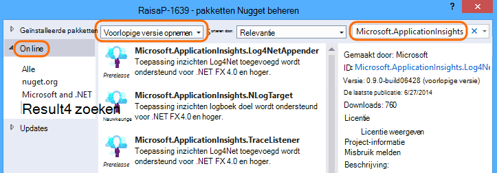

<properties 
    pageTitle="Logs, uitzonderingen en aangepaste diagnostics voor ASP.NET in inzichten van toepassing" 
    description="Vaststellen van problemen in ASP.NET web apps door te verzoeken de uitzonderingen en de logboeken die zijn gegenereerd met Trace, NLog of Log4Net zoeken." 
    services="application-insights" 
    documentationCenter=""
    authors="alancameronwills" 
    manager="douge"/>

<tags 
    ms.service="application-insights" 
    ms.workload="tbd" 
    ms.tgt_pltfrm="ibiza" 
    ms.devlang="na" 
    ms.topic="article" 
    ms.date="04/08/2016" 
    ms.author="awills"/>
 
# Logs, uitzonderingen en aangepaste diagnostics voor ASP.NET in inzichten van toepassing

[Toepassing inzichten] [ start] bevat een krachtige [Diagnostische zoeken] [ diagnostic] tool waarmee u kunt verkennen en analyseren telemetrie verzonden door de SDK toepassing inzichten vanuit uw toepassing. Veel gebeurtenissen zoals paginaweergaven gebruiker worden automatisch verzonden door de SDK.

U kunt ook code schrijven om te verzenden van aangepaste gebeurtenissen, uitzondering rapporten en sporen. En als u al een registratie kader zoals log4J, log4net, NLog of System.Diagnostics.Trace gebruikt, kunt u deze logboeken vastleggen en opnemen in de zoekactie. Dit kunt u gemakkelijk logboek sporen correleren met de acties van de gebruiker, uitzonderingen en andere gebeurtenissen.

## Voordat u een aangepaste telemetrie schrijven

Als u nog niet hebt [inzichten van toepassing voor uw project ingesteld][start], dat nu doen.

Wanneer u uw toepassing uitvoert, deze een bepaalde telemetrie die wordt weergegeven in diagnostische zoeken stuurt, met inbegrip van aanvragen die worden ontvangen door de server, pagina weergaven die zijn aangemeld bij de client, en onbekende uitzonderingen.

Open diagnostische zoeken voor een overzicht van de telemetrie die de SDK automatisch worden verzonden.

De details verschillen van het type toepassing. Kunt u via een enkele gebeurtenis voor meer informatie.

## Bemonstering 

Als uw toepassing veel gegevens worden verzonden en u de toepassing inzichten SDK voor ASP.NET versie 2.0.0-beta3 of hoger gebruikt, kan de functie apparaatafhankelijke bemonstering werken en slechts een percentage van de telemetrie verzenden. [Meer informatie over de bemonstering.](app-insights-sampling.md)

##Aangepaste gebeurtenissen

Aangepaste gebeurtenissen worden weergegeven in [Diagnostische zoeken] [ diagnostic] en [Metric Explorer][metrics]. U kunt ze sturen van apparaten, webpagina's en server-toepassingen. Ze kunnen worden gebruikt voor diagnostische doeleinden en [gebruikspatronen]te begrijpen[track].

Een aangepaste gebeurtenis heeft een naam en ook de eigenschappen die u op, samen met numerieke maateenheden filteren kunt kunt uitvoeren.

JavaScript op de client

    appInsights.trackEvent("WinGame",
         // String properties:
         {Game: currentGame.name, Difficulty: currentGame.difficulty},
         // Numeric measurements:
         {Score: currentGame.score, Opponents: currentGame.opponentCount}
         );

C# op server

    // Set up some properties:
    var properties = new Dictionary <string, string> 
       {{"game", currentGame.Name}, {"difficulty", currentGame.Difficulty}};
    var measurements = new Dictionary <string, double>
       {{"Score", currentGame.Score}, {"Opponents", currentGame.OpponentCount}};

    // Send the event:
    telemetry.TrackEvent("WinGame", properties, measurements);

VB op server

    ' Set up some properties:
    Dim properties = New Dictionary (Of String, String)
    properties.Add("game", currentGame.Name)
    properties.Add("difficulty", currentGame.Difficulty)

    Dim measurements = New Dictionary (Of String, Double)
    measurements.Add("Score", currentGame.Score)
    measurements.Add("Opponents", currentGame.OpponentCount)

    ' Send the event:
    telemetry.TrackEvent("WinGame", properties, measurements)

### Uw toepassing uitvoeren en de resultaten bekijken.

Open diagnostische zoeken.

Selecteer aangepaste gebeurtenis en selecteer de naam van een bepaalde gebeurtenis.

Filter de gegevens meer door het invoeren van een zoekterm op de waarde van een eigenschap.  

Details weergeven in een enkele gebeurtenis voor een overzicht van de uitgebreide eigenschappen.

##Paginaweergaven

Pagina weergave telemetrie wordt verzonden door het aanroepen van trackPageView() in [de JavaScript-fragment dat u kunt in uw webpagina's invoegen][usage]. Het hoofddoel is bij te dragen tot de tellingen van weergaven van de pagina die u op de overzichtspagina ziet.

Meestal wel een keer in elke HTML-pagina, maar u kunt meer gesprekken - bijvoorbeeld invoegen als u een enkele pagina app hebt en u wilt een nieuwe pagina te melden telkens wanneer de gebruiker meer gegevens worden opgehaald.

    appInsights.trackPageView(pageSegmentName, "http://fabrikam.com/page.htm"); 

Soms is het nuttig om de eigenschappen die u als filters in diagnostische zoeken gebruiken kunt koppelen:

    appInsights.trackPageView(pageSegmentName, "http://fabrikam.com/page.htm",
     {Game: currentGame.name, Difficulty: currentGame.difficulty});

##Telemetrie traceren

Trace telemetrie is code die u specifiek wilt maken van de diagnostische logboeken. 

U kan bijvoorbeeld aanroepen als volgt ingevoegd:

    var telemetry = new Microsoft.ApplicationInsights.TelemetryClient();
    telemetry.TrackTrace("Slow response - database01");

####  Een adapter voor uw registratie-framework installeren

U kunt ook zoeken met Logboeken die zijn gegenereerd met een kader voor logboekregistratie - log4Net, NLog of System.Diagnostics.Trace. 

1. Als u van plan bent om log4Net of NLog te gebruiken, kunt u deze in uw project installeren. 
2. In Solution Explorer met de rechtermuisknop op het project en kies **NuGet pakketten beheren**.
3. Online selecteren > alle, selecteer **Zijn voorlopige versie** en zoek naar "Microsoft.ApplicationInsights"

    

4. Selecteer het juiste pakket - een van:
  + Microsoft.ApplicationInsights.TraceListener voor het vastleggen (System.Diagnostics.Trace oproepen)
  + Microsoft.ApplicationInsights.NLogTarget
  + Microsoft.ApplicationInsights.Log4NetAppender

Het pakket NuGet de vereiste assembly's geïnstalleerd en ook web.config of app.config gewijzigd.

#### Het diagnoselogboek van gesprekken invoegen

Als u System.Diagnostics.Trace gebruikt, zou een normaal gesprek zijn:

    System.Diagnostics.Trace.TraceWarning("Slow response - database01");

Als u liever log4net of NLog:

    logger.Warn("Slow response - database01");

Uw toepassing uitvoeren in de foutopsporingsmodus of implementeren.

U ziet de berichten in diagnostische zoeken wanneer u het filter Trace selecteert.

### Uitzonderingen

Uitzondering rapporten opvragen in toepassing inzichten biedt een zeer krachtige ervaring, vooral omdat tussen de mislukte aanvragen en de uitzonderingen navigeren en de uitzonderingsstack lezen.

In sommige gevallen moet u [een paar regels code plaatsen] [ exceptions] om ervoor te zorgen dat de uitzonderingen worden automatisch wordt gevangen.

U kunt ook expliciete code schrijven voor telemetrie uitzondering verzenden:

JavaScript

    try 
    { ...
    }
    catch (ex)
    {
      appInsights.TrackException(ex, "handler loc",
        {Game: currentGame.Name, 
         State: currentGame.State.ToString()});
    }

C#

    var telemetry = new TelemetryClient();
    ...
    try 
    { ...
    }
    catch (Exception ex)
    {
       // Set up some properties:
       var properties = new Dictionary <string, string> 
         {{"Game", currentGame.Name}};

       var measurements = new Dictionary <string, double>
         {{"Users", currentGame.Users.Count}};

       // Send the exception telemetry:
       telemetry.TrackException(ex, properties, measurements);
    }

VB

    Dim telemetry = New TelemetryClient
    ...
    Try
      ...
    Catch ex as Exception
      ' Set up some properties:
      Dim properties = New Dictionary (Of String, String)
      properties.Add("Game", currentGame.Name)

      Dim measurements = New Dictionary (Of String, Double)
      measurements.Add("Users", currentGame.Users.Count)
  
      ' Send the exception telemetry:
      telemetry.TrackException(ex, properties, measurements)
    End Try

De eigenschappen en afmetingen parameters zijn optioneel, maar zijn handig voor het filteren en extra informatie toe te voegen. Als er een app die verschillende spelletjes kan worden uitgevoerd, kan u bijvoorbeeld alle de uitzondering rapporten met betrekking tot een bepaald spel vinden. U kunt zoveel objecten als u elke woordenlijst wilt toevoegen.

#### Uitzonderingen weergeven

Ziet u een overzicht van de uitzonderingen vermeld op het blad Overzicht en kunt u tot en met meer details. Bijvoorbeeld:

[]

Klik op elk uitzonderingstype voor een overzicht van de specifieke gevallen:

[]

U kunt rechtstreeks openen van diagnostische zoeken, filteren op uitzonderingen en kiest u het uitzonderingstype die u wilt zien.

### Onafgehandelde fouten melden

Rapporten van de toepassing inzichten niet-verwerkte uitzonderingen waar dat mogelijk is, van apparaten, [webbrowsers][usage], of webservers of geïmplementeerd door [Status Monitor] [ redfield] of [Toepassing inzichten SDK][greenbrown]. 

Het is echter niet altijd kunt u in sommige gevallen omdat .NET framework de uitzonderingen vangt.  Zorg ervoor dat u alle uitzonderingen zien, moet u een kleine uitzonderings-handler schrijven. De beste procedure is afhankelijk van de technologie. [Telemetrie uitzondering voor ASP.NET] Zie[ exceptions] voor meer informatie. 

### Correleren met een build

Bij het lezen van diagnostische logboeken, is het waarschijnlijk dat de broncode zijn gewijzigd sinds de live code is geïmplementeerd.

Het is daarom handig build om informatie te plaatsen, bijvoorbeeld de URL van de huidige versie in een eigenschap bij elke uitzondering of het traceren. 

In plaats van de eigenschap afzonderlijk aan elke aanroep uitzondering toevoegt, kunt u de gegevens instellen in de standaardcontext. 

    // Telemetry initializer class
    public class MyTelemetryInitializer : ITelemetryInitializer
    {
        public void Initialize (ITelemetry telemetry)
        {
            telemetry.Properties["AppVersion"] = "v2.1";
        }
    }

In de initialisatiefunctie app zoals Global.asax.cs:

    protected void Application_Start()
    {
        // ...
        TelemetryConfiguration.Active.TelemetryInitializers
        .Add(new MyTelemetryInitializer());
    }

###Aanvragen voor Web Server

Aanvraag telemetrie wordt automatisch verzonden wanneer u [Status Monitor op uw webserver installeren][redfield], of wanneer u [toepassing inzichten aan uw webproject toevoegen][greenbrown]. Het wordt ook meegenomen in de aanvraag en het antwoord tijd grafieken Explorer Metric en op de pagina overzicht.

Als u aanvullende gebeurtenissen verzenden, kunt u de API TrackRequest().

## Q & A

### Ik krijg een foutmelding ' Instrumentation sleutel mag niet leeg zijn'

Lijkt erop dat u de logboekregistratie adapter Nuget package geïnstalleerd zonder te installeren toepassing inzichten.

In de Solution Explorer met de rechtermuisknop op `ApplicationInsights.config` en kies **Update toepassing inzichten**. Krijgt u een dialoogvenster met een uitnodiging aan te melden Azure en maak een bron inzichten van toepassing, of een bestaande opnieuw gebruiken. Die het probleem moet oplossen.

### Hoeveel gegevens behouden?

Maximaal 500 gebeurtenissen per seconde van elke toepassing. Gebeurtenissen worden bewaard gedurende zeven dagen.

### Sommige van Mijn gebeurtenissen of sporen worden niet weergegeven

Als uw toepassing veel gegevens worden verzonden en u de toepassing inzichten SDK voor ASP.NET versie 2.0.0-beta3 of hoger gebruikt, kan de functie apparaatafhankelijke bemonstering werken en slechts een percentage van de telemetrie verzenden. [Meer informatie over de bemonstering.](app-insights-sampling.md)

## Volgende stappen

* [Beschikbaarheid en reactievermogen testen][availability]
* [Het oplossen van problemen][qna]

<!--Link references-->

[availability]: app-insights-monitor-web-app-availability.md
[diagnostic]: app-insights-diagnostic-search.md
[exceptions]: app-insights-asp-net-exceptions.md
[greenbrown]: app-insights-asp-net.md
[metrics]: app-insights-metrics-explorer.md
[qna]: app-insights-troubleshoot-faq.md
[redfield]: app-insights-monitor-performance-live-website-now.md
[start]: app-insights-overview.md
[track]: app-insights-api-custom-events-metrics.md
[usage]: app-insights-web-track-usage.md

 
