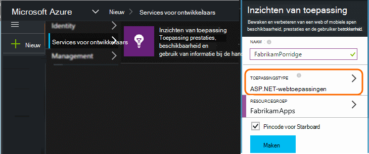
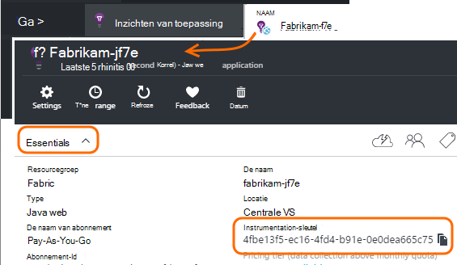

<properties 
    pageTitle="Afzonderlijke toepassing inzichten bronnen voor dev, test en productie" 
    description="De prestaties en het gebruik van de toepassing in verschillende stadia van ontwikkeling" 
    services="application-insights" 
    documentationCenter=""
    authors="alancameronwills" 
    manager="douge"/>

<tags 
    ms.service="application-insights" 
    ms.workload="tbd" 
    ms.tgt_pltfrm="ibiza" 
    ms.devlang="na" 
    ms.topic="article" 
    ms.date="05/04/2016" 
    ms.author="awills"/>

# Toepassing inzichten bronnen van elkaar te scheiden

Moet de telemetrie van de verschillende onderdelen en versies van de toepassing worden verzonden naar resources met verschillende inzichten van toepassing, of gecombineerd worden in één? In dit artikel wordt gezocht met de beste praktijken en de benodigde technieken.

Ten eerste de vraag begrijpen. De gegevens ontvangen van uw toepassing wordt opgeslagen en verwerkt door de inzichten van de toepassing in een Microsoft Azure *resource*. Elke resource wordt geïdentificeerd door een *sleutel instrumentation* (iKey). De sleutel wordt aangeleverd voor de SDK toepassing inzichten in uw app, zodat de gegevens die worden verzameld met de juiste bron kunnen worden verzonden. De sleutel kan worden geleverd in de code of in ApplicationInsights.config. U wijzigt de sleutel in de SDK, kunt u rechtstreeks gegevens bij verschillende bronnen. 

Een eenvoudig voorbeeld, als u de code voor een nieuwe toepassing maakt u ook een nieuwe bron maken in inzichten van toepassing. In Visual Studio doet het dialoogvenster *Nieuw project* .

Als het een hoog volume website, kan deze worden geïmplementeerd op meer dan één exemplaar van de server.

In de meer complexe scenario's hebt u een systeem dat uit meerdere onderdelen - bijvoorbeeld een website en een back-end-processor bestaat. 

## Wanneer u afzonderlijke iKeys gebruikt

Hier volgen enkele algemene richtlijnen:

* Waar hebt u een toepassing onafhankelijk bruikbare eenheid die wordt uitgevoerd op een set server omhoog/omlaag-exemplaren die kunnen worden geschaald onafhankelijk van andere onderdelen, dan u die meestal aan een enkele bron toewijzen zou - dat wil zeggen, is er een sleutel één instrumentation (iKey).
* Daarentegen zijn de redenen voor het gebruik van afzonderlijke iKeys:
 - Gemakkelijk lezen verschillende maatstaven van de afzonderlijke componenten.
 - Bewaar kleinschalige telemetrie van hoge volumes, zodat de beperking van de quota's en bemonstering van één stroom hebben geen invloed op de andere.
 - Afzonderlijke signalen, exporteren en werken artikelconfiguraties.
 - [Grenzen](app-insights-pricing.md#limits-summary) worden verspreid, zoals telemetrie quota beperken en web count testen.
 - Code in ontwikkeling en test een aparte iKey dan het stempel van de productie te sturen.  

Veel van de portal ervaringen inzichten van toepassing zijn ontworpen met deze richtlijnen in het achterhoofd. Bijvoorbeeld weergeven de servers segmenten op server-exemplaar maken van de veronderstelling dat telemetrie over een logisch onderdeel afkomstig uit verschillende exemplaren van de server zijn kan.

## Enkele iKey

Waarin u telemetrie verzenden van meerdere onderdelen naar een enkele iKey:

* Een eigenschap toevoegen aan de telemetrie waarmee u aan het segment en het filter op de identiteit van het onderdeel. De rol-ID wordt automatisch toegevoegd aan telemetrie van serverexemplaren rol, maar in andere gevallen dat kunt u een [telemetrie initialiseren](app-insights-api-filtering-sampling.md#add-properties) van de eigenschap toevoegen.
* De toepassing inzichten SDK's in de verschillende onderdelen op hetzelfde moment worden bijgewerkt. Telemetrie voor één iKey moet afkomstig zijn van dezelfde versie van de SDK.

## Afzonderlijke iKeys

Waar hebt u meerdere iKeys voor de verschillende onderdelen:

* Een [dashboard](app-insights-dashboards.md) voor een overzicht van de belangrijkste telemetrie maken van de logische toepassing van de verschillende onderdelen worden gecombineerd. Dashboards kunnen worden gedeeld, zodat een weergave met één logisch systeem kan worden gebruikt door verschillende teams.
* [Resourcegroepen](app-insights-resources-roles-access-control.md) op teamniveau organiseren. Toegangsmachtigingen zijn toegewezen door de resourcegroep en hiertoe behoren machtigingen voor het instellen van waarschuwingen. 
* [Azure Resource Manager sjablonen en Powershell](app-insights-powershell.md) gebruiken om te artefacten zoals Waarschuwingsregels beheren en web-tests.

## Aparte iKeys voor Dev/Test en productie

Om gemakkelijker de sleutel automatisch wijzigen wanneer de toepassing wordt vrijgegeven, stelt u de iKey in code in plaats van in ApplicationInsights.config.

### Dynamische instrumentation sleutel

Stel de sleutel in een initialisatiemethode, zoals global.aspx.cs in een ASP.NET-service:

*C#*

    protected void Application_Start()
    {
      Microsoft.ApplicationInsights.Extensibility.
        TelemetryConfiguration.Active.InstrumentationKey = 
          // - for example -
          WebConfigurationManager.AppSettings["ikey"];
      ...

In dit voorbeeld worden de ikeys voor de verschillende bronnen in verschillende versies van het webconfiguratiebestand geplaatst. Het configuratiebestand voor web - die u kunt doen als onderdeel van het script voor release - wisselen wordt de doelbron verwisselen.

### Webpagina 's

De iKey wordt ook gebruikt in uw app van webpagina's in het [script dat u hebt gekregen van de bladeserver snel starten](app-insights-javascript.md). In plaats van codering het letterlijk in het script, genereert u het van de server staat. Bijvoorbeeld, in een ASP.NET-toepassing:

*JavaScript in Razor*

    <script type="text/javascript">
    // Standard Application Insights web page script:
    var appInsights = window.appInsights || function(config){ ...
    // Modify this part:
    }({instrumentationKey:  
      // Generate from server property:
      "@Microsoft.ApplicationInsights.Extensibility.
         TelemetryConfiguration.Active.InstrumentationKey"
    }) // ...

## Een extra toepassing inzichten bron maken
  
Als u afzonderlijke telemetrie voor verschillende onderdelen of voor andere stempels (test-dev/productie) van hetzelfde onderdeel, hebt u zult een nieuwe toepassing inzichten bron maken.

Toevoegen in de [portal.azure.com](https://portal.azure.com), een bron van de inzichten van toepassing:

* **Type toepassing** heeft invloed op wat u ziet op het blad Overzicht en de eigenschappen die beschikbaar zijn in [metrische explorer](app-insights-metrics-explorer.md). Als u uw type app niet ziet, kiest u een van de typen webonderdelen voor webpagina's.
* **Resourcegroep** is gemakkelijker te maken voor het beheren van eigenschappen als [toegangsbeheer](app-insights-resources-roles-access-control.md). U kunt aparte bronnengroepen voor ontwikkeling, test en productie.
* **Abonnement** is de rekening voor betalingen in Azure.
* **De locatie** is waar we uw gegevens bewaren. Op dit moment worden niet gewijzigd. 
* **Toevoegen aan dashboard** wordt een tegel voor snelle toegang voor de resource op de startpagina van Azure. 

Het duurt enkele seconden voor het maken van de resource. U ziet een waarschuwing wanneer deze voltooid.

(U kunt schrijven een [PowerShell script](app-insights-powershell-script-create-resource.md) voor het automatisch maken van een resource.)

## Ophalen van de sleutel instrumentation

De sleutel instrumentation identificeert de resource die u hebt gemaakt. 

U moet de instrumentatie sleutels van alle bronnen die uw app gegevens verzonden.

 
