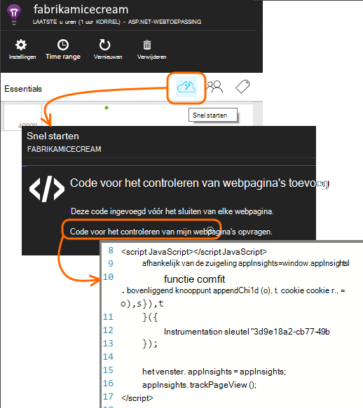

<properties 
    pageTitle="Een SharePoint-site met de inzichten van de toepassing controleren" 
    description="Een nieuwe toepassing met een nieuwe sleutel instrumentation controle starten" 
    services="application-insights" 
    documentationCenter=""
    authors="alancameronwills" 
    manager="douge"/>

<tags 
    ms.service="application-insights" 
    ms.workload="tbd" 
    ms.tgt_pltfrm="ibiza" 
    ms.devlang="na" 
    ms.topic="article" 
    ms.date="03/24/2016" 
    ms.author="awills"/>

# <a name="monitor-a-sharepoint-site-with-application-insights"></a>Een SharePoint-site met de inzichten van de toepassing controleren


Inzichten van Visual Studio-toepassing controleert de beschikbaarheid, prestaties en het gebruik van uw toepassingen. Hier leert u hoe u kunt instellen voor een SharePoint-site.


## <a name="create-an-application-insights-resource"></a>Maak een bron toepassing inzichten


Maakt een nieuwe resource van toepassing inzichten in [Azure portal](https://portal.azure.com). ASP.NET te kiezen als het toepassingstype.


Het blad dat wordt geopend, is de plaats waarin u prestaties en gebruiksgegevens over uw app leert. Als u wilt teruggaan naar het volgende keer dat u bij Azure aanmelden, zult u een tegel voor op het startscherm. U kunt ook op Bladeren om te zoeken.
    


## <a name="add-our-script-to-your-web-pages"></a>Onze script toevoegen aan uw webpagina 's

Ophalen in de Quick Start het script voor webpagina's:



Vlak voordat het script invoegen de &lt;/head&gt; -tag van elke pagina die u wilt bijhouden. Als uw website een basispagina heeft, kunt u het script er plaatsen. Bijvoorbeeld in een project voor ASP.NET MVC, zou u deze plaatsen in View\Shared\_Layout.cshtml

Het script bevat de instrumentatie sleutel waarmee de telemetrie de bron van de inzichten van toepassing.

### <a name="add-the-code-to-your-site-pages"></a>Voeg de code toe aan uw site pagina 's

#### <a name="on-the-master-page"></a>Op de hoofdpagina

Als u de basispagina van de site bewerken kunt, krijgt die voor elke pagina van de site controleren.

De basispagina uitchecken en bewerken met behulp van SharePoint Designer of elke andere teksteditor.


Voeg vlak voor de code de </head> code. 


#### <a name="or-on-individual-pages"></a>Of op afzonderlijke pagina's

Als u wilt controleren op een beperkt aantal pagina's, het script afzonderlijk aan elke pagina toevoegen. 

Een webonderdeel invoegen en het codefragment in het insluiten.


## <a name="view-data-about-your-app"></a>Gegevens over uw app weergeven

Implementeer uw app.

Terug naar uw toepassing blade in [Azure portal](https://portal.azure.com).

De eerste gebeurtenissen worden weergegeven in de zoekresultaten. 


Als u meer gegevens verwacht, klikt u op vernieuwen na een paar seconden.

Klik op **gebruiksanalyse** voor een overzicht van grafieken van gebruikers, sessies en bezoekers van de bladeserver overzicht:


Klik in een grafiek meer details - bijvoorbeeld paginaweergaven:


Of gebruikers:


## <a name="capturing-user-id"></a>Gebruikersnaam vastleggen


Het codefragment standaardwebpagina's de gebruikers-id van SharePoint niet vastleggen, maar u kunt dit doen met een kleine wijziging.


1. Kopiëren van uw app instrumentation sleutel van de Essentials-omlaag in de inzichten van toepassing. 


    

2. Vervangen door de sleutel instrumentation 'XXXX' in het onderstaande fragment. 
3. Het script insluiten in uw SharePoint-app in plaats van het fragment dat u van de portal krijgt.


```


<SharePoint:ScriptLink ID="ScriptLink1" name="SP.js" runat="server" localizable="false" loadafterui="true" /> 
<SharePoint:ScriptLink ID="ScriptLink2" name="SP.UserProfiles.js" runat="server" localizable="false" loadafterui="true" /> 
  
<script type="text/javascript"> 
var personProperties; 
  
// Ensure that the SP.UserProfiles.js file is loaded before the custom code runs. 
SP.SOD.executeOrDelayUntilScriptLoaded(getUserProperties, 'SP.UserProfiles.js'); 
  
function getUserProperties() { 
    // Get the current client context and PeopleManager instance. 
    var clientContext = new SP.ClientContext.get_current(); 
    var peopleManager = new SP.UserProfiles.PeopleManager(clientContext); 
     
    // Get user properties for the target user. 
    // To get the PersonProperties object for the current user, use the 
    // getMyProperties method. 
    
    personProperties = peopleManager.getMyProperties(); 
  
    // Load the PersonProperties object and send the request. 
    clientContext.load(personProperties); 
    clientContext.executeQueryAsync(onRequestSuccess, onRequestFail); 
} 
     
// This function runs if the executeQueryAsync call succeeds. 
function onRequestSuccess() { 
var appInsights=window.appInsights||function(config){
function s(config){t[config]=function(){var i=arguments;t.queue.push(function(){t[config].apply(t,i)})}}var t={config:config},r=document,f=window,e="script",o=r.createElement(e),i,u;for(o.src=config.url||"//az416426.vo.msecnd.net/scripts/a/ai.0.js",r.getElementsByTagName(e)[0].parentNode.appendChild(o),t.cookie=r.cookie,t.queue=[],i=["Event","Exception","Metric","PageView","Trace"];i.length;)s("track"+i.pop());return config.disableExceptionTracking||(i="onerror",s("_"+i),u=f[i],f[i]=function(config,r,f,e,o){var s=u&&u(config,r,f,e,o);return s!==!0&&t["_"+i](config,r,f,e,o),s}),t
    }({
        instrumentationKey:"XXXX"
    });
    window.appInsights=appInsights;
    appInsights.trackPageView(document.title,window.location.href, {User: personProperties.get_displayName()});
} 
  
// This function runs if the executeQueryAsync call fails. 
function onRequestFail(sender, args) { 
} 
</script> 


```


## <a name="next-steps"></a>Volgende stappen

* [Web tests](app-insights-monitor-web-app-availability.md) om de beschikbaarheid van uw site.

* [Inzichten van toepassing](app-insights-overview.md) voor andere soorten app.


<!--Link references-->


 