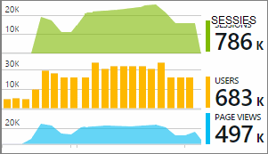

<properties 
    pageTitle="Toepassing inzichten telemetrie in Visual Studio-CodeLens | Microsoft Azure" 
    description="Snel toegang tot uw toepassing inzichten aanvraag en uitzondering telemetrie met CodeLens in Visual Studio." 
    services="application-insights" 
    documentationCenter=".net"
    authors="numberbycolors" 
    manager="douge"/>

<tags 
    ms.service="application-insights" 
    ms.workload="tbd" 
    ms.tgt_pltfrm="ibiza" 
    ms.devlang="na" 
    ms.topic="get-started-article" 
    ms.date="08/30/2016" 
    ms.author="daviste"/>
    
# Toepassing inzichten telemetrie in Visual Studio CodeLens

Methoden in de code van uw web app kunnen aangevuld worden met telemetrie over runtime-uitzonderingen en responstijden aanvragen. Als u [Visual Studio-toepassing inzichten](app-insights-overview.md) in uw toepassing hebt geïnstalleerd, weergegeven de telemetrie in Visual Studio- [CodeLens](https://msdn.microsoft.com/library/dn269218.aspx) - de opmerkingen aan de bovenkant van elke functie waar u gebruikt om te zien van nuttige informatie, zoals het aantal posities dat de functie wordt verwezen of de laatste persoon die deze bewerkt.

> [AZURE.NOTE] Toepassing van inzichten in de CodeLens is beschikbaar in Visual Studio 2015 Update 3 en hoger, of met de nieuwste versie van [uitbreiding van de analytische hulpmiddelen voor ontwikkelaars](https://visualstudiogallery.msdn.microsoft.com/82367b81-3f97-4de1-bbf1-eaf52ddc635a). CodeLens is beschikbaar in de Enterprise- en Professional Edition van Visual Studio.

## Waar vind ik inzichten toepassing gegevens

Zoek naar telemetrie toepassing inzichten in de CodeLens-indicatoren van de openbare aanvraagmethoden van uw webtoepassing. CodeLens-indicatoren zijn bovenstaande methode en andere verklaringen in C# en Visual Basic-code. Als inzichten toepassing gegevens voor een methode beschikbaar is, ziet u de indicatoren voor aanvragen en uitzonderingen zoals "100 aanvraagt, 1% is mislukt" of '10 uitzonderingen'. Klik op een CodeLens indicator voor meer informatie. 

> [AZURE.TIP] Toepassing inzichten aanvragen en indicatoren uitzondering duurt een paar seconden te laden nadat andere indicatoren CodeLens worden weergegeven.

## Uitzonderingen in CodeLens

De uitzondering CodeLens indicator geeft het aantal uitzonderingen die zich hebben voorgedaan in de afgelopen 24 uur uit de 15 meest uitzonderingen in uw toepassing tijdens die periode, tijdens het verwerken van de aanvraag die wordt bediend door de methode plaatsvindt.

Voor meer informatie klikt u op de indicator van de CodeLens uitzonderingen:

* De procentuele verandering in het aantal uitzonderingen in de afgelopen 24 uur ten opzichte van de voorafgaande 24 uur
* Kies **Ga naar code** navigeren naar de broncode van de functie de uitzondering genereren
* Kies **Zoeken** om te zoeken alle exemplaren van deze uitzondering, die zich hebben voorgedaan in de afgelopen 24 uur
* Kies **Trend** trend visualisatie voor exemplaren van deze uitzondering in de afgelopen 24 uur weergeven
* Kies **alle uitzonderingen in deze app weer** opvragen van alle uitzonderingen die zich hebben voorgedaan in de afgelopen 24 uur
* Kies **verkennen uitzondering trends** te bekijken van een visualisatie trend voor alle uitzonderingen die zich hebben voorgedaan in de afgelopen 24 uur. 

> [AZURE.TIP] Als u weet dat er uitzonderingen, maar u '0 uitzonderingen' in CodeLens ziet, Controleer of dat de juiste toepassing inzichten resource is geselecteerd in de CodeLens. Als u een ander middel, met de rechtermuisknop op het project in de Solution Explorer en kies **toepassing inzichten > telemetrie bron kiest u**. CodeLens wordt alleen weergegeven voor de 15 de meeste voorkomende uitzonderingen in uw toepassing in de afgelopen 24 uur, als een uitzondering is de 16e meest of minder, ziet u '0 uitzonderingen'. Uitzonderingen van ASP.NET weergaven verschijnen niet in de controller methoden die deze weergaven wordt gegenereerd.

> [AZURE.TIP] Als u ziet "? uitzonderingen' in CodeLens, moet u uw Azure-account koppelen met Visual Studio of uw referentie Azure-account is verlopen. In beide gevallen klikt u op '? uitzonderingen' en kies **een account toevoegen** uw referenties moet invoeren.

## Aanvragen in de CodeLens

CodeLens indicator verzoek geeft het aantal HTTP-aanvragen die zijn verwerkt door een methode in de afgelopen 24 uur plus het percentage van de aanvragen dat is mislukt.

Voor meer informatie klikt u op de aanvragen CodeLens indicator:

* De wijzigingen in het aantal aanvragen, mislukte aanvragen en gemiddelde responstijden gedurende de afgelopen 24 uur in vergelijking met de voorafgaande 24 uur absolute en percentage
* De betrouwbaarheid van de methode, berekend als het percentage van de aanvragen die niet in de afgelopen 24 uur is mislukt
* Kies **Zoeken** voor aanvragen of mislukte aanvragen voor het opvragen van de (mislukte) aanvragen die heeft plaatsgevonden in de afgelopen 24 uur
* Kies **Trend** trend voor aanvragen, mislukte aanvragen of gemiddelde responstijden visualisatie bekijken in de afgelopen 24 uur.
* Kies de naam van de resource van toepassing inzichten in de linkerbovenhoek van de CodeLens details u wilt wijzigen welke resource de bron voor de gegevens van de CodeLens is.

## Volgende stappen

||
|---|---
|**[Werken met de toepassing van inzichten in Visual Studio](app-insights-visual-studio.md)** Telemetrie zoeken, gegevens in CodeLens en inzichten die toepassing configureren. Alle binnen Visual Studio. |
|**[Meer gegevens toevoegen](app-insights-asp-net-more.md)** Gebruik, beschikbaarheid, afhankelijkheden, uitzonderingen controleren. Sporen van logboekregistratie frameworks integreren. Schrijf aangepaste telemetrie. | 
|**[Werken met de portal Application inzichten](app-insights-dashboards.md)** Dashboards, krachtige hulpmiddelen voor diagnose- en analytische, waarschuwingen, een kaart live afhankelijkheid van uw toepassing en telemetrie exporteren. |
