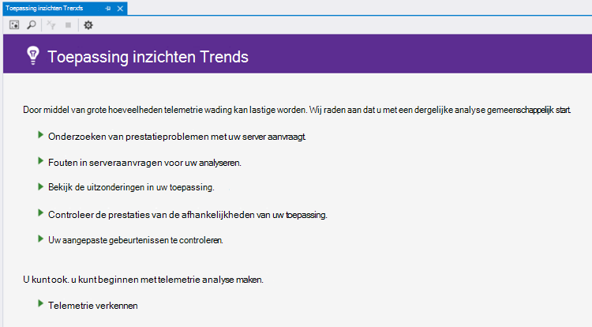
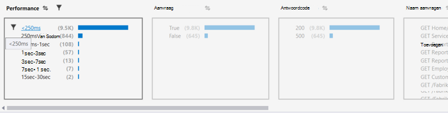
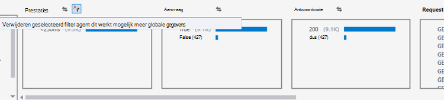
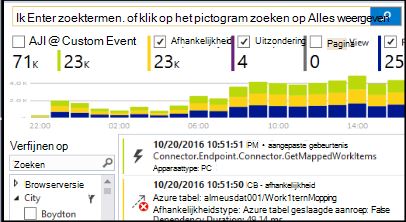

<properties 
    pageTitle="Analyseren van Trends in Visual Studio | Microsoft Azure" 
    description="Analyseren, visualiseren en verkennen van trends in uw toepassing inzichten telemetrie in Visual Studio." 
    services="application-insights" 
    documentationCenter=".net"
    authors="numberbycolors" 
    manager="douge"/>

<tags 
    ms.service="application-insights" 
    ms.workload="tbd" 
    ms.tgt_pltfrm="ibiza" 
    ms.devlang="na" 
    ms.topic="get-started-article" 
    ms.date="10/25/2016" 
    ms.author="daviste"/>
    
# Analyseren van Trends in Visual Studio

Het hulpprogramma Application inzichten Trends visualiseert hoe uw toepassingsgebeurtenissen voor belangrijke telemetrie wijzigen na verloop van tijd, zodat u snel identificeren van problemen en anomalieën. Door een koppeling naar meer gedetailleerde diagnostische gegevens, kunt Trends u betere prestaties van uw app, opsporen van de oorzaken van uitzonderingen en inzichten die uw aangepaste gebeurtenissen aan het licht komen.

> [AZURE.NOTE] Toepassing inzichten Trends is beschikbaar in Visual Studio 2015 Update 3 en hoger, of met de [uitbreiding van de analytische hulpmiddelen voor ontwikkelaars](https://visualstudiogallery.msdn.microsoft.com/82367b81-3f97-4de1-bbf1-eaf52ddc635a) versie 5.209 en hoger.

## Geopende toepassing inzichten Trends

De toepassing inzichten Trends om venster te openen:

* Kies de werkbalkknop toepassing inzichten **Telemetrie Trends verkennen**, of
* Kies in het contextmenu project **inzichten van toepassing > telemetrie Trends onderzoeken**, of
* Kies in de menubalk van de Visual Studio **Weergave > andere Windows > inzichten Trends van toepassing**.

Wordt er gevraagd een bron te selecteren. Klik op **een resource selecteren**, zich aanmelden met een abonnement op Azure en kies vervolgens een bron toepassing inzichten uit de lijst die u wilt graag telemetrie trends te analyseren.

## Kies een trendanalyse

Aan de slag door te kiezen uit een van de vijf algemene trend analyses, elke analyseren van gegevens van de laatste 24 uur:

* **Onderzoeken van prestatieproblemen met uw serveraanvragen** - aanvragen voor uw service, gegroepeerd op responstijden
* **Fouten in serveraanvragen voor uw analyseren** - aanvragen voor uw service, gegroepeerd op http-antwoordcode
* **Bekijk de uitzonderingen in uw toepassing** - uitzonderingen van uw service, gegroepeerd per uitzonderingstype
* **De prestaties van uw toepassing afhankelijkheden controleren** - Services aangeroepen door uw service, gegroepeerd op responstijden
* **Uw aangepaste gebeurtenissen controleren** - aangepaste gebeurtenissen die u hebt ingesteld voor uw service, gegroepeerd per gebeurtenistype.

Deze vooraf gemaakte analyses zijn beschikbaar via de knop **weergave voorkomende telemetrie analyse** in de linkerbovenhoek van het venster Trends later.

## Visualiseren van trends in uw toepassing

Toepassing inzichten Trends maakt tijd reeks visualisatie van de telemetrie van uw app. Elke keer reeks visualisatie wordt één type telemetrie, gegroepeerd op één eigenschap van die telemetrie, gedurende een bepaalde periode weergegeven. U wilt bijvoorbeeld server aanvraagt, gegroepeerd op het land waarvan zij afkomstig is, gedurende de afgelopen 24 uur weergeven. In dit voorbeeld zou elke bel op de visualisatie een telling van de serveraanvragen voor sommige land vertegenwoordigen gedurende één uur.

Gebruik de besturingselementen aan de bovenkant van het venster aanpassen welke soorten telemetrie weergeven. Kies eerst de telemetrie typen waarin u geïnteresseerd bent:

* **Type telemetrie** - serveraanvragen, uitzonderingen, depdendencies of aangepaste gebeurtenissen
* **Periode** - ergens in de laatste 30 minuten in de laatste 3 dagen
* **Group By** - uitzondering type probleem-ID, land en meer.

Klik vervolgens op **Analyseren telemetrie** de query wilt uitvoeren.

Navigeren tussen de Bolletjes in de visualisatie:

* Selecteer een bel, die de filters onder in het venster alleen de gebeurtenissen die hebben plaatsgevonden tijdens een bepaalde periode samenvatten bijgewerkt
* Dubbelklik op een bel om te navigeren naar het gereedschap Zoeken en alle van de telemetrie van afzonderlijke gebeurtenissen in die periode
* CTRL-klik een ballon los om deze te selecteren in de visualisatie.

> [AZURE.TIP] Hulpprogramma's werken samen om u te helpen achterhalen van de oorzaken van problemen met uw service onder duizenden telemetrie gebeurtenissen Trends en zoeken. Bijvoorbeeld, als een middag met uw klanten u uw app ziet minder goed wordt, beginnen met Trends. Aanvragen voor uw service via de afgelopen verscheidene uren, gegroepeerd op responstijd analyseren. Zien of er een ongewoon grote cluster van trage aanvragen. Dubbelklikt u op dat bellen naar het zoekprogramma, gefilterd op de gebeurtenissen van deze aanvraag. U kunt zoeken, verkennen van de inhoud van deze verzoeken en Ga naar de code die het probleem op te lossen.

## Filter

Ontdek meer specifieke ontwikkelingen met behulp van de filterbesturingselementen onder aan het venster. Als u een filter toepast, klikt u op de naam. U kunt snel schakelen tussen verschillende filters te ontdekken van trends in een bepaalde dimensie van de telemetrie kunnen worden verborgen. Als u een filter in één dimensie, zoals het Type uitzondering toepassen blijven filters in andere dimensies waarop kan worden geklikt, hoewel ze beschikbaar worden weergegeven. Bij de VN-een filter toepassen, klikt u nogmaals op. CTRL-klik om te selecteren van meerdere filters in dezelfde dimensie.

Als u wilt meerdere filters toepassen? 

1. Het eerste filter toepassen. 
2. Klik op de knop **geselecteerde filters en query opnieuw toepassen** door de naam van de dimensie van het eerste filter. Dit zal de telemetrie voor alleen gebeurtenissen van het eerste filter opnieuw opvragen. 
3. Een tweede filter toepassen. 
4. Herhaal het proces om te zoeken naar trends in specifieke subsets van de telemetrie. Bijvoorbeeld serveraanvragen met de naam 'GET Home/Index' _en_ die afkomstig is van Duitsland _en_ die een code 500-antwoord ontvangen. 

Bij de VN-een van deze filters toepassen, klikt u op de knop **geselecteerde filters en query opnieuw verwijderen** voor de dimensie.

## Anomalieën zoeken

Het hulpprogramma Trends kunt Bolletjes afwijkende vergeleken met andere Bolletjes in dezelfde tijdreeks zijn gebeurtenissen markeren. Kies in de vervolgkeuzelijst Type weergave **tellingen in tijd bucket (afwijkingen van de markering)** of **Percentages in tijd bucket (afwijkingen van de markering)**. Rode Bolletjes zijn afwijkende. Afwijkingen worden gedefinieerd als Bolletjes tellingen/percentages 2.1 maal de standaardafwijking van de tellingen/percentages die zijn opgetreden in het verleden meer dan twee perioden (48 uur als u de laatste 24 uur, enz bekijkt.).

> [AZURE.TIP] Afwijkingen van de markering is vooral handig voor het zoeken van uitschieters in de tijdreeks van kleine Bolletjes die anders kunnen er ook grote.  

## Volgende stappen

||
|---|---
|**[Werken met de toepassing van inzichten in Visual Studio](app-insights-visual-studio.md)** Telemetrie zoeken, gegevens in CodeLens en inzichten die toepassing configureren. Alle binnen Visual Studio. |
|**[Meer gegevens toevoegen](app-insights-asp-net-more.md)** Gebruik, beschikbaarheid, afhankelijkheden, uitzonderingen controleren. Sporen van logboekregistratie frameworks integreren. Schrijf aangepaste telemetrie. | 
|**[Werken met de portal Application inzichten](app-insights-dashboards.md)** Dashboards, krachtige hulpmiddelen voor diagnose- en analytische, waarschuwingen, een kaart live afhankelijkheid van uw toepassing en telemetrie exporteren. |
