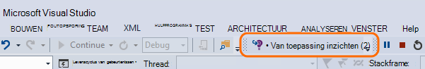
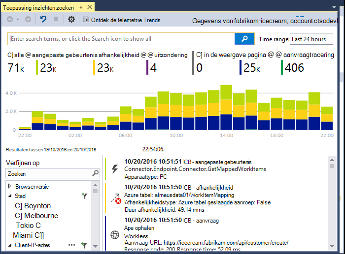
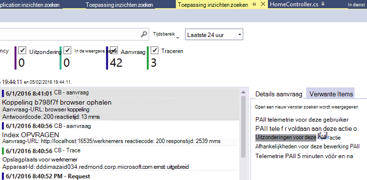
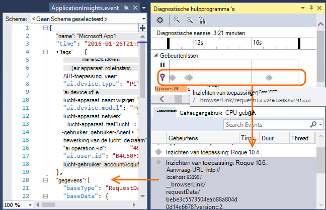
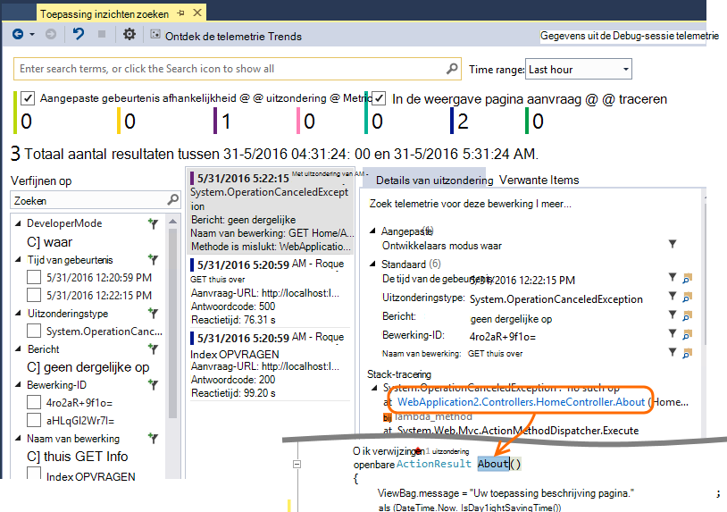
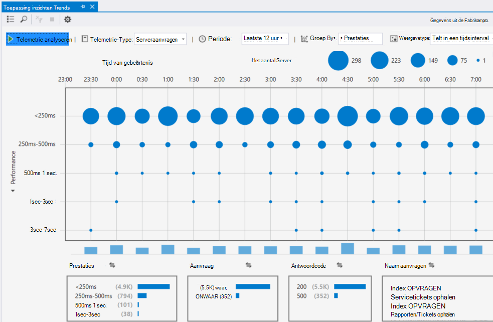

<properties 
    pageTitle="Werken met de inzichten van toepassing op Visual Studio" 
    description="Analyse en diagnose tijdens de foutopsporing en in productie." 
    services="application-insights" 
    documentationCenter=".net"
    authors="alancameronwills" 
    manager="douge"/>

<tags 
    ms.service="application-insights" 
    ms.workload="tbd" 
    ms.tgt_pltfrm="ibiza" 
    ms.devlang="na" 
    ms.topic="get-started-article" 
    ms.date="06/21/2016" 
    ms.author="awills"/>

# Werken met de toepassing van inzichten in Visual Studio

U kunt prestaties analyseren en vaststellen van problemen in Foutopsporing en in productie, met behulp van telemetrie van [Visual Studio-toepassing inzichten](app-insights-overview.md)in Visual Studio (2015 en hoger).

Als u nog niet hebt [Geïnstalleerde toepassing inzichten in uw app](app-insights-asp-net.md), dat nu doen.

## Fouten opsporen in uw project

Uw toepassing uitvoeren met F5 en probeer het zelf: verschillende pagina's voor het genereren van sommige telemetrie openen.

In Visual Studio ziet u een aantal van de gebeurtenissen die zijn geregistreerd.

Klik op deze knop om diagnostische zoeken te openen. 

## Diagnostische zoeken

Het venster zoeken bevat gebeurtenissen die zijn geregistreerd. (Als u aangemeld bij Azure bij het instellen van de toepassing inzichten, u zult kunnen bepaalde gebeurtenissen in de portal te zoeken.)

De vrije tekst zoekopdracht werkt op alle velden in de gebeurtenissen. Bijvoorbeeld zoeken voor een deel van de URL van een pagina. of de waarde van een eigenschap, zoals client plaats; of bepaalde woorden in een traceerlogboek.

Klik op een gebeurtenis om de gedetailleerde eigenschappen te bekijken.

U kunt ook het tabblad gerelateerde artikelen om u te helpen bij het vaststellen van mislukte aanvragen of uitzonderingen openen.

## Diagnostische gegevens hub

De Hub Diagnostics (Visual Studio 2015 of later) toont de telemetrie inzichten Application server wordt gegenereerd. Dit werkt zelfs als u ervoor gekozen alleen te installeren van de SDK, zonder deze verbinding te maken met een bron in de portal Azure.

## Uitzonderingen

Als [uitzondering toezicht ingesteld](app-insights-asp-net-exceptions.md), wordt in het venster Zoeken uitzondering rapporten weergeven. 

Klik op een uitzondering als u een stacktrace. Als de code van de app geopend in Visual Studio is, kunt u door middel van de stacktrace op de betreffende regel van de code.

Bovendien in de regel Code Lens boven elke methode ziet u een aantal van de uitzonderingen die zijn vastgelegd door toepassing inzichten in de afgelopen 24 uur.

## Lokale controle

(Van Visual Studio 2015 Update 2) Als u nog niet hebt geconfigureerd voor de SDK voor het verzenden van de Portal Application inzichten telemetrie (zodat er geen sleutel instrumentation in ApplicationInsights.config) wordt het venster Diagnostiek telemetrie van uw meest recente foutopsporingssessie weergegeven. 

Dit is wenselijk als u een vorige versie van uw app al hebt gepubliceerd. Wilt u niet de telemetrie van de foutopsporing sessies worden verward met de telemetrie op de portal Application inzichten vanuit de gepubliceerde app.

Het is ook handig als u een [aangepaste telemetrie](app-insights-api-custom-events-metrics.md) u fouten opsporen wilt voordat telemetrie naar de portal verzonden.

* *Op het eerste, ik volledig inzichten telemetrie naar de portal verzonden toepassing geconfigureerd. Maar nu ik zou willen zien van de telemetrie alleen in Visual Studio.*

 * Er is een optie lokale diagnostische gegevens zoeken, zelfs als uw app telemetrie naar de portal verzendt in de instellingen van het venster zoeken.
 * Commentaar van de lijn wilt stoppen die worden verzonden naar de portal telemetrie, `<instrumentationkey>...` van ApplicationInsights.config. Als u klaar bent met opmerking telemetrie opnieuw verzenden om de portal te verwijderen.

## Trends

Trends is een hulpmiddel voor het visualiseren van de werking van uw app na verloop van tijd. 

Kies **Verkennen telemetrie Trends** uit de knop toepassing inzichten of toepassing inzichten zoekvenster. Kies een van de vijf algemene query's aan de slag. U kunt verschillende datasets op basis van telemetrie typen tijd bereiken en andere eigenschappen kunt analyseren. 

Kies een van de opties van de afwijking in de vervolgkeuzelijst ' weergave ' om afwijkingen in de gegevens. De filteropties onder aan het venster kunnen eenvoudig specifieke subsets van de telemetrie specificeren.

[Meer informatie over Trends](app-insights-visual-studio-trends.md).

## Hoe nu verder?

||
|---|---
|**[Meer gegevens toevoegen](app-insights-asp-net-more.md)** Gebruik, beschikbaarheid, afhankelijkheden, uitzonderingen controleren. Sporen van logboekregistratie frameworks integreren. Schrijf aangepaste telemetrie. | 
|**[Werken met de portal Application inzichten](app-insights-dashboards.md)** Dashboards, krachtige hulpmiddelen voor diagnose- en analytische, waarschuwingen, een kaart live afhankelijkheid van uw toepassing en telemetrie exporteren. |

 
