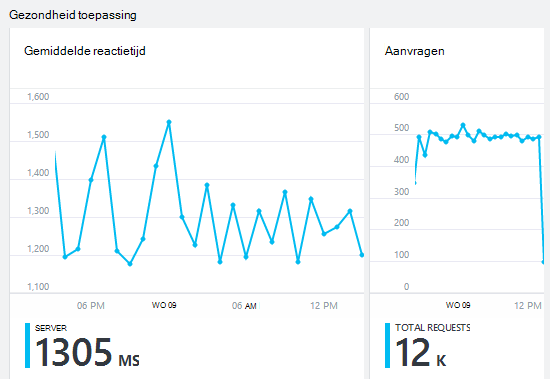

<properties 
    pageTitle="Gezondheid en het gebruik van met de inzichten van de toepassing van uw app controleren" 
    description="Aan de slag met de inzichten van toepassing. Gebruik, beschikbaarheid en prestaties van uw op gebouwen of Microsoft Azure toepassingen analyseren." 
    services="application-insights" 
    documentationCenter=""
    authors="alancameronwills" 
    manager="douge"/>

<tags 
    ms.service="application-insights" 
    ms.workload="tbd" 
    ms.tgt_pltfrm="ibiza" 
    ms.devlang="na" 
    ms.topic="article" 
    ms.date="11/25/2015" 
    ms.author="awills"/>
 
# Prestaties controleren in webtoepassingen

*Inzichten van toepassing is in het afdrukvoorbeeld.*

Zorg ervoor dat uw toepassing presteert goed en snel weten over eventuele fouten. [Toepassing inzichten] [ start] informatie over de problemen met de prestaties en de uitzonderingen en kunt u zoeken en onderzoeken de hoofdoorzaken.

Toepassing inzichten kunnen Java- en ASP.NET-toepassingen en services, WCF-services controleren. Ze kunnen worden gehost, lokaal, op virtuele machines of als Microsoft Azure websites. 

Op de client duurt inzichten van toepassing telemetrie van webpagina's en een grote verscheidenheid van apparaten zoals iOS, Android en Windows Store apps.

## Instellen prestaties controleren

Als u nog niet hebt toegevoegd toepassing inzichten aan uw project (als er geen ApplicationInsights.config), kiest u een van de volgende manieren aan de slag:

* [ASP.NET web apps](app-insights-asp-net.md)
 * [Toezicht op uitzondering toevoegen](app-insights-asp-net-exceptions.md)
 * [Monitoring van afhankelijkheid toevoegen](app-insights-monitor-performance-live-website-now.md)
* [J2EE web apps](app-insights-java-get-started.md)
 * [Monitoring van afhankelijkheid toevoegen](app-insights-java-agent.md)

## Prestatiegegevens verkennen

Blader naar de resource van toepassing inzichten die u voor de toepassing instelt in [de portal Azure](https://portal.azure.com). Het blad overzicht ziet u algemene prestatiegegevens:

Klik in een grafiek meer detail te zien en om resultaten te bekijken voor een langere periode. Klik bijvoorbeeld op de tegel aanvragen en selecteer vervolgens een periode:

Klik in een grafiek als u wilt kiezen welke parameters worden weergegeven, of een nieuwe grafiek toevoegen en selecteer de parameters:

> [AZURE.NOTE] **Schakel alle statistieken** voor een overzicht van de volledige selectie die beschikbaar is. De parameters kunnen worden ingedeeld in groepen; Wanneer een lid van een groep is geselecteerd, worden alleen de andere leden van de groep weergegeven.

## Wat doet alle gemiddelde? Prestaties tegels en rapporten

Er is diverse prestatiestatistieken ophalen die u kunt krijgen. We beginnen met die standaard worden weergegeven op het blad van toepassing.

### Aanvragen

Het aantal HTTP-aanvragen dat is ontvangen in een opgegeven periode. Vergelijk dit met de resultaten van andere-rapporten om te zien hoe de app werkt als de belasting varieert.

HTTP-verzoeken bevatten alle GET of POST-aanvragen voor pagina's, gegevens en afbeeldingen.

Klik op de tegel telt opvragen voor specifieke URL's.

### Gemiddelde reactietijd

Meet de tijd tussen een aanvraag voor een webpagina invoeren van uw toepassing en het antwoord wordt geretourneerd.

De punten geven zwevend gemiddelde. Als er veel aanvragen zijn, kunnen er enkele die afwijken van het gemiddelde zonder een duidelijke piek of dip in de grafiek.

Zoeken naar ongebruikelijke pieken. In het algemeen verwachten responstijd stijgen met een stijging van de aanvragen. Als de stijging onevenredig is, kan uw app een limiet resource zoals CPU of de capaciteit van een service wordt raken.

Klik op de tegel voor tijden voor specifieke URL's.

### Langzaamste aanvragen

Geeft aan welke aanvragen mogelijk voor het afstemmen van prestaties.

### Mislukte aanvragen

Het aantal aanvragen dat niet-afgevangen uitzonderingen heeft veroorzaakt.

Klik op het vakje voor de details van specifieke storingen en selecteert u een afzonderlijke aanvraag voor een overzicht van de details. 

Alleen een representatieve steekproef van fouten blijft voor individuele controle behouden.

### Andere criteria

Om te zien wat andere metrische gegevens weergeven, klikt u op een grafiek en deselecteer alle parameters voor een overzicht van de volledige beschikbaar stellen. Klik op (i) als de definitie van elke maateenheid wilt weergeven.

Selecteren van een metric uitschakelen anderen die niet kan worden weergegeven in dezelfde grafiek.

## Waarschuwingen instellen

Als u wilt worden gewaarschuwd via e-mail van ongebruikelijke waarden van een metriek, een waarschuwing toevoegen. U kunt een e-mailbericht verzenden aan de account administrators of aan specifieke e-mailadressen.

De bron voordat de andere eigenschappen instellen. Kies geen webtest bronnen als u waarschuwingen instellen voor prestatie- of gebruiksrapport maatstaven.

Let erop dat u Let op de eenheden waarin u wordt gevraagd de drempelwaarde in te voeren.

*Ik zie de knop Waarschuwing toevoegen.* -Is dit een groep account waarvoor u alleen-lezen toegang hebt? Neem contact op met de beheerder van de rekening.

## Oplossen van problemen

Hier volgen enkele tips voor het zoeken en oplossen van problemen met de prestaties:

* [Web tests] instellen[ availability] om te worden gewaarschuwd als uw website afgesloten wordt of traag of niet correct reageert. 
* Vergelijk het aantal aanvragen met andere criteria om te zien of er fouten of trage reactie betrekking hebben op laden.
* [Plaats en de instructies trace zoeken] [ diagnostic] in uw code om te helpen problemen lokaliseren.

## Volgende stappen

[Web-tests] [ availability] -web aanvragen verzonden naar uw toepassing op gezette tijden uit de hele wereld.

[Vastleggen en het traceren van diagnostische informatie zoeken] [ diagnostic] - oproepen traceren invoegen en doorzoeken van de resultaten in de problemen te achterhalen.

[Gebruik bijhouden van] [ usage] -Ontdek hoe anderen uw toepassing gebruiken.

[Het oplossen van] [ qna] - en Q & A

## Video

[AZURE.VIDEO performance-monitoring-application-insights]

<!--Link references-->

[availability]: app-insights-monitor-web-app-availability.md
[diagnostic]: app-insights-diagnostic-search.md
[greenbrown]: app-insights-asp-net.md
[qna]: app-insights-troubleshoot-faq.md
[redfield]: app-insights-monitor-performance-live-website-now.md
[start]: app-insights-overview.md
[usage]: app-insights-web-track-usage.md

 
