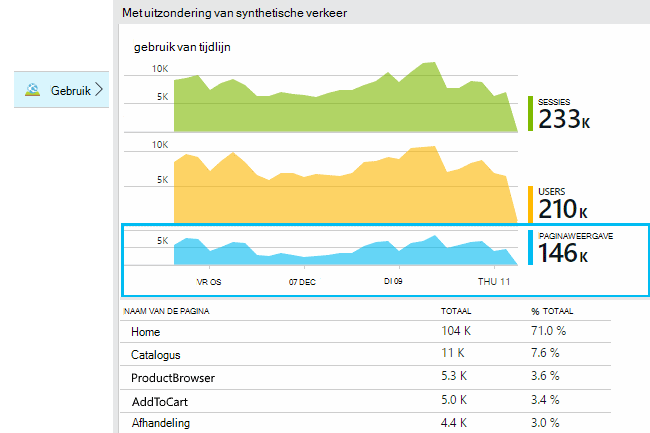
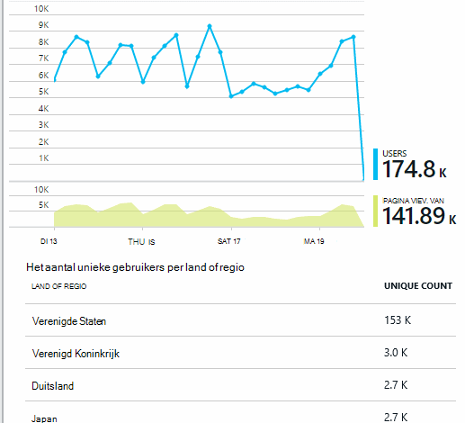
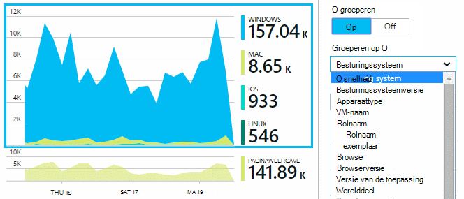
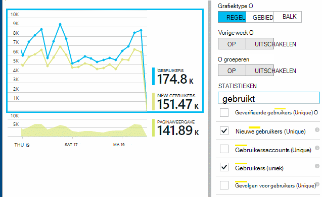
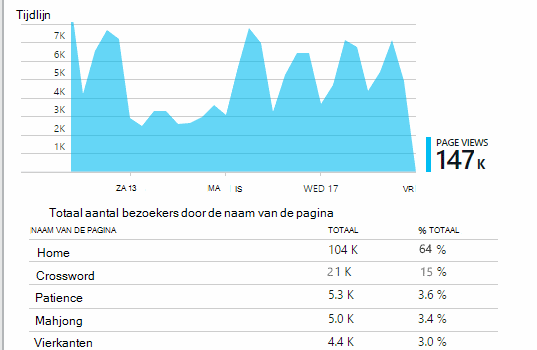
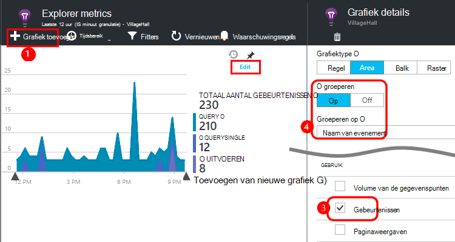
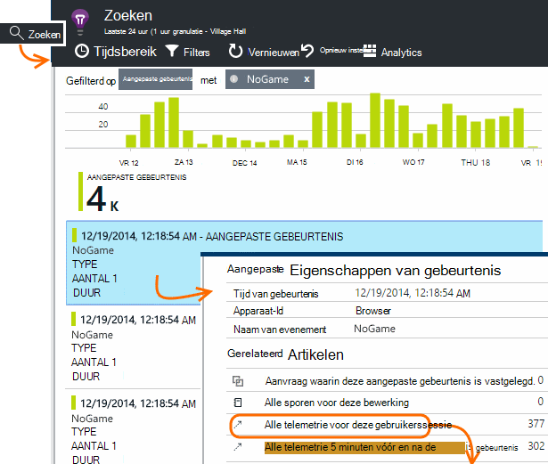
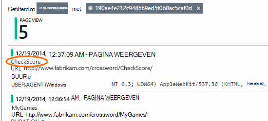
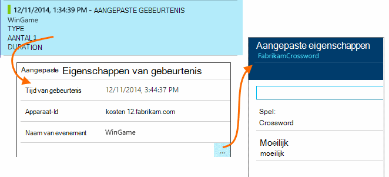
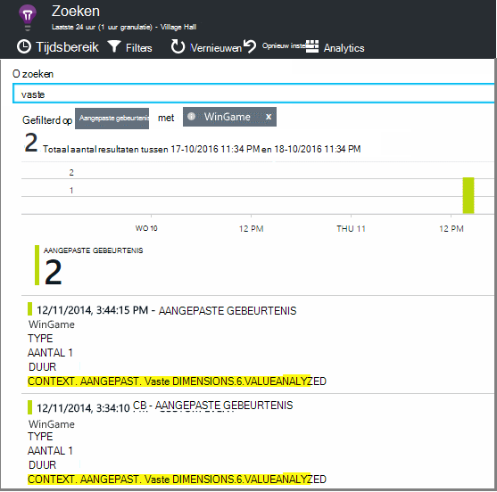

<properties 
    pageTitle="Gebruiksanalyse voor webtoepassingen met inzichten van toepassing" 
    description="Overzicht van de gebruiksanalyse voor web apps met inzichten van toepassing" 
    services="application-insights" 
    documentationCenter=""
    authors="alancameronwills" 
    manager="douge"/>

<tags 
    ms.service="application-insights" 
    ms.workload="tbd" 
    ms.tgt_pltfrm="ibiza" 
    ms.devlang="na" 
    ms.topic="article" 
    ms.date="06/12/2016" 
    ms.author="awills"/>
 
# <a name="usage-analysis-for-web-applications-with-application-insights"></a>Gebruiksanalyse voor webtoepassingen met inzichten van toepassing

Weten hoe mensen gebruiken in uw toepassing kunt u uw ontwikkelingswerk gericht op de scenario's die voor hen het belangrijkst zijn, en zo inzicht te krijgen in de doelen die zij zoeken makkelijker of moeilijker te bereiken. 

Visual Studio-toepassing inzichten biedt twee niveaus van het gebruik bijhouden:

* **Weergeven van gegevens van gebruikers, sessies en pagina** - gebruiksklaar geleverd.  
* **Aangepaste telemetrie** - u [code schrijft] [ api] voor het traceren van gebruikers via de gebruikerservaring van uw app. 

## <a name="setting-up"></a>Instellen

Opent een resource toepassing inzichten in de [Portal Azure](https://portal.azure.com), klik op de lege grafiek van Browser pagina wordt geladen en volg de installatie-instructies.

[Meer informatie](app-insights-javascript.md) 


## <a name="how-popular-is-my-web-application"></a>Hoe populair is mijn toepassing?

Aanmelden bij de [Azure portal][portal], Ga naar de bron van uw toepassing en gebruik op:



* **Gebruikers:** Het aantal verschillende actieve gebruikers in het tijdsbereik van het diagram. 
* **Sessies:** Het aantal actieve sessies
* **Paginaweergaven** Telt het aantal aanroepen van trackPageView(), meestal eenmaal aangeroepen op elke webpagina.

Klik op een van de grafieken in meer detail te zien. U ziet dat u het tijdsbereik van de grafieken kunt wijzigen.

### <a name="where-do-my-users-live"></a>De woonplaats van mijn gebruikers

Klik op de grafiek gebruikers om meer details zichtbaar in de blade gebruik:


 
### <a name="what-browsers-or-operating-systems-do-they-use"></a>Welke browsers en besturingssystemen ze kunnen gebruiken?

Gegevens te groeperen (segment) op een eigenschap, zoals de Browser, besturingssysteem of plaats:




## <a name="sessions"></a>Sessies

Sessie is een fundamentele concept in toepassing inzichten die streeft ernaar te koppelen elke telemetrie - gebeurtenis, zoals aanvragen, bezoekers, uitzonderingen, of aangepaste gebeurtenissen die u code zelf - met een bepaalde gebruikerssessie. 

Rich contextinformatie verzameld over elke sessie, zoals de kenmerken van de drager, geografische locatie en besturingssysteem.

Als u zowel de client als de server instrument ([ASP.NET] [ greenbrown] of [J2EE][java]), de SDK's wordt de sessie-id tussen client en server, doorvoeren, zodat de gebeurtenissen aan beide zijden kunnen worden gecorreleerd.

Bij het [oplossen van problemen][diagnostic], vindt u alle telemetrie gerelateerd aan de sessie waarin een probleem is opgetreden, met inbegrip van alle aanvragen en alle gebeurtenissen, uitzonderingen of sporen die zijn vastgelegd.

Sessies geven een goede indicatie van de populariteit van contexten zoals apparaat, besturingssysteem of locatie. Door het aantal sessies dat is gegroepeerd op het apparaat wordt weergegeven, bijvoorbeeld dat u een nauwkeuriger telling van hoe vaak dat apparaat wordt gebruikt met de app, dan door het tellen van bezoekers. Is dit een nuttige bijdrage aan uw beoordelen wanneer bent van elk apparaat-specifieke probleem.


#### <a name="whats-a-session"></a>Wat is een sessie?

Een sessie vertegenwoordigt één optreden tussen de gebruiker en de toepassing. In zijn eenvoudigste vorm sessie begint met een gebruiker die de app starten en eindigt wanneer de gebruiker de app verlaat. Voor webtoepassingen standaard de sessie wordt beëindigd na 30 minuten inactiviteit of na 24 uur van de activiteit. 

U kunt deze standaardinstellingen wijzigen door het codefragment bewerken:

    <script type="text/javascript">
        var appInsights= ... { ... }({
            instrumentationKey: "...",
            sessionRenewalMs: 3600000,
            sessionExpirationMs: 172800000
        });

* `sessionRenewalMs`: De tijd in milliseconden, verloopt de sessie vanwege inactiviteit van de gebruiker. Standaard: 30 minuten.
* `sessionExpirationMs`: De maximale sessieduur in milliseconden. Als de gebruiker na deze periode actief blijft, wordt een andere sessie geteld. Standaard: 24 uur.

**Duur van de sessie** is een [metric] [ metrics] wordt vastgelegd in de periode tussen de eerste en laatste telemetrie-items van de sessie. (Deze wordt niet opgenomen de time-outperiode.)

**Het aantal** in een bepaalde interval wordt gedefinieerd als het aantal unieke sessies met enkele activiteit gedurende deze periode. Wanneer u een lang bereik zoals count dagelijkse sessie voor de afgelopen week bekijkt, is dit meestal gelijk aan het totale aantal sessies. 

Wanneer u een korter tijdsbereik zoals per uur korrel verkennen, wordt echter een lange sessie spanning meerdere uren geteld voor elk uur dat de sessie actief was. 

## <a name="users-and-user-counts"></a>Gebruikers en gebruikers telt


Elke gebruikerssessie is gekoppeld aan een unieke gebruikers-id. 

Standaard wordt de gebruiker geïdentificeerd door een cookie te plaatsen. Een gebruiker die meerdere browsers of apparaten gebruikt worden meer dan één keer geteld. (Maar Zie [geverifieerde gebruikers](#authenticated-users))


De metric **aantal gebruikers** in een bepaalde interval wordt gedefinieerd als het aantal unieke gebruikers met een opgenomen activiteit gedurende deze periode. Hierdoor kunnen gebruikers met lange sessies mogelijk administratief worden verwerkt meerdere keren wanneer u een periode instellen zodat de korrel minder dan een uur is of zo.

**Nieuwe gebruikers** telt de gebruikers met de app wie de eerste sessie is opgetreden tijdens dit interval. Als u de standaardmethode voor tellen door gebruikers met cookies gebruikt, worden deze ook gebruikers die hun cookies hebt uitgeschakeld, of die een nieuw apparaat of de browser toegang krijgen tot uw app voor het eerst opgenomen.


### <a name="authenticated-users"></a>Geverifieerde gebruikers

Als uw web app kan gebruikers zich aanmelden, krijgt u een nauwkeuriger telling door inzichten van toepassing met een unieke gebruikers-id. Dit hoeft niet te worden van hun naam of dezelfde id die u gebruikt in uw app. Als uw app heeft de gebruiker geïdentificeerd, wordt deze code gebruiken:


*JavaScript op de client*

      appInsights.setAuthenticatedUserContext(userId);

Als uw app gebruikers in rekeningen groepen, kunt u ook een id voor de account doorvoeren. 

      appInsights.setAuthenticatedUserContext(userId, accountId);

De gebruiker en account-id moeten geen spaties of tekens bevatten`,;=|`


In [explorer maatstelsel](app-insights-metrics-explorer.md), kunt u een grafiek van **Geverifieerde gebruikers** en **Accounts**. 

## <a name="synthetic-traffic"></a>Synthetische verkeer

Synthetische verkeer bevat aanvragen van de beschikbaarheid en de belasting testen, zoekmachine-crawlers en andere stoffen. 

Toepassing inzichten probeert streeft ernaar om automatisch te bepalen en classificeren synthetische verkeer en op de juiste wijze te markeren. In de meeste gevallen wordt synthetische verkeer geen gebruikgemaakt van de SDK van JavaScript, zodat deze activiteit wordt uitgesloten van de gebruiker en de sessie tellen. 

Voor toepassing inzichten [web tests][availability], de gebruikers-id wordt automatisch ingesteld op basis van locatie POP en sessie-id wordt ingesteld op basis van de test worden uitgevoerd-id. In rapporten, standaard deze gebruikers en sessies sluit synthetische verkeer wordt gefilterd. Echter wanneer synthetische verkeer opgenomen is, het mogelijk dat een kleine toename in algemene gebruikers en telt sessie.
 
## <a name="page-usage"></a>Gebruik van de pagina

Klik op het diagram van de weergaven pagina voor een meer ingezoomd versie met een uitsplitsing van de meest populaire pagina's:



 
In het bovenstaande voorbeeld is van een website met spellen. Hieruit kunnen we direct zien:

* Gebruik niet is verbeterd in de afgelopen week. Misschien moeten we denken over optimalisatie voor zoekmachines?
* Veel minder mensen Zie spelletjes pagina's dan de introductiepagina. Waarom niet onze homepage aantrekken van mensen om te spelen?
* 'Crossword' is de meest populaire spel. We moeten voorrang geven aan nieuwe ideeën en er verbeteringen.

## <a name="custom-tracking"></a>Aangepaste reeksspatiëring

Stel dat in plaats van de uitvoering van elk spel in een aparte pagina, u wilt ze refactoring alles in de dezelfde app voor één pagina, met de meeste van de functionaliteit die is gecodeerd als Javascript in de pagina. Hierdoor kan de gebruiker snel schakelen tussen een spel en de andere, of zelfs hebben verschillende spelletjes op één pagina. 

Maar u wilt toch inzichten van de toepassing aan te melden, het aantal keren elk spel wordt geopend, op dezelfde manier als wanneer deze zich op een afzonderlijke webpagina's. Dat is heel eenvoudig: alleen een aanroep van de telemetrie-module in uw JavaScript op de record die is geopend met een nieuwe pagina waar u wilt invoegen:

    appInsights.trackPageView(game.Name);

## <a name="custom-events"></a>Aangepaste gebeurtenissen

Schrijf aangepaste telemetrie om specifieke gebeurtenissen. Met name in een app voor één pagina wilt u weten hoe vaak de gebruiker bepaalde acties worden uitgevoerd of bepaalde doelstellingen worden bereikt: 

    appInsights.trackEvent("GameEnd");

Als u bijvoorbeeld aan te melden op een koppeling te klikken:

    <a href="target.htm" onclick="appInsights.trackEvent('linkClick');return true;">my link</a>


## <a name="view-counts-of-custom-events"></a>Weergave van aangepaste gebeurtenissen telt

Open Explorer Metrics en gebeurtenissen weergeven in een grafiek toevoegen. Segment met de naam:




## <a name="drill-into-specific-events"></a>Detailinformatie specifieke gebeurtenissen

Als u een beter begrip van hoe een typische sessie gaat, kunt u zich richten op een specifieke gebruikerssessie met een bepaald type gebeurtenis. 

In dit voorbeeld wordt gecodeerd we een aangepaste gebeurtenis 'NoGame', die wordt aangeroepen als de gebruiker meldt zich af zonder daadwerkelijk een spel wordt gestart. Waarom zou een gebruiker doen? Misschien als we enkele specifieke exemplaren lager, je wij geven een aanwijzing. 

De aangepaste gebeurtenissen ontvangen vanuit de app worden weergegeven op het blad Overzicht:


 
Klik op de gebeurtenis die van belang en selecteer recente criteria voldoen:



 
We bekijken alle telemetrie voor de sessie waarin die NoGame gebeurtenis zich heeft voorgedaan. 


 
Er zijn geen uitzonderingen, zodat de gebruiker is niet verhinderd door een fout.
 
We kunnen alle soorten telemetrie, met uitzondering van paginaweergaven uitfilteren voor deze sessie:



 
En nu kunnen we zien dat deze gebruiker ingelogd simpelweg naar de meest recente scores controleren. Misschien moeten we overwegen ontwikkelen van een gebruiker verhaal dat beter doen. (En we moeten implementeren voor een aangepaste gebeurtenis rapport wanneer dit specifieke artikel plaatsvindt.)

## <a name="filter-search-and-segment-your-data-with-properties"></a>Filteren, zoeken en segmenteren van uw gegevens met eigenschappen
U kunt willekeurige codes en numerieke waarden koppelen aan gebeurtenissen.
 

*JavaScript op de client*

```JavaScript

    appInsights.trackEvent("WinGame",
        // String properties:
        {Game: currentGame.name, Difficulty: currentGame.difficulty},
        // Numeric measurements:
        {Score: currentGame.score, Opponents: currentGame.opponentCount}
    );
```

*C# op server*

```C#

    // Set up some properties:
    var properties = new Dictionary <string, string> 
        {{"game", currentGame.Name}, {"difficulty", currentGame.Difficulty}};
    var measurements = new Dictionary <string, double>
        {{"Score", currentGame.Score}, {"Opponents", currentGame.OpponentCount}};

    // Send the event:
    telemetry.TrackEvent("WinGame", properties, measurements);
```

*VB op server*

```VB

    ' Set up some properties:
    Dim properties = New Dictionary (Of String, String)
    properties.Add("game", currentGame.Name)
    properties.Add("difficulty", currentGame.Difficulty)

    Dim measurements = New Dictionary (Of String, Double)
    measurements.Add("Score", currentGame.Score)
    measurements.Add("Opponents", currentGame.OpponentCount)

    ' Send the event:
    telemetry.TrackEvent("WinGame", properties, measurements)
```

Eigenschappen koppelen aan bezoekers op dezelfde manier:

*JavaScript op de client*

```JS

    appInsights.trackPageView("Win", 
        url,
        {Game: currentGame.Name}, 
        {Score: currentGame.Score});
```

In diagnostische zoeken, moet u de eigenschappen weergeven door te klikken op door middel van een afzonderlijk exemplaar van een gebeurtenis.



 
Gebruik het veld zoeken voor een overzicht van de gebeurtenissen die hebben plaatsgevonden met een bepaalde eigenschappenwaarde.





## <a name="a--b-testing"></a>A | B testen

Als u niet welke variant van een functie succesvoller zal zijn weet, laat u beide, waardoor elke toegankelijk voor andere gebruikers. Het succes van elk meten en vervolgens verplaatst naar een uniforme versie.

Voor deze techniek kunt u verschillende codes toevoegen aan de telemetrie die door elke versie van uw app wordt verzonden. U kunt dit doen door de eigenschappen te definiëren in de actieve TelemetryContext. Deze standaardeigenschappen worden toegevoegd aan elk telemetrie bericht dat de toepassing wordt verzonden - niet alleen uw aangepaste berichten, maar ook de standaard telemetrie. 

In de portal Application inzichten kun je vervolgens steeds te filteren en groeperen (segment) uw gegevens op de tags, om de verschillende versies vergelijken.

*C# op server*

```C#

    using Microsoft.ApplicationInsights.DataContracts;

    var context = new TelemetryContext();
    context.Properties["Game"] = currentGame.Name;
    var telemetry = new TelemetryClient(context);
    // Now all telemetry will automatically be sent with the context property:
    telemetry.TrackEvent("WinGame");
```

*VB op server*

```VB

    Dim context = New TelemetryContext
    context.Properties("Game") = currentGame.Name
    Dim telemetry = New TelemetryClient(context)
    ' Now all telemetry will automatically be sent with the context property:
    telemetry.TrackEvent("WinGame")
```

Afzonderlijke telemetrie kunt negeren de standaardwaarden.

U kunt een universele initialiseren instellen zodat alle nieuwe TelemetryClients automatisch uw context gebruikt.

```C#


    // Telemetry initializer class
    public class MyTelemetryInitializer : ITelemetryInitializer
    {
        public void Initialize (ITelemetry telemetry)
        {
            telemetry.Properties["AppVersion"] = "v2.1";
        }
    }
```

In de initialisatiefunctie app zoals Global.asax.cs:

```C#

    protected void Application_Start()
    {
        // ...
        TelemetryConfiguration.Active.TelemetryInitializers
        .Add(new MyTelemetryInitializer());
    }
```


## <a name="build---measure---learn"></a>Build - eenheid - informatie

Wanneer u analytics gebruiken, wordt het een geïntegreerd onderdeel ontwikkelingscyclus - niet alleen wat die u denkt over om te helpen problemen op te lossen. Hier volgen enkele tips:

* De belangrijkste metric van uw toepassing bepalen. Wilt u dat gebruikers zoveel mogelijk, of u liever een kleine groep gebruikers tevreden? Wilt u bezoeken of verkoop te maximaliseren?
* Plan voor het meten van elk artikel. Wanneer een schets van een nieuwe gebruiker verhaal of functie of een plan voor het bijwerken van een bestaande, altijd bedenken hoe u meet het succes van de wijziging. Voordat u begint codering, vraag "welk effect dit heeft op onze metrics, als het werkt? Moeten we volgen alle nieuwe gebeurtenissen?"
En natuurlijk als de functie live is, Controleer of u de analytics bekijken en reageren op de resultaten. 
* Andere metrische gegevens betrekking op de belangrijkste metric. Bijvoorbeeld, als u een functie 'Favorieten' toevoegen, u wilt weten hoe vaak gebruikers Favorieten toevoegen. Maar het is misschien meer interessant om te weten hoe vaak komen ze terug naar hun Favorieten. En, bovenal, klanten die werken met Favorieten uiteindelijk kopen van uw product?
* Canarische testen. Een schakeloptie functie waarmee u een nieuwe functie om zichtbaar te maken alleen voor bepaalde gebruikers kunt instellen. Inzichten van toepassing om te zien of de nieuwe functie wordt gebruikt in de manier waarop die u het beoogde gebruik. Pas vervolgens vrijgeven aan een breder publiek.
* Neem contact op met uw gebruikers! Analytics is niet genoeg op zichzelf, maar vullen elkaar aan het onderhouden van een goede klantrelatie.


## <a name="references"></a>Verwijzingen

* [Met behulp van de API - overzicht][api]
* [JavaScript API: naslag](https://github.com/Microsoft/ApplicationInsights-JS/blob/master/API-reference.md)

## <a name="video"></a>Video

> [AZURE.VIDEO usage-monitoring-application-insights]


<!--Link references-->

[api]: app-insights-api-custom-events-metrics.md
[availability]: app-insights-monitor-web-app-availability.md
[client]: app-insights-javascript.md
[diagnostic]: app-insights-diagnostic-search.md
[greenbrown]: app-insights-asp-net.md
[java]: app-insights-java-get-started.md
[metrics]: app-insights-metrics-explorer.md
[portal]: http://portal.azure.com/
[windows]: app-insights-windows-get-started.md

 
