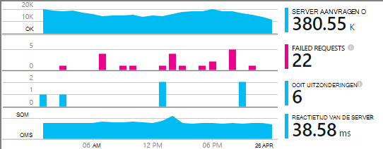
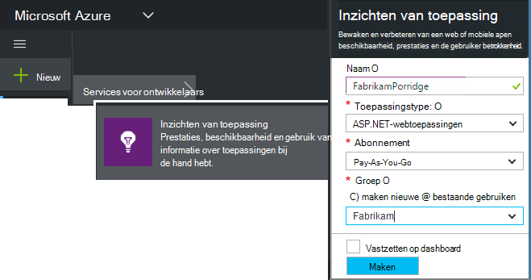
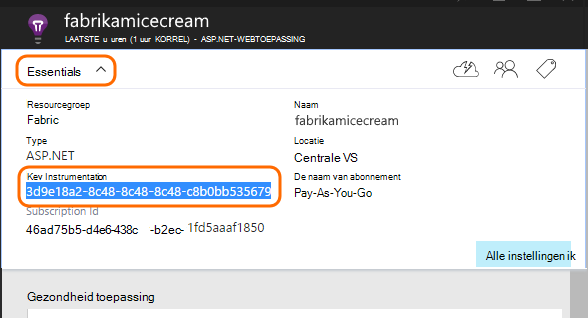
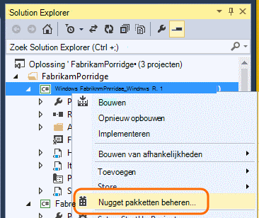
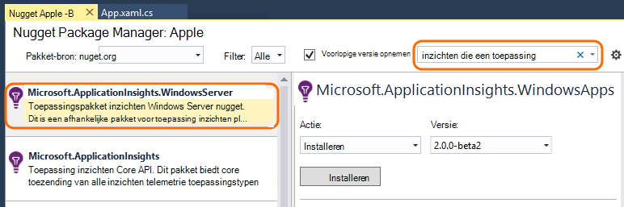
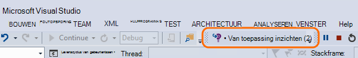
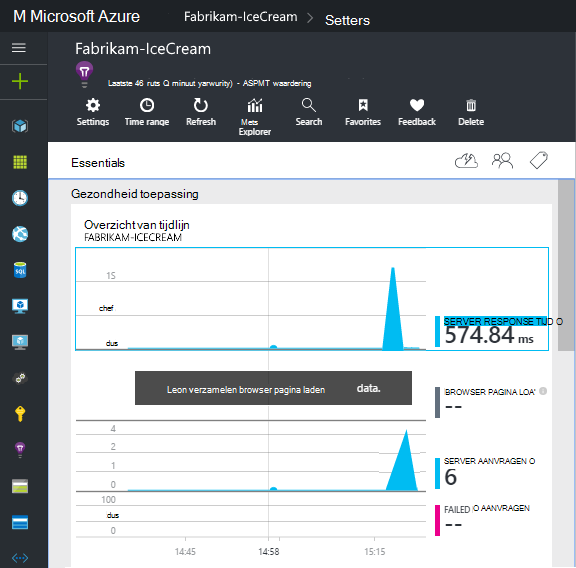
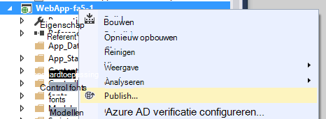

<properties
    pageTitle="Toepassing inzichten voor Windows-services en rollen van de werknemer | Microsoft Azure"
    description="De toepassing inzichten SDK handmatig toevoegen aan uw ASP.NET-toepassing voor het analyseren van gebruik, beschikbaarheid en prestaties."
    services="application-insights"
    documentationCenter=".net"
    authors="alancameronwills"
    manager="douge"/>

<tags
    ms.service="application-insights"
    ms.workload="tbd"
    ms.tgt_pltfrm="ibiza"
    ms.devlang="na"
    ms.topic="get-started-article"
    ms.date="08/30/2016"
    ms.author="awills"/>

# Toepassing inzichten handmatig configureren voor ASP.NET-4-toepassingen

*Inzichten van toepassing is in het afdrukvoorbeeld.*

[AZURE.INCLUDE [app-insights-selector-get-started](../../includes/app-insights-selector-get-started.md)]

U kunt handmatig [Inzichten van Visual Studio-toepassing](app-insights-overview.md) voor het controleren van Windows-services, werknemer, rollen en andere ASP.NET-toepassingen configureren. Handmatige configuratie is een alternatief voor de [Automatische installatie](app-insights-asp-net.md) van Visual Studio voor web-apps.

Toepassing inzichten kunt u opsporen van problemen en prestaties bewaken en -gebruik in de actieve toepassing.

#### Voordat u begint

Hebt u nodig:

* Een abonnement op [Microsoft Azure](http://azure.com). Als uw team of organisatie een Azure-abonnement heeft, kunt de eigenaar u aan toevoegen, met uw [Microsoft-account](http://live.com).
* Visual Studio 2013 of later.

## 1. Maak een toepassing inzichten-bron

Aanmelden bij de [Azure portal](https://portal.azure.com/)en een nieuwe toepassing inzichten bron maken. ASP.NET te kiezen als het toepassingstype.

Een [resource](app-insights-resources-roles-access-control.md) in Azure is een exemplaar van een service. Deze bron is waar telemetrie van uw app worden geanalyseerd en aan u gepresenteerd.

De keuze van het toepassingstype wordt de Standaardinhoud van de eigenschappen en de resource-blades zichtbaar in [De Verkenner maatstaven](app-insights-metrics-explorer.md).

#### Kopieer de sleutel Instrumentation

De sleutel geeft de bron, en installeert u deze snel in de SDK om gegevens naar de bron.

De stappen die u net hebt uitgevoerd om een nieuwe bron maken zijn een goede manier om te beginnen met het toezicht op de toepassing. Nu kunt u de gegevens te verzenden.

## 2. Installeer de SDK in uw toepassing

Installeren en configureren van de toepassing inzichten SDK varieert afhankelijk van het platform waarmee u werkt. Voor ASP.NET-toepassingen is het eenvoudig.

1. Bewerk de NuGet pakketten van uw project web app in Visual Studio.

    

2. Toepassing inzichten SDK voor Web Apps installeren.

    

    *Kan ik andere pakketten gebruiken?*

    Ja. Kies de kern-API (Microsoft.ApplicationInsights) als u alleen gebruikmaken van de API wilt voor het verzenden van uw eigen telemetrie. Het pakket met Windows Server bevat automatisch de kern-API, plus een aantal andere pakketten, zoals de verzameling van prestatiemeteritems en de controle op afhankelijkheid. 

#### Upgrade naar toekomstige versies van de SDK

Wij vrijgegeven van tijd tot tijd een nieuwe versie van de SDK.

Als u wilt upgraden naar een [nieuwe versie van de SDK](https://github.com/Microsoft/ApplicationInsights-dotnet-server/releases/), NuGet package manager opnieuw en filter op geïnstalleerde pakketten te openen. Selecteer **Microsoft.ApplicationInsights.Web** en kiest u **een upgrade uitvoert**.

Als u aanpassingen hebt aangebracht in de ApplicationInsights.config, een kopie ervan opslaan voordat u een upgrade uitvoert en de wijzigingen later in de nieuwe versie samenvoegen.

## 3. telemetrie verzenden

**Als u alleen de core API-pakket hebt geïnstalleerd:**

* Instellen van de sleutel instrumentation in code, bijvoorbeeld `main()`: 

    `TelemetryConfiguration.Active.InstrumentationKey = "`*uw sleutel*`";` 

* [Schrijf uw eigen telemetrie-API gebruiken](app-insights-api-custom-events-metrics.md#ikey).

**Als u een andere toepassing inzichten-pakketten geïnstalleerd** kunt u, als u wilt, gebruikt het .config-bestand de sleutel instrumentation:

* ApplicationInsights.config bewerken (die is toegevoegd door de installatie NuGet). Dit net vóór de afsluitende tag invoegen:

    `<InstrumentationKey>`*de instrumentatie-sleutel die u hebt gekopieerd*`</InstrumentationKey>`

* Zorg ervoor dat de eigenschappen van de ApplicationInsights.config in de Solution Explorer zijn ingesteld op **Build Action = inhoud kopiëren naar de uitvoermap kopie =**.

## Voer het project

Gebruik **F5** om uw toepassing uitvoert en probeer het zelf: verschillende pagina's voor het genereren van sommige telemetrie openen.

In Visual Studio ziet u een aantal van de gebeurtenissen die zijn verzonden.

## Uw telemetrie weergeven

Terug naar de [portal Azure](https://portal.azure.com/) en blader naar de resource inzichten van toepassing.

Zoeken naar gegevens in het overzicht van grafieken. Op het eerste ziet maar u een of twee punten. Bijvoorbeeld:

Klik op een grafiek om te zien meer gedetailleerde statistieken. [Meer informatie over parameters.](app-insights-web-monitor-performance.md)

#### Er zijn geen gegevens?

* Gebruik de toepassing, zodat sommige telemetrie genereert verschillende pagina's te openen.
* Open de tegel [Zoeken](app-insights-diagnostic-search.md) om afzonderlijke gebeurtenissen te bekijken. Soms duurt het gebeurtenissen iets terwijl langer ophalen via de pijpleiding maatstaven.
* Wacht een paar seconden en klikt u op **vernieuwen**. Grafieken regelmatig zelf vernieuwen, maar u kunt handmatig vernieuwen als je voor bepaalde gegevens wacht kunnen worden weergegeven.
* Zie [problemen oplossen](app-insights-troubleshoot-faq.md).

## Publiceren van uw app

Nu uw toepassing te distribueren naar uw server of Azure en kijk hoe de gegevens worden verzameld.

Als u in foutopsporingsmodus uitvoert, wordt telemetrie versneld door de pijplijn, zodat u binnen enkele seconden vermelde gegevens moet zien. Wanneer u uw app Release configuratie implementeert, gegevens worden bij elkaar opgeteld langzamer.

#### Er zijn geen gegevens nadat u op de server publiceren?

Deze poorten voor uitgaand verkeer openen in de firewall van uw server:

+ `dc.services.visualstudio.com:443`
+ `f5.services.visualstudio.com:443`

#### Problemen op de server samenstellen?

Raadpleeg [dit artikel oplossen](app-insights-asp-net-troubleshoot-no-data.md#NuGetBuild).

> [AZURE.NOTE]Als uw app een groot aantal telemetrie genereert (en u de SDK van ASP.NET versie 2.0.0-beta3 of hoger), de module Geavanceerde sampling automatisch afgetrokken van het volume dat wordt verzonden naar de portal door alleen een representatief deel van de gebeurtenissen te sturen. Echter, gebeurtenissen die betrekking op dezelfde aanvraag hebben geselecteerd of uitgeschakeld als een groep, zodat u tussen verwante gebeurtenissen navigeren kunt. 
> [Meer informatie over de bemonstering](app-insights-sampling.md).

## Volgende stappen

* [Telemetrie meer toevoegen](app-insights-asp-net-more.md) aan de 360 °-panorama-weergave van uw toepassing.

