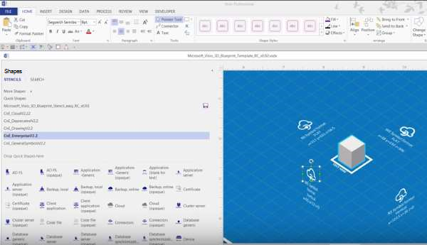

<properties 
    pageTitle="Toepassingsarchitectuur op Microsoft Azure | Microsoft Azure" 
    description="Overzicht architectuur die betrekking heeft op gemeenschappelijk ontwerppatronen" 
    services="" 
    documentationCenter="" 
    authors="Rboucher" 
    manager="jwhit" 
    editor="mattshel"/>

<tags 
    ms.service="multiple" 
    ms.workload="na" 
    ms.tgt_pltfrm="na" 
    ms.devlang="na" 
    ms.topic="article" 
    ms.date="09/13/2016" 
    ms.author="robb"/>

#Toepassingsarchitectuur op Microsoft Azure
Bronnen voor het bouwen van toepassingen die gebruikmaken van Microsoft Azure. Dit bevat hulpprogramma's waarmee u kunt teken diagrammen om visueel softwaresystemen te beschrijven. 

##Ontwerp patronen poster

[Wolk ontwerppatronen](http://msdn.microsoft.com/library/dn568099.aspx) beschikbaar op MSDN en PDF-bestand downloaden is van het boek is gepubliceerd door Microsoft patronen en procedures. Er is ook een groot formaat poster beschikbaar waarin alle patronen. 

##Microsoft-architectuur certificering cursus

Microsoft heeft een architectuur cursus Microsoft certificering examen 70-534 ondersteunen. Het is [beschikbaar op EDX.ORG gratis](https://www.edx.org/course/architecting-microsoft-azure-solutions-microsoft-dev205x).  De [3D-blauwdruk Visio-sjabloon](#3d-blueprint-visio-template)wordt gebruikt. 

##Microsoft-oplossingen

Microsoft publiceert een set van hoog niveau [oplossing architecturen](http://aka.ms/azblueprints) met het bouwen van specifieke soorten systemen die gebruikmaken van Microsoft-producten. 

Eerder gepubliceerd Microsoft een reeks voorbeeld-architecturen met blauwdrukken. Die zijn vervangen door de eerder genoemde oplossing-architecturen en de koppeling blauwdruk punt aan hen is omgeleid. Als u toegang tot de vorige blauwdrukken materiaal voor een of andere reden, e-mailen [CnESymbols@microsoft.com](mailto:CnESymbols@microsoft.com) met uw aanvraag.   

De blauwdrukken en oplossing architecturen diagrammen gebruiken beide delen van de [wolk en Enterprise symboolset](#Drawing-symbol-and-icon-sets).   

##3D-blauwdruk Visio-sjabloon

De 3D-versies van de nu verouderde [Microsoft architectuur blauwdrukken](http://aka.ms/azblueprints) zijn in eerste instantie in een niet-Microsoft-programma gemaakt. Een Visio-sjabloon voor 2013 (en later) verzonden op 5 augustus 2015 als onderdeel van een [architectuur die Microsoft certificering cursus gedistribueerd op EDX.ORG](#microsoft-architecture-certification-course).

De sjabloon is ook beschikbaar buiten de cursus. 

- [Weergave van de video opleiding](http://aka.ms/3dBlueprintTemplateVideo) eerste zodat u weet wat u ermee kunt doen   
- Download de [Microsoft Visio-sjabloon voor 3D-blauwdruk](http://aka.ms/3DBlueprintTemplate)
- Downloaden van de [wolk en Enterprise-symbolen](#drawing-symbol-and-icon-sets) te gebruiken met de 3D-sjabloon. 

Een e-mail sturen naar [CnESymbols@microsoft.com](mailto:CnESymbols@microsoft.com) voor specifieke vragen niet worden beantwoord door het trainingsmateriaal of om feedback te geven. De sjabloon is niet langer actief ontwikkeld, maar het is nog steeds nuttige en relevante omdat deze kan een PNG- of de [wolk en symbolen van de onderneming](#drawing-symbol-and-icon-sets), die worden bijgewerkt.  

##Het symbool en het pictogram sets tekening 

[Visio en symbolen training video weergeven](http://aka.ms/CnESymbolsVideo) en vervolgens [downloaden van de wolk en symbool van de onderneming instellen](http://aka.ms/CnESymbols) voor het maken van technische materialen die beschrijven Azure, Windows Server, SQL Server en meer. Kunt u de symbolen in de architectuur, diagrammen, lesmateriaal, presentaties, gegevensbladen, infographics, whitepapers en zelfs 3e partij boeken als het boek mensen traint gebruik van Microsoft-producten. Ze zijn echter niet bedoeld voor gebruik in gebruikersinterfaces.

De CnE symbolen zijn in Visio, SVG- en PNG-indeling. Aanvullende instructies over hoe u gemakkelijk de symbolen gebruiken in PowerPoint worden opgenomen in de groep. 

De symboolset per kwartaal wordt geleverd en wordt bijgewerkt als nieuwe services worden vrijgegeven. 

Aanvullende symbolen voor Microsoft Office en verwante technologieën zijn beschikbaar in [Microsoft Office Visio-stencil](http://www.microsoft.com/en-us/download/details.aspx?id=35772), maar ze zijn niet geoptimaliseerd voor bouwkundige diagrammen, zoals het CnE is ingesteld.   

**Feedback:** Als u de CnE symbolen hebt gebruikt, de korte vraag 5 [enquête](http://aka.ms/azuresymbolssurveyv2) of een e-mail sturen naar [CnESymbols@microsoft.com](mailto:CnESymbols@microsoft.com) voor specifieke vragen en problemen. We willen graag weten wat u denkt, met inbegrip van positieve feedback zo we doorgaan weten met investeren tijd in deze. 

##Architectuur van Infographics

Microsoft publiceert verschillende architectuur gerelateerde posters/infographics. Zij zijn [Ware Cloud-toepassingen maken](https://azure.microsoft.com/documentation/infographics/building-real-world-cloud-apps/) en [schaal met Cloud Services](https://azure.microsoft.com/documentation/infographics/cloud-services/) . 

