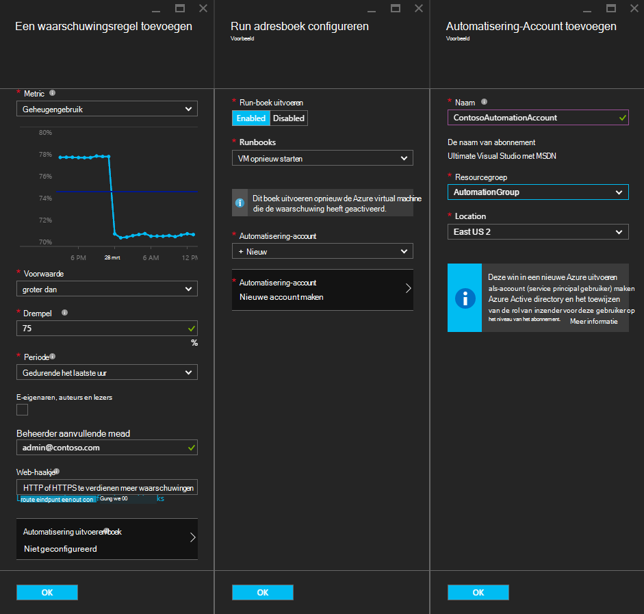
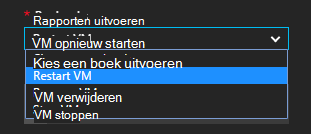
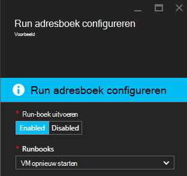
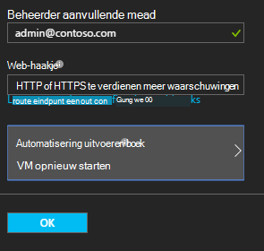

<properties
    pageTitle=" Azure VM waarschuwingen met automatisering Runbooks herstellen | Microsoft Azure"
    description="In dit artikel wordt beschreven hoe waarschuwingen Azure Virtual Machine integreren met Azure automatisering runbooks en auto problemen verhelpen"
    services="automation"
    documentationCenter=""
    authors="mgoedtel"
    manager="jwhit"
    editor="tysonn" />    
<tags
    ms.service="automation"
    ms.devlang="na"
    ms.topic="article"
    ms.tgt_pltfrm="na"
    ms.workload="infrastructure-services"
    ms.date="06/14/2016"
    ms.author="csand;magoedte" />

# <a name="azure-automation-scenario---remediate-azure-vm-alerts"></a>Scenario voor automatisering op Azure - waarschuwingen voor Azure VM verhelpen

Azure automatisering en Azure virtuele Machines hebben een nieuwe functie, zodat u kunt uitvoeren van automatisering runbooks Virtual Machine (VM) waarschuwingen configureren uitgebracht. Deze nieuwe functionaliteit kunt u automatisch herstel standaard worden uitgevoerd in reactie op VM signalen, zoals het opnieuw starten of stoppen van de VM.

Eerder, tijdens het maken van VM waarschuwingsregel u kon [een automatisering-webhook opgeven](https://azure.microsoft.com/blog/using-azure-automation-to-take-actions-on-azure-alerts/) om een runbook om de runbook uitgevoerd wanneer de waarschuwing gegeven. Dit vereist echter u het werk van de runbook maken, maken van de webhook voor de runbook, en vervolgens kopiëren en plakken van de webhook tijdens het maken van waarschuwingsregel. Met deze nieuwe release is het proces veel gemakkelijker omdat u een runbook rechtstreeks uit een lijst tijdens het maken van waarschuwingsregel kiezen kunt en kunt u een Automation-account die wordt uitgevoerd, de runbook of eenvoudig een account maken.

In dit artikel zien we u hoe eenvoudig het is een waarschuwing voor Azure VM instellen en configureren van een automatisering-runbook moet worden uitgevoerd als het signaal wordt gegenereerd. Voorbeeldscenario's bevatten een VM opnieuw te starten als het geheugenverbruik groter is dan sommige drempel door een toepassing op de VM met een geheugenlek, of een VM stoppen wanneer de gebruiker CPU-tijd minder dan 1% van het afgelopen uur is en niet in gebruik. Ook leggen we hoe het automatisch maken van een service principal in uw account automatisering vereenvoudigt het gebruik van runbooks in Azure alert doorvoeren.

## <a name="create-an-alert-on-a-vm"></a>Een waarschuwing maken op een VM

Voer de volgende stappen voor het configureren van een waarschuwing om een runbook te starten wanneer de drempel is voldaan.

>[AZURE.NOTE] Deze versie alleen ondersteund V2 virtuele machines en ondersteuning voor klassieke die VMS zal spoedig worden toegevoegd.  

1. Log in op de Azure portal en klik op **virtuele Machines**.  
2. Selecteer een van uw virtuele machines.  De blade virtuele machine dashboard wordt weergegeven en de bladeservers **Instellingen** rechts ervan.  
3. Selecteer in de blade **Instellingen** onder de controlesectie **waarschuwingsregels**.
4. Klik op het blad **waarschuwingsregels** **melding toevoegen**.

Hiermee opent u het **toevoegen van een waarschuwingsregel** blade, waarbij de voorwaarden voor de signalering configureren en kiezen uit een of alle van de volgende opties: e-mailbericht naar iemand verzenden, zenden het signaal naar een ander systeem en/of uitvoeren van een runbook automatisering in antwoord poging om het probleem te verhelpen met een webhook.

## <a name="configure-a-runbook"></a>Een runbook configureren

Selecteer voor het configureren van een runbook worden uitgevoerd wanneer wordt voldaan aan de alarmdrempel VM **Automatisering Runbook**. In het blad **runbook configureren** , kunt u de runbook uit te voeren en de account automatisering voor het uitvoeren van de runbook in.



>[AZURE.NOTE] Voor deze release kunt u kiezen uit drie runbooks die de service levert – VM opnieuw starten of stoppen VM VM verwijderen (verwijderen).  De mogelijkheid te kiezen voor andere runbooks of een van uw eigen runbooks zijn beschikbaar in een toekomstige versie.



Nadat u een van de drie beschikbare runbooks, de vervolgkeuzelijst **automatisering account** wordt weergegeven en kunt u een automation-account die als de runbook wordt uitgevoerd. Runbooks moet worden uitgevoerd in de context van een [account voor automatisering](automation-security-overview.md) van uw abonnement op Azure. Kunt u een Automation-account dat u al hebt gemaakt, of u kunt een nieuwe automatisering-account voor u gemaakt.

De runbooks die beschikbaar zijn voor Azure met behulp van een service principal worden geverifieerd. Als u kiest voor de runbook een van uw bestaande accounts van automatisering, zullen we automatisch de service principal voor u maken. Als u een nieuwe account voor automatisering, maakt we automatisch de account en de service principal. In beide gevallen worden twee activa ook gemaakt in de automatisering – de activa van een certificaat met de naam **AzureRunAsCertificate** en de activa van een verbinding met de naam **AzureRunAsConnection**. De runbooks **AzureRunAsConnection** gebruikt voor verificatie met Azure om het beheer van actie tegen de VM.

>[AZURE.NOTE] De service principal is gemaakt in de scope van het abonnement en de rol van Inzender is toegewezen. Deze functie is vereist om de account te kunnen uitvoeren van automatisering runbooks Azure VMs beheren.  Het maken van een account Automaton en/of de service principal is een eenmalige gebeurtenis. Zodra ze zijn gemaakt, kunt u die account voor het uitvoeren van runbooks voor andere waarschuwingen Azure VM.

Wanneer u op **OK** klikt de waarschuwing is geconfigureerd en als u de optie voor het maken van een nieuwe account voor automatisering hebt geselecteerd, wordt deze gemaakt samen met de service principal.  Dit kan enkele seconden duren.  



Nadat de configuratie is voltooid, ziet u de naam van de runbook in het blad **een waarschuwingsregel toevoegen** wordt weergegeven.



Klik op **OK** in het **toevoegen van een waarschuwingsregel** blade en de waarschuwingsregel wordt gemaakt en geactiveerd als de virtuele machine uitgevoerd wordt.

### <a name="enable-or-disable-a-runbook"></a>In- of uitschakelen van een runbook

Hebt u een runbook voor een signaal is geconfigureerd, kunt u deze uitschakelen zonder de configuratie runbook. Hiermee kunt u de waarschuwing actief houden en testen misschien enkele van de waarschuwingsregels en later weer inschakelen de runbook.

## <a name="create-a-runbook-that-works-with-an-azure-alert"></a>Een runbook die met een Azure waarschuwing werkt maken

Wanneer u een runbook als onderdeel van een Azure waarschuwingsregel kiest, moet de runbook logica hebben in het beheren van de waarschuwingsgegevens die wordt doorgegeven aan het.  Wanneer een runbook is geconfigureerd in een waarschuwingsregel, een webhook gemaakt voor de runbook; dat webhook wordt vervolgens gebruikt voor de runbook worden gestart wanneer de waarschuwing wordt gegenereerd.  De werkelijke gesprek starten de runbook is een HTTP POST-aanvraag naar de URL webhook. De tekst van de POST-aanvraag bevat een JSON-indeling object met nuttige eigenschappen die betrekking hebben op de waarschuwing.  Zoals u hieronder zien kunt, bevat de waarschuwingsgegevens details, zoals subscriptionID, resourceGroupName, resourceName en resourceType.

### <a name="example-of-alert-data"></a>Voorbeeld van waarschuwing gegevens
```
{
    "WebhookName": "AzureAlertTest",
    "RequestBody": "{
    \"status\":\"Activated\",
    \"context\": {
        \"id\":\"/subscriptions/<subscriptionId>/resourceGroups/MyResourceGroup/providers/microsoft.insights/alertrules/AlertTest\",
        \"name\":\"AlertTest\",
        \"description\":\"\",
        \"condition\": {
            \"metricName\":\"CPU percentage guest OS\",
            \"metricUnit\":\"Percent\",
            \"metricValue\":\"4.26337916666667\",
            \"threshold\":\"1\",
            \"windowSize\":\"60\",
            \"timeAggregation\":\"Average\",
            \"operator\":\"GreaterThan\"},
        \"subscriptionId\":\<subscriptionID> \",
        \"resourceGroupName\":\"TestResourceGroup\",
        \"timestamp\":\"2016-04-24T23:19:50.1440170Z\",
        \"resourceName\":\"TestVM\",
        \"resourceType\":\"microsoft.compute/virtualmachines\",
        \"resourceRegion\":\"westus\",
        \"resourceId\":\"/subscriptions/<subscriptionId>/resourceGroups/TestResourceGroup/providers/Microsoft.Compute/virtualMachines/TestVM\",
        \"portalLink\":\"https://portal.azure.com/#resource/subscriptions/<subscriptionId>/resourceGroups/TestResourceGroup/providers/Microsoft.Compute/virtualMachines/TestVM\"
        },
    \"properties\":{}
    }",
    "RequestHeader": {
        "Connection": "Keep-Alive",
        "Host": "<webhookURL>"
    }
}
```

Wanneer de service automatisering webhook ontvangt de HTTP POST haalt gegevens op de waarschuwing en wordt doorgegeven aan de runbook in de invoerparameter van WebhookData runbook.  Hieronder ziet u een voorbeeld runbook waarin wordt uitgelegd hoe u de parameter WebhookData en pak de waarschuwingsgegevens en beheren de Azure bron die de waarschuwing heeft geactiveerd.

### <a name="example-runbook"></a>Voorbeeld runbook

```
#  This runbook will restart an ARM (V2) VM in response to an Azure VM alert.

[OutputType("PSAzureOperationResponse")]

param ( [object] $WebhookData )

if ($WebhookData)
{
    # Get the data object from WebhookData
    $WebhookBody = (ConvertFrom-Json -InputObject $WebhookData.RequestBody)

    # Assure that the alert status is 'Activated' (alert condition went from false to true)
    # and not 'Resolved' (alert condition went from true to false)
    if ($WebhookBody.status -eq "Activated")
    {
        # Get the info needed to identify the VM
        $AlertContext = [object] $WebhookBody.context
        $ResourceName = $AlertContext.resourceName
        $ResourceType = $AlertContext.resourceType
        $ResourceGroupName = $AlertContext.resourceGroupName
        $SubId = $AlertContext.subscriptionId

        # Assure that this is the expected resource type
        Write-Verbose "ResourceType: $ResourceType"
        if ($ResourceType -eq "microsoft.compute/virtualmachines")
        {
            # This is an ARM (V2) VM

            # Authenticate to Azure with service principal and certificate
            $ConnectionAssetName = "AzureRunAsConnection"
            $Conn = Get-AutomationConnection -Name $ConnectionAssetName
            if ($Conn -eq $null) {
                throw "Could not retrieve connection asset: $ConnectionAssetName. Check that this asset exists in the Automation account."
            }
            Add-AzureRMAccount -ServicePrincipal -Tenant $Conn.TenantID -ApplicationId $Conn.ApplicationID -CertificateThumbprint $Conn.CertificateThumbprint | Write-Verbose
            Set-AzureRmContext -SubscriptionId $SubId -ErrorAction Stop | Write-Verbose

            # Restart the VM
            Restart-AzureRmVM -Name $ResourceName -ResourceGroupName $ResourceGroupName
        } else {
            Write-Error "$ResourceType is not a supported resource type for this runbook."
        }
    } else {
        # The alert status was not 'Activated' so no action taken
        Write-Verbose ("No action taken. Alert status: " + $WebhookBody.status)
    }
} else {
    Write-Error "This runbook is meant to be started from an Azure alert only."
}
```

## <a name="summary"></a>Samenvatting

Wanneer u een waarschuwing op een Azure VM configureert, hebt u nu de mogelijkheid om eenvoudig configureren een automatisering-runbook automatisch doorvoeren om actie te voeren als het signaal wordt gegenereerd. Voor deze release, kunt u uit de runbooks te starten, stoppen of een VM afhankelijk van uw scenario waarschuwing verwijderen. Dit is slechts het begin van de scenario's waar u de acties die automatisch worden genomen wanneer een waarschuwing wordt gegenereerd (melding, problemen oplossen, herstel) bepalen.

## <a name="next-steps"></a>Volgende stappen

- Om te beginnen met een grafische runbooks, Zie [Mijn eerste grafische runbook](automation-first-runbook-graphical.md)
- Om te beginnen met PowerShell workflow runbooks, Zie [Mijn eerste PowerShell workflow runbook](automation-first-runbook-textual.md)
- Zie voor meer informatie over de typen runbook, hun voordelen en beperkingen, [Azure automatisering runbook typen](automation-runbook-types.md)
