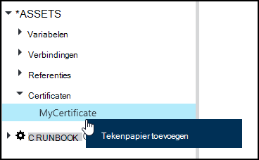
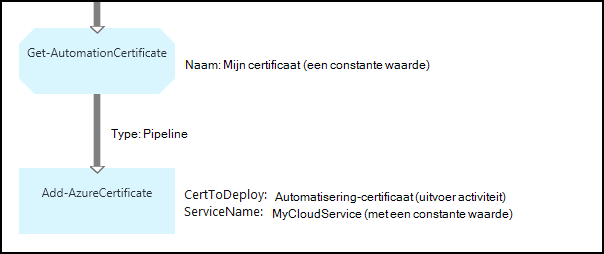

<properties 
   pageTitle="Certificaat van activa in Azure automatisering | Microsoft Azure"
   description="Certificaten kunnen veilig worden opgeslagen in Azure automatisering zodat ze kunnen worden benaderd door runbooks of DSC-configuraties voor verificatie op Azure en bronnen van derden.  In dit artikel wordt uitgelegd dat de details van de certificaten en hoe ze werken in zowel tekstuele en grafische ontwerpen."
   services="automation"
   documentationCenter=""
   authors="mgoedtel"
   manager="stevenka"
   editor="tysonn" />
<tags 
   ms.service="automation"
   ms.devlang="na"
   ms.topic="article"
   ms.tgt_pltfrm="na"
   ms.workload="infrastructure-services"
   ms.date="02/23/2016"
   ms.author="magoedte;bwren" />

# Certificaat activa in Azure automatisering

Certificaten kunnen veilig worden opgeslagen in Azure automatisering zodat ze kunnen worden benaderd door runbooks of DSC-configuraties met behulp van de **Get-AutomationCertificate** -activiteit. Dit kunt u voor het maken van runbooks en DSC-configuraties die gebruikmaken van certificaten voor verificatie of toegevoegd aan middelen Azure of derden.

>[AZURE.NOTE] Veilige activa in Azure automatisering zijn referenties, certificaten, verbindingen en gecodeerde variabelen. Deze activa worden gecodeerd en opgeslagen in de Azure automatisering met behulp van een unieke sleutel die is gegenereerd voor elke rekening voor automatisering. Deze sleutel wordt gecodeerd met behulp van een basiscertificaat en opgeslagen in Azure automatisering. Voordat u een activum veilig op te slaan, de sleutel voor de rekening van de automatisering wordt gedecodeerd met behulp van het basiscertificaat en wordt gebruikt voor het coderen van de activa.

## Windows PowerShell-Cmdlets

De cmdlets in de volgende tabel worden gebruikt voor het maken en beheren van automatisering certificaat activa met Windows PowerShell. Ze geleverd als onderdeel van de [module Azure PowerShell](../powershell-install-configure.md) beschikbaar voor gebruik in runbooks automatisering en DSC-configuraties is.

|Cmdlets|Beschrijving|
|:---|:---|
|[Get-AzureAutomationCertificate](http://msdn.microsoft.com/library/dn913765.aspx)|Informatie over een certificaat wordt opgehaald. U kunt alleen het certificaat zelf ophalen uit de Get-AutomationCertificate-activiteit.|
|[Nieuwe AzureAutomationCertificate](http://msdn.microsoft.com/library/dn913764.aspx)|Een nieuw certificaat importeert in Azure automatisering.|
|[Software - AzureAutomationCertificate](http://msdn.microsoft.com/library/dn913773.aspx)|Hiermee verwijdert u een certificaat van Azure automatisering.|
|[Set - AzureAutomationCertificate](http://msdn.microsoft.com/library/dn913763.aspx)|Hiermee stelt u de eigenschappen van een bestaand certificaat, met inbegrip van het bestand voor het uploaden en het instellen van het wachtwoord voor een pfx.|

## Activiteiten voor toegang tot de certificaten

De activiteiten in de volgende tabel worden gebruikt voor toegang tot de certificaten in een runbook of een DSC-configuratie.

|Activiteiten|Beschrijving|
|:---|:---|
|Get-AutomationCertificate|Met deze eigenschap haalt een certificaat wilt gebruiken in een runbook of een DSC-configuratie.|

>[AZURE.NOTE] Vermijd het gebruik van variabelen in de – naamparameter van Get-AutomationCertificate, omdat dit kan ontdekken afhankelijkheden tussen runbooks of DSC-configuraties bemoeilijken en activa tijdens het ontwerpen certificaat.

## Een nieuw certificaat maken

Wanneer u een nieuw certificaat maakt, kunt u een cer of pfx-bestand uploaden naar Azure automatisering. Als u het certificaat als exporteerbaar markeren, kunt vervolgens u overbrengen uit het certificaatarchief Azure automatisering. Als deze kan niet worden geëxporteerd, kan vervolgens het alleen worden gebruikt voor het ondertekenen in de runbook of DSC-configuratie.

### Een nieuw certificaat maken met de klassieke Azure portal

1. Klik op **activa** aan de bovenkant van het venster van uw account automatisering.
1. Klik op **Toevoegen**onder aan het venster.
1. Klik op **referentie toevoegen**.
2. Selecteer in de vervolgkeuzelijst **Referentietype** **certificaat**.
3. Typ een naam voor het certificaat in het vak **naam** en klik op de pijl-rechts.
4. Blader naar een cer- of pfx-bestand.  Als u een pfx-bestand selecteert, geeft u een wachtwoord en of deze moet kunnen worden geëxporteerd.
1. Klik op het selectievakje om het uploaden van het bestand en sla het nieuwe certificaat actief.

### Een nieuw certificaat maken met de Azure portal

1. Klik op het onderdeel **activa** om te openen de blade **activa** van uw account automatisering.
1. Klik op het onderdeel **certificaten** de blade **certificaten** te openen.
1. Klik op **een certificaat toevoegen** aan de bovenkant van het blad.
2. Typ een naam voor het certificaat in het vak **naam** .
2. Klik op **een bestand selecteren** onder **een certificaatbestand uploaden** om te bladeren naar een cer- of pfx-bestand.  Als u een pfx-bestand selecteert, geeft u een wachtwoord en of deze moet kunnen worden geëxporteerd.
1. Klik op **maken** om het nieuwe certificaat actief opslaan.

### Een nieuw certificaat maken met Windows PowerShell

De volgende voorbeeldopdrachten weergeven van het maken van een nieuw certificaat voor automatisering en markeert exporteerbaar. Dit importeert een bestaand .pfx-bestand.

    $certName = 'MyCertificate'
    $certPath = '.\MyCert.pfx'
    $certPwd = ConvertTo-SecureString -String 'P@$$w0rd' -AsPlainText -Force
    
    New-AzureAutomationCertificate -AutomationAccountName "MyAutomationAccount" -Name $certName -Path $certPath –Password $certPwd -Exportable

## Met behulp van een certificaat

De **Get-AutomationCertificate** -activiteit moet u een certificaat gebruiken. U kunt de cmdlet [Get-AzureAutomationCertificate](http://msdn.microsoft.com/library/dn913765.aspx) niet gebruiken, aangezien deze informatie over het certificaat actief maar niet op het certificaat zelf retourneert.

### Tekstuele runbook monster

De volgende voorbeeldcode ziet u hoe u een certificaat toevoegen aan een cloud service in een runbook. In dit voorbeeld wordt het wachtwoord van een gecodeerde automation-variabele opgehaald.

    $serviceName = 'MyCloudService'
    $cert = Get-AutomationCertificate -Name 'MyCertificate'
    $certPwd = Get-AutomationVariable –Name 'MyCertPassword'
    Add-AzureCertificate -ServiceName $serviceName -CertToDeploy $cert

### Voorbeeld van de grafische runbook

U voegt een **Get-AutomationCertificate** aan een grafische runbook door met de rechtermuisknop op het certificaat in het deelvenster bibliotheek van de grafische editor en **toevoegen aan het tekenpapier**te selecteren.

De volgende afbeelding ziet u een voorbeeld van het gebruik van een certificaat in een grafische runbook.  Dit is hetzelfde voorbeeld voor het toevoegen van een certificaat naar een cloud-service uit een tekstuele runbook hierboven.  

In dit voorbeeld wordt de parameter **UseConnectionObject** is ingesteld voor het **Verzenden TwilioSMS** activiteit die een connection-object voor verificatie van de service gebruikt.  Een [pijpleiding koppeling](automation-graphical-authoring-intro.md#links-and-workflow) moet hier worden gebruikt omdat de koppeling van een reeks retourneert een collectie met één object niet dat de parameter Connection verwacht.

## Zie ook

- [Koppelingen in grafische ontwerpen](automation-graphical-authoring-intro.md#links-and-workflow) 
