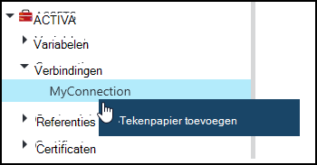
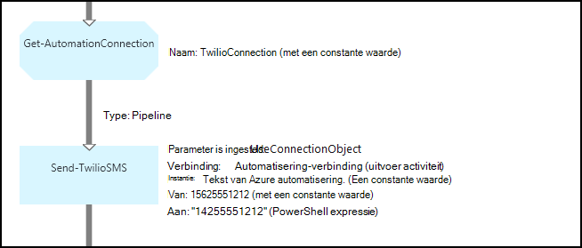
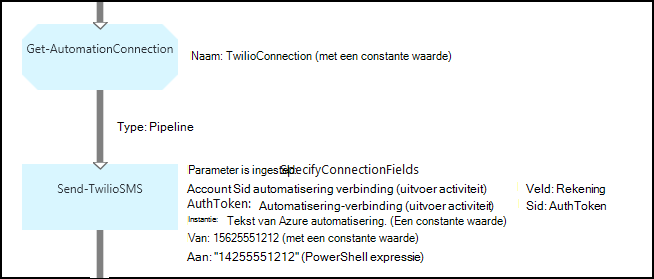

<properties 
   pageTitle="Activa in Azure automatisering verbinding | Microsoft Azure"
   description="Verbinding activa in Azure automatisering bevatten de informatie die nodig is om te verbinden met een externe service of toepassing van een runbook of een DSC-configuratie. In dit artikel wordt uitgelegd dat de details van de verbindingen en het werken met hen in tekst en grafische ontwerpen."
   services="automation"
   documentationCenter=""
   authors="bwren"
   manager="stevenka"
   editor="tysonn" />
<tags 
   ms.service="automation"
   ms.devlang="na"
   ms.topic="article"
   ms.tgt_pltfrm="na"
   ms.workload="infrastructure-services"
   ms.date="01/27/2016"
   ms.author="bwren" />

# Activa in Azure automatisering verbinding

Een automatisering-verbinding actief bevat informatie die verbinding maken met een externe service of toepassing van een runbook of een DSC-configuratie is vereist. Deze kan informatie is vereist voor verificatie, zoals een gebruikersnaam en wachtwoord naast verbindingsgegevens zoals een URL of een poort bevatten. De waarde van een verbinding wordt behouden alle eigenschappen voor de verbinding met een bepaalde toepassing in een actief in plaats van meerdere variabelen maken. De gebruiker kan de waarden voor een verbinding op één plaats bewerken en kunt u de naam van een verbinding met een runbook of DSC-configuratie in een enkele parameter doorgeven. De eigenschappen van een verbinding kunnen worden geopend in de runbook of DSC-configuratie met de **Get-AutomationConnection** -activiteit.

Wanneer u een verbinding maakt, moet u een *verbindingstype*opgeven. Het verbindingstype is een sjabloon waarmee een set eigenschappen. De verbinding definieert de waarden voor elke eigenschap die is gedefinieerd in het verbindingstype. Verbindingstypen worden toegevoegd aan de Azure automatisering in integratiemodules of met de [Azure automatisering API](http://msdn.microsoft.com/library/azure/mt163818.aspx)gemaakt. De enige verbinding die beschikbaar zijn wanneer u een verbinding maken zijn die zijn geïnstalleerd in uw account voor automatisering.

>[AZURE.NOTE] Veilige activa in Azure automatisering zijn referenties, certificaten, verbindingen en gecodeerde variabelen. Deze activa worden gecodeerd en opgeslagen in de Azure automatisering met behulp van een unieke sleutel die is gegenereerd voor elke rekening voor automatisering. Deze sleutel wordt gecodeerd met behulp van een basiscertificaat en opgeslagen in Azure automatisering. Voordat u een activum veilig op te slaan, de sleutel voor de rekening van de automatisering wordt gedecodeerd met behulp van het basiscertificaat en wordt gebruikt voor het coderen van de activa.

## Windows PowerShell-Cmdlets

De cmdlets in de volgende tabel worden gebruikt voor het maken en beheren van verbindingen automatiseren met Windows PowerShell. Ze geleverd als onderdeel van de [module Azure PowerShell](../powershell-install-configure.md) beschikbaar voor gebruik in runbooks automatisering en DSC-configuraties is.

|Cmdlet|Beschrijving|
|:---|:---|
|[Get-AzureAutomationConnection](http://msdn.microsoft.com/library/dn921828.aspx)|Een verbinding wordt opgehaald. Bevat een hash-tabel met de waarden van de velden van de verbinding.|
|[Nieuwe AzureAutomationConnection](http://msdn.microsoft.com/library/dn921825.aspx)|Hiermee maakt u een nieuwe verbinding.|
|[Verwijderen AzureAutomationConnection](http://msdn.microsoft.com/library/dn921827.aspx)|Een bestaande verbinding verwijderen.|
|[Set AzureAutomationConnectionFieldValue](http://msdn.microsoft.com/library/dn921826.aspx)|Hiermee stelt u de waarde van een bepaald veld voor een bestaande verbinding.|

## Activiteiten

De activiteiten in de volgende tabel worden gebruikt voor toegang tot de verbindingen in een runbook of een DSC-configuratie.

|Activiteiten|Beschrijving|
|---|---|
|Get-AutomationConnection|Deze eigenschap haalt een verbinding moet worden gebruikt. Deze eigenschap retourneert een hash-tabel met de eigenschappen van de verbinding.|

>[AZURE.NOTE] Vermijd het gebruik van variabelen in de – naamparameter van **Get-AutomationConnection** aangezien dit ontdekken afhankelijkheden tussen runbooks of DSC-configuraties en activa van de verbinding in de ontwerpfase kan bemoeilijken.

## Een nieuwe verbinding maken

### Een nieuwe verbinding maken met de klassieke Azure portal

1. Klik op **activa** aan de bovenkant van het venster van uw account automatisering.
1. Klik op **Toevoegen**onder aan het venster.
1. Klik op **verbinding toevoegen**.
2. Selecteer in de vervolgkeuzelijst **Type verbinding** het type verbinding dat u wilt maken.  De wizard geeft de eigenschappen voor dat type.
1. Voltooi de wizard en schakel het selectievakje in als u wilt opslaan van de nieuwe verbinding.

### Een nieuwe verbinding maken met de Azure portal

1. Klik op het onderdeel **activa** om te openen de blade **activa** van uw account automatisering.
1. Klik op het gedeelte **verbindingen** het blade **verbindingen** openen.
1. Klik op **een verbinding toevoegen** aan de bovenkant van het blad.
2. Selecteer in de vervolgkeuzelijst **Type** het type verbinding dat u wilt maken. Het formulier wordt de eigenschappen voor dat type weergegeven.
1. Vul het formulier in en klik op **maken** om de nieuwe verbinding.

### Een nieuwe verbinding maken met Windows PowerShell

Een nieuwe verbinding maken met Windows PowerShell met de cmdlet [New-AzureAutomationConnection](http://msdn.microsoft.com/library/dn921825.aspx) . Deze cmdlet heeft een parameter met de naam **ConnectionFieldValues** die verwacht een [hash-tabel](http://technet.microsoft.com/library/hh847780.aspx) waarden definiëren voor elk van de eigenschappen die zijn gedefinieerd door het verbindingstype.

De volgende voorbeeldopdrachten Maak een nieuwe verbinding voor [Twilio](http://www.twilio.com) een telephony-service waarmee u kunt verzenden en ontvangen van SMS-berichten.  Een monster integratie-module met een Twilio het verbindingstype is beschikbaar in het [Script Center](http://gallery.technet.microsoft.com/scriptcenter/Twilio-PowerShell-Module-8a8bfef8).  Dit verbindingstype definieert eigenschappen voor Account SID en Token vergunning, die nodig zijn om uw account te valideren wanneer verbinding wordt gemaakt met Twilio.  Als u [deze module downloaden](http://gallery.technet.microsoft.com/scriptcenter/Twilio-PowerShell-Module-8a8bfef8) en installeren in uw account automatisering voor de toepassing van deze voorbeeldcode.

    $AccountSid = "DAf5fed830c6f8fac3235c5b9d58ed7ac5"
    $AuthToken  = "17d4dadfce74153d5853725143c52fd1"
    $FieldValues = @{"AccountSid" = $AccountSid;"AuthToken"=$AuthToken}

    New-AzureAutomationConnection -AutomationAccountName "MyAutomationAccount" -Name "TwilioConnection" -ConnectionTypeName "Twilio" -ConnectionFieldValues $FieldValues

## Met behulp van een verbinding in een runbook of een DSC-configuratie

U haalt een verbinding in een runbook of een DSC-configuratie met de cmdlet **Get-AutomationConnection** .  Deze activiteit haalt de waarden van de verschillende velden in de verbinding en worden ze geretourneerd als een [hash-tabel](http://go.microsoft.com/fwlink/?LinkID=324844) met de overeenkomstige opdrachten in de runbook of DSC-configuratie kan worden gebruikt.

### Tekstuele runbook monster
De volgende voorbeeldopdrachten weergeven gebruiken de verbinding Twilio in het vorige voorbeeld een SMS-bericht verzenden vanuit een runbook.  De hier gebruikte verzenden-TwilioSMS-activiteit heeft twee parametersets die elk een andere methode gebruiken voor het verifiëren van de service Twilio.  Gebruik van een connection-object en een andere afzonderlijke parameters gebruikt voor de Account SID en vergunning Token.  Beide methoden worden weergegeven in dit voorbeeld.

    $Con = Get-AutomationConnection -Name "TwilioConnection"
    $NumTo = "14255551212"
    $NumFrom = "15625551212"
    $Body = "Text from Azure Automation."

    #Send text with connection object.
    Send-TwilioSMS -Connection $Con -From $NumFrom -To $NumTo -Body $Body

    #Send text with connection properties.
    Send-TwilioSMS -AccountSid $Con.AccountSid -AuthToken $Con.AuthToken -From $NumFrom -To $NumTo -Body $Body

### Voorbeelden van grafische runbook

U toevoegen een **Get-AutomationConnection** -activiteit aan een grafische runbook met de rechtermuisknop op de verbinding in het deelvenster bibliotheek van de grafische editor en selecteer **toevoegen aan het tekenpapier**.

De volgende afbeelding ziet u een voorbeeld van het gebruik van een verbinding in een grafische runbook.  Dit is hetzelfde voorbeeld voor het verzenden van een tekstbericht met Twilio van een tekstuele runbook hierboven.  In dit voorbeeld wordt de parameter **UseConnectionObject** is ingesteld voor het **Verzenden TwilioSMS** activiteit die een connection-object voor verificatie van de service gebruikt.  Een [pijpleiding koppeling](automation-graphical-authoring-intro.md#links-and-workflow) wordt hier gebruikt, aangezien de parameter voor een enkel object verwacht.

De reden dat een expressie wordt gebruikt voor de waarde in de parameter **op** in plaats van een constante waarde PowerShell is dat deze parameter een tekenreeks matrix waardetype verwacht, zodat u naar meerdere nummers verzenden kunt.  Een expressie PowerShell kunt u een single-waarde of een matrix.

De onderstaande afbeelding ziet de hetzelfde voorbeeld als hierboven, maar gebruikt de parameter **SpecifyConnectionFields** ingesteld die verwacht dat de parameters AccountSid en AuthToken afzonderlijk worden opgegeven in plaats van een connection-object voor de verificatie.  In dit geval worden de velden van de verbinding opgegeven in plaats van het object zelf.  

## Verwante artikelen

- [Koppelingen in grafische ontwerpen](automation-graphical-authoring-intro.md#links-and-workflow)
 
