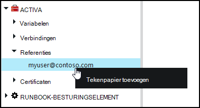
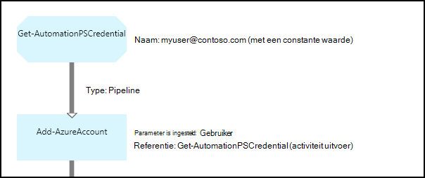

<properties 
   pageTitle="Referentie-elementen in Azure automatisering | Microsoft Azure"
   description="Referentie activa in Azure automatisering bevatten de beveiligingsreferenties die worden geverifieerd bij bronnen waartoe de runbook of DSC-configuratie kunnen worden gebruikt. In dit artikel wordt beschreven hoe referenties activa maken en deze gebruiken in een runbook of een DSC-configuratie."
   services="automation"
   documentationCenter=""
   authors="mgoedtel"
   manager="jwhit"
   editor="tysonn" />
<tags 
   ms.service="automation"
   ms.devlang="na"
   ms.topic="article"
   ms.tgt_pltfrm="na"
   ms.workload="infrastructure-services"
   ms.date="06/09/2016"
   ms.author="bwren" />

# Referentie activa in Azure automatisering

Een actief automatisering referentie bevat een [PSCredential](http://msdn.microsoft.com/library/system.management.automation.pscredential) -object bevat de gebruikersnaam een gebruikersnaam en wachtwoord. Runbooks en DSC-configuraties kunt cmdlets die een PSCredential-object voor verificatie worden geaccepteerd, of ze kunnen uitpakken met de gebruikersnaam en het wachtwoord van het PSCredential-object voor een bepaalde toepassing of service waarvoor verificatie is vereist. De eigenschappen van een referentie in Azure automatisering worden veilig opgeslagen en kunnen worden geopend in de runbook of DSC-configuratie met de [Get-AutomationPSCredential](http://msdn.microsoft.com/library/system.management.automation.pscredential.aspx) -activiteit.

>[AZURE.NOTE] Veilige activa in Azure automatisering zijn referenties, certificaten, verbindingen en gecodeerde variabelen. Deze activa worden gecodeerd en opgeslagen in de Azure automatisering met behulp van een unieke sleutel die is gegenereerd voor elke rekening voor automatisering. Deze sleutel wordt gecodeerd met behulp van een basiscertificaat en opgeslagen in Azure automatisering. Voordat u een activum veilig op te slaan, de sleutel voor de rekening van de automatisering wordt gedecodeerd met behulp van het basiscertificaat en wordt gebruikt voor het coderen van de activa. 

## Windows PowerShell-cmdlets

De cmdlets in de volgende tabel worden gebruikt voor het maken en beheren van automatisering referentie activa met Windows PowerShell.  Ze geleverd als onderdeel van de [module Azure PowerShell](../powershell-install-configure.md) beschikbaar voor gebruik in runbooks automatisering en DSC-configuraties is.

|Cmdlets|Beschrijving|
|:---|:---|
|[Get-AzureAutomationCredential](http://msdn.microsoft.com/library/dn913781.aspx)|Een referentie-informatie opgehaald. U kunt alleen de referentie zelf ophalen uit **Get-AutomationPSCredential** -activiteit.|
|[Nieuwe AzureAutomationCredential](http://msdn.microsoft.com/library/azure/jj554330.aspx)|Hiermee maakt u een nieuwe referentie voor automatisering.|
|[Software - AzureAutomationCredential](http://msdn.microsoft.com/library/azure/jj554330.aspx)|Hiermee verwijdert u een referentie voor automatisering.|
|[Set - AzureAutomationCredential](http://msdn.microsoft.com/library/azure/jj554330.aspx)|Hiermee stelt u de eigenschappen van een bestaande referentie voor automatisering.|

## Runbook activiteiten

De activiteiten in de volgende tabel worden gebruikt voor toegang tot de referenties in een runbook en DSC-configuraties.

|Activiteiten|Beschrijving|
|:---|:---|
|Get-AutomationPSCredential|Deze eigenschap haalt een referentie te gebruiken in een runbook of een DSC-configuratie. Een [System.Management.Automation.PSCredential](http://msdn.microsoft.com/library/system.management.automation.pscredential) -object als resultaat geeft.|

>[AZURE.NOTE] Vermijd het gebruik van variabelen in de – naamparameter van Get-AutomationPSCredential, omdat dit kan ontdekken afhankelijkheden tussen runbooks of DSC-configuraties bemoeilijken en referentie-elementen in de ontwerpfase.

## Een nieuwe referentie actief maken

### Een nieuwe referentie actief maken met de klassieke Azure portal

1. Klik op **activa** aan de bovenkant van het venster van uw account automatisering.
1. Klik op **Toevoegen**onder aan het venster.
1. Klik op **referentie toevoegen**.
2. Selecteer in de vervolgkeuzelijst **Type referenties** **Referentie PowerShell**.
1. Voltooi de wizard en schakel het selectievakje in om de nieuwe referentie wordt opgeslagen.

### Een nieuwe referentie actief met de Azure portal maken

1. Klik op het onderdeel **activa** om te openen de blade **activa** van uw account automatisering.
1. Klik op het onderdeel **referenties** om te openen de blade **referenties** .
1. Klik op **een referentie toevoegen** aan de bovenkant van het blad.
1. Vul het formulier in en klik op **maken** om de nieuwe referentie wordt opgeslagen.

### Een nieuwe referentie actief maken met Windows PowerShell

De volgende voorbeeldopdrachten hoe maakt u een nieuwe referentie voor automatisering. Een PSCredential-object is gemaakt met de naam en het wachtwoord en vervolgens gebruikt voor het maken van de activa van de referentie. U kunt ook de cmdlet **Get-referenties** typt u een naam en wachtwoord wordt gevraagd.

    $user = "MyDomain\MyUser"
    $pw = ConvertTo-SecureString "PassWord!" -AsPlainText -Force
    $cred = New-Object –TypeName System.Management.Automation.PSCredential –ArgumentList $user, $pw
    New-AzureAutomationCredential -AutomationAccountName "MyAutomationAccount" -Name "MyCredential" -Value $cred

## Met behulp van een PowerShell-referentie

U haalt een referentie actief in een runbook of een DSC-configuratie met de **Get-AutomationPSCredential** -activiteit. Hiermee wordt een [PSCredential-object](http://msdn.microsoft.com/library/system.management.automation.pscredential.aspx) dat u kunt gebruiken met een activiteit of de cmdlet waarvoor een parameter PSCredential. U kunt ook de eigenschappen van het object referentie om afzonderlijk ophalen. Het object heeft een eigenschap voor de gebruikersnaam en het wachtwoord beveiligd of kunt u de methode **GetNetworkCredential** retourneert een object [NetworkCredential](http://msdn.microsoft.com/library/system.net.networkcredential.aspx) waarmee een niet-beveiligde versie van het wachtwoord.

### Tekstuele runbook monster

De volgende voorbeeldopdrachten hoe een referentie PowerShell gebruiken in een runbook. In dit voorbeeld wordt de referentie wordt opgehaald en de gebruikersnaam en het wachtwoord toegewezen aan variabelen.

    $myCredential = Get-AutomationPSCredential -Name 'MyCredential'
    $userName = $myCredential.UserName
    $securePassword = $myCredential.Password
    $password = $myCredential.GetNetworkCredential().Password

### Voorbeeld van de grafische runbook

U toevoegen een **Get-AutomationPSCredential** -activiteit aan een grafische runbook met de rechtermuisknop op de referentie in het deelvenster bibliotheek van de grafische editor en selecteer **toevoegen aan het tekenpapier**.

De volgende afbeelding ziet u een voorbeeld van het gebruik van een referentie in een grafische runbook.  In dit geval, wordt deze gebruikt voor verificatie voor een runbook met Azure bronnen zoals beschreven in [Runbooks met Azure AD-gebruikersaccount worden geverifieerd](automation-sec-configure-aduser-account.md).  De eerste activiteit haalt de referenties die toegang tot het abonnement Azure heeft.  De activiteit **Toevoegen AzureAccount** wordt deze referentie voor verificatie voor alle activiteiten die na het komen.  Een [koppeling van de pijpleiding](automation-graphical-authoring-intro.md#links-and-workflow) is hier omdat de **Get-AutomationPSCredential** een enkel object verwacht.  

## Met behulp van een referentie PowerShell in DSC
Terwijl DSC-configuraties in Azure automatisering kunnen verwijzen naar de referentie activa met **Get-AutomationPSCredential**, kunnen referentie activa ook worden doorgegeven via parameters, indien gewenst. Voor meer informatie Zie [configuraties in Azure automatisering DSC compileren](automation-dsc-compile.md#credential-assets).

## Volgende stappen

- Zie voor meer informatie over koppelingen in grafische ontwerpen, [koppelingen in het grafische ontwerpen](automation-graphical-authoring-intro.md#links-and-workflow)
- Zie [Azure automatische beveiliging](automation-security-overview.md) inzicht in de verschillende verificatiemethoden met automatisering
- Om te beginnen met een grafische runbooks, Zie [Mijn eerste grafische runbook](automation-first-runbook-graphical.md)
- Om te beginnen met PowerShell workflow runbooks, Zie [Mijn eerste PowerShell workflow runbook](automation-first-runbook-textual.md) 

 
