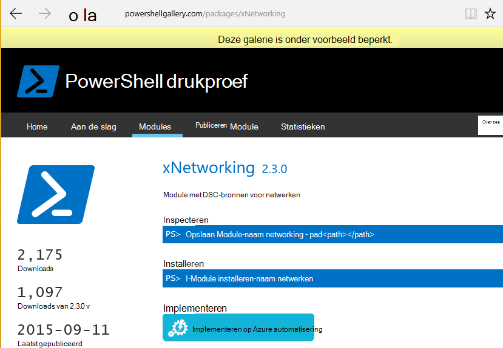

<properties
   pageTitle="Doorlopende Azure automatisering DSC-implementatie met Chocolatey | Microsoft Azure"
   description="DevOps continu distributie met Azure automatisering DSC en Chocolatey Pakketbeheer.  Voorbeeld met volledige ARM JSON-sjabloon en PowerShell bron."
   services="automation"
   documentationCenter=""
   authors="sebastus"
   manager="stevenka"
   editor=""/>

<tags
   ms.service="automation"
   ms.devlang="na"
   ms.topic="article"
   ms.tgt_pltfrm="vm-windows"
   ms.workload="na"
   ms.date="08/08/2016"
   ms.author="golive"/>

# Voorbeeld van gebruik: Doorlopende implementatie aan virtuele Machines met behulp van automatisering DSC en Chocolatey

In een wereld van DevOps zijn er veel hulpmiddelen om u te helpen bij de verschillende punten in de pijplijn continue integratie.  Azure automatisering gewenst staat configuratie (DSC) is een Welkom nieuwe toevoeging aan de opties die u van DevOps teams gebruikmaken kunnen.  In dit artikel wordt gedemonstreerd van Continuous Deployment (CD)-instelling voor een Windows-computer.  U kunt de techniek om Windows-computers zo veel als nodig zijn in de functie (bijvoorbeeld een website) en van daaruit naar aanvullende rollen ook gemakkelijk uitbreiden.

## Op een hoog niveau

Er is heel wat hier, maar gelukkig kan worden onderverdeeld in twee procédés: 

  - Schrijven van code testen, maken en publiceren van installatiepakketten voor primaire en secundaire versies van het systeem. 
  - Maken en beheren van VMs die installeren en uitvoeren van de code in de pakketten.  

Als beide core processen uitgevoerd worden, is het een korte stap voor het automatisch bijwerken van het pakket worden uitgevoerd op een bepaalde VM nieuwe versies worden gemaakt en geïmplementeerd.

## Overzicht van component

Pakket managers zoals [apt-get](https://en.wikipedia.org/wiki/Advanced_Packaging_Tool) zijn redelijk bekend in de Linux-wereld, maar niet zo veel in de wereld van Windows.  [Chocolatey](https://chocolatey.org/) is een goed en Scott Hanselman van [blog](http://www.hanselman.com/blog/IsTheWindowsUserReadyForAptget.aspx) op het onderwerp is een geweldige intro.  Kortom, kunt Chocolatey u pakketten installeren vanaf een centrale opslagplaats voor pakketten in een Windows-systeem met behulp van de opdrachtregel.  U kunt maken en beheren van uw eigen bibliotheek en Chocolatey pakketten van alle opslaglocaties die u kunt installeren.

Gewenste status configuratie (DSC) ([Overzicht](https://technet.microsoft.com/library/dn249912.aspx)) is een PowerShell-hulpprogramma waarmee u de configuratie die u wilt gebruiken voor een machine te declareren.  U kunt bijvoorbeeld, "Ik wil Chocolatey geïnstalleerd, gewenste IIS is geïnstalleerd, gewenste poort 80 is geopend, gewenste versie 1.0.0 van mijn website."  De DSC lokale Configuration Manager (LCM) implementeert die configuratie. Een DSC Pull-Server heeft een opslagplaats van configuraties voor uw machines. De LCM op elke computer controleert regelmatig om te zien of de configuratie overeenkomt met de opgeslagen configuratie. Het kan de status rapporteren of proberen om de computer terugbrengen in de uitlijning met de opgeslagen configuratie. U kunt de opgeslagen configuratie op de server pull te veroorzaken van een machine of een set computers moeten worden uitgelijnd met de gewijzigde configuratie bewerken.

Azure automatisering is een beheerde service in Microsoft Azure waarmee u diverse taken met behulp van runbooks, knooppunten, referenties, middelen en activa, zoals planningen en globale variabelen kunt automatiseren. Azure automatisering DSC breidt deze mogelijkheid automatisering bevatten PowerShell DSC-hulpprogramma's.  Hier volgt een [Overzicht](automation-dsc-overview.md).

Een DSC-bron is een module met code die u specifieke mogelijkheden heeft, zoals het beheren van netwerken, Active Directory, of SQL Server.  De Chocolatey DSC Resource weet hoe u toegang tot een NuGet Server (onder andere), pakketten downloaden, installeren van pakketten, enzovoort.  Er zijn vele andere DSC-bronnen in de [Galerie met PowerShell](http://www.powershellgallery.com/packages?q=dsc+resources&prerelease=&sortOrder=package-title).  Deze modules zijn geïnstalleerd in uw Azure DSC Pull-automatiseringsserver (u) zodat ze kunnen worden gebruikt door uw configuraties.

ARM sjablonen bieden een declaratieve manier voor het genereren van uw infrastructuur - zaken als netwerken, subnetten, netwerkbeveiliging en routering, balancers, netwerkkaarten en VMs laden.  Hier is een [artikel](../resource-manager-deployment-model.md) waarbij de ARM implementatiemodel (declaratieve) met Azure Service Management (ASM of klassiek) vergelijkt implementatiemodel (imperatieve).  En een ander [artikel](../virtual-machines/virtual-machines-windows-compare-deployment-models.md) over core resource providers, compute, storage en netwerk.

Een belangrijke functie van de sjabloon voor een ARM is de mogelijkheid om een VM-extensie in de VM te installeren als deze ingericht.  Een VM-extensie heeft specifieke mogelijkheden zoals een aangepast script uitgevoerd, antivirussoftware installeren of uitvoeren van een script DSC-configuratie.  Er zijn vele andere typen extensies VM.

## Snelle reis rondom het diagram

Vanaf de bovenkant, schrijft u uw code, bouwen, testen en vervolgens een installatiepakket te maken.  Chocolatey kunnen verschillende soorten installatiepakketten, zoals MSI, MSU, ZIP verwerken.  En u hebt de volledige kracht van PowerShell doen de werkelijke installatie als Chocolatey van eigen mogelijkheden niet helemaal tot.  Het pakket in het ergens bereikbaar – een pakket opslagplaats gebracht.  In dit voorbeeld gebruik van een openbare map in een account Azure blob-opslag gebruikt kan, maar overal.  Chocolatey werkt standaard met NuGet-servers en andere voor het beheer van het pakket metagegevens.  [In dit artikel](https://github.com/chocolatey/choco/wiki/How-To-Host-Feed) worden de opties beschreven.  In dit voorbeeld gebruik NuGet gebruikt.  Een Nuspec is metagegevens over uw pakketten.  Van de Nuspec zijn 'gecompileerd met"van NuPkg en opgeslagen in een NuGet-server.  Wanneer de configuratie van de verzoeken in een pakket met de naam verwijst naar een server NuGet, de Chocolatey DSC-bron (nu op de VM) pakt het pakket en wordt voor u geïnstalleerd.  U kunt ook een specifieke versie van een pakket aanvragen.

In de onderste linker gedeelte van de afbeelding wordt er een sjabloon Azure Resource Manager (ARM).  In dit voorbeeld gebruik registreert de extensie VM VM met de Azure DSC Pull-automatiseringsserver (dat wil zeggen een pull-server) als een knooppunt.  De configuratie wordt opgeslagen in de pull-server.  Werkelijk, wordt deze opgeslagen tweemaal: eenmaal als tekst zonder opmaak en eenmaal als een MOF-bestand is gecompileerd (voor degenen die over zaken weten.)  De MOF is in het portal voor een "knooppuntconfiguratie" (in plaats van gewoon ' configuratie').  Het artefact dat is gekoppeld aan een knooppunt, zodat het knooppunt de configuratie ervan weet is.  Hieronder hoe het toewijzen van de knooppuntconfiguratie naar het knooppunt.

U doet waarschijnlijk al het bit aan de boven- of het grootste.  De nuspec maken, compileren en opslaan in een NuGet server is een klein ding.  En u bent al VMs beheren.  Neemt de volgende stap met continue implementatie vereist (eenmaal) de pull-server, registreert de knooppunten (eenmaal), en instellen en maken er de configuratie op te slaan (in eerste instantie).  Vernieuw vervolgens pakketten worden bijgewerkt en geïmplementeerd in de opslagplaats, de configuratie en de configuratie van knooppunten in de pull-server (herhalen als nodig is).

Als u niet met de sjabloon voor een ARM begint, maar dat is ook OK.  Er zijn PowerShell-cmdlets waarmee u uw VMs registreren met de pull-server en alle van de rest. Zie dit artikel voor meer informatie: [Onboarding machines voor beheer door Azure automatisering DSC](automation-dsc-onboarding.md)

## Stap 1: De pull-server en -automatisering-account instellen

Op een geverifieerde (Add-AzureRmAccount) PowerShell-opdrachtregel: (kan een paar minuten duren terwijl de pull-server is ingesteld)

    New-AzureRmResourceGroup –Name MY-AUTOMATION-RG –Location MY-RG-LOCATION-IN-QUOTES
    New-AzureRmAutomationAccount –ResourceGroupName MY-AUTOMATION-RG –Location MY-RG-LOCATION-IN-QUOTES –Name MY-AUTOMATION-ACCOUNT 

U kunt uw account automatisering plaatsen in een van de volgende regio's (aka locatie): Oost-VS 2, South Central ons, ons finan-Virginia, West-Europa, Zuidoost-Azië, Japan, Oost, centraal India en Zuidoost Australië.

## Stap 2: VM extensie trucs in de ARM-sjabloon

Details voor VM registratie (met de extensie PowerShell DSC VM) in deze [Azure Quickstart sjabloon](https://github.com/Azure/azure-quickstart-templates/tree/master/dsc-extension-azure-automation-pullserver).  Deze stap registreert uw nieuwe VM met de pull-server in de lijst met knooppunten DSC.  Onderdeel van deze registratie is de knooppuntconfiguratie moet worden toegepast op het knooppunt opgeven.  Deze knooppuntconfiguratie geen nog bestaat in de pull-server, zodat het OK dat stap 4 wanneer dit wordt gedaan voor de eerste keer is.  Maar hier in stap 2 hoeft te hebben besloten de naam van het knooppunt en de naam van de configuratie.  Het knooppunt is 'isvbox' in dit voorbeeld gebruik en de configuratie is 'ISVBoxConfig'.  De naam van het knooppunt configuratie (aan te geven in de DeploymentTemplate.json) is 'ISVBoxConfig.isvbox'.  

## Stap 3: Vereiste DSC resources toevoegen aan de pull-server

De galerie met PowerShell is DSC bronnen installeren in uw account automatisering Azure geïmplementeerd.  Ga naar de resource die u wilt gebruiken en klik op de knop 'Implementeren op Azure automatisering'.

Een andere techniek die onlangs zijn toegevoegd aan de Portal Azure kunt u ophalen van nieuwe modules of het bijwerken van bestaande modules. Klik op de Account automatisering resource, de tegel activa en ten slotte de Modules naast elkaar.  Het pictogram galerie bladeren kunt u een overzicht van de modules in de galerie, Inzoomen op details en uiteindelijk importeren in uw Account voor automatisering. Dit is een uitstekende manier om de modules te houden van tijd tot tijd. En de functie importeren controleert afhankelijkheden met andere modules, zodat er niets niet synchroon.

Nee, er is de handmatige methode.  De mapstructuur van een voor een computer met Windows PowerShell-integratiemodule wijkt enigszins af van de structuur van de door de automatisering van Azure verwacht.  Dit is wat u van uw kant vereist.  Het is niet moeilijk maar dit gebeurt slechts eenmaal per resource (tenzij u wilt bijwerken in de toekomst.)  Zie dit artikel voor meer informatie over het ontwerpen van PowerShell-integratiemodules: [Azure automatisering-integratiemodules ontwerpen](https://azure.microsoft.com/blog/authoring-integration-modules-for-azure-automation/)

-   Installeer de module die u nodig hebt op uw werkstation, als volgt:
    -   Installeer het [Windows Management Framework, v5](http://aka.ms/wmf5latest) (niet nodig voor Windows 10)
    -   `Install-Module –Name MODULE-NAME`<, pakt u de module uit de galerie met PowerShell 
-   Kopieer de map module uit `c:\Program Files\WindowsPowerShell\Modules\MODULE-NAME` naar een tijdelijke map 
-   Voorbeelden en documentatie van de map verwijderen 
-   De hoofdmap, precies dezelfde map als de naamgeving van het ZIP-bestand ZIP 
-   Het ZIP-bestand in een bereikbaar HTTP-locatie op een rekening van de opslag Azure blob-opslag plaatsen.
-   Deze PowerShell uitvoeren:

        New-AzureRmAutomationModule `
            -ResourceGroupName MY-AUTOMATION-RG -AutomationAccountName MY-AUTOMATION-ACCOUNT `
            -Name MODULE-NAME –ContentLink "https://STORAGE-URI/CONTAINERNAME/MODULE-NAME.zip"
        

In het voorbeeld opgenomen voert deze stappen voor cChoco en xNetworking. Zie de [opmerkingen](#notes) voor speciale verwerking voor cChoco.

## Stap 4: De knooppuntconfiguratie toevoegen aan de pull-server

Er is niets speciaal over de eerste keer dat u uw configuratie in de pull-server en compileren importeren.  Alle latere import/compileert met dezelfde configuratie zien er precies hetzelfde.  Telkens wanneer u het pakket bijwerken en doorgeven aan de productie moet doen u deze stap nadat u dat het configuratiebestand is juist – met inbegrip van de nieuwe versie van het pakket.  Dit is het configuratiebestand en PowerShell:

ISVBoxConfig.ps1:

    Configuration ISVBoxConfig 
    { 
        Import-DscResource -ModuleName cChoco 
        Import-DscResource -ModuleName xNetworking
    
        Node "isvbox" {   
    
            cChocoInstaller installChoco 
            { 
                InstallDir = "C:\choco" 
            }
    
            WindowsFeature installIIS 
            { 
                Ensure="Present" 
                Name="Web-Server" 
            }
    
            xFirewall WebFirewallRule 
            { 
                Direction = "Inbound" 
                Name = "Web-Server-TCP-In" 
                DisplayName = "Web Server (TCP-In)" 
                Description = "IIS allow incoming web site traffic." 
                DisplayGroup = "IIS Incoming Traffic" 
                State = "Enabled" 
                Access = "Allow" 
                Protocol = "TCP" 
                LocalPort = "80" 
                Ensure = "Present" 
            }
    
            cChocoPackageInstaller trivialWeb 
            {            
                Name = "trivialweb" 
                Version = "1.0.0" 
                Source = “MY-NUGET-V2-SERVER-ADDRESS” 
                DependsOn = "[cChocoInstaller]installChoco", 
                "[WindowsFeature]installIIS" 
            } 
        }    
    }

Nieuw-ConfigurationScript.ps1:

    Import-AzureRmAutomationDscConfiguration ` 
        -ResourceGroupName MY-AUTOMATION-RG –AutomationAccountName MY-AUTOMATION-ACCOUNT ` 
        -SourcePath C:\temp\AzureAutomationDsc\ISVBoxConfig.ps1 ` 
        -Published –Force
    
    $jobData = Start-AzureRmAutomationDscCompilationJob ` 
        -ResourceGroupName MY-AUTOMATION-RG –AutomationAccountName MY-AUTOMATION-ACCOUNT ` 
        -ConfigurationName ISVBoxConfig 
    
    $compilationJobId = $jobData.Id
    
    Get-AzureRmAutomationDscCompilationJob ` 
        -ResourceGroupName MY-AUTOMATION-RG –AutomationAccountName MY-AUTOMATION-ACCOUNT ` 
        -Id $compilationJobId

Deze stappen leiden tot een nieuwe configuratie van het knooppunt met de naam 'ISVBoxConfig.isvbox' op de pull-server wordt geplaatst.  De naam van de configuratie knooppunt is gebouwd als "configurationName.nodeName".

## Stap 5: Maken en onderhouden van de metagegevens van het pakket

Voor elk pakket die u in de opslagplaats pakket zetten, moet u een beschrijving van het nuspec.  Dat nuspec moet worden gecompileerd en opgeslagen in uw server NuGet. Dit proces wordt beschreven [hier](http://docs.nuget.org/create/creating-and-publishing-a-package).  U kunt MyGet.org gebruiken als NuGet server.  Ze verkopen deze service, maar hebben een starter SKU die vrij is.  Op NuGet.org vindt u instructies voor het installeren van uw eigen server NuGet voor uw privé-pakketten.

## Stap 6: Helemaal koppelverkoop

Elke keer dat een versie QA wordt doorgegeven en is goedgekeurd voor distributie, is het pakket gemaakt, nuspec en nupkg bijgewerkt en geïmplementeerd op de server NuGet.  De configuratie (stap 4 hierboven) moet bovendien overeenstemming met het nieuwe versienummer worden bijgewerkt.  Het moet worden verzonden naar de pull-server en gecompileerd.  Vanaf dat moment is het aan de VMs die afhankelijk zijn van die configuratie de update ophalen en installeren.  Elk van deze updates zijn eenvoudig - gewoon een of twee regels van PowerShell.  In het geval van Visual Studio Team Services, ze worden opgenomen in build taken die kunnen worden samengevoegd in een build.  In dit [artikel](https://www.visualstudio.com/en-us/docs/alm-devops-feature-index#continuous-delivery) vindt u meer informatie.  Deze [GitHub repo](https://github.com/Microsoft/vso-agent-tasks) details over de verschillende beschikbare build-taken.

## Notities

In dit voorbeeld gebruik begint met een VM uit een algemene Windows Server 2012 R2 afbeelding uit de galerie met Azure.  U kunt starten vanuit een opgeslagen afbeelding en van daaruit met de DSC-configuratie aanpassen.  Configuratie die is baked wijzigen in een afbeelding is echter veel moeilijker dan het dynamisch bijwerken van de configuratie met behulp van DSC.

U hoeft niet een ARM-sjabloon en de VM-extensie gebruiken om deze techniek te gebruiken met uw VMs.  En uw VMs hoeft te worden op Azure worden onder beheer van de CD.  Dat nodig is, is dat Chocolatey worden geïnstalleerd en de LCM op de VM geconfigureerd zodat het weet waar de pull-server is.  

Wanneer u een pakket op een VM in productie bijwerkt, moet u natuurlijk dat VM draaien niet op te nemen terwijl de update is geïnstalleerd.  Hoe kan dit erg uiteenloopt.  Bijvoorbeeld met een VM achter een Azure-taakverdeling, kunt u toevoegen een aangepaste Probe.  Tijdens het bijwerken van de VM, hebben de sonde eindpunt een 400 terug.  Het moet ervoor zorgen dat deze wijziging tweak zijn in uw configuratie, kunt u de tweak om terug te keren naar een 200 retourneren als de update voltooid is.

Volledige bron voor dit voorbeeld gebruik is in [deze Visual Studio-project](https://github.com/sebastus/ARM/tree/master/CDIaaSVM) op GitHub.

##Verwante artikelen##

- [DSC-overzicht azure automatisering] (dsc-automatisering-overview.md)
- [Azure automatisering DSC-cmdlets] (https://msdn.microsoft.com/library/mt244122.aspx)
- [Onboarding machines voor beheer door Azure automatisering DSC] (dsc-automatisering-onboarding.md)
