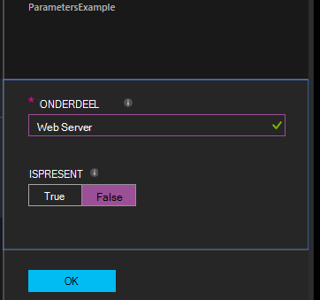

<properties 
   pageTitle="Configuraties in Azure automatisering DSC compileren | Microsoft Azure" 
   description="Overzicht van de twee manieren voor het compileren van configuraties in de gewenste staat configuratie (DSC): In de Azure portal en met Windows PowerShell. " 
   services="automation" 
   documentationCenter="na" 
   authors="coreyp-at-msft" 
   manager="stevenka" 
   editor="tysonn"/>

<tags
   ms.service="automation"
   ms.devlang="na"
   ms.topic="article"
   ms.tgt_pltfrm="powershell"
   ms.workload="na" 
   ms.date="01/25/2016"
   ms.author="coreyp"/>
   
#Configuraties in Azure automatisering DSC compileren#

Kunt u de gewenste status configuratie (DSC) configuraties op twee manieren met Azure automatisering compileren: In de Azure portal en met Windows PowerShell. De volgende tabel kunt u bepalen welke op basis van de kenmerken van elke methode gebruiken: 

###Azure preview portal###
- Eenvoudigste methode met een interactieve gebruikersinterface
- Formulier eenvoudig parameterwaarden op te geven
- Taakstatus op eenvoudige wijze volgen
- Toegang met Azure aanmelding is geverifieerd

###Windows PowerShell###
- Bel vanaf opdrachtregel met Windows PowerShell-cmdlets
- Kunnen worden opgenomen in een geautomatiseerde oplossing met meerdere stappen
- Eenvoudige en complexe parameterwaarden opgeven
- Taakstatus bijhouden
- Client vereist voor de ondersteuning van PowerShell-cmdlets
- ConfigurationData doorgeven
- Compileren configuraties die gebruikmaken van referenties

Als u hebt besloten op een compilatie-methode, kunt u het hieronder om te beginnen met het compileren van respectieve procedures volgen.

##Opstelling van een DSC-configuratie met Azure portal##

1.  Klik op de **configuraties**van uw account automatisering.
2.  Klik op een configuratie die u opent de blade.
3.  Klik op **compileren**.
4.  Als de configuratie geen parameters heeft, wordt u gevraagd te bevestigen of u wilt tijdens het compileren. Als de configuratie parameters heeft, wordt de **Configuratie compileren** blade geopend zodat u de parameterwaarden kunt opgeven. Zie de sectie <a href="#basic-parameters">**Fundamentele Parameters**</a> hieronder voor meer informatie over parameters.
5.  Het **Project compileren** blade wordt geopend zodat u de status van de Compilatietaak en het knooppunt configuraties (MOF configuratiedocumenten) het moet worden geplaatst op de Azure DSC Pull-automatiseringsserver veroorzaakt kunt bijhouden.

##Opstelling van een DSC-configuratie met Windows PowerShell##

U kunt [`Start-AzureRmAutomationDscCompilationJob`](https://msdn.microsoft.com/library/mt244118.aspx) te compileren met Windows PowerShell. De volgende voorbeeldcode wordt gestart compilatie van een DSC-configuratie **SampleConfig**genoemd.

    Start-AzureRmAutomationDscCompilationJob -ResourceGroupName "MyResourceGroup" -AutomationAccountName "MyAutomationAccount" -ConfigurationName "SampleConfig" 
 
`Start-AzureRmAutomationDscCompilationJob`Deze eigenschap retourneert een taakobject compilatie, kunt u de status ervan bijhouden. U kunt dit taakobject compilatie met [`Get-AzureRmAutomationDscCompilationJob`](https://msdn.microsoft.com/library/mt244120.aspx) om te bepalen van de status van het project compileren en [`Get-AzureRmAutomationDscCompilationJobOutput`](https://msdn.microsoft.com/library/mt244103.aspx) (output) van de streams te bekijken. De volgende voorbeeldcode compilatie van de configuratie van de **SampleConfig** is gestart, wacht totdat deze is voltooid en vervolgens de streams wordt.
    
    $CompilationJob = Start-AzureRmAutomationDscCompilationJob -ResourceGroupName "MyResourceGroup" -AutomationAccountName "MyAutomationAccount" -ConfigurationName "SampleConfig"
    
    while($CompilationJob.EndTime –eq $null -and $CompilationJob.Exception –eq $null)           
    {
        $CompilationJob = $CompilationJob | Get-AzureRmAutomationDscCompilationJob
        Start-Sleep -Seconds 3
    }
    
    $CompilationJob | Get-AzureRmAutomationDscCompilationJobOutput –Stream Any 

##Fundamentele Parameters##

Parameterdeclaratie in DSC-configuraties, met inbegrip van de soorten parameters en eigenschappen, werkt hetzelfde als in Azure automatisering runbooks. Zie het [starten van een runbook in Azure automatisering](automation-starting-a-runbook.md) voor meer informatie over parameters voor runbook.

Het volgende voorbeeld worden twee parameters met de naam van **onderdeel** - en **IsPresent**, om te bepalen van de waarden van eigenschappen in de configuratie **ParametersExample.sample** knooppunt, gegenereerd tijdens het compileren.

    Configuration ParametersExample
    {
        param(
            [Parameter(Mandatory=$true)]
    
            [string] $FeatureName,
    
            [Parameter(Mandatory=$true)]
            [boolean] $IsPresent
        )
    
        $EnsureString = "Present"
        if($IsPresent -eq $false)
        {
            $EnsureString = "Absent"
        }
    
        Node "sample"
        {
            WindowsFeature ($FeatureName + "Feature")
            {
                Ensure = $EnsureString
                Name = $FeatureName
            }
        }
    }

U kunt compileren DSC-configuraties die in de portal Azure automatisering DSC of met Azure PowerShell fundamentele parameters gebruiken:

###Portal###

In de portal kunt u parameterwaarden na het klikken op **compileren**.

###PowerShell###

PowerShell vereist parameters in een [hash-tabel](http://technet.microsoft.com/library/hh847780.aspx) waarin de sleutel overeenkomt met de parameternaam van de en de waarde gelijk is aan de waarde van de parameter.

    $Parameters = @{
            "FeatureName" = "Web-Server"
            "IsPresent" = $False
    }
    
    
    Start-AzureRmAutomationDscCompilationJob -ResourceGroupName "MyResourceGroup" -AutomationAccountName "MyAutomationAccount" -ConfigurationName "ParametersExample" -Parameters $Parameters 
    

Zie <a href="#credential-assets">**Referentie activa**</a> hieronder voor meer informatie over het PSCredentials doorgeven als parameters.

##ConfigurationData##

**ConfigurationData** kunt u afzonderlijke structurele configuratie van een specifieke configuratie milieu bij het gebruik van PowerShell DSC. Zie ["Wat" scheiden van 'Waar' in PowerShell DSC](http://blogs.msdn.com/b/powershell/archive/2014/01/09/continuous-deployment-using-dsc-with-minimal-change.aspx) voor meer informatie over **ConfigurationData**.

>[AZURE.NOTE] U kunt **ConfigurationData** gebruiken tijdens het compileren in Azure automatisering DSC met Azure PowerShell, maar niet in de portal Azure.

Het volgende voorbeeld DSC-configuratie maakt gebruik van **ConfigurationData** via de sleutelwoorden **$ConfigurationData** en **$AllNodes** . U moet ook de [module **xWebAdministration** ](https://www.powershellgallery.com/packages/xWebAdministration/) in dit voorbeeld:

     Configuration ConfigurationDataSample
     {
        Import-DscResource -ModuleName xWebAdministration -Name MSFT_xWebsite
    
        Write-Verbose $ConfigurationData.NonNodeData.SomeMessage 
    
        Node $AllNodes.Where{$_.Role -eq "WebServer"}.NodeName
        {
            xWebsite Site
            {
                Name = $Node.SiteName
                PhysicalPath = $Node.SiteContents
                Ensure   = "Present"
            }
        }
    }

U kunt de configuratie DSC hierboven met PowerShell compileren. De onderstaande PowerShell voegt u twee configuraties van het knooppunt aan de Azure automatisering DSC Pull-Server: **ConfigurationDataSample.MyVM1** en **ConfigurationDataSample.MyVM3**:

    $ConfigData = @{
        AllNodes = @(
            @{
                NodeName = "MyVM1"
                Role = "WebServer"
            },
            @{
                NodeName = "MyVM2"
                Role = "SQLServer"
            },
            @{
                NodeName = "MyVM3"
                Role = "WebServer"
    
            }
    
        )
    
        NonNodeData = @{
            SomeMessage = "I love Azure Automation DSC!"
    
        }
    
    } 
    
    Start-AzureRmAutomationDscCompilationJob -ResourceGroupName "MyResourceGroup" -AutomationAccountName "MyAutomationAccount" -ConfigurationName "ConfigurationDataSample" -ConfigurationData $ConfigData

##Activa##

Activa verwijzingen zijn hetzelfde in Azure automatisering DSC-configuraties en runbooks. Zie de volgende onderwerpen voor meer informatie:

- [Certificaten](automation-certificates.md)
- [Verbindingen](automation-connections.md)
- [Referenties](automation-credentials.md)
- [Variabelen](automation-variables.md)

###Referentie activa###
Terwijl DSC-configuraties in Azure automatisering kunnen verwijzen naar de referentie activa met **Get-AzureRmAutomationCredential**, kunnen referentie activa ook worden doorgegeven via parameters, indien gewenst. Als u een configuratie is een parameter van het type **PSCredential** wordt, moet u de naam van een actief Azure automatisering referentie doorgeven als waarde van de parameter in plaats van een PSCredential-object. Achter de schermen, wordt de activa van de referentie Azure automatisering met die naam opgehaald en doorgegeven aan de configuratie.

Referenties houden vereist veilig in knooppunt configuraties (MOF configuratiedocumenten) de referenties in het knooppunt configuratie MOF-bestand te coderen. Azure automatisering gaat één stap verder en het MOF-bestand worden gecodeerd. Echter moet op dit moment u zien PowerShell DSC is geen probleem om referenties te produceren output in tekst zonder opmaak tijdens het genereren van knooppunt configuratie MOF, omdat PowerShell DSC niet weten dat Azure automatisering zal worden coderen het MOF-bestand na de generatie via een project compileren.

U ziet PowerShell DSC is geen probleem om referenties te produceren output in tekst zonder opmaak in de gegenereerde knooppuntconfiguratie MOF-bestanden met behulp van <a href="#configurationdata">**ConfigurationData**</a>. U moet doorgeven in de `PSDscAllowPlainTextPassword = $true` via **ConfigurationData** voor elk knooppunt van de blok naam die wordt weergegeven in de configuratie van DSC en referenties gebruikt.

In het volgende voorbeeld ziet u een DSC-configuratie die gebruikmaakt van een referentie automatisering actief.

    Configuration CredentialSample
    {
       $Cred = Get-AzureRmAutomationCredential -Name "SomeCredentialAsset"
    
        Node $AllNodes.NodeName
        { 
            File ExampleFile
            { 
                SourcePath = "\\Server\share\path\file.ext" 
                DestinationPath = "C:\destinationPath" 
                Credential = $Cred 
            }
        }
    }

U kunt de configuratie DSC hierboven met PowerShell compileren. De onderstaande PowerShell voegt u twee configuraties van het knooppunt aan de Azure automatisering DSC Pull-Server: **CredentialSample.MyVM1** en **CredentialSample.MyVM2**.

    $ConfigData = @{
        AllNodes = @(
            @{
                NodeName = "*"
                PSDscAllowPlainTextPassword = $True
            },
            @{
                NodeName = "MyVM1"
            },
            @{
                NodeName = "MyVM2"
            }
        )
    }
    
    Start-AzureRmAutomationDscCompilationJob -ResourceGroupName "MyResourceGroup" -AutomationAccountName "MyAutomationAccount" -ConfigurationName "CredentialSample" -ConfigurationData $ConfigData
