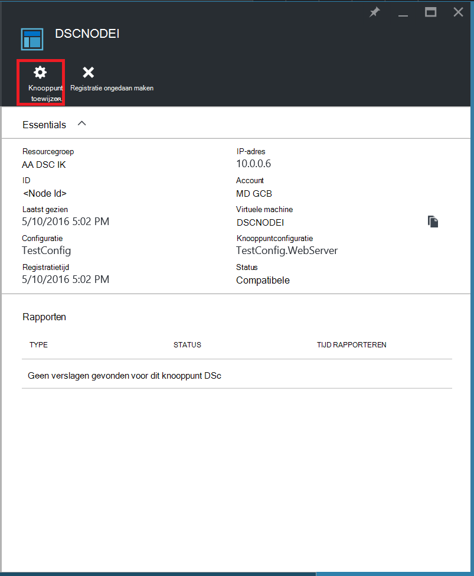

<properties
   pageTitle="Aan de slag met Azure automatisering DSC"
   description="Uitleg en voorbeelden van de meest gangbare taken in Azure automatisering gewenst staat configuratie (DSC)"
   services="automation" 
   documentationCenter="na" 
   authors="eslesar" 
   manager="dongill" 
   editor="tysonn"/>

<tags
   ms.service="automation"
   ms.devlang="na"
   ms.topic="article"
   ms.tgt_pltfrm="powershell"
   ms.workload="na" 
   ms.date="06/06/2016"
   ms.author="magoedte;eslesar"/>
   

# <a name="getting-started-with-azure-automation-dsc"></a>Aan de slag met Azure automatisering DSC

In dit onderwerp wordt uitgelegd hoe u de meest voorkomende taken uitvoeren met Azure automatisering gewenst staat configuratie (DSC), zoals maken, importeren, en compileren van configuraties, onboarding machines te beheren en bekijken van rapporten. Zie voor een overzicht van de Azure automatisering DSC, [Azure automatisering DSC-overzicht](automation-dsc-overview.md). Zie [Windows PowerShell gewenst staat configuratie overzicht](https://msdn.microsoft.com/PowerShell/dsc/overview)voor DSC-documentatie.

Dit onderwerp bevat een stapsgewijze handleiding voor het gebruik van Azure automatisering DSC. Als u een monster omgeving die al is ingesteld wilt zonder dat u de stappen in dit onderwerp wordt beschreven, kunt u [de volgende ARM-sjabloon](https://github.com/azureautomation/automation-packs/tree/master/102-sample-automation-setup). Met deze sjabloon stelt u een voltooide Azure automatisering DSC-omgeving, inclusief een Azure VM die wordt beheerd door Azure automatisering DSC.
 
## <a name="prerequisites"></a>Vereisten

Het volgende is vereist om de voorbeelden in dit onderwerp:

- Een account Azure automatisering. Zie voor meer informatie over het maken van automatisering Azure die worden uitgevoerd als een account [Azure uitvoeren als-Account](automation-sec-configure-azure-runas-account.md).
- Een Resource Manager Azure VM (niet klassiek) waarop Windows Server 2008 R2 wordt uitgevoerd of hoger. Zie voor instructies over het maken van een VM [maken uw eerste virtuele Windows-computer in de portal voor Azure](../virtual-machines/virtual-machines-windows-hero-tutorial.md)

## <a name="creating-a-dsc-configuration"></a>Maken van een DSC-configuratie

We gaan een eenvoudige [configuratie van DSC](https://msdn.microsoft.com/powershell/dsc/configurations) die ervoor zorgt dat de aanwezigheid of afwezigheid van de **Web Server** Windows functie (IIS), afhankelijk van hoe het toewijzen van knooppunten maken.

1. Start de Windows PowerShell ISE (of een willekeurige teksteditor).

2. Typ de volgende tekst:

    ```powershell
    configuration TestConfig
    {
        Node WebServer
        {
            WindowsFeature IIS
            {
                Ensure               = 'Present'
                Name                 = 'Web-Server'
                IncludeAllSubFeature = $true

            }
        }

        Node NotWebServer
        {
            WindowsFeature IIS
            {
                Ensure               = 'Absent'
                Name                 = 'Web-Server'

            }
        }
        }
    ```
3. Sla het bestand op als `TestConfig.ps1`.

Deze configuratie wordt een resource in elk knooppunt blok, de [resource WindowsFeature](https://msdn.microsoft.com/powershell/dsc/windowsfeatureresource), die ervoor zorgt de aanwezigheid of afwezigheid van de functie **Webserver dat** .

## <a name="importing-a-configuration-into-azure-automation"></a>Importeren van een configuratie in Azure automatisering

Vervolgens zullen we de configuratie importeren op de rekening van de automatisering.

1. Log in om de [Azure portal](https://portal.azure.com).

2. De Hub op het menu **alle resources** en vervolgens op de naam van de rekening van de automatisering.

3. Klik op het blad **automatisering account** **DSC-configuraties**.

4. Klik op **toevoegen, een configuratie**op de bladeserver **DSC-configuraties** .

5. Op het blad **Configuratie importeren** , bladert u naar de `TestConfig.ps1` -bestand op uw computer.
    
    
    

6. Klik op **OK**.

## <a name="viewing-a-configuration-in-azure-automation"></a>Een configuratie weergeven in Azure automatisering

Nadat u een configuratie hebt geïmporteerd, kunt u deze weergeven in de Azure portal.

1. Log in om de [Azure portal](https://portal.azure.com).

2. De Hub op het menu **alle resources** en vervolgens op de naam van de rekening van de automatisering.

3. Klik op het blad **automatisering account** **DSC-configuraties**

4. Klik op het blad **DSC-configuraties** , **TestConfig** (dit is de naam van de configuratie die u hebt geïmporteerd in de vorige procedure).

5. Klik op het blad **TestConfig configuratie** **configuratie-bron weergeven**.

    
    
    Een blade **TestConfig configuratie-bron** wordt geopend de code PowerShell voor de configuratie.
    
## <a name="compiling-a-configuration-in-azure-automation"></a>Opstelling van een configuratie in Azure automatisering

Voordat u een gewenste status op een knooppunt toepassen kunt, moet een DSC-configuratie definiëren die staat worden gecompileerd in een of meer knooppunten configuraties (document MOF) en geplaatst op de DSC Pull-automatiseringsserver. Zie voor een meer gedetailleerde beschrijving van het compileren van configuraties in Azure automatisering DSC [configuraties in Azure automatisering DSC compileren](automation-dsc-compile.md). Zie voor meer informatie over het compileren van configuraties [DSC-configuraties](https://msdn.microsoft.com/PowerShell/DSC/configurations).

1. Log in om de [Azure portal](https://portal.azure.com).

2. De Hub op het menu **alle resources** en vervolgens op de naam van de rekening van de automatisering.

3. Klik op het blad **automatisering account** **DSC-configuraties**

4. Klik op het blad **DSC-configuraties** op **TestConfig** (de naam van de eerder geïmporteerde configuratie).

5. Klik op **compileren**in het blad **TestConfig configuratie** en klik op **Ja**. Hiermee start u een project compileren.
    
    
    
> [AZURE.NOTE] Wanneer u een configuratie in Azure automatisering compileert, worden automatisch alle gemaakte knooppuntconfiguratie MOF-bestanden naar de pull-server implementeert.

## <a name="viewing-a-compilation-job"></a>Een compilatie van project weergeven

Nadat u een compilatie van start, vindt u deze in de **compilatie taken** naast elkaar in de blade **configuratie** . De **compilatie taken** naast elkaar weergegeven die momenteel worden uitgevoerd, voltooid en taken is mislukt. Wanneer u een project compileren blade opent, ziet u informatie over die taak met inbegrip van eventuele fouten of waarschuwingen opgetreden, invoerparameters die wordt gebruikt in de configuratie en de compilatie van Logboeken.

1. Log in om de [Azure portal](https://portal.azure.com).

2. De Hub op het menu **alle resources** en vervolgens op de naam van de rekening van de automatisering.

3. Klik op het blad **automatisering account** **DSC-configuraties**.

4. Klik op het blad **DSC-configuraties** op **TestConfig** (de naam van de eerder geïmporteerde configuratie).

5. Klik op een van de taken die worden vermeld op de tegel **compilatie taken** van het blad **TestConfig configuratie** . Een **Project compileren** blade wordt geopend met het label met de datum waarop de Compilatietaak is begonnen.

    
  
6. Klik op een tegel in de blade **Compilatietaak** verder om details te bekijken over de taak.

## <a name="viewing-node-configurations"></a>Knooppunt configuraties weergeven

Succesvolle afronding van een project compileren maakt u een of meer nieuwe knooppunt configuraties. De configuratie van een knooppunt is een MOF-document dat wordt geïmplementeerd naar de pull-server en kan worden opgehaald en toegepast door een of meer knooppunten. Het knooppunt configuraties kunt u bekijken in uw account automatisering in de blade **DSC knooppunt configuraties** . De configuratie van een knooppunt heeft een naam met het formulier *ConfigurationName*. *Knooppuntnaam*.

1. Log in om de [Azure portal](https://portal.azure.com).

2. De Hub op het menu **alle resources** en vervolgens op de naam van de rekening van de automatisering.

3. Klik op het blad **automatisering account** **DSC knooppunt configuraties**.

    
    
## <a name="onboarding-an-azure-vm-for-management-with-azure-automation-dsc"></a>Onboarding een Azure VM voor beheer met Azure automatisering DSC

U kunt Azure automatisering DSC Azure VMs (klassiek en Resource Manager), op gebouwen VMs Linux machines, VMs (AWS) en fysieke machines op locatie beheren. In dit onderwerp, dekken we het VMs on-board alleen Azure Resource Manager. Andere soorten machines, Zie voor meer informatie over onboarding [Onboarding machines voor beheer door Azure automatisering DSC](automation-dsc-onboarding.md).

### <a name="to-onboard-an-azure-resource-manager-vm-for-management-by-azure-automation-dsc"></a>Aan boord een VM Azure Resource Manager voor beheer door Azure automatisering DSC

1. Log in om de [Azure portal](https://portal.azure.com).

2. De Hub op het menu **alle resources** en vervolgens op de naam van de rekening van de automatisering.

3. Klik op het blad **automatisering account** **DSC-knooppunten**.

4. Klik in de **DSC-knooppunten** bladeservers, **Azure VM toevoegen**.

    

5. Klik op **virtuele machines aan boord te selecteren**in de blade **Azure VMs toevoegen** .

6. Selecteer de gewenste on-board VM in de blade **VMs selecteert** en op **OK**.

    >[AZURE.IMPORTANT] Dit moet een Azure Resource Manager VM met Windows Server 2008 R2 of later.
    
7. Klik in het blad **Toevoegen Azure VMs** **registratiegegevens configureren**.

8. Voer de naam van het knooppuntconfiguratie die u wilt toepassen op de VM in het vak **Naam van de configuratie knooppunt** in de blade **registratie** . Dit moet exact overeenkomen met de naam van de knooppuntconfiguratie van een in de rekening van de automatisering. Op dit moment een naam opgeven is optioneel. U kunt de knooppuntconfiguratie toegewezen nadat het knooppunt onboarding wijzigen.
**Knooppunt indien nodig opnieuw opstarten**controleren en klik vervolgens op **OK**.
    
    
    
    De configuratie van het knooppunt opgegeven worden toegepast op de VM met intervallen gespecificeerd in de **Frequentie van configuratie-modus**en de VM zal controleren op updates voor de knooppuntconfiguratie met intervallen gespecificeerd in de **Vernieuwingsfrequentie**. Zie [de lokale Configuration Manager configureren](https://msdn.microsoft.com/PowerShell/DSC/metaConfig)voor meer informatie over het gebruik van deze waarden.
    
9. Klik op **maken**in de blade **Azure VMs toevoegen** .

Azure starten onboarding VM. Wanneer deze voltooid is, wordt de VM weergegeven in de blade **DSC-knooppunten** in de rekening van de automatisering.

## <a name="viewing-the-list-of-dsc-nodes"></a>De lijst met knooppunten DSC weergeven

U kunt de lijst met alle computers die onboarded voor het beheer in uw account automatisering in de **DSC-knooppunten** bladeservers zijn weergeven.

1. Log in om de [Azure portal](https://portal.azure.com).

2. De Hub op het menu **alle resources** en vervolgens op de naam van de rekening van de automatisering.

3. Klik op het blad **automatisering account** **DSC-knooppunten**.

## <a name="viewing-reports-for-dsc-nodes"></a>Weergeven van rapporten voor DSC-knooppunten

Azure automatisering DSC een consistentiecontrole op een beheerde knooppunt uitvoeren wanneer verzendt het knooppunt een statusrapport naar de pull-server. U kunt deze rapporten bekijken op het blad voor dat knooppunt.

1. Log in om de [Azure portal](https://portal.azure.com).

2. De Hub op het menu **alle resources** en vervolgens op de naam van de rekening van de automatisering.

3. Klik op het blad **automatisering account** **DSC-knooppunten**.

4. Klik op de tegel **rapporten** op een van de rapporten in de lijst.

    

Op het blad voor een afzonderlijk rapport ziet u de volgende informatie voor de bijbehorende consistentiecontrole:

- De rapportstatus, of het knooppunt 'Compatibel', 'Mislukt', van de configuratie is of het knooppunt "Niet compatibel is" (wanneer het knooppunt in de **applyandmonitor** modus is en de computer niet in de gewenste staat).
- De begintijd van de consistentiecontrole.
- De totale runtime voor de consistentiecontrole.
- Het type van de consistentiecontrole.
- Fouten, met inbegrip van de foutcode en een foutbericht wordt weergegeven. 
- DSC-bronnen in de configuratie en de status van elke bron (of het knooppunt is in de gewenste status voor die bron) gebruikt, kunt u op elke resource voor meer gedetailleerde informatie voor die resource.
- De naam, IP-adres en de configuratiemodus van het knooppunt.

U kunt ook klikken op **ruwe rapport weergeven** als u wilt zien van de feitelijke gegevens die door het knooppunt worden verzonden naar de server. Zie voor meer informatie over het gebruik van die gegevens [met behulp van een DSC-rapportserver](https://msdn.microsoft.com/powershell/dsc/reportserver).

Het kan even duren nadat een knooppunt is een onboarded voordat het eerste verslag beschikbaar is. Mogelijk moet u wachten voordat tot 30 minuten voor het eerste rapport na het boord een knooppunt.

## <a name="reassigning-a-node-to-a-different-node-configuration"></a>Een knooppunt naar een ander knooppuntconfiguratie opnieuw toewijzen

U kunt een knooppunt naar een ander knooppunt configuratie dan de die oorspronkelijk toegewezen.

1. Log in om de [Azure portal](https://portal.azure.com).

2. De Hub op het menu **alle resources** en vervolgens op de naam van de rekening van de automatisering.

3. Klik op het blad **automatisering account** **DSC-knooppunten**.

4. Klik op de naam van het knooppunt dat u wilt toewijzen in de blade **DSC-knooppunten** .

5. Klik op het blad voor dat knooppunt, **knooppunt toewijzen**.

    

6. Selecteer de configuratie van de knooppunten die u wilt toewijzen, het knooppunt op het blad **Knooppuntconfiguratie toewijzen** en klik op **OK**.

    
    
## <a name="unregistering-a-node"></a>Afmelden van een knooppunt

Als u een knooppunt wordt beheerd door Azure automatisering DSC niet meer wilt, kunt u de registratie verwijderen.

1. Log in om de [Azure portal](https://portal.azure.com).

2. De Hub op het menu **alle resources** en vervolgens op de naam van de rekening van de automatisering.

3. Klik op het blad **automatisering account** **DSC-knooppunten**.

4. Klik op de **DSC-knooppunten** bladeservers, op de naam van het knooppunt dat u wilt verwijderen.

5. Klik op het blad voor dat knooppunt, **registratie**.

    

## <a name="related-articles"></a>Verwante artikelen
* [Azure automatisering DSC-overzicht](automation-dsc-overview.md)
* [Machines voor beheer door Azure automatisering DSC onboarding](automation-dsc-onboarding.md)
* [Windows PowerShell gewenst staat configuratie, overzicht](https://msdn.microsoft.com/powershell/dsc/overview)
* [Azure automatisering DSC-cmdlets](https://msdn.microsoft.com/library/mt244122.aspx)
* [Azure automatisering DSC-prijzen](https://azure.microsoft.com/pricing/details/automation/)

