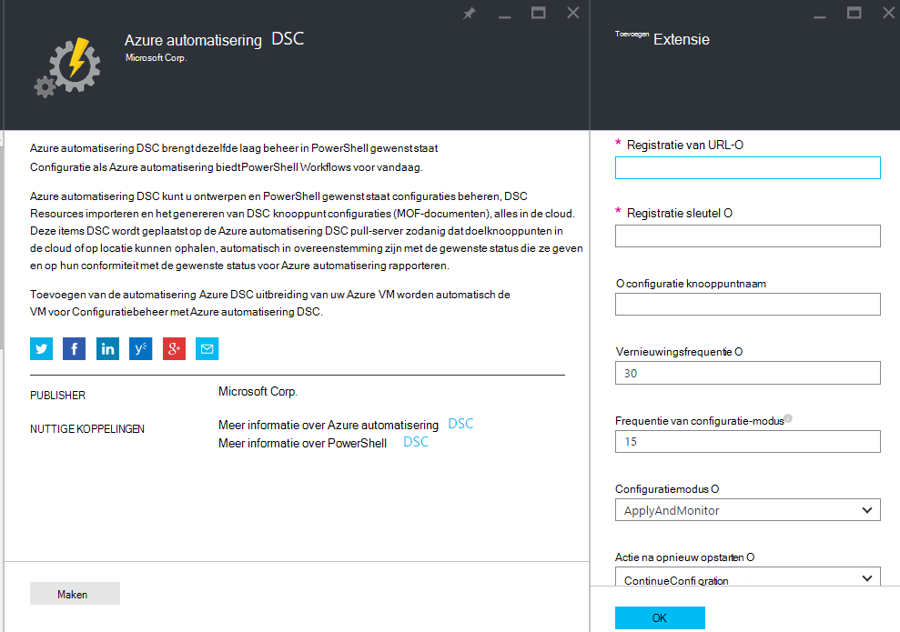
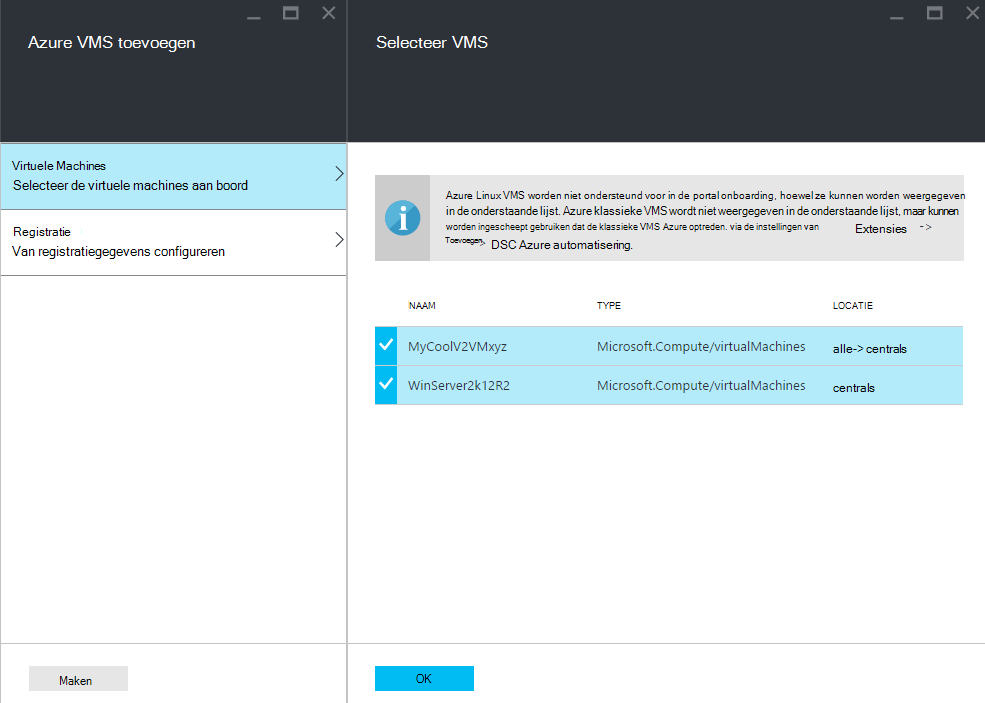
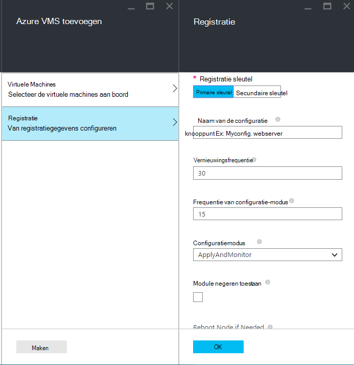
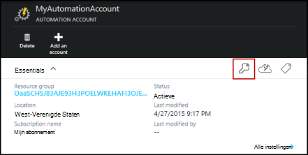
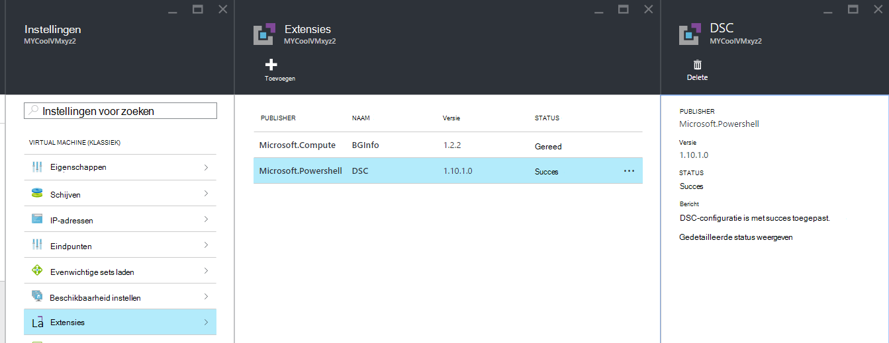

<properties 
   pageTitle="Onboarding fysieke en virtuele machines voor beheer door Azure automatisering DSC | Microsoft Azure" 
   description="Machines voor het beheer van Azure automatisering DSC instellen" 
   services="automation" 
   documentationCenter="dev-center-name" 
   authors="coreyp-at-msft" 
   manager="stevenka" 
   editor="tysonn"/>

<tags
   ms.service="automation"
   ms.devlang="NA"
   ms.topic="article"
   ms.tgt_pltfrm="powershell"
   ms.workload="TBD" 
   ms.date="04/22/2016"
   ms.author="coreyp"/>

# Machines voor beheer door Azure automatisering DSC onboarding

## Waarom machines met Azure automatisering DSC beheren?

Zoals [PowerShell gewenst staat configuratie](https://technet.microsoft.com/library/dn249912.aspx)is configuratie van Azure automatisering gewenst een eenvoudige, maar krachtige, configuratie management voor DSC knooppunten (fysieke en virtuele machines) in een datacenter cloud of op locatie. Hierdoor zijn schaalbaarheid in duizenden computers snel en eenvoudig vanaf een centrale, veilige locatie. U kunt gemakkelijk ingebouwde machines, wijzen ze declaratieve configuraties en rapporten bekijken met elke machine de naleving van de gewenste status die u hebt opgegeven. De Azure automatisering DSC management laag is DSC de Azure automatisering management laag is PowerShell-scripts. Met andere woorden, op dezelfde manier die Azure automatisering kunt u PowerShell scripts beheren, kunt ook u DSC-configuraties beheren. Zie voor meer informatie over de voordelen van het gebruik van Azure automatisering DSC, [Azure automatisering DSC-overzicht](automation-dsc-overview.md). 

Azure DSC van automatisering kunnen worden gebruikt voor het beheren van een groot aantal machines:

*    Azure virtuele machines (klassiek)
*    Azure virtuele machines
*    Amazon Web Services (AWS) virtuele machines
*    Fysieke/virtuele Windows machines op locatie, of in een wolk dan Azure AWS /
*    Fysieke/virtuele Linux machines op-ruimten, in Azure, of in een wolk dan Azure

Bovendien bent u niet gereed voor de configuratie van de machine beheren vanuit de cloud, kan Azure automatisering DSC ook worden gebruikt als eindpunt van een rapport alleen-lezen. Hiermee kunt u de gewenste configuratie (push) via DSC op gebouwen en uitgebreide rapportage details bekijken knooppunt dat voldoet aan de gewenste status in Azure automatisering.

De volgende gedeelten hoe kunt u de boord elk type machine Azure automatisering DSC.

## Azure virtuele machines (klassiek)

Met Azure automatisering DSC kunt u gemakkelijk on-board Azure virtuele machines (klassiek) voor het beheer van de configuratie met de Azure portal of PowerShell. Onder de motorkap en een beheerder op afstand in de VM met registreert de configuratie van Azure VM de gewenste extensie VM met Azure automatisering DSC. Aangezien de configuratie van Azure VM de gewenste extensie asynchroon uitgevoerd stappen uit om de voortgang bijhouden of problemen met deze beschikbaar in de sectie [**Probleemoplossing Azure VM onboarding**](#troubleshooting-azure-virtual-machine-onboarding) hieronder.

### Azure portal

Klik op **Bladeren**in de [Azure portal](http://portal.azure.com/) -> **virtuele machines (klassiek)**. Selecteer de gewenste ingebouwde Windows-VM. Klik op de virtuele machine dashboard blade, **alle instellingen** -> **extensies** -> **Add** -> **Azure automatisering DSC** -> **maken**. Voer de [waarden PowerShell DSC Local Configuration Manager](https://msdn.microsoft.com/powershell/dsc/metaconfig4) vereist voor de use-case, registratie-sleutel van de account van de automatisering en registratie URL en eventueel een knooppuntconfiguratie toe te wijzen aan de VM.

Ga voor de registratie account URL en de sleutel voor de automatisering van aan boord de computer, raadpleegt u de sectie [**registratie te beveiligen**](#secure-registration) .

### PowerShell

    # log in to both Azure Service Management and Azure Resource Manager
    Add-AzureAccount
    Add-AzureRmAccount
    
    # fill in correct values for your VM/Automation account here
    $VMName = ""
    $ServiceName = ""
    $AutomationAccountName = ""
    $AutomationAccountResourceGroup = ""

    # fill in the name of a Node Configuration in Azure Automation DSC, for this VM to conform to
    $NodeConfigName = ""

    # get Azure Automation DSC registration info
    $Account = Get-AzureRmAutomationAccount -ResourceGroupName $AutomationAccountResourceGroup -Name $AutomationAccountName
    $RegistrationInfo = $Account | Get-AzureRmAutomationRegistrationInfo

    # use the DSC extension to onboard the VM for management with Azure Automation DSC
    $VM = Get-AzureVM -Name $VMName -ServiceName $ServiceName
    
    $PublicConfiguration = ConvertTo-Json -Depth 8 @{
      SasToken = ""
      ModulesUrl = "https://eus2oaasibizamarketprod1.blob.core.windows.net/automationdscpreview/RegistrationMetaConfigV2.zip"
      ConfigurationFunction = "RegistrationMetaConfigV2.ps1\RegistrationMetaConfigV2"

    # update these PowerShell DSC Local Configuration Manager defaults if they do not match your use case.
    # See https://technet.microsoft.com/library/dn249922.aspx?f=255&MSPPError=-2147217396 for more details
     Properties = @{
        RegistrationKey = @{
          UserName = 'notused'
          Password = 'PrivateSettingsRef:RegistrationKey'
        }
        RegistrationUrl = $RegistrationInfo.Endpoint
        NodeConfigurationName = $NodeConfigName
        ConfigurationMode = "ApplyAndMonitor"
        ConfigurationModeFrequencyMins = 15
        RefreshFrequencyMins = 30
        RebootNodeIfNeeded = $False
        ActionAfterReboot = "ContinueConfiguration"
        AllowModuleOverwrite = $False
      }
    }

    $PrivateConfiguration = ConvertTo-Json -Depth 8 @{
      Items = @{
         RegistrationKey = $RegistrationInfo.PrimaryKey
      }
    }
    
    $VM = Set-AzureVMExtension `
     -VM $vm `
     -Publisher Microsoft.Powershell `
     -ExtensionName DSC `
     -Version 2.19 `
     -PublicConfiguration $PublicConfiguration `
     -PrivateConfiguration $PrivateConfiguration `
     -ForceUpdate

    $VM | Update-AzureVM

## Azure virtuele machines

Azure automatisering DSC kunt u gemakkelijk on-board Azure virtuele machines voor het beheer van de configuratie, via de portal Azure, Azure Resource Manager sjablonen of PowerShell. Onder de motorkap en een beheerder op afstand in de VM met registreert de configuratie van Azure VM de gewenste extensie VM met Azure automatisering DSC. Aangezien de configuratie van Azure VM de gewenste extensie asynchroon uitgevoerd stappen uit om de voortgang bijhouden of problemen met deze beschikbaar in de sectie [**Probleemoplossing Azure VM onboarding**](#troubleshooting-azure-virtual-machine-onboarding) hieronder.

### Azure portal

Ga naar de automatisering van Azure account waar u ingebouwde virtuele machines in de [portal Azure](https://portal.azure.com/). Klik op het dashboard van de account automatisering **Knooppunten DSC** -> **Azure VM toevoegen**.

Selecteer een of meer Azure virtuele machines aan boord onder **virtuele machines aan boord te selecteren**.

Geef onder **registratiegegevens configureren** [PowerShell DSC Local Configuration Manager waarden](https://msdn.microsoft.com/powershell/dsc/metaconfig4) vereist zijn voor de use-case en eventueel een knooppuntconfiguratie toe te wijzen aan de VM.

 
### Azure Resource Manager-sjablonen

Azure virtuele machines kunnen worden geïmplementeerd en onboarded naar Azure automatisering DSC via Azure Resource Manager-sjablonen. Zie [een VM via DSC-extensie en Azure automatisering DSC configureren](https://azure.microsoft.com/documentation/templates/dsc-extension-azure-automation-pullserver/) voor een van de voorbeeldsjabloon die een bestaande VM naar Azure automatisering DSC-onboards. Zoeken naar de sleutel van de registratie en registratie URL genomen als invoer in deze sjabloon, Zie de sectie [**registratie te beveiligen**](#secure-registration) .

### PowerShell

De [Kassa-AzureRmAutomationDscNode](https://msdn.microsoft.com/library/mt603833.aspx) -cmdlet kunt on-board virtuele machines in de portal via PowerShell voor Azure worden gebruikt.

## Amazon Web Services (AWS) virtuele machines

U kunt gemakkelijk ingebouwde Amazon Web Services virtuele machines voor Configuratiebeheer door Azure automatisering DSC met de AWS DSC-Toolkit. Voor meer informatie over de toolkit [hier](https://blogs.msdn.microsoft.com/powershell/2016/04/20/aws-dsc-toolkit/).

## Fysieke/virtuele Windows machines op locatie, of in een wolk dan Azure AWS /

Windows-machines in de lokalen en Windows-computers in niet-Azure wolken (zoals Amazon Web Services) ook zijn onboarded naar Azure automatisering DSC, als ze uitgaande toegang tot het internet, via een paar eenvoudige stappen hebben:

1. Zorg ervoor dat de meest recente versie van [WMF 5](http://aka.ms/wmf5latest) is geïnstalleerd op de computers die u ingebouwde naar Azure automatisering DSC wilt.
2. Volg de aanwijzingen in de sectie [**genereren DSC metaconfigurations**](#generating-dsc-metaconfigurations) hieronder voor het genereren van een map met de benodigde DSC-metaconfigurations.
3. De PowerShell DSC-metaconfiguration op afstand van toepassing op de gewenste on-board machines. **De machine die met deze opdracht wordt uitgevoerd vanuit de meest recente versie van [WMF 5](http://aka.ms/wmf5latest) geïnstalleerd moet hebben**:

    `Set-DscLocalConfigurationManager -Path C:\Users\joe\Desktop\DscMetaConfigs -ComputerName MyServer1, MyServer2`

4. Als u niet de PowerShell DSC-metaconfigurations op afstand toepassen, Kopieer de metaconfigurations uit stap 2 op elke computer aan boord. Contact opnemen met **Set-DscLocalConfigurationManager** lokaal op elke computer aan boord.
5. Controleer met de cmdlets of Azure portal dat de machines aan boord nu worden weergegeven als geregistreerd in uw account Azure automatisering DSC-knooppunten.

## Fysieke/virtuele Linux machines op-ruimten, in Azure, of in een wolk dan Azure

Linux-machines op lokalen, Linux machines in Azure en Linux-computers in niet-Azure wolken ook zijn onboarded naar Azure automatisering DSC, als ze uitgaande toegang tot het internet, via een paar eenvoudige stappen hebben:

1. Zorg ervoor dat de nieuwste versie van [Linux DSC-agent](http://www.microsoft.com/download/details.aspx?id=49150) is geïnstalleerd op de computers die u ingebouwde naar Azure automatisering DSC wilt.

2. Als de [standaardinstellingen voor PowerShell DSC Local Configuration Manager](https://msdn.microsoft.com/powershell/dsc/metaconfig4) overeenkomen met de use-case, en u naar on-board wilt dergelijke machines die ze **halen uit zowel Azure automatisering DSC verslag** :

    *    Op elke machine Linux voor on-board naar Azure automatisering DSC, gebruikt u Register.py aan boord met de standaardinstellingen PowerShell DSC Local Configuration Manager:

        `/opt/microsoft/dsc/Scripts/Register.py <Automation account registration key> <Automation account registration URL>`

    *    De sleutel van de registratie en de URL van de registratie voor uw account automatisering, Zie de sectie [**registratie te beveiligen**](#secure-registration) .

    Als de PowerShell DSC Local Configuration Manager standaard **doen** komt **niet** overeen met de use-case, of u ingebouwde machines wilt, dat ze alleen Azure automatisering DSC rapporteren, doen maar geen pull-configuratie of PowerShell modules uit, voert u de stappen 3-6. Anders kunt u doorgaan met stap 6.

3.  Volg de aanwijzingen in de sectie [**DSC genereren van metaconfigurations**](#generating-dsc-metaconfigurations) voor het genereren van een map met de benodigde DSC-metaconfigurations.
4.  De PowerShell DSC-metaconfiguration op afstand van toepassing op de gewenste on-board machines:
        
        $SecurePass = ConvertTo-SecureString -String "<root password>" -AsPlainText -Force
        $Cred = New-Object System.Management.Automation.PSCredential "root", $SecurePass
        $Opt = New-CimSessionOption -UseSsl -SkipCACheck -SkipCNCheck -SkipRevocationCheck

        # need a CimSession for each Linux machine to onboard
        
        $Session = New-CimSession -Credential $Cred -ComputerName <your Linux machine> -Port 5986 -Authentication basic -SessionOption $Opt
        
        Set-DscLocalConfigurationManager -CimSession $Session –Path C:\Users\joe\Desktop\DscMetaConfigs
    
De machine die met deze opdracht wordt uitgevoerd vanuit moet de nieuwste versie van [WMF 5](http://aka.ms/wmf5latest) geïnstalleerd hebben.

5.  Als u niet op afstand, de PowerShell DSC-metaconfigurations voor elke computer Linux toepassen aan boord, de metaconfiguration die overeenkomt met die machine uit de map die u in stap 5 op de Linux-computer kopiëren. Contact opnemen met `SetDscLocalConfigurationManager.py` lokaal op elke machine Linux gewenste tot on-board naar Azure automatisering DSC:

    `/opt/microsoft/dsc/Scripts/SetDscLocalConfigurationManager.py –configurationmof <path to metaconfiguration file>`

6.  Controleer met de cmdlets of Azure portal dat de machines aan boord nu worden weergegeven als geregistreerd in uw account Azure automatisering DSC-knooppunten.

##DSC-metaconfigurations genereren
Generieke onboard computers naar Azure automatisering DSC, een DSC-metaconfiguration kan worden gegenereerd die, wanneer toegepast, vertelt de DSC-agent op de computer te halen uit en/of Azure automatisering DSC verslag. DSC-metaconfigurations voor Azure automatisering DSC kan worden gegenereerd met behulp van een PowerShell DSC-configuratie of de Azure automatisering PowerShell-cmdlets.

**Opmerking:** DSC-metaconfigurations bevatten de geheimen die nodig zijn aan boord een machine naar een automatisering te verantwoorden management. Zorg ervoor dat u goed beschermen de DSC-metaconfigurations die u maakt, of ze verwijderen na gebruik.

###Met behulp van een DSC-configuratie
1.  Open de PowerShell ISE als beheerder op een computer in uw lokale omgeving. De machine moet de nieuwste versie van [WMF 5](http://aka.ms/wmf5latest) geïnstalleerd hebben.

2.  Kopieer het volgende script lokaal. Dit script bevat een PowerShell DSC-configuratie voor het maken van metaconfigurations en een opdracht te ere van de metaconfiguration maken.
    
        # The DSC configuration that will generate metaconfigurations
        [DscLocalConfigurationManager()]
        Configuration DscMetaConfigs 
        { 
            param 
            ( 
                [Parameter(Mandatory=$True)] 
                [String]$RegistrationUrl,
         
                [Parameter(Mandatory=$True)] 
                [String]$RegistrationKey,

                [Parameter(Mandatory=$True)] 
                [String[]]$ComputerName,

                [Int]$RefreshFrequencyMins = 30, 
            
                [Int]$ConfigurationModeFrequencyMins = 15, 
            
                [String]$ConfigurationMode = "ApplyAndMonitor", 
            
                [String]$NodeConfigurationName,

                [Boolean]$RebootNodeIfNeeded= $False,

                [String]$ActionAfterReboot = "ContinueConfiguration",

                [Boolean]$AllowModuleOverwrite = $False,

                [Boolean]$ReportOnly
            )

    
            if(!$NodeConfigurationName -or $NodeConfigurationName -eq "") 
            { 
                $ConfigurationNames = $null 
            } 
            else 
            { 
                $ConfigurationNames = @($NodeConfigurationName) 
            }

            if($ReportOnly)
            {
               $RefreshMode = "PUSH"
            }
            else
            {
               $RefreshMode = "PULL"
            }

            Node $ComputerName
            {

                Settings 
                { 
                    RefreshFrequencyMins = $RefreshFrequencyMins 
                    RefreshMode = $RefreshMode 
                    ConfigurationMode = $ConfigurationMode 
                    AllowModuleOverwrite = $AllowModuleOverwrite 
                    RebootNodeIfNeeded = $RebootNodeIfNeeded 
                    ActionAfterReboot = $ActionAfterReboot 
                    ConfigurationModeFrequencyMins = $ConfigurationModeFrequencyMins 
                }

                if(!$ReportOnly)
                {
                   ConfigurationRepositoryWeb AzureAutomationDSC 
                    { 
                        ServerUrl = $RegistrationUrl 
                        RegistrationKey = $RegistrationKey 
                        ConfigurationNames = $ConfigurationNames 
                    }

                    ResourceRepositoryWeb AzureAutomationDSC 
                    { 
                       ServerUrl = $RegistrationUrl 
                       RegistrationKey = $RegistrationKey 
                    }
                }

                ReportServerWeb AzureAutomationDSC 
                { 
                    ServerUrl = $RegistrationUrl 
                    RegistrationKey = $RegistrationKey 
                }
            } 
        }
        
        # Create the metaconfigurations
        # TODO: edit the below as needed for your use case
        $Params = @{
             RegistrationUrl = '<fill me in>';
             RegistrationKey = '<fill me in>';
             ComputerName = @('<some VM to onboard>', '<some other VM to onboard>');
             NodeConfigurationName = 'SimpleConfig.webserver';
             RefreshFrequencyMins = 30;
             ConfigurationModeFrequencyMins = 15;
             RebootNodeIfNeeded = $False;
             AllowModuleOverwrite = $False;
             ConfigurationMode = 'ApplyAndMonitor';
             ActionAfterReboot = 'ContinueConfiguration';
             ReportOnly = $False;  # Set to $True to have machines only report to AA DSC but not pull from it
        }
        
        # Use PowerShell splatting to pass parameters to the DSC configuration being invoked
        # For more info about splatting, run: Get-Help -Name about_Splatting
        DscMetaConfigs @Params

3.  Vul de registratie sleutel en de URL in voor uw account automatisering, alsmede de namen van de machines aan boord. Alle andere parameters zijn optioneel. De sleutel van de registratie en de URL van de registratie voor uw account automatisering, Zie de sectie [**registratie te beveiligen**](#secure-registration) .

4.  Als u wilt dat de machines DSC status informatie naar Azure automatisering DSC, maar geen pull-configuratie of PowerShell modules, moet u de parameter **ReportOnly** ingesteld op true.

5.  Het script uitvoeren. U hebt nu een map met de naam **DscMetaConfigs** in de werkmap met de PowerShell DSC-metaconfigurations voor de machines aan boord.

###De cmdlets Azure automatisering gebruiken
Als de standaardwaarden PowerShell DSC Local Configuration Manager overeenkomen met de use-case en onboard computers gewenste zodanig dat ze zowel halen uit en aan Azure automatisering DSC rapporteren, bieden de cmdlets Azure Automatisering een vereenvoudigde methode voor het genereren van de DSC-metaconfigurations nodig:

1.  Open de console PowerShell of PowerShell ISE als beheerder op een computer in uw lokale omgeving.

2.  Verbinding maken met Azure Resource Manager met behulp van de **Add-AzureRmAccount**

3.  De PowerShell DSC-metaconfigurations voor de computers die u wilt aan boord van de automatisering-account die u ingebouwde knooppunten wilt downloaden:

        # Define the parameters for Get-AzureRmAutomationDscOnboardingMetaconfig using PowerShell Splatting
        $Params = @{
            ResourceGroupName = 'ContosoResources'; # The name of the ARM Resource Group that contains your Azure Automation Account
            AutomationAccountName = 'ContosoAutomation'; # The name of the Azure Automation Account where you want a node on-boarded to
            ComputerName = @('web01', 'web02', 'sql01'); # The names of the computers that the meta configuration will be generated for
            OutputFolder = "$env:UserProfile\Desktop\";
        }
        
        # Use PowerShell splatting to pass parameters to the Azure Automation cmdlet being invoked
        # For more info about splatting, run: Get-Help -Name about_Splatting
        Get-AzureRmAutomationDscOnboardingMetaconfig @Params

U hebt nu een map met de naam ***DscMetaConfigs***, met de PowerShell DSC-metaconfigurations voor de machines aan boord.

##Beveiligde registratie

Machines kunnen veilig boord op een rekening Azure automatisering via het WMF 5 DSC registratie-protocol, waarmee een knooppunt DSC bij een Pull-PowerShell DSC V2 of Reporting server (met inbegrip van Azure automatisering DSC). Het knooppunt wordt geregistreerd op de server op een **URL van de registratie**, geverifieerd met behulp van een **sleutel van de registratie**. Tijdens de registratie, de DSC-knooppunt en DSC Pull/Reporting server onderhandelen over een uniek certificaat voor dit knooppunt wilt gebruiken voor verificatie op de na serverregistratie. Dit proces wordt voorkomen dat de knooppunten uit zich voordoen als een die andere, bijvoorbeeld als een knooppunt wordt aangetast en bedoelingen goed onboarded. De registratie-sleutel wordt niet gebruikt voor verificatie opnieuw en wordt verwijderd uit het knooppunt na registratie.

U kunt de vereiste informatie voor het protocol DSC registratie van de bladeserver **Sleutels beheren** in de portal Azure voorbeeld. Deze blade openen door te klikken op het sleutelpictogram klikken in het deelvenster **Essentials** voor de rekening van de automatisering.

*    Registratie URL is de URL-veld in de blade sleutels beheren.
*    Registratie-sleutel is de primaire sleutel van Access of secundaire sneltoets in de blade sleutels beheren. Een sleutel kan worden gebruikt.

Voor extra beveiliging kunnen op elk gewenst moment (op het blad **Sleutels beheren** ) om te voorkomen dat toekomstige knooppunt registraties met vorige sleutels de primaire en secundaire sleutels van een automatisering-account worden hersteld.

##Azure VM onboarding oplossen

Azure automatisering DSC kunt u gemakkelijk on-board Azure Windows VMs voor Configuratiebeheer. Onder de motorkap, wordt de configuratie van Azure VM de gewenste extensie voor het registreren van de VM met Azure automatisering DSC gebruikt. Aangezien de configuratie van Azure VM de gewenste extensie wordt asynchroon uitgevoerd, de voortgang bijhouden en problemen met de uitvoering ervan kunnen van belang zijn. 

>[AZURE.NOTE] Elke methode een Azure Windows VM naar Azure automatisering DSC die gebruikmaakt van de configuratie van Azure VM de gewenste extensie onboarding kan duren een uur voor het knooppunt wilt weergeven tot geregistreerd in Azure automatisering. Dit komt door de installatie van Windows Management Framework 5.0 op de VM door de Azure VM DSC-extensie vereist voor on-board is VM naar Azure automatisering DSC.

Wilt oplossen of de status van de configuratie van Azure VM gewenste uitbreiding, in de Azure portal, Ga naar de VM wordt onboarded en vervolgens klikt u op **alle instellingen**-> -> **extensies** -> **DSC**. Voor meer informatie kunt u **Gedetailleerde status weergeven**.

## Certificaat verlopen en ruimen

Na de registratie van een machine als een knooppunt DSC in Azure automatisering DSC, zijn er een aantal redenen waarom u mogelijk dat knooppunt in de toekomst opnieuw registreren:

* Na de registratie elk knooppunt automatisch onderhandelt over een uniek certificaat voor verificatie die na een jaar is verstreken. Op dit moment niet kan het protocol PowerShell DSC registratie certificaten automatisch vernieuwd wanneer ze vervaldatum, naderen dus u moet de knooppunten van een jaar later opnieuw te registreren. Voordat u opnieuw registreert, zorg ervoor dat elk knooppunt wordt uitgevoerd Windows Management Framework 5.0 RTM. Als certificaat voor clientverificatie van een knooppunt is verlopen en het knooppunt niet is geregistreerd, het knooppunt kan niet communiceren met Azure automatisering en zal worden gemarkeerd als 'Unresponsive'. Ruimen uitgevoerd 90 dagen of minder van de verloopdatum van het certificaat of op elk gewenst moment na de verloopdatum van het certificaat, leidt tot een nieuw certificaat worden gegenereerd en gebruikt.

* [PowerShell DSC Local Configuration Manager-waarden](https://msdn.microsoft.com/powershell/dsc/metaconfig4) die zijn ingesteld bij de eerste registratie van het knooppunt, zoals ConfigurationMode wijzigen. Op dit moment kunnen deze waarden DSC-agent alleen worden gewijzigd via ruimen. De enige uitzondering hierop is de configuratie knooppunt is toegewezen aan het knooppunt--dit kan rechtstreeks worden gewijzigd in Azure automatisering DSC.

Opnieuw kan worden uitgevoerd op dezelfde manier als die u geregistreerd het knooppunt in eerste instantie met het onboarding-methoden die in dit document worden beschreven. U hoeft niet de registratie van een knooppunt uit Azure automatisering DSC voordat deze opnieuw te registreren.

## Verwante artikelen
* [Azure automatisering DSC-overzicht](automation-dsc-overview.md)
* [Azure automatisering DSC-cmdlets](https://msdn.microsoft.com/library/mt244122.aspx)
* [Azure automatisering DSC-prijzen](https://azure.microsoft.com/pricing/details/automation/)

