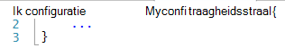
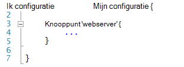
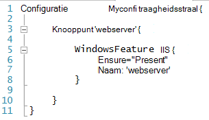
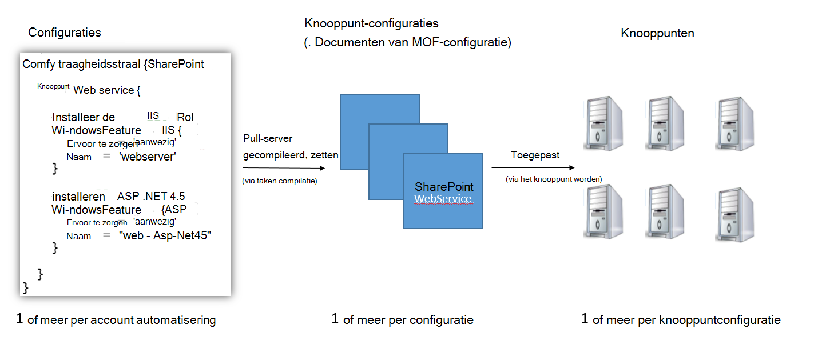
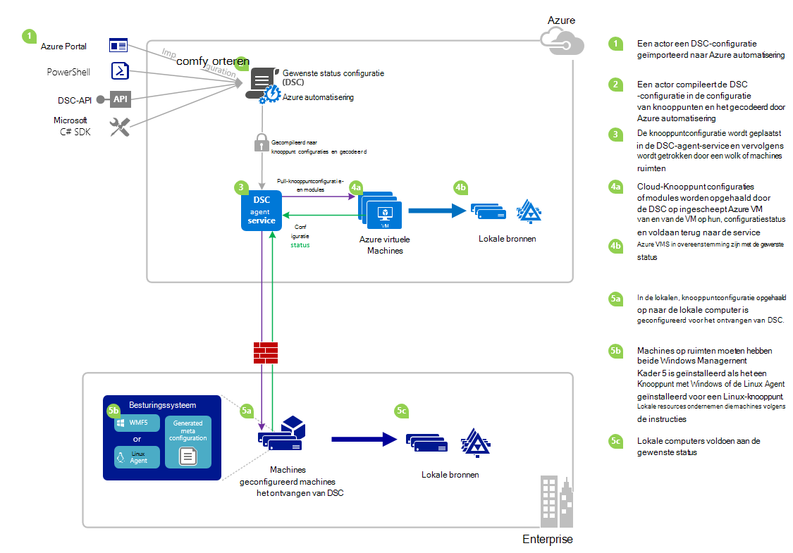

<properties 
   pageTitle="DSC-overzicht Azure automatisering | Microsoft Azure" 
   description="Een overzicht van Azure automatisering gewenst staat configuratie (DSC), de voorwaarden en bekende problemen" 
   services="automation" 
   documentationCenter="dev-center-name" 
   authors="coreyp-at-msft" 
   manager="stevenka" 
   editor="tysonn"
   keywords="PowerShell dsc, configuratie van de gewenste status, powershell dsc azure"/>

<tags
   ms.service="automation"
   ms.devlang="NA"
   ms.topic="article"
   ms.tgt_pltfrm="powershell"
   ms.workload="TBD" 
   ms.date="05/10/2016"
   ms.author="magoedte;coreyp"/>

# Azure automatisering DSC-overzicht #

##Wat is Azure automatisering DSC?##
Distributie en onderhoud van de gewenste status van uw servers en toepassingsbronnen kunnen worden vervelend en foutgevoelig. Met Azure automatisering gewenste staat configuratie (DSC), kunt u voortdurend implementeren, op betrouwbare wijze te controleren en automatisch bijwerken de gewenste status van alle uw IT-middelen, met de schaal van de cloud. Gebaseerd op PowerShell DSC en kunt automatisering DSC uitlijnen configuratie van de computer met een bepaalde status tussen fysieke en virtuele machines (VMs), met Windows of Linux, en in de cloud of op locatie U kunt continue levering van IT services met consistente controle- en snelle veranderingen in de heterogene hybride IT-omgeving beheren met gemak.

Azure automatisering DSC is gebaseerd op de grondbeginselen in PowerShell DSC voor een nog eenvoudiger configuratie management ervaring geïntroduceerd. Azure automatisering DSC brengt dezelfde laag management [PowerShell gewenst staat configuratie](https://msdn.microsoft.com/powershell/dsc/overview) zoals automatisering Azure biedt voor PowerShell scripts vandaag.

Azure automatisering DSC kunt u [ontwerpen en beheren van PowerShell gewenst staat configuraties](https://technet.microsoft.com/library/dn249918.aspx) [DSC Resources](https://technet.microsoft.com/library/dn282125.aspx)importeren en het genereren van DSC knooppunt configuraties (MOF-documenten), alles in de cloud. Deze items DSC wordt geplaatst op de automatisering van Azure [DSC pull-server](https://technet.microsoft.com/library/dn249913.aspx) zodat doelknooppunten in de cloud of op locatie (zoals fysieke en virtuele machines) kunnen ophalen, automatisch in overeenstemming zijn met de gewenste status die ze geven en op hun conformiteit met de gewenste status voor Azure automatisering rapporteren.

Het beste kijken naar lezen? Bekijk de onderstaande video vanaf mei 2015, als eerste Azure automatisering DSC werd aangekondigd. **Opmerking:** Terwijl de concepten en lifecycle besproken in deze video juist zijn, is veel Azure automatisering DSC gevorderd omdat deze video is vastgelegd. Het is nu algemeen beschikbaar, is een veel uitgebreidere gebruikersinterface in de portal Azure en ondersteunt veel extra mogelijkheden.

> [AZURE.VIDEO microsoft-ignite-2015-heterogeneous-configuration-management-using-microsoft-azure-automation]

## Azure automatisering DSC-voorwaarden ##
### Configuratie ###
PowerShell DSC introduceerde een nieuw concept configuraties genoemd. Configuraties kunnen u via PowerShell-syntaxis definiëren de gewenste status van uw omgeving. DSC gebruikt voor het configureren van uw omgeving, eerst een Windows PowerShell-scriptblok met het sleutelwoord configuratie definiëren en vervolgens gaat u als volgt een id, klik vervolgens met de accolades ({}) te scheiden van het blok.

U kunt binnen het blok configuratie knooppunt configuratie blokken die geeft u de gewenste configuratie voor een reeks knooppunten (computers) in uw omgeving die moeten worden geconfigureerd dat precies dezelfde definiëren. Op deze manier vertegenwoordigt een knooppuntconfiguratie "rol" voor een of meer knooppunten om aan te nemen. Een configuratie knooppunt blok begint met het sleutelwoord knooppunt. Volg dit trefwoord met de naam van de rol die een variabele of expressie. Gebruik accolades {} te scheiden van het blok knooppunt configuratie na de naam van de rol.

 
In de configuratie knooppunt-blok definieert u de resource blokken om specifieke DSC-bronnen configureren. Een resource blok begint met de naam van de resource, gevolgd door de id die u wilt opgeven voor dat blok vervolgens accolades {} om het blok te scheiden.

Voor meer informatie over het sleutelwoord configuratie, Zie: [Wat zijn configuratie trefwoord in de gewenste staat configuratie](http://blogs.msdn.com/b/powershell/archive/2013/11/05/understanding-configuration-keyword-in-desired-state-configuration.aspx "Wat configuratie trefwoord in de gewenste staat configuratie")

Actief (compileren) produceert een DSC-configuratie een of meer DSC knooppunt configuraties (MOF-documenten), die knooppunten DSC toepassen om te voldoen aan de gewenste status.

Azure automatisering DSC kunt u importeren, auteur en compileren DSC-configuraties in Azure automatisering, vergelijkbaar met hoe runbooks kunnen worden geïmporteerd, geschreven en in Azure Automatisering gestart.

>[AZURE.IMPORTANT] Een configuratie bevat slechts een blok van de configuratie, met dezelfde naam als de configuratie in Azure automatisering DSC. 

###Knooppuntconfiguratie###

Wanneer een DSC-configuratie wordt gecompileerd, worden een of meer knooppunten configuraties afhankelijk van het knooppunt blokken in de configuratie geproduceerd. De configuratie van een knooppunt is hetzelfde als een "MOF" of "configuratie document" (als u bekend met deze voorwaarden PS DSC bent) en "rol", zoals een webserver of een werknemer, die een of meer knooppunten moeten aannemen of compatibiliteit ten opzichte van de gewenste vertegenwoordigt. Namen van knooppunt configuraties in Azure automatisering DSC de vorm aannemen van "Name.NodeConfigurationBlockName configuratie".

PS DSC knooppunten worden op de hoogte van het knooppunt configuraties die zij via DSC push of pull-methoden nemen moeten. Azure automatisering DSC afhankelijk van de DSC pull-methode, waarbij knooppunten knooppunt configuraties voor toepassing van de automatisering Azure DSC pull-server. Omdat de knooppunten de aanvraag naar Azure automatisering DSC maken, knooppunten worden achter een firewall, zijn alle binnenkomende poorten gesloten, enz. Hoeft alleen uitgaande toegang tot het Internet (rechtstreeks of via een proxy).

###Knooppunt###

Een knooppunt DSC is een machine met de configuratie die wordt beheerd door DSC. Dit kan zijn van een Windows- of Linux Azure VM, VM op gebouwen / fysieke host of computer in een andere openbare cloud. Knooppunten knooppunt configuraties worden en voldoen aan de gewenste status definiëren onderhouden vast en kunnen ook een rapport naar een reporting server op hun, configuratiestatus en naleving versus de gewenste status.

Azure automatisering DSC onboarding van knooppunten voor beheer door Azure automatisering DSC kunt u gemakkelijk en kunt wijzigen van de knooppuntconfiguratie is toegewezen aan elk knooppunt aan de serverzijde, zodat zodra die een knooppunt, controleert de server voor instructies wordt een andere rol vervullen en hoe deze is geconfigureerd en de status van complaince wijzigen het rapporteren moet aan.

###Resource###
DSC-bronnen zijn de bouwstenen die u gebruiken kunt voor het definiëren van een configuratie van Windows PowerShell gewenst staat configuratie (DSC). DSC wordt geleverd met een set ingebouwde bronnen zoals bestanden en mappen, server-functies en rollen, registerinstellingen, omgevingsvariabelen, en services en processen. Zie meer informatie over de volledige lijst met ingebouwde DSC-bronnen en het gebruik ervan, [Ingebouwde Windows PowerShell de gewenste configuratie staatsmiddelen](https://technet.microsoft.com/library/dn249921.aspx).

DSC resources kunnen ook worden geïmporteerd als onderdeel van PowerShell Modules uit te breiden de set ingebouwde DSC-bronnen. Niet standaard bronnen zal worden opgevraagd door DSC-knooppunten van de DSC-pull-server, als een knooppuntconfiguratie is die het knooppunt is bedoeld als vast verwijzingen naar deze bronnen bevat. Zie meer informatie over het maken van aangepaste middelen, [Bouwen aangepaste Windows PowerShell de gewenste configuratie staatsmiddelen](https://technet.microsoft.com/library/dn249927.aspx).

Azure automatisering DSC wordt geleverd met alle ingebouwde DSC-bronnen als PS DSC. Aanvullende bronnen kunnen worden toegevoegd aan de Azure automatisering DSC door met de bronnen in de automatisering van Azure PowerShell-modules importeren.

###Van Compilatietaak###
Een project compileren in Azure automatisering DSC is een exemplaar van de opstelling van een configuratie met een of meer knooppunten configuraties maken. Ze zijn vergelijkbaar met Azure automatisering runbook taken, behalve dat ze elke taak, behalve als u wilt maken van een knooppunt configuraties niet daadwerkelijk uitvoeren. Gemaakt door een Compilatietaak configuraties knooppunt automatisch worden geplaatst op de Azure automatisering DSC pull-server en overschrijven eerdere versies van knooppunt configuraties, als ze bestaan voor deze configuratie. De naam van een knooppuntconfiguratie geproduceerd door een project compileren, heeft de vorm van "ConfigurationName.NodeConfigurationBlockName". Compileren van bijvoorbeeld de onder configuratie zou produceren een configuratie met één knooppunt genaamd "MyConfiguration.webserver"

>[AZURE.NOTE] Net als runbooks, kunnen de configuraties worden gepubliceerd. Dit is niet gerelateerd aan het DSC-artikelen op de Azure automatisering DSC pull-server. Compilatie van taken tot gevolg hebben dat DSC artikelen moeten worden geplaatst op de Azure automatisering DSC pull-server. Zie voor meer informatie op 'publiceren' in Azure automatisering, [publiceren van een Runbook](https://msdn.microsoft.com/library/dn903765.aspx).

##Azure automatisering DSC LifeCycle##
Uit een lege automatisering-account te gaan naar een beheerde reeks knooppunten correct geconfigureerde bestaat uit een verzameling van processen voor het definiëren van configuraties die configuraties in knooppunt configuraties en onboarding knooppunten knooppunt configuraties en Azure automatisering DSC schakelen. In het volgende diagram illustreert de Azure automatisering DSC-levenscyclus:

De volgende afbeelding ziet u gedetailleerde stapsgewijze proces in de levenscyclus van DSC. Het bevat verschillende manieren een configuratie wordt geïmporteerd en wordt toegepast op knooppunten in Azure automatisering, onderdelen die vereist zijn voor een machine op locatie voor ondersteuning van DSC en interacties tussen de verschillende onderdelen. 

     

##Gotchas / bekende problemen:##

- Wanneer u een upgrade naar WMF 5 RTM, als de computer al is geregistreerd als een knooppunt in Azure automatisering DSC, deze registratie voor Azure automatisering DSC en deze opnieuw te registreren nadat de WMF 5 RTM-upgrade.

- Azure automatisering DSC ondersteund geheel of gedeeltelijk samengesteld DSC-configuraties op dit moment niet. DSC samengestelde bronnen kunnen echter worden geïmporteerd en gebruikt in Azure automatisering DSC configuraties wilt, zoals in lokale PowerShell, waardoor hergebruik van de configuratie.

- De meest recente versie van WMF 5 moet worden geïnstalleerd voor de agent PowerShell DSC voor Windows kunnen communiceren met Azure automatisering. De meest recente versie van de agent PowerShell DSC voor Linux moet worden geïnstalleerd voor Linux te kunnen communiceren met Azure automatisering.

- De traditionele PowerShell DSC pull-server verwacht module bericht wordt nu om te worden geplaatst op de pull-server in de indeling **ModuleName_Version.zip '**. Automatisering Azure verwacht PowerShell modules wilt importeren met namen in de vorm van een **ModuleName.zip**. Zie [Dit bericht op een blog](https://azure.microsoft.com/blog/2014/12/15/authoring-integration-modules-for-azure-automation/) voor meer info over de integratiemodule-indeling die nodig zijn voor het importeren van de module in Azure automatisering. 

- .Doc of .docx bestanden mag niet geïmporteerd in automatisering Azure PowerShell-modules. Sommige PowerShell-modules met DSC-bronnen bevatten deze bestanden voor help-toepassing. Deze bestanden moeten worden verwijderd uit de modules, vóór het importeren in Azure automatisering.

- Wanneer een knooppunt met een account met Azure automatisering is ingeschreven, of het knooppunt is gewijzigd om te worden toegewezen aan een ander knooppunt configuratie aan de serverzijde, wordt de status 'Compatibel', zelfs als de status van het knooppunt niet werkelijk in overeenstemming met de knooppuntconfiguratie die is nu toegewezen aan. Nadat het knooppunt wordt uitgevoerd de eerste pull en haar eerste verslag na registratie of een knooppunt toewijzing configuratiewijziging verzendt, kan de status van het knooppunt kan worden vertrouwd.

- Wanneer een Azure Windows VM voor beheer door Azure automatisering DSC met een van onze methoden direct onboarding onboarding, het kan duren tot een uur voor de VM weergeven als een knooppunt DSC in Azure automatisering. Dit komt door de installatie van Windows Management Framework 5.0 op de VM door de Azure VM DSC-extensie vereist voor on-board is VM naar Azure automatisering DSC.

- Na de registratie elk knooppunt automatisch onderhandelt over een uniek certificaat voor verificatie die na een jaar is verstreken. Op dit moment is kan geen het protocol PowerShell DSC-registratie certificaten automatisch vernieuwd wanneer ze vervaldatum, naderen dus u moet de knooppunten van een jaar later opnieuw te registreren. Voordat u opnieuw registreert, zorg ervoor dat elk knooppunt wordt uitgevoerd Windows Management Framework 5.0 RTM. Als certificaat voor clientverificatie van een knooppunt is verlopen en het knooppunt niet is geregistreerd, het knooppunt kan niet communiceren met Azure automatisering en zal worden gemarkeerd als 'Unresponsive'. Ruimen wordt uitgevoerd op dezelfde manier als die u het knooppunt in eerste instantie geregistreerd. Ruimen uitgevoerd 90 dagen of minder van de verloopdatum van het certificaat of op elk gewenst moment na de verloopdatum van het certificaat, leidt tot een nieuw certificaat worden gegenereerd en gebruikt.

- Wanneer u een upgrade naar WMF 5 RTM, als de computer al is geregistreerd als een knooppunt in Azure automatisering DSC, deze registratie voor Azure automatisering DSC en deze opnieuw te registreren nadat de WMF 5 RTM-upgrade. Voordat u opnieuw te registreren, door het bestand $env:windir\system32\configuration\DSCEngineCache.mof te verwijderen.

- DSC PowerShell cmdlets werken mogelijk niet als WMF 5 RTM op WMF 5 productie Preview is geïnstalleerd. U kunt dit verhelpen met de volgende opdracht worden uitgevoerd in een verhoogde PowerShell-sessie (als administrator uitvoeren):`mofcomp $env:windir\system32\wbem\DscCoreConfProv.mof`
 

##Verwante artikelen##

- [Onboarding machines voor beheer door Azure automatisering DSC] (.. /Automation/Automation-DSC-onboarding.MD)
- [Compileren configuraties in Azure automatisering DSC] (.. /Automation/Automation-DSC-Compile.MD)
- [Azure automatisering DSC-cmdlets] (https://msdn.microsoft.com/library/mt244122.aspx)
- [Azure automatisering DSC prijzen] (https://azure.microsoft.com/pricing/details/automation/)
- [Continue implementatie IaaS VMs Azure automatisering DSC en Chocolatey] (automatisering-dsc-cd-chocolatey.md)
