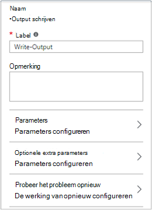

<properties
    pageTitle="Mijn eerste grafische runbook in Azure automatisering | Microsoft Azure"
    description="Zelfstudie die u bij het maken begeleidt, testen en publiceren van een eenvoudige grafische runbook."
    services="automation"
    documentationCenter=""
    authors="mgoedtel"
    manager="jwhit"
    editor=""
    keywords="runbook, runbook, sjabloon, runbook automatisering, azure runbook"/>
<tags
    ms.service="automation"
    ms.workload="tbd"
    ms.tgt_pltfrm="na"
    ms.devlang="na"
    ms.topic="get-started-article"
    ms.date="07/06/2016"
    ms.author="magoedte;bwren"/>

# <a name="my-first-graphical-runbook"></a>Mijn eerste grafische runbook

> [AZURE.SELECTOR] - [Grafische](automation-first-runbook-graphical.md) - [PowerShell](automation-first-runbook-textual-PowerShell.md) - [PowerShell Workflow](automation-first-runbook-textual.md)

Deze handleiding helpt u bij het maken van een [grafische runbook](automation-runbook-types.md#graphical-runbooks) in Azure automatisering.  We beginnen met een eenvoudige runbook die we testen en publiceren terwijl leggen we uit hoe bij te houden van de status van de taak van de runbook.  We zullen wijzigt u de runbook voor het beheren van bronnen Azure, werkelijk in dit geval een Azure virtuele machine te starten.  Vervolgens gaat maken we de runbook robuuster door de parameters runbook en voorwaardelijke koppelingen toe te voegen.

## <a name="prerequisites"></a>Vereisten

Als u deze zelfstudie hebt voltooid, moet u het volgende.

-   Abonnement op Azure.  Als u geen één nog hebt, kunt u [uw MSDN subscriber voordelen te activeren](https://azure.microsoft.com/pricing/member-offers/msdn-benefits-details/) of <a href="/pricing/free-account/" target="_blank"> [Aanmelden voor een gratis account](https://azure.microsoft.com/free/).
-   [Azure uitvoeren als-Account](automation-sec-configure-azure-runas-account.md) Houd de runbook en geverifieerd bij bronnen Azure.  Deze account moet gemachtigd zijn om te starten en stoppen van de virtuele machine.
-   Een Azure virtuele machine.  We zullen stoppen en starten van deze computer zodat deze productie niet moet worden.


## <a name="step-1---create-new-runbook"></a>Stap 1 - nieuwe runbook maken

We beginnen met het maken van een eenvoudig runbook dat de tekst *Hallo wereld*oplevert.

1.  Open uw account automatisering in de Portal Azure.  
    De pagina automatisering biedt u een snelle weergave van de bronnen in deze account.  U moet al bepaalde activa.  De meeste van deze zijn de modules die automatisch worden opgenomen in een nieuwe account voor automatisering.  Ook hebt u de referentie actief dat wordt vermeld in de [voorwaarden](#prerequisites).
2.  Klik op de tegel **Runbooks** opent de lijst met runbooks.<br> 
3.  Een nieuwe runbook maken door te klikken op de knop **toevoegen, een runbook** en **een nieuwe runbook maken**.
4.  De runbook de *MyFirstRunbook-grafische*naam geven.
5.  In dit geval gaan we voor het maken van een [grafische runbook](automation-graphical-authoring-intro.md) **grafische** dus selecteren voor het **type Runbook**.<br> <br>
6.  Klik op **maken** om het maken van de runbook en de grafische editor openen.

## <a name="step-2---add-activities-to-the-runbook"></a>Stap 2 - activiteiten aan de runbook toevoegen

Het besturingselement van de bibliotheek aan de linkerkant van de editor kunt u activiteiten toe te voegen aan uw runbook te selecteren.  Gaan we een cmdlet **Schrijven-uitvoer** om de uitvoer van de tekst van de runbook toevoegen.

1.  In de bibliotheek, klikt u op in het tekstvak zoeken en typ **Schrijven-Output**.  Hieronder worden de zoekresultaten weergegeven. <br> 
2.  Ga naar de onderkant van de lijst.  U kunt de **Schrijven uitvoer** Klik met de rechtermuisknop en selecteer **tekenpapier toevoegen** of klik op de ellips naast de cmdlet en **tekenpapier toevoegen**selecteert.
3.  Klik op de activiteit **Schrijven uitvoer** op het canvas.  Hiermee opent u de configuratie van besturingselement blade waarmee u voor het configureren van de activiteit.
4.  Het **Label** wordt standaard de naam van de cmdlet, maar we kunnen veranderen, meer beschrijvende. Wijzigen in *Schrijven Hallo wereld om uit te voeren*.
5.  Klik op **Parameters** voor de waarden voor de parameters van de cmdlet.  
    Sommige cmdlets meerdere parametersets hebt en u moet selecteren die u wilt gebruiken. In dit geval heeft **Schrijven uitvoer** slechts één parameter is ingesteld, zodat u niet hoeft om een te selecteren. <br> 
6.  Selecteer de parameter **InputObject** .  Dit is de parameter waar we de tekst te verzenden naar de uitvoerstroom wordt aangegeven.
7.  Selecteer in de vervolgkeuzelijst **gegevensbron** **PowerShell-expressie**.  De vervolgkeuzelijst **gegevensbron** biedt verschillende bronnen die u gebruikt voor het vullen van een waarde voor de parameter.  
    U kunt de uitvoer uit dergelijke bronnen zoals een andere activiteit, een actief automatisering of een expressie PowerShell gebruiken.  In dit geval willen we alleen voor de uitvoer van de tekst *Hallo wereld*. We kunnen een PowerShell-expressie gebruiken en een tekenreeks opgeven.
8.  *"Hello World"* typt in het vak **expressie** en klik vervolgens op **OK** tweemaal om terug te keren naar het canvas.<br> 
9.  De runbook opslaan door op **Opslaan**te klikken.<br> 

## <a name="step-3---test-the-runbook"></a>Stap 3: testen van de runbook

Voordat we de runbook zodat deze beschikbaar zijn in de productie kunt publiceren, willen we het testen om ervoor te zorgen dat het goed werkt.  Wanneer u een runbook test, kunt u **de conceptversie** uitvoeren en de uitvoer interactief weergeven.

1.  Klik op **Test deelvenster** openen de blade Test.<br> 
2.  Klik op **Start** om de test te starten.  Dit moet de enige optie is ingeschakeld.
3.  Een [taak van de runbook](automation-runbook-execution.md) wordt gemaakt en de status wordt weergegeven in het deelvenster.  
    Status van de taak wordt gestart als *in wachtrij* , die aangeeft dat deze nog voor een werknemer van de runbook in de cloud beschikbaar.  Deze vervolgens verplaatst naar het *begin* wanneer een werknemer beweert dat de taak en *wordt uitgevoerd* wanneer de runbook daadwerkelijk wordt gestart.  
4.  Wanneer de runbook-taak is voltooid, wordt de uitvoer weergegeven. In ons geval zien we *Hallo wereld*.<br> 
5.  Sluit de Test blade terug te keren naar het canvas.

## <a name="step-4---publish-and-start-the-runbook"></a>Stap 4 - publiceren en starten van de runbook

De runbook die we zojuist hebben gemaakt, is nog steeds in de conceptmodus. We moeten publiceren voordat we kan worden uitgevoerd in de productie.  Wanneer u een runbook publiceert, kunt u de bestaande gepubliceerde versie overschrijven met de conceptversie.  In ons geval nog we geen een gepubliceerde versie omdat we net hebben de runbook gemaakt.

1.  Klik op **publiceren** op de runbook publiceren en vervolgens op **Ja** wanneer u wordt gevraagd.<br> 
2.  Als u de schuifbalk links de runbook in het blad **Runbooks** , wordt het weergegeven een **Status ontwerpen** van **gepubliceerd**.
3.  Ga terug naar de blade bekijken voor **MyFirstRunbook**.  
    De opties boven kunnen we de runbook start, plannen te starten op een bepaald moment in de toekomst of een [webhook](automation-webhooks.md) te maken, zodat deze kan worden gestart via een HTTP-oproep.
4.  We willen net start de runbook dus klikt u op **Start** en vervolgens op **Ja** wanneer u wordt gevraagd.<br> 
5.  Een taak blade is geopend voor het runbook project dat we zojuist hebben gemaakt.  We kunnen deze blade sluiten, maar in dit geval we laten het open zodat we de voortgang van het project kan bekijken.
6.  Status van de taak wordt weergegeven in de **Samenvatting** en komt overeen met de statussen die u hebt gezien wanneer we de runbook getest.<br> 
7.  Wanneer de status van de runbook *voltooid wordt*, klikt u op **uitvoer**. De blade **uitvoer** wordt geopend en zien we onze *HelloWorld* in het deelvenster.<br>   
8.  Sluit de uitvoer blade.
9.  Klik op **Alle logboeken** om te openen de blade Streams voor de taak runbook.  We moeten alleen *Hallo wereld* in de uitvoerstroom zien, maar dit andere stromen voor een project van runbook zoals uitgebreid en fout kunt weergeven als de runbook voor hen schrijft.<br> 
10. Sluit de blade alle logboeken en de blade taak terug te keren naar het blade MyFirstRunbook.
11. Klik op **taken** om te openen de blade taken voor deze runbook.  Hier worden alle taken die door deze runbook gemaakt. Moeten zien we slechts één taak sinds we de taak slechts eenmaal hebt weergegeven.<br> 
12. U kunt klikken op deze taak opent het deelvenster dezelfde taak die we weergegeven wanneer we begonnen met de runbook.  Hiermee kunt u teruggaan in de tijd en de details van een taak die is gemaakt voor een bepaalde runbook weergeven.

## <a name="step-5---create-variable-assets"></a>Stap 5 - variabele activa maken

We hebben getest en onze runbook gepubliceerd, maar tot nu toe het doet nog niets nuttig. Wij willen deze Azure bronnen beheren.  Voordat we de runbook voor verificatie configureren, maken we een variabele houdt de abonnement-ID en ernaar verwijzen nadat we de activiteit te verifiëren in stap 6 hieronder instellen.  Een verwijzing naar de context van het abonnement, kunt u eenvoudig tussen meerdere abonnementen werken.  Voordat u verdergaat, uw abonnements-ID van de optie abonnementen van het navigatiedeelvenster te kopiëren.  

1. In het blad automatisering Accounts klikt u op de tegel **activa** en de **activa** blade wordt geopend.
2. Klik op de tegel **variabelen** in de blade activa.
3. Klik op het blad variabelen **toevoegen een variabele**.<br>
4. Voer **AzureSubscriptionId** in de nieuwe variabele blade in het vak **naam** en in het vak **waarde** de abonnement-id invoeren.  Houden *tekenreeks* van het **Type** en de standaardwaarde voor **codering**.  
5. Klik op **maken** om de variabele te maken.  


## <a name="step-6---add-authentication-to-manage-azure-resources"></a>Stap 6 - verificatie voor het beheren van Azure resources toevoegen

Nu dat we een variabele voor het opslaan van onze abonnements-ID hebt, kunnen we onze runbook voor het verifiëren van de referenties uitvoeren als waarnaar wordt verwezen in de [vereisten](#prerequisites)configureren.  We doen dat door de Azure uitvoeren als verbinding **actief** en **Add-AzureRMAccount-** cmdlet toe te voegen aan het canvas.  

1.  De grafische editor openen door te klikken op **bewerken** in het blad MyFirstRunbook.<br> 
2.  We **Schrijven Hello World voor de uitvoer** niet meer nodig, dus op de rechtermuisknop en selecteer **verwijderen**.
3.  Vouw **verbindingen** in de bibliotheek, en **AzureRunAsConnection** aan het canvas toevoegen door te selecteren **aan het tekenpapier toevoegen**.
4.  Selecteer **AzureRunAsConnection** en typ in het deelvenster Beheer configuratie **Uitvoeren als verbinding ophalen** in het tekstvak **Label** op het canvas.  Dit is de verbinding 
5.  Typ in het besturingselement bibliotheek **Toevoegen AzureRmAccount** in het tekstvak zoeken.
6.  **Add-AzureRmAccount** aan het tekenpapier toevoegen.<br> 
7.  De muisaanwijzer **Uitvoeren als verbinding krijgen** tot een cirkel wordt weergegeven op de onderkant van de vorm. Klik op de cirkel en sleep de pijl naar **Add-AzureRmAccount**.  De pijl die u zojuist hebt gemaakt, wordt een *koppeling*.  De runbook zal starten met **Uitvoeren als verbinding ophalen** en voer vervolgens **Add-AzureRmAccount**.<br> 
8.  Selecteer **Add-AzureRmAccount** en in de configuratie bepalen deelvenster type **Azure-aanmeldingen** in het tekstvak **Label** op het canvas.
9.  Klik op **Parameters** en de activiteit Parameter configuratie blade wordt weergegeven. 
10.  **Toevoegen-AzureRmAccount** heeft meerdere parametersets, dus we een selecteren moeten voordat wij parameterwaarden kunnen bieden.  Klik op **Parameter instellen** en selecteer vervolgens de parameter **ServicePrincipalCertificate** is ingesteld. 
11.  Als u de parameter is ingesteld, worden de parameters in de blade activiteit Parameter configuratie weergegeven.  Klik op **APPLICATIONID**.<br> 
12.  In het blad parameterwaarde **activiteit uitvoer** voor de **gegevensbron** selecteren en **Ophalen uitvoeren als verbinding** selecteren in de lijst, typ in het **veld pad** textbox **ApplicationId**, en klik op **OK**.  Wij zijn de naam van de eigenschap voor het veld pad opgeven omdat hiermee een object met meerdere eigenschappen kunt u de activiteit.
13.  Klik op **CERTIFICATETHUMBPRINT**en selecteer in het blad parameterwaarde **activiteit uitvoer** voor de **gegevensbron**.  **Uitvoeren als verbinding krijgen** selecteren uit de lijst, typ in het **veld pad** textbox **CertificateThumbprint**, en klik vervolgens op **OK**. 
14.  **SERVICEPRINCIPAL**, klik op en selecteer in het blad waarde voor de Parameter **ConstantValue** voor de **gegevensbron**, klikt u op de optie **True**en klik op **OK**.
15.  Klik op **TENANTID**en selecteer in de waarde van de Parameter-blade **activiteit uitvoer** voor de **gegevensbron**.  Selecteer **Uitvoeren als verbinding krijgen** uit de lijst, typ in het **veld pad** textbox **TenantId**, en klik vervolgens op **OK** .  
16.  Typ **Set-AzureRmContext** in het tekstvak Zoeken in de bibliotheek-besturingselement.
17.  **Set AzureRmContext** aan het tekenpapier toevoegen.
18.  Selecteer **Set AzureRmContext** en controle deelvenster type **Abonnement-Id opgeven** in het tekstvak **Label** in de configuratie op het canvas.
19.  Klik op **Parameters** en de activiteit Parameter configuratie blade wordt weergegeven. 
20. **Set AzureRmContext** heeft meerdere parametersets, dus we een selecteren moeten voordat wij parameterwaarden kunnen bieden.  Klik op **Parameter instellen** en selecteer vervolgens de parameter **SubscriptionId** is ingesteld.  
21.  Als u de parameter is ingesteld, worden de parameters in de blade activiteit Parameter configuratie weergegeven.  Klik op **SubscriptionID**
22.  In de waarde van de Parameter-blade **Variabele activum** selecteren voor de **gegevensbron** en selecteer **AzureSubscriptionId** in de lijst en klik vervolgens op **OK** .   
23.  De muisaanwijzer op **het aanmelden bij de Azure** tot een cirkel wordt weergegeven op de onderkant van de vorm. Klik op de cirkel en sleep de pijl aan de **Abonnement-Id opgeven**.


Uw runbook ziet er als volgt nu: <br>

## <a name="step-7---add-activity-to-start-a-virtual-machine"></a>Stap 7 - activiteit om een virtuele machine start toevoegen

Nu gaan we een activiteit **Start AzureRmVM** als u een virtuele machine start wilt toevoegen.  Kunt u een virtuele machine in uw abonnement Azure en nu we hardcoding die naar de cmdlet naam zult zijn.

1. Typ in het besturingselement bibliotheek **Start AzureRm** in het tekstvak zoeken.
2. **Start AzureRmVM** aan het canvas toevoegen en klik vervolgens op en sleep deze onder de **Abonnement-Id opgeven**.
3. De muisaanwijzer op de **Abonnement-Id opgeven** totdat een cirkel wordt weergegeven op de onderkant van de vorm.  Klik op de cirkel en sleep de pijl aan het **Begin AzureRmVM**. 
4.  Selecteer **Start-AzureRmVM**.  Klik op **Parameters** **Parameter ingesteld** voor de sets van **Start-AzureRmVM**.  Selecteer de parameter **ResourceGroupNameParameterSetName** is ingesteld. Opmerking dat **ResourceGroupName** en de **naam** uitroeptekens vervolgens hebben ze.  Hiermee wordt aangegeven dat zij de vereiste parameters zijn.  Vergeet niet dat beide tekenreekswaarden verwacht.
5.  Selecteer **de naam**.  Selecteer **PowerShell-expressie** voor de **gegevensbron** en typ de naam van de virtuele machine tussen dubbele aanhalingstekens die we met deze runbook wordt gestart.  Klik op **OK**.<br>
6.  Selecteer **ResourceGroupName**. **PowerShell expressie** gebruiken voor de **gegevensbron** en typ de naam van de resourcegroep die tussen dubbele aanhalingstekens.  Klik op **OK**.<br> 
8.  Klik in deelvenster Test zodat we de runbook kunt testen.
9.  Klik op **Start** om de test te starten.  Zodra deze is voltooid, moet u controleren dat de virtuele machine is gestart.

Uw runbook ziet er als volgt nu: <br>

## <a name="step-8---add-additional-input-parameters-to-the-runbook"></a>Stap 8: extra input parameters toevoegen aan de runbook

Onze runbook de virtuele machine die momenteel in de resourcegroep die is opgegeven in de **Start-AzureRmVM** -cmdlet wordt gestart, maar onze runbook zou zijn als we beide opgeven kunt wanneer de runbook wordt gestart.  We zullen nu invoerparameters toevoegen aan de runbook om deze functionaliteit te bieden.

1. De grafische editor openen door te klikken op **bewerken** in het deelvenster **MyFirstRunbook** .
2. Klik op **invoer en uitvoer** en **invoer toevoegen** om de invoerparameter Runbook-venster te openen.<br> 
3. *VMName* opgeven voor de **naam**.  *Tekenreeks* voor het **Type**behouden, maar **verplicht** wijzigen in *Ja*.  Klik op **OK**.
4. Een tweede verplicht input parameter met de naam *ResourceGroupName* maken en klik vervolgens op **OK** om de **invoer en uitvoer** -venster sluit.<br> 
5. De activiteit **Start AzureRmVM** selecteren en klik vervolgens op **Parameters**.
6. De **gegevensbron** voor **de naam** te wijzigen in **Runbook input** en selecteer **VMName**.<br>
7. Wijzigen van de **gegevensbron** voor de **ResourceGroupName** op **de invoer van Runbook** en selecteer **ResourceGroupName**.<br> 
8. De runbook opslaan en openen van de te beproeven ruit.  Opmerking u kunt nu waarden opgeven voor de twee ingevoerde variabelen die worden gebruikt in de test.
9. De te beproeven ruit sluit.
10. Klik op **publiceren** om de nieuwe versie van de runbook te publiceren.
11. Stop de virtuele machine die u in de vorige stap hebt gestart.
12. Klik op **Start** om te beginnen de runbook.  Typ in het **VMName** en **ResourceGroupName** voor de virtuele machine die u wilt starten.<br> 
13. Wanneer de runbook is voltooid, kunt u controleren of de virtuele machine is gestart.

## <a name="step-9---create-a-conditional-link"></a>Stap 9: Maak een link met voorwaardelijke

We zullen nu de runbook zodanig wijzigen dat alleen wordt geprobeerd de virtuele machine te starten als deze nog niet is gestart.  We zullen dit doen door een cmdlet **Get-AzureRmVM** toe te voegen aan de runbook die een status op het exemplaar van de virtuele machine. Vervolgens gaan we een PowerShell Workflow module **Get Status** aangeroepen met een fragment van code om te bepalen als de status van de virtuele machine uitgevoerd of is gestopt wordt PowerShell toevoegen.  Een voorwaardelijke koppeling vanuit de module **Get Status** **Start AzureRmVM** kan alleen worden uitgevoerd als de huidige actieve status is gestopt.  Ten slotte zullen we een bericht om te informeren of de VM is gestart of niet met de cmdlet PowerShell schrijven-Output uitvoer.

1. Open **MyFirstRunbook** in de grafische editor.
2. De koppeling tussen de **Abonnement-Id opgeven** en de **Begin-en AzureRmVM** verwijderen door erop te klikken en vervolgens op de *Delete* -toets te drukken.
3. Typ in het besturingselement bibliotheek **Get-AzureRm** in het tekstvak zoeken.
4. **Get-AzureRmVM** aan het tekenpapier toevoegen.
5. Selecteer **Get-AzureRmVM** en **Parameter ingesteld** om de sets voor **Get-AzureRmVM**weer te geven.  Selecteer de parameter **GetVirtualMachineInResourceGroupNameParamSet** is ingesteld.  Opmerking dat **ResourceGroupName** en de **naam** uitroeptekens vervolgens hebben ze.  Hiermee wordt aangegeven dat zij de vereiste parameters zijn.  Vergeet niet dat beide tekenreekswaarden verwacht.
6. **Runbook-invoer** selecteren onder voor **naam** **gegevensbron** en selecteer **VMName**.  Klik op **OK**.
7. Onder **gegevensbron** voor **ResourceGroupName**, **Runbook-invoer** selecteren en selecteer vervolgens de **ResourceGroupName**.  Klik op **OK**.
8. Onder **gegevensbron** van **Status**voor de **constante waarde** te selecteren en klik vervolgens op op **True**.  Klik op **OK**.  
9. Maak een koppeling van de **Abonnements-Id opgeven** voor **Get-AzureRmVM**.
10. **Runbook-besturingselement** selectie uitvouwen in de bibliotheek, en voeg **Code** toe aan het tekenpapier.  
11. Maak een koppeling van de **Get-AzureRmVM** **code**.  
12. Klik op **Code** en wijzigen in het venster configuratie label **Get Status**.
13. Selecteer **Code** parameter en het blad van de **Code-Editor** wordt weergegeven.  
14. Plak het volgende stukje code in de code-editor:

     ```
     $StatusesJson = $ActivityOutput['Get-AzureRmVM'].StatusesText 
     $Statuses = ConvertFrom-Json $StatusesJson 
     $StatusOut ="" 
     foreach ($Status in $Statuses){ 
     if($Status.Code -eq "Powerstate/running"){$StatusOut = "running"} 
     elseif ($Status.Code -eq "Powerstate/deallocated") {$StatusOut = "stopped"} 
     } 
     $StatusOut 
     ```

15. Maak een koppeling van **Get Status** naar **Start AzureRmVM**.<br>   
16. Selecteer de koppeling en wijzig in het venster configuratie **toepassen voorwaarde** in **Ja**.   Opmerking de koppeling wordt een stippellijn die aangeeft dat de activiteit alleen worden uitgevoerd als de voorwaarde wordt omgezet in true.  
17. Typ *$ActivityOutput ['Get Status'] - eq "Gestopt"*voor de **voorwaarde-expressie**.  **Start AzureRmVM** wordt nu alleen uitgevoerd als de virtuele machine wordt gestopt.
18. Vouw in het besturingselement bibliotheek **Cmdlets** en **Microsoft.PowerShell.Utility**.
19. **Schrijven uitvoer** tweemaal aan het canvas toevoegen.<br> 
20. Op het eerste besturingselement **Schrijven-uitvoer** , klikt u op **Parameters** en wijzig de waarde van de **Label** in *VM gestart in kennis*.
21. Voor **InputObject**, omzetten in **gegevensbron** **PowerShell expressie** en typ de expressie *"$VMName is gestart."*.
22. Op het tweede besturingselement **Schrijven-uitvoer** , klikt u op **Parameters** en wijzig de waarde van de **Label** in *Kennis VM starten is mislukt*
23. Voor **InputObject**, omzetten in **gegevensbron** **PowerShell expressie** en typ de expressie *'$VMName kan niet worden gestart.'*.
24. Een koppeling maken vanaf **Begin AzureRmVM** **VM gestart in kennis** en **Delen VM starten is mislukt**.
25. Klik op de link **kennis VM** gestart en **toepassen voorwaarde** wijzigen op **True**.
26. Typ *$ActivityOutput ['Start-AzureRmVM'] voor de **voorwaarde-expressie**. IsSuccessStatusCode - eq $true*.  Dit besturingselement schrijven uitvoer wordt nu alleen uitgevoerd als de virtuele machine wordt gestart.
27. Klik op de link om te **Waarschuwen VM starten is mislukt** en **toepassen voorwaarde** wijzigen op **True**.
28. Typ *$ActivityOutput ['Start-AzureRmVM'] voor de **voorwaarde-expressie**. IsSuccessStatusCode - ne $true*.  Dit besturingselement schrijven uitvoer wordt nu alleen uitgevoerd als de virtuele machine niet gestart.
29. De runbook opslaan en openen van de te beproeven ruit.
30. De runbook beginnen met de virtuele machine gestopt en moet worden gestart.

## <a name="next-steps"></a>Volgende stappen

-   Zie voor meer informatie over grafische ontwerpen, [grafische ontwerpen in Azure automatisering](automation-graphical-authoring-intro.md)
-   Om te beginnen met PowerShell runbooks, Zie [Mijn eerste PowerShell-runbook](automation-first-runbook-textual-powershell.md)
-   Om te beginnen met PowerShell workflow runbooks, Zie [Mijn eerste PowerShell workflow runbook](automation-first-runbook-textual.md)
