<properties
    pageTitle="Mijn eerste runbook PowerShell in Azure automatisering | Microsoft Azure"
    description="Zelfstudie die u bij het maken begeleidt, testen en publiceren van een eenvoudige runbook met PowerShell."
    services="automation"
    documentationCenter=""
    authors="mgoedtel"
    manager="jwhit"
    editor=""
    keywords="Azure powershell, powershell script zelfstudie, powershell automatisering"/>
<tags
    ms.service="automation"
    ms.workload="tbd"
    ms.tgt_pltfrm="na"
    ms.devlang="na"
    ms.topic="get-started-article"
    ms.date="07/19/2016"
    ms.author="magoedte;sngun"/>

# <a name="my-first-powershell-runbook"></a>Mijn eerste PowerShell-runbook

> [AZURE.SELECTOR] - [Grafische](automation-first-runbook-graphical.md) - [PowerShell](automation-first-runbook-textual-PowerShell.md) - [PowerShell Workflow](automation-first-runbook-textual.md)  

Deze handleiding helpt u bij het maken van een [runbook PowerShell](automation-runbook-types.md#powershell-runbooks) in Azure automatisering. We beginnen met een eenvoudige runbook die we testen en publiceren terwijl leggen we uit hoe bij te houden van de status van de taak van de runbook. We zullen wijzigt u de runbook voor het beheren van bronnen Azure, werkelijk in dit geval een Azure virtuele machine te starten. Vervolgens gaat maken we de runbook nog krachtiger door runbook parameters toe te voegen.

## <a name="prerequisites"></a>Vereisten

Als u deze zelfstudie hebt voltooid, moet u het volgende.

-   Abonnement op Azure. Als u geen één nog hebt, kunt u [uw MSDN subscriber voordelen te activeren](https://azure.microsoft.com/pricing/member-offers/msdn-benefits-details/) of <a href="/pricing/free-account/" target="_blank"> [Aanmelden voor een gratis account](https://azure.microsoft.com/free/).
-   [Automatisering rekening](automation-security-overview.md) houdt de runbook en geverifieerd bij bronnen Azure.  Deze account moet gemachtigd zijn om te starten en stoppen van de virtuele machine.
-   Een Azure virtuele machine. We zullen stoppen en starten van deze computer zodat deze productie niet moet worden.

## <a name="step-1---create-new-runbook"></a>Stap 1 - nieuwe runbook maken

We beginnen met het maken van een eenvoudig runbook dat de tekst *Hallo wereld*oplevert.

1.  Open uw account automatisering in de Portal Azure.  
    De pagina automatisering biedt u een snelle weergave van de bronnen in deze account. U moet al bepaalde activa. De meeste van deze zijn de modules die automatisch worden opgenomen in een nieuwe account voor automatisering. Ook hebt u de referentie actief dat wordt vermeld in de [voorwaarden](#prerequisites).
2.  Klik op de tegel **Runbooks** opent de lijst met runbooks.  
      
3.  Een nieuwe runbook maken door te klikken op de knop **toevoegen, een runbook** en **een nieuwe runbook maken**.
4.  De runbook geeft u de naam *MyFirstRunbook PowerShell*.
5.  In dit geval gaan we maken een [PowerShell runbook](automation-runbook-types.md#powershell-runbooks) **Powershell** dus selecteren voor het **type Runbook**.  
    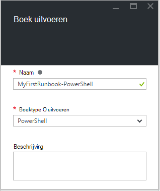  
6.  Klik op **maken** om het maken van de runbook en de tekst-editor openen.

## <a name="step-2---add-code-to-the-runbook"></a>Stap 2: Voeg code toe aan de runbook

Kunt u ofwel de code rechtstreeks in de runbook, of u kunt cmdlets, runbooks en elementen uit de bibliotheek-besturingselement selecteren en deze toegevoegd aan de runbook met alle bijbehorende parameters. Voor dit scenario zullen we Typ rechtstreeks in de runbook.

1.  Onze runbook is momenteel leeg, type *schrijven Output 'Hello World'.*.  
    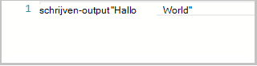  
2.  De runbook opslaan door op **Opslaan**te klikken.  
    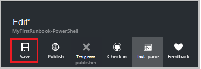  

## <a name="step-3---test-the-runbook"></a>Stap 3: testen van de runbook

Voordat we de runbook zodat deze beschikbaar zijn in de productie kunt publiceren, willen we het testen om ervoor te zorgen dat het goed werkt. Wanneer u een runbook test, kunt u **de conceptversie** uitvoeren en de uitvoer interactief weergeven.

1.  Klik op **testvenster** om de Test-venster te openen.  
    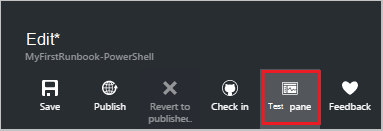  
2.  Klik op **Start** om de test te starten. Dit moet de enige optie is ingeschakeld.
3.  Een [runbook taak](automation-runbook-execution.md) wordt gemaakt en wordt de status weergegeven.  
    Status van de taak wordt gestart als *in wachtrij* , die aangeeft dat deze nog voor een werknemer van de runbook in de cloud beschikbaar komen. Deze vervolgens verplaatst naar het *begin* wanneer een werknemer beweert dat de taak en *wordt uitgevoerd* wanneer de runbook daadwerkelijk wordt gestart.  
4.  Wanneer de runbook-taak is voltooid, wordt de uitvoer weergegeven. In ons geval moeten we zien *Hallo wereld*  
    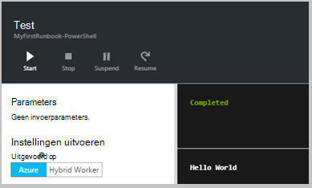  
5.  Sluit u het testvenster om terug te keren naar het canvas.

## <a name="step-4---publish-and-start-the-runbook"></a>Stap 4 - publiceren en starten van de runbook

De runbook die we zojuist hebben gemaakt, is nog steeds in de conceptmodus. We moeten publiceren voordat we kan worden uitgevoerd in de productie. Wanneer u een runbook publiceert, kunt u de bestaande gepubliceerde versie overschrijven met de conceptversie. In ons geval nog we geen een gepubliceerde versie omdat we net hebben de runbook gemaakt.

1.  Klik op **publiceren** op de runbook publiceren en vervolgens op **Ja** wanneer u wordt gevraagd.  
      
2.  Als u de schuifbalk links de runbook in het deelvenster **Runbooks** nu, wordt het weergegeven een **Status ontwerpen** van **gepubliceerd**.
3.  Ga terug naar het deelvenster voor **MyFirstRunbook PowerShell**bekijken.  
    De opties boven kunnen we de start van de runbook, de runbook bekijken, plannen te starten op een bepaald moment in de toekomst of een [webhook](automation-webhooks.md) te maken, zodat deze kan worden gestart via een HTTP-oproep.
4.  We willen net start de runbook dus klikt u op **Start** en klik vervolgens op **Ok** wanneer het blad Runbook starten wordt geopend.  
    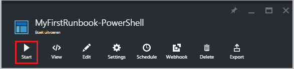  
5.  Een deelvenster Project is geopend voor het runbook project dat we zojuist hebben gemaakt. We kunnen dit venster sluiten, maar in dit geval we laten het open zodat we de voortgang van het project kan bekijken.
6.  Status van de taak wordt weergegeven in de **Samenvatting** en komt overeen met de statussen die u hebt gezien wanneer we de runbook getest.  
    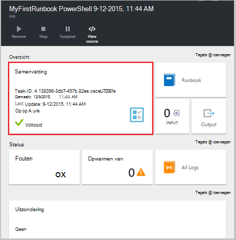  
7.  Wanneer de status van de runbook *voltooid wordt*, klikt u op **uitvoer**. Het deelvenster Uitvoer geopend en kunnen we onze *Hallo wereld*zien.  
    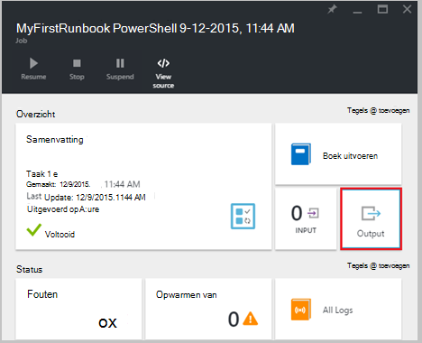
8.  Sluit het deelvenster Uitvoer.
9.  Klik op **Alle logboeken** om het deelvenster Streams voor het runbook-project te openen. We moeten alleen *Hallo wereld* in de uitvoerstroom zien, maar dit andere stromen voor een project van runbook zoals uitgebreid en fout kunt weergeven als de runbook voor hen schrijft.  
    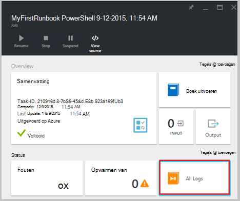  
10. Sluit het deelvenster Streams en het deelvenster Project om terug te keren naar het deelvenster MyFirstRunbook PowerShell.
11. Klik op **taken** om te openen van het deelvenster Taken voor deze runbook. Hier worden alle taken die door deze runbook gemaakt. Moeten zien we slechts één taak sinds we de taak slechts eenmaal hebt weergegeven.  
    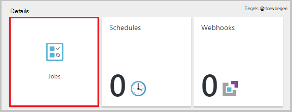  
12. U kunt klikken op deze taak opent het deelvenster dezelfde taak die we weergegeven wanneer we begonnen met de runbook. Hiermee kunt u teruggaan in de tijd en de details van een taak die is gemaakt voor een bepaalde runbook weergeven.

## <a name="step-5---add-authentication-to-manage-azure-resources"></a>Stap 5 - verificatie voor het beheren van Azure resources toevoegen

We hebben getest en onze runbook gepubliceerd, maar tot nu toe het doet nog niets nuttig. Wij willen deze Azure bronnen beheren. Niet mogelijk doen maar tenzij wij hebben geverifieerd met behulp van de referenties die worden genoemd in de [voorwaarden](#prerequisites). Dat doen we met de cmdlet **Add-AzureRmAccount** .

1.  De tekstuele editor openen door te klikken op **bewerken** in het deelvenster MyFirstRunbook PowerShell.  
    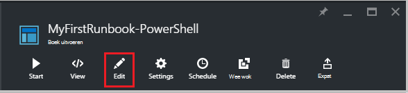  
2.  We de regel **Schrijven uitvoer** niet meer nodig, dus ga verder en verwijder deze.
3.  Typ of kopieer en plak de volgende code waarmee de verificatie met uw automatisering uitvoeren als-account worden verwerkt:

    ```
     $Conn = Get-AutomationConnection -Name AzureRunAsConnection 
     Add-AzureRMAccount -ServicePrincipal -Tenant $Conn.TenantID `
     -ApplicationId $Conn.ApplicationID -CertificateThumbprint $Conn.CertificateThumbprint
    ``` 
<br>
4.  Klik op **venster testen** zodat we de runbook kunt testen.
5.  Klik op **Start** om de test te starten. Zodra deze is voltooid, ontvangt u uitvoer vergelijkbaar met basisinformatie over het volgende, weergave van uw account. Dit bevestigt dat de referentie geldig is. <br> 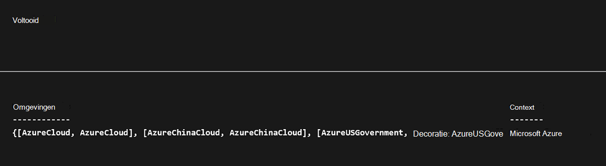

## <a name="step-6---add-code-to-start-a-virtual-machine"></a>Stap 6 - code toevoegen om op te starten van een virtuele machine

Nu dat onze runbook tot onze Azure abonnement verifieert, kunt we bronnen beheren. We gaan een opdracht aan een virtuele machine start toevoegen. Kunt u een virtuele machine in uw abonnement Azure en nu we hardcoding die naar de cmdlet naam zult zijn.

1.  Typ na *Add-AzureRmAccount*, *Start AzureRmVM-naam 'VMName' - ResourceGroupName 'NameofResourceGroup'* met de naam en de naam van de resourcegroep van de virtuele machine te starten.  
    
    ```
     $Conn = Get-AutomationConnection -Name AzureRunAsConnection 
     Add-AzureRMAccount -ServicePrincipal -Tenant $Conn.TenantID `
     -ApplicationID $Conn.ApplicationID -CertificateThumbprint $Conn.CertificateThumbprint 
     Start-AzureRmVM -Name 'VMName' -ResourceGroupName 'ResourceGroupName'
     ```
<br>
2.  De runbook opslaan en klik op **venster testen** zodat we het kunnen testen.
3.  Klik op **Start** om de test te starten. Zodra deze is voltooid, moet u controleren dat de virtuele machine is gestart.

## <a name="step-7---add-an-input-parameter-to-the-runbook"></a>Stap 7: een invoerparameter toevoegen aan de runbook

Onze runbook op dat moment start de virtuele machine die we hardcoded in de runbook, maar het zou zijn als we de virtuele machine opgeven kunt wanneer de runbook wordt gestart. We zullen nu invoerparameters toevoegen aan de runbook om deze functionaliteit te bieden.

1.  Parameters voor *VMName* en *ResourceGroupName* toevoegen aan de runbook en het gebruik van deze variabelen met de cmdlet **Start AzureRmVM** zoals in het onderstaande voorbeeld.  
    
    ```
    Param(
       [string]$VMName,
       [string]$ResourceGroupName
    )
     $Conn = Get-AutomationConnection -Name AzureRunAsConnection 
     Add-AzureRMAccount -ServicePrincipal -Tenant $Conn.TenantID `
     -ApplicationID $Conn.ApplicationID -CertificateThumbprint $Conn.CertificateThumbprint 
     Start-AzureRmVM -Name $VMName -ResourceGroupName $ResourceGroupName
     ```
<br> 
2.  De runbook opslaan en openen van de te beproeven ruit. Opmerking u kunt nu waarden opgeven voor de twee ingevoerde variabelen die worden gebruikt in de test.
3.  De te beproeven ruit sluit.
4.  Klik op **publiceren** om de nieuwe versie van de runbook te publiceren.
5.  Stop de virtuele machine die u in de vorige stap hebt gestart.
6.  Klik op **Start** om te beginnen de runbook. Typ in het **VMName** en **ResourceGroupName** voor de virtuele machine die u wilt starten.  
    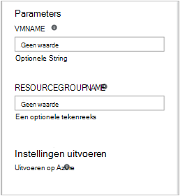  
7.  Wanneer de runbook is voltooid, kunt u controleren of de virtuele machine is gestart.

## <a name="differences-from-powershell-workflow"></a>Verschillen met PowerShell Workflow

Runbooks PowerShell dezelfde levenscyclus, mogelijkheden en beheer van PowerShell Workflow runbooks maar er zijn enkele verschillen en beperkingen:

1.  PowerShell runbooks snel worden uitgevoerd in vergelijking met PowerShell Workflow runbooks als ze geen compilatie stap.
2.  PowerShell Workflow runbooks ondersteunen met controlepunten controlepunten, runbooks PowerShell werkstroom kan worden hervat vanaf elk punt in de runbook dat PowerShell runbooks kan alleen worden hervat vanaf het begin.
3.  PowerShell Workflow runbooks ondersteuning voor parallelle en seriële uitvoering dat PowerShell runbooks kunnen opdrachten alleen serie uitvoeren.
4.  In een runbook PowerShell Workflow hebben een activiteit, een opdracht of een scriptblok een eigen runspace dat in een runbook PowerShell alles in een script wordt uitgevoerd in een enkel runspace. Er zijn ook enkele [syntactische verschillen](https://technet.microsoft.com/magazine/dn151046.aspx) tussen een native PowerShell-runbook en een runbook PowerShell Workflow.

## <a name="next-steps"></a>Volgende stappen

-   Om te beginnen met een grafische runbooks, Zie [Mijn eerste grafische runbook](automation-first-runbook-graphical.md)
-   Om te beginnen met PowerShell workflow runbooks, Zie [Mijn eerste PowerShell workflow runbook](automation-first-runbook-textual.md)
-   Als u wilt meer weten over de typen runbook, hun voordelen en beperkingen, Zie [Azure automatisering runbook typen](automation-runbook-types.md)
-   Voor meer informatie over PowerShell script functie ondersteunen, Zie [Native PowerShell script in Azure automatisering ondersteunen](https://azure.microsoft.com/blog/announcing-powershell-script-support-azure-automation-2/)
