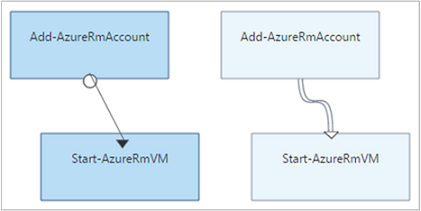

<properties 
    pageTitle="Grafische ontwerpen in Azure automatisering | Microsoft Azure"
    description="Grafische ontwerpen kunt u runbooks maken voor het automatiseren van Azure zonder het werken met code. Dit artikel bevat een inleiding tot grafisch ontwerpen en alle informatie die nodig is om te beginnen met het maken van een grafische runbook."
    services="automation"   
    documentationCenter=""
    authors="mgoedtel"
    manager="jwhit"
    editor="tysonn" />
<tags 
    ms.service="automation"
    ms.devlang="na"
    ms.topic="article"
    ms.tgt_pltfrm="na"
    ms.workload="infrastructure-services"
    ms.date="06/03/2016"
    ms.author="magoedte;bwren" />

# Grafische ontwerpen in Azure automatisering

## Inleiding

Grafische ontwerpen kunt u runbooks maken voor het automatiseren van Azure zonder de complexiteit van de onderliggende code van Windows PowerShell of PowerShell Workflow. U activiteiten aan het canvas toevoegen vanuit een bibliotheek met cmdlets en runbooks, deze aan elkaar koppelen en als u een werkstroom wilt configureren.  Als u hebt gewerkt met System Center Orchestrator of Service Management automatisering (SMA), vervolgens ziet dit u vertrouwd voorkomen.   

Dit artikel bevat een inleiding tot het grafische ontwerp en de concepten die u nodig hebt bij het maken van een grafische runbook.

## Grafische runbooks

Alle runbooks in Azure automatisering zijn Windows PowerShell werkstromen.  Grafische en grafische PowerShell Workflow runbooks PowerShell code die wordt uitgevoerd door de werknemers automatisering genereren, maar u bent niet kunnen bekijken of rechtstreeks wijzigen.  Een grafische runbook kan worden geconverteerd naar een grafische PowerShell Workflow runbook en vice versa, maar ze kunnen niet worden geconverteerd naar een tekstuele runbook. Een bestaande tekstuele runbook kan niet worden geïmporteerd in de grafische editor.  

## Overzicht van de grafische editor

U kunt de grafische editor openen in Azure portal door maken of bewerken van een grafische runbook.

De volgende secties worden de besturingselementen in de grafische editor.

### Canvas
Het Canvas maakt u uw runbook.  U activiteiten van de knooppunten in de bibliotheek-besturingselement toevoegen aan de runbook en deze koppelen aan de koppelingen voor het definiëren van de logica van de runbook.

U kunt de besturingselementen onder aan het tekenpapier in-en uitzoomen.

### Bibliotheek beheer

Het besturingselement voor de bibliotheek is waar u [activiteiten](#activities) toe te voegen aan uw runbook.  U toevoegen ze aan het canvas waar u deze op andere activiteiten aansluit.  Het bevat vier secties in de volgende tabel beschreven.

| Sectie | Beschrijving |
|:---|:---|
| Cmdlets | Bevat de cmdlets die kunnen worden gebruikt in uw runbook.  Cmdlets zijn geordend per module.  Alle modules die zijn geïnstalleerd in uw account automatisering zijn beschikbaar.  |
| Runbooks |  Bevat de runbooks in uw account voor automatisering. Deze runbooks kunnen worden toegevoegd aan het papier moet worden gebruikt als onderliggende runbooks. Alleen de runbooks van hetzelfde type als de runbook wordt bewerkt core worden weergegeven; Grafische worden runbooks alleen PowerShell op basis van runbooks weergegeven, terwijl runbooks grafische PowerShell Workflow alleen PowerShell Workflow-gebaseerde runbooks worden weergegeven.
| Activa | De [activa van de automatisering](http://msdn.microsoft.com/library/dn939988.aspx) bevat in uw account automatisering die kan worden gebruikt in de runbook.  Wanneer u een element aan een runbook toevoegen, wordt er een werkstroomactiviteit die de geselecteerde activa wordt toegevoegd.  In het geval van de variabele elementen, kunt u of een activiteit in de variabele ophalen of instellen van de variabele wordt toegevoegd.
| Runbook-besturingselement | Bevat runbook controleactiviteiten die kunnen worden gebruikt in uw huidige runbook. Een *kruising* heeft meerdere ingangen en wacht totdat alle voordat u doorgaat met de werkstroom hebt voltooid. Een activiteit van de *Code* wordt uitgevoerd een of meer regels van PowerShell of PowerShell Workflow code, afhankelijk van het type grafische runbook.  U kunt deze activiteit voor de aangepaste code of functionaliteit die is moeilijk te realiseren met andere activiteiten.|

### Configuratiebeheer

Het besturingselement configuratie is waar u informatie geven voor een object is geselecteerd op het canvas. De eigenschappen die beschikbaar zijn in dit besturingselement is afhankelijk van het type object dat is geselecteerd.  Wanneer u een optie in het besturingselement configuratie selecteert, wordt deze extra bladen geopend om aanvullende informatie te verstrekken.

### Besturingselement testen

De Test-besturingselement wordt niet weergegeven wanneer de grafische editor voor het eerst wordt gestart. Het wordt geopend wanneer u interactief [testen van een grafische runbook](#graphical-runbook-procedures).  

## Grafische runbook procedures 

### Exporteren en importeren van een grafische runbook

U kunt de gepubliceerde versie van een grafische runbook alleen exporteren.  Als de runbook nog niet is gepubliceerd, wordt de knop **exporteren gepubliceerde** worden uitgeschakeld.  Wanneer u op de knop **exporteren wordt gepubliceerd** , wordt de runbook op uw lokale computer gedownload.  De naam van het bestand overeenkomt met de naam van de runbook met de extensie *graphrunbook* .

Door de optie **importeren** als u een runbook toevoegt, kunt u een grafische of grafische PowerShell Workflow runbook-bestand importeren.   Wanneer u het te importeren bestand selecteert, kunt u dezelfde **naam** behouden of bieden een nieuwe.  Nadat deze het geselecteerde bestand beoordeelt en als u een ander type selecteren dat is niet juist probeert, een bericht krijgt waarbij er potentiële conflicten en tijdens de conversie kan er syntaxisfouten in het veld Runbook Type het type runbook weergegeven.  

### Een grafische runbook testen

Terwijl het verlaten van de gepubliceerde versie van de runbook ongewijzigd of kunt u een nieuw runbook testen voordat deze is gepubliceerd, kunt u de conceptversie van een runbook testen in de portal Azure. Hiermee kunt u controleren of de runbook goed werkt voordat de gepubliceerde versie te vervangen. Wanneer u een runbook test, de runbook van het concept wordt uitgevoerd en acties die worden uitgevoerd, zijn voltooid. Geen geschiedenis wordt gemaakt, maar de uitvoer wordt weergegeven in de uitvoer te beproeven ruit. 

Het besturingselement testen voor een runbook via de runbook voor bewerken openen en klik op de knop **Test** .

Het besturingselement testen vraagt om alle invoerparameters en start u de runbook door te klikken op de knop **Start** .

### Publiceren van een grafische runbook

Elke runbook in Azure automatisering is een concept en een gepubliceerde versie. Alleen de gepubliceerde versie is beschikbaar om te worden uitgevoerd en alleen de conceptversie kan worden bewerkt. De gepubliceerde versie wordt niet beïnvloed door wijzigingen in de conceptversie. Wanneer de ontwerp-versie beschikbaar zijn, klikt publiceren u die de gepubliceerde versie met de versie van het concept overschrijft.

U kunt een grafische runbook publiceren door het openen van de runbook voor het bewerken en vervolgens te klikken op de knop **publiceren** .

Een runbook is nog niet gepubliceerd zijn, heeft de status **Nieuw**.  Wanneer het is gepubliceerd, heeft de status **gepubliceerd**.  Als u de runbook bewerken nadat deze is gepubliceerd en de concept- en gepubliceerde versies verschillende zijn, heeft de runbook een status **In bewerken**.

 

U hebt ook de optie om terug te keren naar de gepubliceerde versie van een runbook.  Hiermee verwijdert u eventuele wijzigingen sinds de runbook laatst is gepubliceerd en de gepubliceerde versie van de conceptversie van de runbook vervangen.

## Activiteiten

Activiteiten zijn de bouwstenen van een runbook.  Een activiteit is een PowerShell-cmdlet, een onderliggende runbook of de werkstroomactiviteit van een.  U kunt een activiteit toevoegen aan de runbook rechtermuisknop erop te klikken in het besturingselement voor de bibliotheek en selecteer **toevoegen aan het tekenpapier**.  U kunt Klik en sleep de activiteit om overal op het tekenpapier wilt plaatsen.  De locatie van het van de activiteit op het canvas heeft geen invloed op de werking van de runbook op geen enkele manier.  U kunt lay-out uw runbook maar u het meest geschikt vindt voor het visualiseren van de werking ervan. 

Selecteer de activiteit op het canvas de eigenschappen en parameters configureren in de blade configuratie.  U kunt het **Label** van de activiteit op iets dat u beschrijvende wijzigen.  Nog steeds de oorspronkelijke cmdlet wordt uitgevoerd, wijzigt u alleen de naam die wordt gebruikt in de grafische editor.  Het label moet uniek zijn binnen de runbook. 

### Parametersets

Een parameterset definieert de verplichte en facultatieve parameters dat waarden voor een bepaalde cmdlet wilt accepteren.  Alle cmdlets hebben ten minste één parameter ingesteld en soms uit meerdere.  Als een cmdlet meerdere parametersets heeft, moet u selecteren welke optie u gebruiken gaat voordat u de parameters kunt configureren.  De parameters die u kunt configureren, is afhankelijk van de parameter is ingesteld dat u kiest.  U kunt de parameter is ingesteld door een activiteit door het **Instellen van de Parameter** selecteren en klikken op een andere set gebruikt.  In dit geval, alle parameterwaarden die u hebt geconfigureerd gaan verloren.

In het volgende voorbeeld heeft de cmdlet Get-AzureRmVM drie parametersets.  U kan geen parameterwaarden totdat u een van de parametersets selecteren.  De parameter ListVirtualMachineInResourceGroupParamSet ingesteld is voor het retourneren van alle virtuele machines in een resourcegroep en één optionele parameter.  De GetVirtualMachineInResourceGroupParamSet is voor het opgeven van de virtuele machine u als resultaat wilt geven, en twee verplicht en een optionele parameter.

#### Parameterwaarden

Wanneer u een waarde voor een parameter opgeeft, selecteert u een gegevensbron om te bepalen hoe de waarde wordt opgegeven.  De gegevensbronnen die beschikbaar voor een bepaalde parameter zijn, is afhankelijk van de geldige waarden voor die parameter.  Null worden bijvoorbeeld niet een optie voor een parameter die kan geen null-waarden.

| Gegevensbron | Beschrijving |
|:---|:---|
|Constante waarde|Typ een waarde voor de parameter.  Dit is alleen beschikbaar voor de volgende gegevenstypen: Int32, Int64, tekenreeks, Boole-waarde, DateTime, Switch. |
|Uitvoer van activiteit|De uitvoer van een activiteit die voorafgaat aan de huidige activiteit in de workflow.  Alle geldige activiteiten worden weergegeven.  Selecteer alleen de activiteit op de uitvoer voor de waarde van de parameter gebruiken.  Als de activiteit een object met meerdere eigenschappen wordt, kunt u opgeven op de naam van de eigenschap na het selecteren van de activiteit.|
|Runbook invoer |Selecteer een invoerparameter runbook als invoer voor de parameter activiteit.|  
|Variabele activa|Selecteer een Automation-variabele als invoer.|  
|Referentie actief|Selecteer een referentie voor automatisering als invoer.|  
|Certificaat-activa|Selecteer een certificaat automatisering als invoer.|  
|Verbinding actief|Selecteer een verbinding automatisering als invoer.| 
|PowerShell expressie|Eenvoudige [PowerShell-expressie](#powershell-expressions)op te geven.  De expressie wordt geëvalueerd voordat de activiteit en het resultaat dat wordt gebruikt voor de waarde van de parameter.  U kunt variabelen gebruiken om te verwijzen naar de uitvoer van een activiteit of een invoerparameter runbook.|
|Niet geconfigureerd|Hiermee wist u een willekeurige waarde die eerder was geconfigureerd.|

#### Optionele extra parameters

Alle cmdlets hebt de mogelijkheid om aanvullende parameters.  Dit zijn de algemene parameters PowerShell of andere aangepaste parameters.  Er worden weergegeven met een tekstvak waarin u met PowerShell syntaxis parameters kunt opgeven.  Bijvoorbeeld de **uitgebreide** gemeenschappelijke als parameter wilt gebruiken, geeft u **"-Verbose: $True"**.

### Activiteit opnieuw

**Opnieuw gedrag** kan een activiteit moet meerdere malen worden uitgevoerd totdat aan een bepaalde voorwaarde is voldaan, net als een lus.  U kunt deze functie gebruiken voor activiteiten die meerdere keren moet uitvoeren, zijn foutgevoelig en nodig hebt meer dan één poging voor succes, of de informatie van de uitvoer van de activiteit voor geldige gegevens testen.    

Wanneer u opnieuw voor een activiteit inschakelt, kunt u een vertraging en een voorwaarde instellen.  De vertraging is de tijd (in seconden of minuten) dat de runbook wachten moet voordat het opnieuw uitvoeren van de activiteit.  Als geen vertraging is opgegeven, wordt wordt de activiteit uitgevoerd opnieuw onmiddellijk nadat deze is voltooid. 

De voorwaarde opnieuw is een PowerShell-expressie die wordt geëvalueerd na elke keer dat de activiteit wordt uitgevoerd.  Als de expressie is opgelost op True, de activiteit wordt uitgevoerd opnieuw.  De expressie wordt omgezet in de waarde False wordt de activiteit niet opnieuw uitgevoerd als de runbook gaat verder met de volgende activiteit. 

De voorwaarde opnieuw kunt gebruiken een variabele met de naam $RetryData die toegang tot informatie over de pogingen van de activiteit geeft.  Deze variabele is van de eigenschappen in de volgende tabel.

| Eigenschap | Beschrijving |
|:--|:--|
| NumberOfAttempts | Het aantal keren dat de activiteit is uitgevoerd.              |
| Uitvoer           | De uitvoer van de laatste uitvoering van de activiteit.                    |
| TotalDuration    | Time-out is verstreken sinds de eerste keer is gestart door de activiteit. |
| StartedAt        | Tijd in UTC-notatie die de activiteit voor het eerst startte.           |

Hieronder staan voorbeelden van voorwaarden opnieuw.

    # Run the activity exactly 10 times.
    $RetryData.NumberOfAttempts -ge 10 

    # Run the activity repeatedly until it produces any output.
    $RetryData.Output.Count -ge 1 

    # Run the activity repeatedly until 2 minutes has elapsed. 
    $RetryData.TotalDuration.TotalMinutes -ge 2

Na het configureren van een voorwaarde voor nieuwe pogingen voor een activiteit, inclusief de activiteit twee visuele aanwijzingen om u te herinneren.  Een van de activiteit wordt weergegeven en de andere als u de configuratie van de activiteit.

### Besturingselement voor workflow-Script

Een besturingselement is een speciale activiteit die PowerShell of PowerShell Workflow script afhankelijk van het type grafische runbook wordt geschreven accepteert, zodat de functionaliteit die anders mogelijk niet beschikbaar.  Deze parameters niet accepteren, maar kunt deze variabelen gebruiken voor activiteit uitvoer en runbook invoerparameters.  Uitvoer van de activiteit wordt toegevoegd aan de databus, tenzij er geen uitgaande koppelen in dat geval wordt deze toegevoegd aan de uitvoer van de runbook.

De volgende code wordt bijvoorbeeld datumberekeningen met een runbook input variabele met de naam $NumberOfDays uitgevoerd.  Vervolgens stuurt een berekende datum tijd als uitvoer door de volgende activiteiten in de runbook moet worden gebruikt.

    $DateTimeNow = (Get-Date).ToUniversalTime()
    $DateTimeStart = ($DateTimeNow).AddDays(-$NumberOfDays)}
    $DateTimeStart

## Koppelingen en workflow

Een **koppeling** in een grafische runbook verbindt twee activiteiten.  Op het canvas wordt deze weergegeven als een pijl uit de activiteit van de bron van de activiteit van de bestemming.  De activiteiten worden uitgevoerd in de richting van de pijl aan de bestemming activiteit starten na voltooiing van de activiteit van de bron.  

### Een koppeling maken

Een koppeling maken tussen twee activiteiten door de activiteit van de bron te selecteren en te klikken op de cirkel aan de onderkant van de vorm.  Sleep de pijl aan de activiteit van de bestemming brengen.

Klik op de link voor het configureren van de eigenschappen in de blade configuratie.  Hierbij wordt het koppelingstype dat wordt beschreven in de volgende tabel.

| Koppelingstype | Beschrijving |
|:---|:---|
| Pijpleiding | De activiteit bestemming eenmaal uitgevoerd voor elk objectuitvoer uit de activiteit van de bron.  De activiteit van de bestemming wordt niet uitgevoerd als de activiteit van de bron geen uitvoer.  Uitvoer van de activiteit van de bron is beschikbaar als een object.  |
| Reeks | De activiteit van de bestemming, wordt slechts eenmaal uitgevoerd.  Een array van objecten ontvangen van de activiteit van de bron.  Uitvoer van de activiteit van de bron is beschikbaar als een array van objecten. |

### Activiteit starten

Een grafische runbook wordt met activiteiten die niet een binnenkomende verbinding gestart.  Dit is vaak slechts één activiteit die als de eerste activiteit voor de runbook fungeren zou.  Als u meerdere activiteiten een binnenkomende verbinding niet hebt, start de runbook door deze parallelle uitvoering.  Het zal Volg de koppelingen voor het uitvoeren van andere activiteiten zoals elk is voltooid.

### Voorwaarden

Wanneer u een voorwaarde voor een koppeling opgeeft, de activiteit van de bestemming kan alleen worden uitgevoerd als de voorwaarde wordt omgezet in true.  Meestal gebruikt u een $ActivityOutput-variabele in een voorwaarde voor het ophalen van de uitvoer van de activiteit van de bron.  

U een voorwaarde voor een enkel object opgeven voor de koppeling van een pijpleiding en de voorwaarde voor de uitvoer van elk object wordt geëvalueerd door de activiteit van de bron.  De activiteit van de bestemming wordt vervolgens uitgevoerd voor elk object dat aan de voorwaarde voldoet.  Bijvoorbeeld met een activiteit van de bron van de Get-AzureRmVm, kan de volgende syntaxis worden gebruikt voor de koppeling van een voorwaardelijke pijpleiding worden alleen virtuele machines in de bronnengroep met de naam *groep1*opgehaald.  

    $ActivityOutput['Get Azure VMs'].Name -match "Group1"

Voor een koppeling van de reeks, wordt de voorwaarde alleen geëvalueerd eenmaal omdat een matrix als resultaat gegeven die alle objecten uitvoer van de activiteit van de bron.  Daarom een reeks koppeling kan niet worden gebruikt voor het filteren van zoals de koppeling van een pijpleiding, maar bepaalt alleen of de volgende activiteit wordt uitgevoerd. Neem bijvoorbeeld de volgende set van activiteiten in de runbook van onze VM beginnen.   
Er zijn drie verschillende reeks koppelingen die zijn geverifieerd waarden zijn geleverd aan twee runbook invoerparameters die VM de naam en groep van bronnen om te bepalen wat de juiste actie te ondernemen - een enkele VM start, start alle VMs in de groep bronnen of alle VMs in een abonnement.  Voor de reeks koppeling tussen Connect to Azure en ontvang één VM is hier de logica van de voorwaarde:

    <# 
    Both VMName and ResourceGroupName runbook input parameters have values 
    #>
    (
    (($VMName -ne $null) -and ($VMName.Length -gt 0))
    ) -and (
    (($ResourceGroupName -ne $null) -and ($ResourceGroupName.Length -gt 0))
    )

Wanneer u een voorwaardelijke koppeling gebruikt, worden de gegevens van de activiteit van de bron is beschikbaar voor andere activiteiten in die tak door de voorwaarde worden gefilterd.  Als een activiteit tot meerdere koppelingen, vervolgens afhankelijk de gegevens die beschikbaar zijn voor activiteiten in elke tak van de voorwaarde in de koppeling een verbinding met dat filiaal.

Bijvoorbeeld, begint de activiteit **Start AzureRmVm** in de runbook hieronder alle virtuele machines.  Het heeft twee voorwaardelijke koppelingen.  De eerste voorwaardelijke koppeling wordt de expressie *$ActivityOutput ['Start-AzureRmVM"]. IsSuccessStatusCode - eq $true* filteren als u de begin-en AzureRmVm activiteit is voltooid.  De tweede wordt de expressie *$ActivityOutput ['Start-AzureRmVM"]. IsSuccessStatusCode - ne $true* als de activiteit Start AzureRmVm start de virtuele machine kan niet filteren.  

Elke activiteit die volgt op de eerste koppeling en wordt de uitvoer van de activiteit van Get-AzureVM krijgt alleen de virtuele machines die zijn gestart op het moment dat het uitvoeren van Get-AzureVM.  Elke activiteit die volgt op de tweede koppeling krijgt alleen de de virtuele machines die waren gestopt op het moment dat het uitvoeren van Get-AzureVM.  Elke activiteit die de derde koppeling krijgt alle virtuele machines ongeacht hun status actief.

### Kruispunten

Een koppelingspunt is een speciale activiteit die wacht totdat alle binnenkomende vertakkingen hebben voltooid.  Hiermee kunt u meerdere activiteiten tegelijk uitvoeren en ervoor zorgen dat alle zijn voltooid voordat u doorgaat.

Terwijl een verbinding een onbeperkt aantal binnenkomende koppelingen zijn kan, mag niet meer dan een van deze koppelingen een pijpleiding.  Het aantal binnenkomende koppelingen van de reeks is niet beperkt.  U mag de verbinding met meerdere koppelingen van inkomende pipeline maken en opslaan van de runbook, maar zal mislukken wanneer deze wordt uitgevoerd.

In het volgende voorbeeld is een onderdeel van een runbook die een set van virtuele machines begint bij het downloaden van patches worden toegepast op deze computers tegelijk.  Een knooppunt wordt gebruikt om ervoor te zorgen dat beide processen zijn voltooid voordat de runbook wordt voortgezet.

### Cycli

Een cyclus is een bestemming activiteit een koppeling terug naar de bron-activiteit of een andere activiteit die uiteindelijk teruggekoppeld naar de bron.  Cycli zijn momenteel niet toegestaan in het grafische ontwerpen.  Als uw runbook een cyclus heeft, correct worden opgeslagen, maar wordt een foutbericht weergegeven wanneer deze wordt uitgevoerd.

### Delen van gegevens tussen activiteiten

Alle gegevens die worden uitgevoerd door een activiteit met een uitgaande verbinding naar de *databus* van de runbook geschreven.  Elke activiteit in de runbook gegevens op de databus parameterwaarden vullen of kunt opnemen in een script.  Een activiteit hebben toegang tot de uitvoer van de vorige activiteit in de workflow.     

Hoe de gegevens worden weggeschreven naar de databus is afhankelijk van het type koppeling op de activiteit.  Voor een **pijpleiding**wordt de gegevens weergegeven als veelvouden-objecten.  Voor de koppeling van een **reeks** wordt de gegevens weergegeven als een matrix.  Als er slechts één waarde, zal deze worden uitgevoerd als een matrix met één element.

Toegang tot gegevens op de databus een van twee manieren.  Eerst wordt met behulp van een gegevensbron voor de **Uitvoer van de activiteit** voor het vullen van een parameter van een andere activiteit.  Als de uitvoer een object is, kunt u één eigenschap.

Ook kunt u de uitvoer van een activiteit in een gegevensbron **PowerShell-expressie** of een activiteit met **Werkstroom Script** met een variabele ActivityOutput ophalen.  Als de uitvoer een object is, kunt u één eigenschap.  ActivityOutput variabelen gebruikt de volgende syntaxis.

    $ActivityOutput['Activity Label']
    $ActivityOutput['Activity Label'].PropertyName 

### Controlepunten

*Checkpoint runbook* selecteren voor elke activiteit kunt u [controlepunten](automation-powershell-workflow.md#checkpoints) in een grafische PowerShell Workflow runbook instellen.  Hierdoor wordt een controlepunt moet worden ingesteld nadat de activiteit wordt uitgevoerd.

Controlepunten zijn alleen ingeschakeld in de Workflow van grafische PowerShell runbooks, is niet beschikbaar in grafische runbooks.  Als de runbook-cmdlets Azure worden gebruikt, moet u een controlepunt activiteit met een Add-AzureRMAccount volgen in het geval het runbook wordt onderbroken en wordt opnieuw gestart vanuit dit controlepunt op een andere werknemer. 

## Verificatie bij bronnen Azure

Runbooks in Azure automatisering die Azure bronnen beheren wordt Azure is verificatie vereist.  De nieuwe functie voor [uitvoeren als-account](automation-sec-configure-azure-runas-account.md) (ook aangeduid als een service principal) is de standaardmethode voor toegang tot bronnen in uw abonnement met automatisering runbooks Azure Resource Manager.  U kunt deze functionaliteit toevoegen aan een grafische runbook door de **AzureRunAsConnection** verbinding activa en de PowerShell- [Get-AutomationConnection](https://technet.microsoft.com/library/dn919922%28v=sc.16%29.aspx) -cmdlet de cmdlet [Add-AzureRmAccount](https://msdn.microsoft.com/library/mt619267.aspx) aan het papier en toe te voegen. Dit wordt geïllustreerd in het volgende voorbeeld.  
De activiteit uitvoeren als verbinding krijgen (dat wil zeggen Get-AutomationConnection) is geconfigureerd met een constante waarde-gegevensbron met de naam AzureRunAsConnection.  
De volgende activiteit, Add-AzureRmAccount, wordt de geverifieerde uitvoeren als-account voor gebruik in de runbook. 
 
U moet de naam van de eigenschap voor het veld pad opgeven, omdat hiermee een object met meerdere eigenschappen kunt u de activiteit voor de parameters **APPLICATIONID**, **CERTIFICATETHUMBPRINT**en **TENANTID** .  Anders als u de runbook uitvoert, mislukt dit probeert te verifiëren.  Dit is wat u moet ten minste de runbook met de uitvoeren als-account te verifiëren.

Compatibiliteit achterwaarts voor abonnees die een Azure Service Management (ASM) of Azure Resource Manager bronnen beheren met behulp van een [gebruikersaccount Azure AD](automation-sec-configure-aduser-account.md) automatisering-account hebt gemaakt, is de methode voor het verifiëren van de cmdlet Add-AzureAccount met een [referentie activa](http://msdn.microsoft.com/library/dn940015.aspx) die Active Directory-gebruiker met toegang tot de Azure account vertegenwoordigt.

U kunt deze functionaliteit toevoegen aan een grafische runbook door een actief referentie toe te voegen aan het canvas gevolgd door een activiteit toevoegen AzureAccount.  De referentie-activiteit toevoegen AzureAccount gebruikt voor de invoer.  Dit wordt geïllustreerd in het volgende voorbeeld.

U hebt aan het begin van de runbook en na elk controlepunt worden geverifieerd.  Dit betekent dat een activiteit toevoegen AzureAccount toevoeging na elke activiteit Checkpoint Workflow toe te voegen. Hoeft u niet een toevoeging referentie activiteit aangezien u dezelfde kunt 

## Runbook invoer en uitvoer

### Runbook invoer

Een runbook mogelijk invoer van een gebruiker wanneer ze de runbook via de portal Azure starten of van een andere runbook als het huidige bestand wordt gebruikt als een kind.
Hebt u een runbook die een virtuele machine maakt, wilt u kan bieden informatie zoals de naam van de virtuele machine en andere eigenschappen van elke keer dat u start de runbook.  

U accepteert invoer voor een runbook door het definiëren van een of meer invoerparameters.  U opgeven waarden voor deze parameters wordt gestart met de runbook.  Wanneer u een runbook met Azure portal start, vraagt het u waarden op te geven voor elk van de runbook van de invoerparameters.

U kunt parameters voor een runbook door te klikken op de knop **invoer en uitvoer** op de werkbalk runbook openen.  

 

De **invoer en uitvoer** besturingselement kunt u een bestaande invoerparameter bewerken of een nieuwe maken door te klikken op **invoer toevoegen**wordt geopend. 

De invoerparameter is gedefinieerd door de eigenschappen in de volgende tabel.

|Eigenschap|Beschrijving|
|:---|:---|
| Naam | De unieke naam van de parameter.  Dit kan alleen alfa-numerieke tekens bevatten en mag geen spaties bevatten. |
| Beschrijving | Een optionele beschrijving voor de invoerparameter.  |
| Type | Een gegevenstype voor de waarde van de parameter wordt verwacht.  De Azure portal biedt een passende controlemaatregelen voor het gegevenstype van elke parameter tijdens het vragen om invoer. |
| Verplicht | Hiermee geeft u op of een waarde voor de parameter moet worden opgegeven.  De runbook kan niet worden gestart als u geen waarde opgeeft voor elke verplichte parameter waarvoor geen standaardwaarde is gedefinieerd. |
| Standaardwaarde | Hiermee geeft u aan welke waarde voor de parameter wordt gebruikt als een is opgegeven.  Dit kan zijn Null of een specifieke waarde. |

### Uitvoer van Runbook

Gemaakt door elke activiteit die geen koppeling van een uitgaande gegevens wordt toegevoegd aan de [uitvoer van de runbook](http://msdn.microsoft.com/library/azure/dn879148.aspx).  De uitvoer wordt opgeslagen met de functie runbook en beschikbaar is voor een bovenliggende runbook als de runbook wordt gebruikt als een kind.  

## PowerShell expressies

Een van de voordelen van grafische ontwerpen biedt u de mogelijkheid om te bouwen van een runbook met een minimale kennis van PowerShell.  U hoeft op dit moment weet een beetje PowerShell al voor het invullen van bepaalde [parameterwaarden](#activities) en voor het instellen van [Koppelingsvoorwaarden](#links-and-workflow).  Deze sectie bevat een korte inleiding PowerShell expressies voor gebruikers die niet bekend zijn met het.  Alle details van PowerShell zijn beschikbaar bij het [uitvoeren van scripts met Windows PowerShell](http://technet.microsoft.com/library/bb978526.aspx). 

### PowerShell expressiegegevensbron

Kunt u een PowerShell-expressie als gegevensbron voor het vullen van de waarde van een [parameter van de activiteit](#activities) met de resultaten van sommige PowerShell code.  Dit kan bijvoorbeeld één regel code toe voor een eenvoudige functie of meerdere regels die bepaalde complexe logica uitvoeren.  De uitvoer van een opdracht die niet is toegewezen aan een variabele worden uitgevoerd in de waarde van de parameter. 

Bijvoorbeeld zou de volgende opdracht uitvoer van de huidige datum. 

    Get-Date

De volgende opdrachten voor het bouwen van een tekenreeks vanaf de huidige datum en toewijzen aan een variabele.  De inhoud van de variabele worden vervolgens aan de uitvoer verzonden 

    $string = "The current date is " + (Get-Date)
    $string

De volgende opdrachten voor het evalueren van de huidige datum en retourneert een tekenreeks die aangeeft of de huidige dag een dag of een weekend is. 

    $date = Get-Date
    if (($date.DayOfWeek = "Saturday") -or ($date.DayOfWeek = "Sunday")) { "Weekend" }
    else { "Weekday" }
    
 
### Uitvoer van activiteit

Als u de uitvoer van een vorige activiteit in de runbook, de $ActivityOutput-variabele met de volgende syntaxis te gebruiken.

    $ActivityOutput['Activity Label'].PropertyName

Zo kan er een activiteit met een eigenschap die de naam van een virtuele machine, moet in dat geval kunt u de volgende expressie gebruiken.

    $ActivityOutput['Get-AzureVm'].Name

Als de eigenschap die de virtuele machine wordt vereist in plaats van alleen een eigenschap-object, kunt u het volledige object met de volgende syntaxis zou terugkeren.

    $ActivityOutput['Get-AzureVm']

U kunt ook de uitvoer van een activiteit in een complexe expressie als de onderstaande waarmee tekst op de naam van de virtuele machine.

    "The computer name is " + $ActivityOutput['Get-AzureVm'].Name

### Voorwaarden

Gebruikt de [vergelijkingsoperators](https://technet.microsoft.com/library/hh847759.aspx) om waarden te vergelijken of te bepalen of een waarde overeenkomt met een opgegeven patroon.  Een vergelijking geeft als resultaat de waarde $true of $false.

Bijvoorbeeld de volgende voorwaarde wordt bepaald of de virtuele machine van een *Get-AzureVM* met de naam activiteit momenteel *gestopt*. 

    $ActivityOutput["Get-AzureVM"].PowerState –eq "Stopped"

De volgende voorwaarde wordt gecontroleerd of de virtuele machine in een staat die geen *gestopt is*.

    $ActivityOutput["Get-AzureVM"].PowerState –ne "Stopped"

U kunt deelnemen aan meerdere voorwaarden met behulp van een [logische operator](https://technet.microsoft.com/library/hh847789.aspx) , zoals **- en** of **- of**.  De volgende voorwaarde controleert bijvoorbeeld of de virtuele machine in het vorige voorbeeld in een staat van *gestopt* of *Stoppen is*.

    ($ActivityOutput["Get-AzureVM"].PowerState –eq "Stopped") -or ($ActivityOutput["Get-AzureVM"].PowerState –eq "Stopping") 

### Hashtabellen

[Hashtabellen](http://technet.microsoft.com/library/hh847780.aspx) zijn naam/waarde-paren die worden gebruikt om een reeks waarden te retourneren.  Eigenschappen voor bepaalde activiteiten kunnen verwachten van een hash-tabel in plaats van een eenvoudige waarde.  U ziet mogelijk ook als hash-tabel aangeduid als een woordenboek. 

U kunt een hash-tabel maken met de volgende syntaxis.  Hash-tabel kan een willekeurig aantal items bevatten, maar elk wordt gedefinieerd door een naam en waarde.

    @{ <name> = <value>; [<name> = <value> ] ...}

De volgende expressie wordt bijvoorbeeld een hash-tabel in de gegevensbron worden gebruikt voor de parameter van een activiteit die u verwacht van een hash-tabel met de waarden voor een internet-zoekopdracht.

    $query = "Azure Automation"
    $count = 10
    $h = @{'q'=$query; 'lr'='lang_ja';  'count'=$Count}
    $h

Het volgende voorbeeld wordt de uitvoer van een activiteit *Ophalen Twitter verbinding* genoemd voor het vullen van een hash-tabel.

    @{'ApiKey'=$ActivityOutput['Get Twitter Connection'].ConsumerAPIKey;
      'ApiSecret'=$ActivityOutput['Get Twitter Connection'].ConsumerAPISecret;
      'AccessToken'=$ActivityOutput['Get Twitter Connection'].AccessToken;
      'AccessTokenSecret'=$ActivityOutput['Get Twitter Connection'].AccessTokenSecret}

## Volgende stappen

- Om te beginnen met PowerShell workflow runbooks, Zie [Mijn eerste PowerShell workflow runbook](automation-first-runbook-textual.md) 
- Om te beginnen met een grafische runbooks, Zie [Mijn eerste grafische runbook](automation-first-runbook-graphical.md)
- Als u wilt meer weten over de typen runbook, hun voordelen en beperkingen, Zie [Azure automatisering runbook typen](automation-runbook-types.md)
- Als u wilt weten hoe om te verifiëren met de automatisering uitvoeren als-account, Zie [Configureren Azure uitvoeren als-Account](automation-sec-configure-azure-runas-account.md)
 
