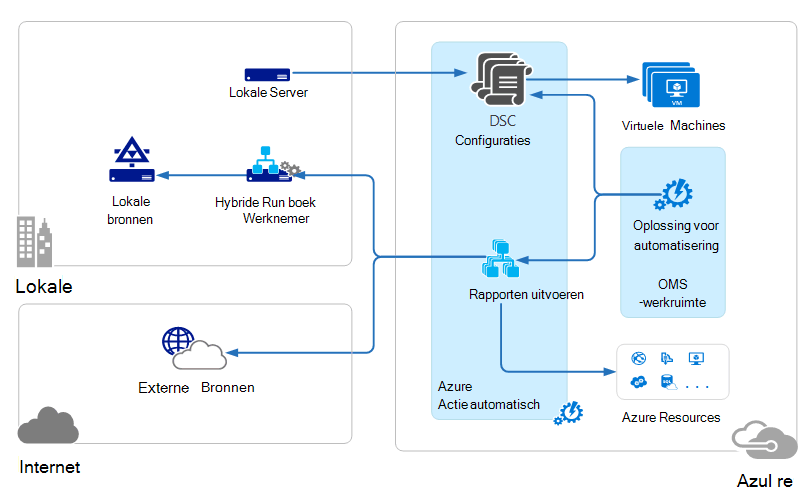
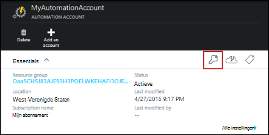
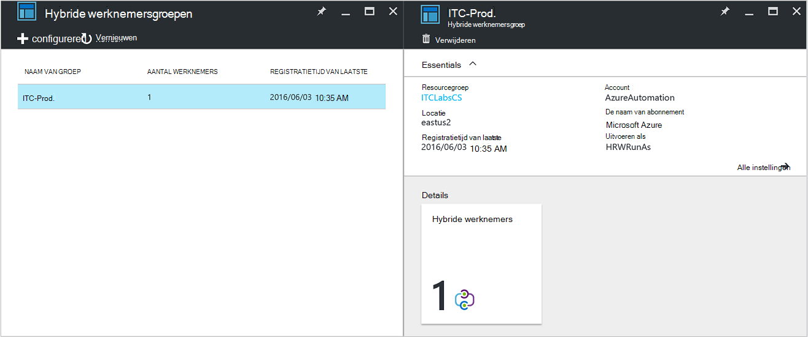
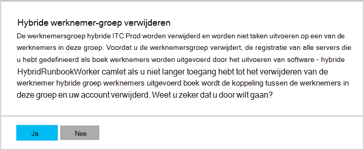

<properties
   pageTitle="Azure automatisering hybride Runbook werknemers | Microsoft Azure"
   description="Dit artikel bevat informatie over de installatie en het gebruik van hybride Runbook werknemer een functie van Azure automatisering die u kunt runbooks uitvoeren op computers in uw lokale Datacenter."
   services="automation"
   documentationCenter=""
   authors="mgoedtel"
   manager="jwhit"
   editor="tysonn" />
<tags
   ms.service="automation"
   ms.devlang="na"
   ms.topic="article"
   ms.tgt_pltfrm="na"
   ms.workload="infrastructure-services"
   ms.date="10/14/2016"
   ms.author="bwren" />

# Azure automatisering hybride Runbook werknemers

Runbooks in Azure automatisering heeft geen toegang tot bronnen in het midden van uw lokale gegevens omdat ze worden uitgevoerd in de Azure cloud.  De functie Hybride Runbook werknemer van Azure automatisering kunt u runbooks uitvoeren op computers die zich in uw datacenter om lokale resources te beheren. De runbooks worden opgeslagen en beheerd in Azure automatisering en vervolgens afgeleverd op de machines van een of meer op gebouwen.  

Deze functionaliteit wordt in de volgende afbeelding geïllustreerd.   

U kunt een of meer computers in uw datacenter te fungeren als een werknemer van hybride Runbook en runbooks uitvoeren van automatisering Azure aanwijzen.  Elke werknemer moet Microsoft Management Agent met een verbinding met Microsoft Operations Management Suite en de automatisering van Azure runbook omgeving.  Operations Management Suite wordt alleen gebruikt voor het installeren en onderhouden van de beheeragent en de functionaliteit van de werknemer.  De levering van runbooks en de instructie uit te voeren dat ze worden uitgevoerd door automatisering Azure.

Er zijn geen firewallvereisten inkomende ter ondersteuning van hybride Runbook werknemers. De agent op de lokale computer wordt door alle communicatie met Azure automatisering in de cloud. Wanneer een runbook wordt gestart, maakt Azure Automatisering een instructie die is opgehaald door de agent. De agent vervolgens haalt de runbook en de eventuele parameters voordat deze wordt uitgevoerd.  Ook worden alle [activa](http://msdn.microsoft.com/library/dn939988.aspx) die worden gebruikt door de runbook van Azure automatisering opgehaald.

>[AZURE.NOTE] Hybride Runbook werknemers ondersteunen momenteel geen [DSC-configuraties](automation-dsc-overview.md).

## Hybride Runbook werknemersgroepen

Elke werknemer hybride Runbook is lid van een werknemer van hybride Runbook-groep die u opgeeft bij het installeren van de agent.  Een groep een enkele agent kunt opnemen, maar u kunt meerdere agenten installeren in een groep voor hoge beschikbaarheid.

Als u een runbook op een hybride Runbook werknemer start, geeft u de groep die kan worden uitgevoerd op.  De leden van de groep zal bepalen welke werknemer wordt de aanvraag.  U kunt een bepaalde werknemer niet opgeven.

## Hybride Runbook werknemer eisen

U moet ten minste één op ruimten computer uit te voeren taken van hybride runbook aanwijzen.  Deze computer, moet het volgende:

- Windows Server 2012 of later
- Windows PowerShell 4.0 of hoger
- Minimaal twee cores en 4 GB RAM-geheugen

Houd rekening met de volgende aanbevelingen voor hybride werknemers: 

- Toewijzen meerdere hybride werknemers in elke groep voor hoge beschikbaarheid.  
- Hybride werknemers kunnen naast Service Management automatisering of System Center Orchestrator runbook servers.
- Overweeg het gebruik van een computer die zich fysiek in of in de buurt van de regio van uw account automatisering aangezien de taakgegevens terug naar Azure automatisering wordt verzonden wanneer een taak is voltooid.

>[AZURE.NOTE] Werknemer van hybride Runbook versie 7.2.11136.0 ondersteuning op dit moment communicatie via een proxyserver alleen met PowerShell-scripts.  Ondersteuning voor de werkstroom PowerShell scripts zijn beschikbaar in een toekomstige versie.  

### Proxy- en firewall-instellingen configureren

Voor de lokale hybride Runbook werknemer verbinding maken met en registreren bij de service Microsoft Operations Management Suite (OMS), moet deze toegang hebben tot het poortnummer en de URL's die hieronder worden beschreven.  Dit is naast de [poorten en URL's die zijn vereist voor de Microsoft Agent Monitoring](../log-analytics/log-analytics-proxy-firewall.md#configure-proxy-and-firewall-settings-with-the-microsoft-monitoring-agent) met OMS. Als u een proxyserver voor de communicatie tussen de agent en de OMS-service gebruikt, moet u ervoor zorgen dat de juiste bronnen toegankelijk zijn. Als u een firewall gebruikt om toegang te beperken tot het Internet, moet u voor het configureren van uw firewall om toegang te verlenen. 

De informatie hieronder een lijst van de poort en URL's die vereist zijn voor de werknemer hybride Runbook om te communiceren met automatisering.

- Poort: Alleen TCP 443 is vereist voor uitgaande Internet-toegang
- Globale URL: *.azure-automation.net

Als u een Automation-account die is gedefinieerd voor een bepaalde regio wilt u communicatie met die regionale datacenter beperken, vindt de volgende tabel u DNS-record voor elke regio.

|**Regio**|**DNS-Record**|
|--------------|--------------|
|Zuid-centraal-Verenigde Staten|scus-jobruntimedata-Prod.-su1.azure-automation.net|
|Oost-Verenigde Staten 2|eus2-jobruntimedata-Prod.-su1.azure-automation.net|
|West-Europa|We-jobruntimedata-Prod.-su1.azure-automation.net|
|Noord-Europa|ne-jobruntimedata-Prod.-su1.azure-automation.net|
|Canada Central|CC-jobruntimedata-Prod.-su1.azure-automation.net|
|Zuid-Oost-Azië|zee-jobruntimedata-Prod.-su1.azure-automation.net|
|Centraal India|CID-jobruntimedata-Prod.-su1.azure-automation.net|
|East Japan|jpe-jobruntimedata-Prod.-su1.azure-automation.net|
|Zuidoost-Australië|ASE-jobruntimedata-Prod.-su1.azure-automation.net|

## Installeren van hybride Runbook werknemer

De volgende procedure wordt beschreven hoe u installeren en configureren van hybride Runbook werknemer.  De eerste twee stappen eenmaal uitvoeren voor uw omgeving automatisering en herhaal vervolgens de resterende stappen uit voor elke werknemer computer.

### 1. Operations Management Suite werkruimte maken

Als u nog een werkruimte Operations Management Suite, maakt u met de instructies bij het [instellen van uw werkruimte](https://technet.microsoft.com/library/mt484119.aspx). U kunt een bestaande werkruimte als u nog hebt.

### 2. automatiseringsoplossing toevoegen aan de werkruimte Operations Management Suite

Oplossingen toevoegen functionaliteit aan het Operations Management Suite.  Oplossing voor de automatisering van voegt functionaliteit toe voor Azure automatisering, inclusief ondersteuning voor de werknemer van hybride Runbook.  Wanneer u de oplossing aan de werkruimte toevoegt, wordt deze automatisch push de bestanddelen van de werknemer aan de agentcomputer die u in de volgende stap installeren wilt.

Volg de instructies op het [toevoegen van een oplossing met behulp van de galerie met oplossingen](../log-analytics/log-analytics-add-solutions.md) **de automatiseringsoplossing** toevoegen aan uw werkruimte Operations Management Suite.

### 3. Installeer de Microsoft Agent controleren

Microsoft Monitoring Agent verbindt computers met Operations Management Suite.  Wanneer u de agent op uw computer op gebouwen installeren en deze aan op uw werkruimte sluit, worden de onderdelen die vereist zijn voor hybride Runbook werknemer automatisch gedownload.

Volg de instructies op [verbinding maken met Windows-computers aanmelden Analytics](../log-analytics/log-analytics-windows-agents.md) de agent installeren op de computer op gebouwen.  U kunt Herhaal dit proces voor meerdere computers kunnen meerdere werknemers toevoegen aan uw omgeving.

Wanneer de agent is met het Operations Management Suite verbonden, zal deze worden vermeld op het tabblad **Bronnen verbonden** aan het deelvenster Operations Management Suite **Instellingen** .  U kunt controleren dat de agent correct oplossing voor de automatisering heeft gedownload wanneer er een map met de naam **AzureAutomationFiles** in C:\Program Files\Microsoft controleren Agent\Agent.  Controleer de versie van de hybride Runbook werknemer, u kunt navigeren naar C:\Program Files\Microsoft toezicht Agent\Agent\AzureAutomation\ en onder de \\ *versie* submap.   

### 4. Installeer de runbook omgeving en verbinding maken met Azure automatisering

Wanneer u een agent aan Operations Management Suite toevoegt, duwt de automatiseringsoplossing beneden de **HybridRegistration** PowerShell-module met de cmdlet **Add-HybridRunbookWorker** .  Met deze cmdlet kunt u de omgeving van de runbook op de computer installeren en registreren met Azure automatisering.

Open een PowerShell-sessie in de Administrator-modus en voer de volgende opdrachten voor het importeren van de module.

    cd "C:\Program Files\Microsoft Monitoring Agent\Agent\AzureAutomation\<version>\HybridRegistration"
    Import-Module HybridRegistration.psd1

Voer de cmdlet **Add-HybridRunbookWorker** is met de volgende syntaxis:

    Add-HybridRunbookWorker –Name <String> -EndPoint <Url> -Token <String>

U kunt de vereiste informatie voor deze cmdlet uit de blade **Sleutels beheren** in de portal Azure.  Deze blade openen door te klikken op het pictogram sleutel in het paneel elementen voor de rekening van de automatisering.

- **Is de naam van de groep werknemers van hybride Runbook.** Als deze groep al in de automatisering bestaat, is vervolgens de huidige computer toegevoegd.  Als deze niet bestaat nog, wordt deze toegevoegd.
- **Eindpunt** is het **URL** -veld in de blade **Sleutels beheren** .
- **Token** is de **Primaire sleutel van Access** in de blade **Sleutels beheren** .  

Gebruik de **-uitgebreide** schakelen met **Add-HybridRunbookWorker** voor gedetailleerde informatie over de installatie.

### 5. Installeer de PowerShell-modules

Runbooks kunt u elk van de activiteiten en de cmdlets die zijn gedefinieerd in de modules die zijn geïnstalleerd in uw omgeving Azure automatisering.  Deze modules worden niet automatisch geïmplementeerd op computers voor gebouwen, zodat u handmatig moet installeren.  De uitzondering is de Azure module die is geïnstalleerd standaard toegang tot cmdlets voor alle Azure diensten en activiteiten voor het automatiseren van Azure.

Aangezien het primaire doel van de functie Hybride Runbook werknemer beheren lokale bronnen, moet u waarschijnlijk de modules die deze bronnen voor ondersteuning te installeren.  U kunt verwijzen naar [Modules installeren](http://msdn.microsoft.com/library/dd878350.aspx) voor informatie over het installeren van Windows PowerShell-modules.

## Verwijderen van hybride Runbook werknemer

U kunt een of meer hybride Runbook werknemers uit een groep verwijderen of afhankelijk van uw vereisten kunt u de groep verwijderen.  U verwijdert een hybride Runbook werknemer vanaf een computer in de lokalen, een PowerShell-sessie openen in de Administrator-modus en voert u de volgende opdracht - cmdlet **Verwijderen HybridRunbookWorker** .  Gebruik de **-uitgebreide** voor een gedetailleerd logboek van het verwijderingsproces overschakelen. 

Dit verwijdert niet de Agent Microsoft bewaking van de computer, alleen de functionaliteit en de configuratie van de rol van hybride Runbook werknemer.  

Een als groep wilt verwijderen, moet u eerst de hybride Runbook werknemer vanaf elke computer die lid is van de groep met behulp van de bovenstaande opdracht verwijderen en voer de volgende stappen uit om de groep te verwijderen.  

1. Open de account automatisering in Azure portal.
2. Selecteer de tegel **Werknemersgroepen hybride** en selecteer de groep die u wilt verwijderen in de blade **Werknemersgroepen hybride** .  Na het selecteren van de specifieke groep wordt de blade **hybride werknemersgroep** eigenschappen weergegeven.     
3. Op het blad van de eigenschappen voor de geselecteerde groep, klikt u op **verwijderen**.  Een bericht weergegeven waarin u deze actie te bevestigen en klik op **Ja** als u weet zeker dat u wilt doorgaan.    Dit proces kan enige seconden duren en u kunt de voortgang van de **meldingen** bijhouden in het menu.  

## Runbooks starten op hybride Runbook werknemer

[Starten van een Runbook in Azure automatisering](automation-starting-a-runbook.md) beschrijft verschillende methoden voor het starten van een runbook.  Hybride Runbook werknemer wordt toegevoegd een optie voor de **RunOn** waarin u de naam van een groep van hybride Runbook werknemer kunt opgeven.  Als een groep is opgegeven, is de runbook de opgehaald en uitgevoerd door de werknemers in die groep.  Als deze optie niet is opgegeven, wordt deze uitgevoerd in Azure automatisering normaal.

Wanneer u een runbook in de Azure portal start, u krijgt een optie voor het **uitvoeren van** waar u kunt selecteren, **Azure** of **Hybride werknemer**.  Als u een **Hybride werknemer**selecteert, kunt u de groep selecteren in een vervolgkeuzelijst.

De **RunOn** parameter kunt u de volgende opdracht om te starten, een runbook met de naam Test-Runbook op een hybride Runbook werknemer groep met de naam MyHybridGroup met Windows PowerShell gebruiken.

    Start-AzureRmAutomationRunbook –AutomationAccountName "MyAutomationAccount" –Name "Test-Runbook" -RunOn "MyHybridGroup"

>[AZURE.NOTE] De parameter **RunOn** is toegevoegd aan de cmdlet **Start AzureAutomationRunbook** in versie 0.9.1 van Microsoft Azure PowerShell.  U moet [de meest recente versie](https://azure.microsoft.com/downloads/) hebt u eerder een geïnstalleerd.  U hoeft deze versie te installeren op een werkstation waarop u de runbook van Windows PowerShell eerste.  U hoeft niet te installeren op de computer van de werknemer, tenzij u van plan bent een runbooks vanaf de computer start.  U starten niet op dit moment een runbook op een hybride Runbook werknemer van een andere runbook omdat dit zou betekenen dat de nieuwste versie van Azure Powershell in uw account automatisering kunnen worden geïnstalleerd.  De meest recente versie wordt automatisch bijgewerkt in Azure automatisering en automatisch omlaag gedrukt om de werknemers te snel.

## Machtigingen voor Runbook

Runbooks waarop een werknemer hybride Runbook niet de dezelfde [methode die meestal voor runbooks gebruikt wordt worden geverifieerd bij bronnen Azure](automation-configuring.md#configuring-authentication-to-azure-resources) gebruiken aangezien zij toegang bronnen buiten de Azure tot.  De runbook kan een eigen verificatie tot lokale bronnen bieden of kunt u een account RunAs om een gebruikerscontext voor alle runbooks.

### Verificatie van Runbook

Standaard wordt runbooks uitgevoerd in de context van de lokale systeemaccount op de computer in de ruimten zodat bronnen die zij toegang tot hun eigen verificatie moet bieden.  

[Referentie](http://msdn.microsoft.com/library/dn940015.aspx) en [certificaat](http://msdn.microsoft.com/library/dn940013.aspx) activa kunt u in uw runbook met de cmdlets waarmee u referenties opgeven, zodat bij verschillende bronnen kan worden geverifieerd.  In het volgende voorbeeld ziet u een deel van een runbook dat een computer wordt opnieuw opgestart.  Deze referenties worden opgehaald van een activum referenties en de naam van de computer uit de activa van een variabele en gebruikt vervolgens deze waarden met de cmdlet Computer opnieuw opstarten.

    $Cred = Get-AzureRmAutomationCredential -ResourceGroupName "ResourceGroup01" -Name "MyCredential"
    $Computer = Get-AzureRmAutomationVariable -ResourceGroupName "ResourceGroup01" -Name  "ComputerName"

    Restart-Computer -ComputerName $Computer -Credential $Cred

U kunt ook gebruikmaken van [InlineScript](automation-powershell-workflow.md#inline-script) , waarmee u kunt blokken code uitvoeren op een andere computer met referenties die zijn opgegeven door de [algemene PSCredential-parameter](http://technet.microsoft.com/library/jj129719.aspx).

### RunAs-account

In plaats van runbooks hun eigen verificatie tot lokale bronnen, kunt u een account **RunAs** voor een hybride werknemersgroep.  U een [activum referenties](automation-credentials.md) toegang tot lokale bronnen en alle runbooks onder deze referenties wordt uitgevoerd wanneer een werknemer hybride Runbook in de groep wordt uitgevoerd.  

De gebruikersnaam voor de referenties moet zijn in een van de volgende indelingen:

- domein\gebruikersnaam 
- username@domain
- gebruikersnaam (voor accounts die lokaal op de computer op ruimten)

Gebruik de volgende procedure om op te geven voor een hybride werknemersgroep een RunAs-account:

1. Maak een [referentie actief](automation-credentials.md) met toegang tot lokale bronnen.
2. Open de account automatisering in Azure portal.
2. Selecteer de tegel **Werknemersgroepen hybride** en selecteer vervolgens de groep.
3. Selecteer **alle instellingen** en **instellingen van hybride werknemer**.
4. Wijzigen **uitvoeren als** van het **standaard** in **aangepast**.
5. Selecteer de referentie en klik op **Opslaan**.

## Runbooks maken voor hybride Runbook werknemer

Er is geen verschil in de structuur van de runbooks die worden uitgevoerd in Azure automatisering en die op een werknemer van hybride Runbook. Runbooks die u kunt met elk gebruiken zal waarschijnlijk aanzienlijk verschillen maar sinds runbooks voor hybride Runbook werknemer meestal lokale resources in uw datacenter beheren wordt terwijl de runbooks in Azure automatisering meestal bronnen in de Azure cloud beheren. 

Kunt u een runbook voor hybride Runbook werknemer in Azure automatisering, maar moet u mogelijk problemen als u probeert te testen van de runbook in de editor.  De PowerShell-modules toegang krijgen tot lokale bronnen is mogelijk niet geïnstalleerd in uw omgeving Azure automatisering in welk geval de test zou mislukken.  Als u de vereiste modules installeert, wordt de runbook uitgevoerd, maar deze worden niet toegang krijgen tot lokale bronnen voor een volledige test.

## Problemen met runbooks op hybride Runbook werknemer

[Uitvoer van de Runbook en de berichten](automation-runbook-output-and-messages.md) worden verzonden naar Azure automatisering van hybride werknemers net als runbook taken uitvoeren in de cloud.  Ook kunt u de streams uitgebreid en de voortgang van de dezelfde manier als voor andere runbooks.  

Logboeken worden lokaal opgeslagen op elke werknemer hybride op C:\ProgramData\Microsoft\System Center\Orchestrator\7.2\SMA\Sandboxes.

Bekijk het artikel voor het oplossen van problemen als uw runbooks niet met succes maken van de verbinding en de taak-overzicht de status van de **onderbroken wordt**, [hybride Runbook werknemer: een runbook taak wordt beëindigd met de status onderbroken](automation-troubleshooting-hrw-runbook-terminates-suspended.md).   

## Relatie met de automatisering van Service Management

[Service Management automatisering (SMA)](https://technet.microsoft.com/library/dn469260.aspx) kunt u de dezelfde runbooks die worden ondersteund door Azure automatisering in uw lokale Datacenter wordt uitgevoerd. SMA is over het algemeen geïmplementeerd met Windows Azure Pack, Windows Azure Pack bevat een grafische interface voor het beheer van SMA. In tegenstelling tot Azure automatisering, SMA, moet u een lokale met webservers die als host voor de API, een database bevatten runbooks en SMA configuratie en Runbook werknemers uit te voeren taken runbook. Azure automatisering biedt deze services in de cloud en alleen moet u de hybride Runbook werknemers in uw lokale omgeving te onderhouden.

Als u een bestaande SMA-gebruiker bent, kunt u uw runbooks kunt verplaatsen naar Azure automatisering met hybride Runbook werknemer zonder wijzigingen gebruikt, ervan uitgaande dat ze hun eigen bronnen als verificatie uitvoeren die zijn beschreven in [runbooks voor hybride Runbook werknemer maken](#creating-runbooks-for-hybrid-runbook-worker).  Runbooks in SMA uitgevoerd in het kader van de service-account op de server werknemer die dat de verificatie voor de runbooks voorschrijven.

U kunt de volgende criteria om te bepalen of Azure automatisering met hybride Runbook werknemer of Service Management automatisering meer geschikt voor uw behoeften is.

- SMA moet een lokale installatie van de onderliggende onderdelen die zijn verbonden met Windows Azure Pack als een grafische beheerinterface vereist is. Met hogere onderhoudskosten dan Azure automatisering die alleen een agent is geïnstalleerd op de lokale runbook werknemers dient meer lokale bronnen nodig. De agents die worden beheerd door Operations Management Suite de onderhoudsposten de kosten verder te verlagen.
- Azure automatisering wordt de runbooks opgeslagen in de cloud en biedt ze aan voor bedrijfsruimten hybride Runbook werknemers. Als u het beveiligingsbeleid niet mogelijk dit probleem is, moet u SMA gebruiken.
- SMA is opgenomen in System Center; en daarom is een System Center 2012 R2-licentie vereist. Azure automatisering is gebaseerd op een abonnementsmodel doorverbonden.
- Azure automatisering beschikt over geavanceerde functies zoals grafische runbooks die niet beschikbaar in SMA zijn.

## Volgende stappen

- Zie voor meer informatie over de verschillende methoden die kunnen worden gebruikt voor het starten van een runbook, [een Runbook in Azure Automatisering gestart](automation-starting-a-runbook.md)
- Zie [een Runbook in Azure automatisering bewerken](automation-edit-textual-runbook.md) inzicht in de verschillende procedures voor het werken met PowerShell en PowerShell Workflow runbooks in Azure automatisering met behulp van de tekst-editor

 
