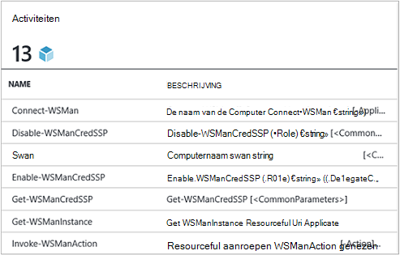
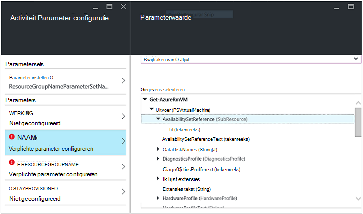
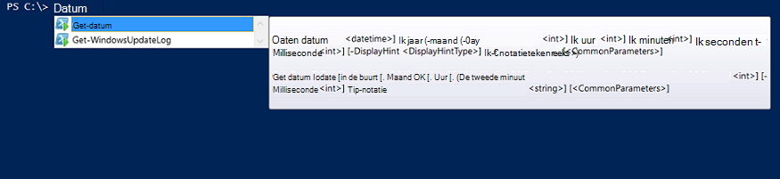

<properties
   pageTitle="Een Azure Automation integratiemodule maken | Microsoft Azure"
   description="Zelfstudie die helpt u bij het maken, testen en voorbeeld gebruik van integratiemodules in Azure automatisering."
   services="automation"
   documentationCenter=""
   authors="mgoedtel"
   manager="jwhit"
   editor="" />

<tags
   ms.service="automation"
   ms.workload="tbd"
   ms.tgt_pltfrm="na"
   ms.devlang="na"
   ms.topic="get-started-article"
   ms.date="09/12/2016"
   ms.author="magoedte" />

# <a name="azure-automation-integration-modules"></a>Modules voor Azure automatisering-integratie

PowerShell is de fundamentele technologie achter Azure automatisering. Aangezien Azure automatisering op PowerShell is gebouwd, zijn PowerShell modules sleutel tot de uitbreidbaarheid van Azure automatisering. In dit artikel hebben begeleidt we u bij de specifieke kenmerken van het gebruik van Azure automatisering van PowerShell-modules 'Integratiemodules' en aanbevolen procedures voor het maken van uw eigen modules PowerShell om ervoor te zorgen dat ze werken als integratiemodules in Azure-automatisering genoemd. 

## <a name="what-is-a-powershell-module"></a>Wat is een PowerShell Module?

Een module PowerShell is een groep van PowerShell cmdlets, zoals **Get datum** of **Item kopiëren**, die kan worden gebruikt vanuit de console PowerShell scripts, werkstromen, runbooks en PowerShell DSC bronnen zoals WindowsFeature of bestand, dat kan worden gebruikt vanuit PowerShell DSC-configuraties. Elke cmdlet/DSC-bron wordt gesteund door een module PowerShell en de functionaliteit van PowerShell cmdlets en DSC-bronnen is via veel van die worden geleverd met PowerShell zelf. Bijvoorbeeld de cmdlet **Get-datum** is onderdeel van de module Microsoft.PowerShell.Utility PowerShell en cmdlet **Item kopiëren** maakt deel uit van de module Microsoft.PowerShell.Management PowerShell en het pakket DSC resource deel uitmaakt van de module PSDesiredStateConfiguration PowerShell. Beide van deze modules geleverd met PowerShell. Maar veel PowerShell-modules niet geleverd als onderdeel van PowerShell en in plaats daarvan worden verdeeld met de eerste of derde partij producten zoals System Center 2012 Configuration Manager of door de enorme Gemeenschap PowerShell op plaatsen zoals de galerie met PowerShell.  De modules zijn handig omdat ze eenvoudiger complexe taken via ingekapselde functionaliteit.  U kunt meer informatie over [PowerShell modules op MSDN](https://msdn.microsoft.com/library/dd878324%28v=vs.85%29.aspx). 

## <a name="what-is-an-azure-automation-integration-module"></a>Wat is een integratiemodule Azure automatisering?

Een integratiemodule is niet heel anders dan een PowerShell-module. Zijn gewoon een PowerShell-module met desgewenst een extra bestand - een bestand met metagegevens opgeven van een verbindingstype Azure automatisering kan worden gebruikt bij de cmdlets van de module in runbooks. Optioneel bestand of niet, deze PowerShell modules kunnen worden geïmporteerd in Azure automatisering hun cmdlets beschikbaar maken voor gebruik in runbooks en hun DSC-bronnen beschikbaar voor gebruik binnen DSC-configuraties. Achter de schermen, Azure automatisering slaat deze modules en laadt deze taak runbook en uitvoeringstijd DSC compiliation in de Azure automatisering sandboxen waar runbooks worden uitgevoerd en DSC-configuraties worden gecompileerd.  DSC bronnen in modules worden ook automatisch geplaatst op de automatisering DSC pull-server, zodat deze kunnen worden opgevraagd door machines probeert toe te passen DSC-configuraties.  We verzenden een aantal Azure PowerShell modules uit de doos in Azure automatisering kunt gebruiken, zodat u kunt aan de slag meteen Azure management automatiseren, maar kunt u eenvoudig PowerShell modules voor welke systeem, service of gereedschap dat u integreren wilt met importeren. 

>[AZURE.NOTE] Bepaalde modules worden als "globale modules" in de automatisering-service verzonden. Deze globale modules zijn beschikbaar voor u uit de doos als u een automation-account maken en we ze soms bijwerken die automatisch uit naar de rekening van de automatisering duwt. Als u niet dat ze automatisch worden bijgewerkt wilt, kunt u altijd importeren dezelfde module zelf en die voorrang boven de algemene moduleversie van die module die we in de service verzenden. 

De indeling waarin u een pakket integratiemodule importeren is een gecomprimeerd bestand met dezelfde naam als de module en de extensie. Het bevat de module Windows PowerShell en alle ondersteunende bestanden, met inbegrip van een manifestbestand (.psd1) als de module is.

Als de module een verbindingstype Azure automatisering bevat, moet ook het bevatten een bestand met de naam *<ModuleName>*-Automation.json die de eigenschappen van het type verbinding aangeeft. Dit is een json-bestand in de map module van uw gecomprimeerde ZIP-bestand geplaatst en de velden van een 'connection' bevat dat is vereist voor verbinding met het systeem of de service die de module vertegenwoordigt. Dit zal uiteindelijk een verbindingstype maken in Azure automatisering. Met dit bestand kunt u instellen dat de veldnamen typt, en of de velden moeten worden gecodeerd en / of optioneel zijn, voor het verbindingstype van de module. Dit is een sjabloon in de json-indeling:

```
{ 
   "ConnectionFields": [
   {
      "IsEncrypted":  false,
      "IsOptional":  false,
      "Name":  "ComputerName",
      "TypeName":  "System.String"
   },
   {
      "IsEncrypted":  false,
      "IsOptional":  true,
      "Name":  "Username",
      "TypeName":  "System.String"
   },
   {
      "IsEncrypted":  true,
      "IsOptional":  false,
      "Name":  "Password",
   "TypeName":  "System.String"
   }],
   "ConnectionTypeName":  "DataProtectionManager",
   "IntegrationModuleName":  "DataProtectionManager"
}
```

Als u de Service Management automatisering hebt geïmplementeerd en integratiemodules pakketten voor uw automatisering runbooks gemaakt, dit er erg bekend ziet. 


## <a name="authoring-best-practices"></a>Aanbevolen procedures schrijven

Omdat integratiemodules in feite PowerShell modules zijn, dat betekent niet dat we niet beschikken over een reeks procedures om ze te ontwerpen. Er is nog een aantal dingen u aangeraden tijdens het ontwerpen van een module met PowerShell, zodat het meest bruikbaar in Azure automatisering toe. Enkele voorbeelden hiervan zijn specifieke Azure-automatisering en sommige van hen zijn handig is net om de modules werken goed in PowerShell Workflow, ongeacht of u automatisering gebruikt. 

1. Bevatten een overzicht, beschrijving en help URI voor elke cmdlet in de module. PowerShell kunt u bepaalde help-informatie voor de cmdlets zodat de gebruiker om hulp over het gebruik van deze met de cmdlet **Get-Help** te krijgen. Bijvoorbeeld, is hier het definiëren van een samenvatting en URI help voor een module PowerShell is geschreven in een .psm1-bestand.<br>  

    ```
    <#
        .SYNOPSIS
         Gets all outgoing phone numbers for this Twilio account 
    #>
    function Get-TwilioPhoneNumbers {
    [CmdletBinding(DefaultParameterSetName='SpecifyConnectionFields', `
    HelpUri='http://www.twilio.com/docs/api/rest/outgoing-caller-ids')]
    param(
       [Parameter(ParameterSetName='SpecifyConnectionFields', Mandatory=$true)]
       [ValidateNotNullOrEmpty()]
       [string]
       $AccountSid,

       [Parameter(ParameterSetName='SpecifyConnectionFields', Mandatory=$true)]
       [ValidateNotNullOrEmpty()]
       [string]
       $AuthToken,

       [Parameter(ParameterSetName='UseConnectionObject', Mandatory=$true)]
       [ValidateNotNullOrEmpty()]
       [Hashtable]
       $Connection
    )

    $cred = CreateTwilioCredential -Connection $Connection -AccountSid $AccountSid -AuthToken $AuthToken

    $uri = "$TWILIO_BASE_URL/Accounts/" + $cred.UserName + "/IncomingPhoneNumbers"
    
    $response = Invoke-RestMethod -Method Get -Uri $uri -Credential $cred

    $response.TwilioResponse.IncomingPhoneNumbers.IncomingPhoneNumber
    }
    ```
<br> 
Mits deze info niet alleen deze help via de cmdlet **Get-Help** in de PowerShell-console weergegeven, zal het ook deze help-functionaliteit in Azure automatisering, bijvoorbeeld bij het invoegen van activiteiten tijdens het ontwerpen van runbook worden blootgesteld. Op 'Gedetailleerde help weergeven', wordt de URI van de help geopend in een ander tabblad van de webbrowser die u gebruikt voor toegang tot Azure automatisering.<br>
2. Als de module wordt uitgevoerd op een extern systeem een. Een integratiemodule metagegevens-bestand waarin de gegevens die nodig zijn voor de verbinding met een extern systeem, wat betekent dat het verbindingstype moet bevatten. b. Elke cmdlet in de module moet kunnen nemen in een connection-object (een instantie van dat verbindingstype) als een parameter.  
    Cmdlets in de module in Azure automatisering gebruiken als u een object met de velden van het verbindingstype wordt doorgegeven als parameter aan de cmdlet eenvoudiger geworden. Deze manier-gebruikers hebben geen parameters van de verbinding actief toewijzen aan de bijbehorende parameters van de cmdlet elke keer dat ze een cmdlet. Op basis van het bovenstaande voorbeeld van runbook, wordt een Twilio-verbinding actief CorpTwilio aangeroepen voor toegang tot Twilio en de telefoonnummers op de rekening terug.  U ziet hoe het de velden van de verbinding is toegewezen aan de parameters van de cmdlet?<br>

    ```
    workflow Get-CorpTwilioPhones
    {
      $CorpTwilio = Get-AutomationConnection -Name 'CorpTwilio'
    
      Get-TwilioPhoneNumbers 
        -AccountSid $CorpTwilio.AccountSid  
        -AuthToken $CorptTwilio.AuthToken
    }
    ```
<br>
Een eenvoudiger en beter manier deze benadering is het connection-object rechtstreeks doorgeven aan de cmdlet-

    ```
    workflow Get-CorpTwilioPhones
    {
      $CorpTwilio = Get-AutomationConnection -Name 'CorpTwilio'

      Get-TwilioPhoneNumbers -Connection $CorpTwilio
    }
    ```
<br>
Gedrag als volgt voor de cmdlets kunt u door een connection-object rechtstreeks als een parameter, in plaats van alleen verbinding velden voor parameters accepteren. Meestal zult u een parameter is ingesteld voor elk, zodat een gebruiker niet met Azure automatisering kunt de cmdlets zonder een hash-tabel als het connection-object maken. **SpecifyConnectionFields** hieronder wordt gebruikt voor de verbinding geeft de eigenschappen van een door een parameter is ingesteld. **UseConnectionObject** kunt u de verbinding via rechte doorgeven. Zoals u zien kunt, kunt u de cmdlet Send-TwilioSMS in de [module Twilio PowerShell](https://gallery.technet.microsoft.com/scriptcenter/Twilio-PowerShell-Module-8a8bfef8) in beide gevallen worden doorgegeven: 

    ```
    function Send-TwilioSMS {
      [CmdletBinding(DefaultParameterSetName='SpecifyConnectionFields', `
      HelpUri='http://www.twilio.com/docs/api/rest/sending-sms')]
      param(
         [Parameter(ParameterSetName='SpecifyConnectionFields', Mandatory=$true)]
         [ValidateNotNullOrEmpty()]
         [string]
         $AccountSid,

         [Parameter(ParameterSetName='SpecifyConnectionFields', Mandatory=$true)]
         [ValidateNotNullOrEmpty()]
         [string]
         $AuthToken,

         [Parameter(ParameterSetName='UseConnectionObject', Mandatory=$true)]
         [ValidateNotNullOrEmpty()]
         [Hashtable]
         $Connection

       )
    }
    ```
<br>
3. Het uitvoertype voor alle cmdlets definiëren in de module. Een definitietype uitvoer van een cmdlet kunt IntelliSense ontwerpmodus kunt u de eigenschappen van de uitvoer van de cmdlet, voor gebruik tijdens het ontwerpen. Dit is vooral handig tijdens het automatisering runbook grafische ontwerpen, waarbij design tijd kennis is de sleutel tot een eenvoudige gebruikerservaring met de module.<br> <br> Dit is vergelijkbaar met de functie "vooruit type" van de uitvoer van een cmdlet in PowerShell ISE zonder uit te voeren.<br> <br>
4. Cmdlets in de module neemt complexe objecttypen voor parameters. PowerShell Workflow verschilt van PowerShell in die complexe gegevenstypen wordt opgeslagen in het formulier gedeserialiseerd. Primitieve typen als primitieven blijven, maar complexe gegevenstypen worden geconverteerd naar hun gedeserialiseerd versies, in feite eigenschap zakken zijn. Als u de cmdlet **Get-proces** in een runbook (of een werkstroom PowerShell overigens) gebruikt, zou er bijvoorbeeld een object van het type [Deserialized.System.Diagnostic.Process], niet het verwachte type [System.Diagnostic.Process] geretourneerd. Dit type heeft dezelfde eigenschappen als het type niet gedeserialiseerd, maar geen van de methoden. En als u deze waarde als parameter doorgeven aan een cmdlet, waar de cmdlet een [System.Diagnostic.Process]-waarde voor deze parameter is vereist, ontvangt u de volgende fout: *argument transformatie op de parameter 'process' kan niet worden verwerkt. Fout: "de waarde 'System.Diagnostics.Process (CcmExec)' van het type 'Deserialized.System.Diagnostics.Process', typt u 'System.Diagnostics.Process' kan niet converteren.*   Dit is omdat er een niet overeenkomt met de verwachte [System.Diagnostic.Process]-type en de opgegeven [Deserialized.System.Diagnostic.Process]. De manier om dit probleem is om ervoor te zorgen dat de cmdlets van de module complexe gegevenstypen voor parameters worden pas van kracht. Hier is de verkeerde manier om het te doen.

    ```
    function Get-ProcessDescription {
      param (
            [System.Diagnostic.Process] $process
      )
      $process.Description
    }
    ``` 
<br>
En hier is de juiste manier, waarbij in een primitieve die worden intern door de cmdlet gebruikt kan pak complexe object en het gebruik. Daar worden uitgevoerd in de context van de PowerShell cmdlets, niet PowerShell Workflow binnen de cmdlet $process, wordt het juiste type van [System.Diagnostic.Process].  

    ```
    function Get-ProcessDescription {
      param (
            [String] $processName
      )
      $process = Get-Process -Name $processName

      $process.Description
    }
    ```
<br>
Verbinding activa in runbooks zijn hashtabellen die een complexe type zijn, en nog deze hashtabellen lijkt te kunnen worden doorgegeven naar de cmdlets voor hun – de parameter perfect, met geen uitzondering cast. Technisch, sommige typen PowerShell kunnen goed gecast uit hun geserialiseerde vorm aan hun gedeserialiseerd formulier, en dus kunnen worden doorgegeven naar cmdlets voor aanvaarding van het gedeserialiseerde type niet - parameters. Hash-tabel is een van de volgende. Het is mogelijk voor een module van de auteur gedefinieerde typen moet worden geïmplementeerd op een manier die ze ook goed kunnen deserialisatie, maar er zijn sommige gebruik te maken van systeembronnen. Het type moet beschikken over een standaardconstructor, hebben alle openbare eigenschappen en een PSTypeConverter. Voor reeds gedefinieerde typen die niet de eigenaar is de auteur van de module, er is echter geen manier om "fix", aldus de aanbeveling om te voorkomen dat complexe gegevenstypen voor parameters bij elkaar. Runbook schrijven tip: als voor sommige reden cmdlets hoeft te nemen van een complex typeparameter, of als u van iemand anders module die een complexe typeparameter is vereist, de tijdelijke oplossing in PowerShell Workflow, runbooks en PowerShel Workflows in lokale PowerShell, is de cmdlet die genereert het complexe type en de cmdlet verbruikt het complexe type in dezelfde activiteit InlineScript doorloopt. Aangezien InlineScript wordt de inhoud ervan als PowerShell in plaats van PowerShell Workflow uitgevoerd, zou de cmdlet genereren van het complexe type dat juiste type, niet de gedeserialiseerd complexe type produceren.
5. Alle cmdlets in de module stateless maken. PowerShell-werkstroom wordt uitgevoerd elke cmdlet genoemd in de workflow in een andere sessie. Dit betekent dat alle cmdlets die afhankelijk van de sessiestatus gemaakt zijn / gewijzigd door andere cmdlets in dezelfde module werkt niet in de PowerShell Workflow runbooks.  Hier volgt een voorbeeld van wat niet te doen.

    ```
    $globalNum = 0
    function Set-GlobalNum {
       param(
           [int] $num
       )
      
       $globalNum = $num
    }
    function Get-GlobalNumTimesTwo {
       $output = $globalNum * 2
     
       $output
    }
    ```
<br>
6. De module moet volledig zijn opgenomen in een Xcopy kunnen pakket. Omdat Azure automatisering modules worden verdeeld over de sandboxen automatisering als runbooks wilt uitvoeren, moeten ze werken onafhankelijk van de host die op uitvoert. Dit houdt in dat u kunnen Zip moet het pakket module verplaatsen naar een andere host met de PowerShell dezelfde of een nieuwere versie en het functioneren als normale wanneer geïmporteerd in PowerShell-omgeving van de host. Om dat te gebeuren, de module niet afhankelijk zijn geen bestanden buiten de module (de map die u bij het importeren in Azure automatisering van haalt ingepakte) of een unieke registerinstellingen op een host, zoals die door de installatie van een product. Als dit het beste niet wordt gevolgd, meer de module niet bruikbaar zijn in Azure automatisering.  

## <a name="next-steps"></a>Volgende stappen

- Om te beginnen met PowerShell workflow runbooks, Zie [Mijn eerste PowerShell workflow runbook](automation-first-runbook-textual.md)
- Zie voor meer informatie over het maken van PowerShell-Modules, [het schrijven van een Windows PowerShell-Module](https://msdn.microsoft.com/library/dd878310%28v=vs.85%29.aspx)