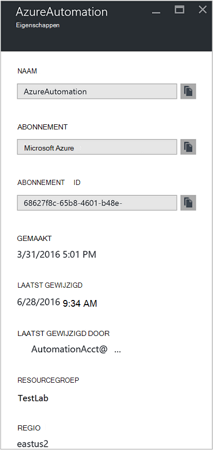
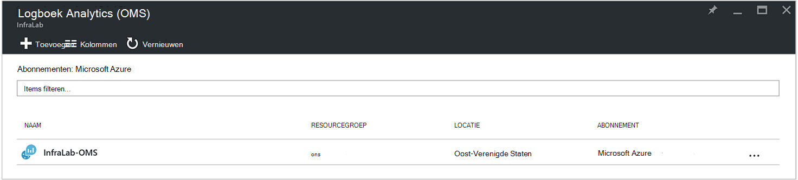
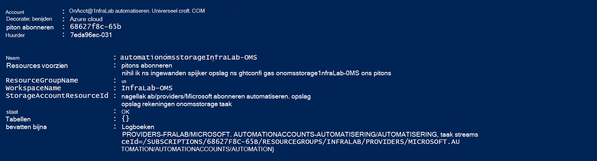
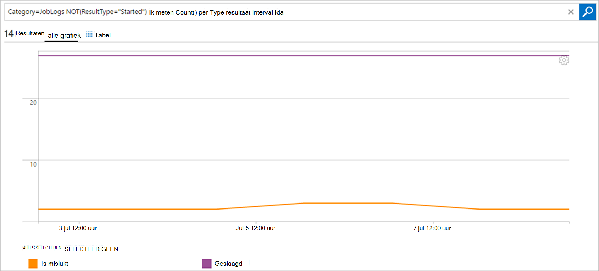

<properties
    pageTitle="Taakstatus en taak streams van doorsturen automatisering logboek Analytics (OMS) | Microsoft Azure"
    description="In dit artikel wordt beschreven hoe taakstatus en runbook stromen taak verzenden naar Microsoft Operations Management Suite logboek Analytics bieden meer inzicht en beheer."
    services="automation"
    documentationCenter=""
    authors="MGoedtel"
    manager="jwhit"
    editor="tysonn" />
<tags
    ms.service="automation"
    ms.devlang="na"
    ms.topic="article"
    ms.tgt_pltfrm="na"
    ms.workload="infrastructure-services"
    ms.date="09/22/2016"
    ms.author="magoedte" />

# Taakstatus en taak streams van doorsturen automatisering logboek Analytics (OMS)

Automatisering kunt runbook project status- en gegevensstromen verzenden naar uw werkruimte logboek Analytics van Microsoft Operations Management Suite (OMS).  Terwijl u deze informatie in het portal voor Azure of met PowerShell door de status van afzonderlijke of alle taken voor een bepaalde rekening voor automatisering bekijken kunt, geavanceerde ter ondersteuning van uw operationele vereisten, moet u voor het maken van aangepaste PowerShell scripts.  Met het logboek Anaytics kunt u nu:

- Inzicht te krijgen op uw taken automatiseren 
- Trigger is een e-mailbericht of een waarschuwing wordt gebaseerd op de status van runbook (bv. niet of onderbroken) 
- Geavanceerde query's te schrijven over uw project streams 
- Taken correleren automatisering accounts 
- Geschiedenis van de loop van de tijd te visualiseren     

## Vereisten en overwegingen voor de implementatie

Als u wilt beginnen met het verzenden van uw automatisering logboeken naar logboek Analytics, hebt u het volgende:

1. OMS-abonnement. Zie [aan de slag met Analytics logboek](../log-analytics/log-analytics-get-started.md)voor meer informatie.  

    >[AZURE.NOTE]De OMS werkruimte en account automatisering moeten in het abonnement op dezelfde Azure voor deze configuratie correct te laten werken. 
  
2. Een [account Azure opslag](../storage/storage-create-storage-account.md).  
   
    >[AZURE.NOTE]De opslag-account *moet* worden in hetzelfde gebied, als de rekening van de automatisering. 
 
3. Azure PowerShell met versie 1.0.8 of nieuwer van de cmdlets operationele inzichten. Zie voor meer informatie over deze release en deze installeren [het installeren en configureren van Azure PowerShell](../powershell-install-configure.md).
4. Azure diagnose en logboek Analytics PowerShell.  Zie voor meer informatie over deze versie en installeert u het [Diagnostische Azure en logboek Analytics](https://www.powershellgallery.com/packages/AzureDiagnosticsAndLogAnalytics/0.1).  
5. Download het PowerShell script **Inschakelen AzureDiagnostics.ps1** uit de [Galerie met PowerShell](https://www.powershellgallery.com/packages/Enable-AzureDiagnostics/1.0/DisplayScript). Dit script wordt het volgende configureren:
 - Een opslag-account voor de runbook taak de status en de stroom gegevens voor een automatisering-account die u opgeeft.
 - Het verzamelen van deze gegevens uit uw account automatisering en bewaar dit op een rekening Azure Blob storage in JSON-indeling inschakelen.
 - Configureren voor het verzamelen van de gegevens van uw account Blob storage aan OMS logboek Analytics.
 - De oplossing voor automatisering logboek Analytics uw werkruimte OMS inschakelen.   

Het script **Inschakelen AzureDiagnostics.ps1** worden de volgende parameters tijdens de uitvoering van:

- *AutomationAccountName* - de naam van de account van uw automatisering
- *LogAnalyticsWorkspaceName* - de naam van uw werkruimte OMS

Om de waarden voor *AutomationAccountName*in de Azure portal uw automatisering-account selecteert in de blade **automatisering account** en **alle instellingen**te selecteren.  In het blad **alle instellingen** onder **Accountinstellingen** , selecteer **Eigenschappen**.  U kunt deze waarden te vermelden in het blad **Eigenschappen** .  .

## Integratie met Analytics logboek instellen

1. Op uw computer, start u **Windows PowerShell** vanuit **het startscherm** .  
2. Ga naar de map waarin het script dat u hebt gedownload en uitgevoerd door de waarden voor de parameters *- AutomationAccountName* en *-LogAnalyticsWorkspaceName*vanuit de shell van de PowerShell-opdrachtregel.

    >[AZURE.NOTE] U wordt gevraagd om te verifiëren met Azure nadat u het script uitvoert.  U **moet** zich aanmelden met een account die lid is van de rol Admins abonnement en CO-beheerder van het abonnement is.   
    
        .\Enable-AzureDiagnostics -AutomationAccountName <NameofAutomationAccount> `
        -LogAnalyticsWorkspaceName <NameofOMSWorkspace> `

3. Na het uitvoeren van dit script ziet u records in logboek Analytics ongeveer 30 minuten nadat de nieuwe diagnostische gegevens worden geschreven naar de opslag.  Als er records zijn niet beschikbaar na dit tijdstip verwijst naar de sectie Probleemoplossing in [JSON bestanden in blob-opslag](../log-analytics/log-analytics-azure-storage-json.md#troubleshooting-configuration-for-azure-diagnostics-written-to-blob-in-json).

### Configuratie controleren

Om te bevestigen dat het script uw account automatisering en OMS wokspace is geconfigureerd, kunt u de volgende stappen uitvoeren in PowerShell.  Alvorens dit te doen, om de waarden voor de OMS werkruimte de naam en de Resourcegroepnaam, vanuit de portal Azure navigeren logboek Analytics (OMS) en de blade logboek Analytics (OMS) Noteer de waarde voor **de naam** en de **Resourcegroep**.   gebruiken We deze twee waarden als we controleren of de configuratie in uw OMS-werkruimte met behulp van de PowerShell-cmdlet [Get-AzureRmOperationalInsightsStorageInsight](https://msdn.microsoft.com/library/mt603567.aspx).

1.  Ga naar opslag rekeningen en zoek naar de volgende opslag account waarbij u de naamgevingsconventie - *AutomationAccountNameomsstorage*vanuit de portal Azure.  Na een runbook taak is voltooid, kort daarna ziet u twee Blob containers gemaakt - **inzichten-logboeken-joblogs** en **inzichten-logboeken-jobstreams**.  

2.  Van PowerShell, de volgende PowerShell code uitvoert, wijzigt de waarden voor de parameters **ResourceGroupName** en **Werkruimtenaam** die u gekopieerd of eerder is opgemerkt.  

    Login AzureRmAccount Get-AzureRmSubscription - SubscriptionName 'SubscriptionName' | Get set-AzureRmContext-AzureRmOperationalInsightsStorageInsight - ResourceGroupName 'OMSResourceGroupName' '-werkruimte "OMSWorkspaceName" 

    Hiermee herstelt u het inzicht van de opslag voor de opgegeven OMS-werkruimte.  We willen het inzicht van de opslag voor de automatisering-account die we eerder opgegeven aanwezig is en het **status** -object geeft een waarde van **OK**.  .

## Logboekrecords Analytics

Automatisering maakt twee typen records in de opslagplaats OMS.

### Logboeken van de taak

Eigenschap | Beschrijving|
----------|----------|
Tijd | Datum en tijd waarop de taak runbook uitgevoerd.|
resourceId | Hiermee geeft u het resourcetype in Azure.  Voor automatisering is de waarde de automatisering-account die is gekoppeld aan de runbook.|
operationName | Hiermee geeft u het type bewerking uitgevoerd in Azure.  De waarde is voor automatisering, taak.|
resultType | De status van het project runbook.  Mogelijke waarden zijn: -De slag -Gestopt -Geschorst -Is mislukt -Geslaagd|
resultDescription | Beschrijving van het resultaat van runbook taakstatus.  Mogelijke waarden zijn: -De taak is gestart -Taak is mislukt -De taak is voltooid|
CorrelationId | De GUID is de correlatie-Id van het project runbook.|
Categorie | Classificatie van het type gegevens.  Voor automatisering is de waarde JobLogs.|
RunbookName | De naam van de runbook.|
Taak-id | De GUID wordt de Id van de taak runbook.|
Beller |  Wie de bewerking heeft gestart.  Mogelijke waarden zijn een e-mailadres of een systeem voor geplande taken.|

### Taak Streams
Eigenschap | Beschrijving|
----------|----------|
Tijd | Datum en tijd waarop de taak runbook uitgevoerd.|
resourceId | Hiermee geeft u het resourcetype in Azure.  Voor automatisering is de waarde de automatisering-account die is gekoppeld aan de runbook.|
operationName | Hiermee geeft u het type bewerking uitgevoerd in Azure.  De waarde is voor automatisering, taak.|
resultType | De status van het project runbook.  Mogelijke waarden zijn: -InProgress|
resultDescription | Bevat de uitvoerstroom van de runbook.|
CorrelationId | De GUID is de correlatie-Id van het project runbook.|
Categorie | Classificatie van het type gegevens.  Voor automatisering is de waarde JobStreams.|
RunbookName | De naam van de runbook.|
Taak-id | De GUID wordt de Id van de taak runbook.|
Beller | Wie de bewerking heeft gestart.  Mogelijke waarden zijn een e-mailadres of een systeem voor geplande taken.| 
StreamType | Het type van de stroom van de taak. Mogelijke waarden zijn: -Voortgang -Uitvoer -Waarschuwing -Fout -Foutopsporing -Uitgebreide|

## Automatisering weergeven worden vastgelegd in het logboek Analytics 

Nu de logboeken van de taak automatisering verzenden naar Analytics logboek is gestart, gaan we kijken wat u kunt doen met deze logboeken in OMS.   

### Een e-mailbericht verzenden wanneer een functie runbook mislukt of wordt uitgesteld 

Een van onze grootste klant wordt gevraagd voor het verzenden van een e-mailbericht of een tekstvak wanneer er iets met de taak van een runbook misgaat.   

Een waarschuwing als regel wilt maken, begint u met het maken van een logboek zoeken naar records job runbook dat de waarschuwing moet worden aangeroepen.  De knop **Waarschuwing** zijn beschikbaar zodat u kunt maken en configureren van de waarschuwingsregel.

1.  Klik op **Logboek zoeken**vanuit de pagina OMS-overzicht.
2.  Een logboek-zoekopdracht voor uw waarschuwing door te typen in het volgende in het queryveld maken: `Category=JobLogs (ResultType=Failed || ResultType=Suspended)`.  U kunt ook groeperen op de RunbookName via: `Category=JobLogs (ResultType=Failed || ResultType=Suspended) | measure Count() by RunbookName_s`.   
  
    Als u uw werkruimte Logboeken uit meer dan één automatisering-account of -abonnement hebt ingesteld, kunt u mogelijk ook geïnteresseerd in uw waarschuwingen via inschrijving of account automatisering te groeperen.  Accountnaam van automatisering kan worden afgeleid uit het veld bron in het zoeken van een JobLogs.  

3.  Klik op **Waarschuwing** aan de bovenkant van de pagina om het scherm **Waarschuwingsregel toevoegen** te openen.  Zie voor meer informatie over de opties voor het configureren van de waarschuwing [waarschuwingen in logboek Analytics](../log-analytics/log-analytics-alerts.md#creating-an-alert-rule).

### Alle taken die zijn voltooid met fouten zoeken 

Naast waarschuwingen gebaseerd op fouten, u waarschijnlijk als u wilt weten wanneer een taak runbook heeft een fout niet wordt beëindigd (PowerShell produceert een foutstroom maar -terminating fouten niet ertoe leiden dat uw werk te onderbreken of niet).    

1. Klik op **Logboek zoeken**in de portal OMS.
2. Typ in het queryveld `Category=JobStreams StreamType_s=Error | measure count() by JobId_g` en klik op **Zoeken**.

### Weergeven taak streams voor een project  

Wanneer u een taak foutopsporing, kunt u ook zoeken in de project-streams.  De query hieronder toont de streams voor een enkel project met een GUID-2ebd22ea-e05e-4eb9 - 9d 76-d73cbd4356e0:   

`Category=JobStreams JobId_g="2ebd22ea-e05e-4eb9-9d76-d73cbd4356e0" | sort TimeGenerated | select ResultDescription` 

### Status van de historische taak weergeven 

Tot slot wilt u visualiseren uw geschiedenis na verloop van tijd.  U kunt deze query om te zoeken naar de status van uw taken in de tijd. 

`Category=JobLogs NOT(ResultType="started") | measure Count() by ResultType interval 1day`  
   

## Samenvatting

Automatisering taak de status en de stroom gegevens verzendt naar logboek Analytics, krijgt u inzicht in de status van uw taken automatiseren door het instellen van waarschuwingen om u te waarschuwen als er een probleem en aangepaste dashboards met behulp van geavanceerde query's voor het visualiseren van de resultaten van de runbook, de status van runbook, en andere belangrijke indicatoren of maatstaven.  Hierdoor kan meer inzicht en adres incidenten sneller leveren.  

## Volgende stappen

- Zie voor meer informatie over het samenstellen van verschillende zoekquery's en de logboeken van de taak automatisering met Analytics logboek bekijken, [zoekacties in Analytics logboek logboek](../log-analytics/log-analytics-log-searches.md)
- Informatie over het maken en productie- en berichten ophalen uit runbooks, Zie [Runbook uitvoer en berichten](automation-runbook-output-and-messages.md) 
- Zie voor meer informatie over runbook worden uitgevoerd, hoe de taken voor het controleren van runbook, en andere technische details, [een runbook project bijhouden](automation-runbook-execution.md)
- Zie voor meer informatie over het Kantoorbeheersysteem logboek Analytics en gegevensbronnen collectie, [opslag, gegevens in logboek Analytics overzicht Azure verzamelen](../log-analytics/log-analytics-azure-storage.md)