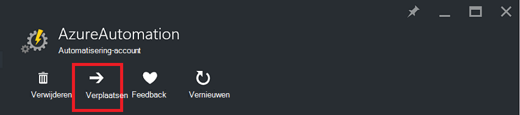
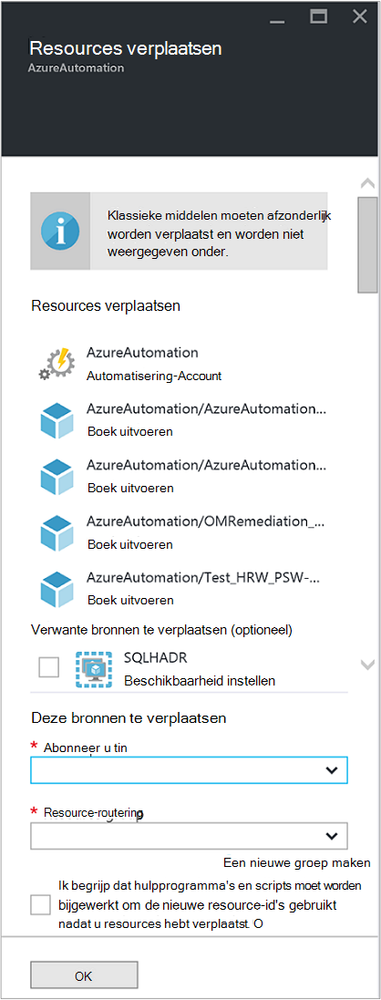

<properties
   pageTitle="Rekening van de automatisering en Resources migreren | Microsoft Azure"
   description="In dit artikel wordt beschreven hoe een Account automatisering in Azure automatisering en bijbehorende resources van een abonnement naar de andere verplaatsen."
   services="automation"
   documentationCenter=""
   authors="MGoedtel"
   manager="jwhit"
   editor="tysonn" />
<tags
   ms.service="automation"
   ms.devlang="na"
   ms.topic="article"
   ms.tgt_pltfrm="na"
   ms.workload="infrastructure-services"
   ms.date="07/07/2016"
   ms.author="magoedte" />

# <a name="migrate-automation-account-and-resources"></a>Rekening van de automatisering en resources migreren

Voor automatisering accounts en de bijbehorende bronnen (dat wil zeggen elementen, runbooks, modules, enz.) die u hebt gemaakt in de portal Azure en wilt migreren uit een resourcegroep naar een andere of van een abonnement aan een andere, kunt u dit doen eenvoudig met de functie [resources verplaatsen](../resource-group-move-resources.md) in Azure portal beschikbaar. Echter, voordat u verdergaat met deze actie moet u eerst kijken de volgende [Controlelijst voordat u bronnen](../resource-group-move-resources.md#Checklist-before-moving-resources) en bovendien de onderstaande specifieke voor automatisering.   

1.  De bestemming abonnement/resourcegroep moet zich in hetzelfde gebied, als de bron.  Wat betekent automatisering accounts niet verplaatsen tussen de regio's.
2.  Bij het verplaatsen van resources (bv. runbooks, projecten, enz.), zijn de bronnengroep en de doelgroep vergrendeld voor de duur van de bewerking. Schrijven en verwijderen van de groepen worden geblokkeerd totdat de verplaatsing is voltooid.  
3.  Een runbooks of variabelen die verwijzen naar een bron of abonnement-ID van het bestaande abonnement moet worden bijgewerkt nadat de migratie is voltooid.   


>[AZURE.NOTE] Deze functie biedt geen ondersteuning voor bewegende klassieke automatisering bronnen.

## <a name="to-move-the-automation-account-using-the-portal"></a>De Account van de automatisering met behulp van de portal te verplaatsen

1. Klik op **verplaatsen** boven aan het blad van uw account automatisering.<br> <br> 
2. Let op de bladeserver **bronnen verplaatsen** dat deze bronnen die verwant zijn aan uw account voor de automatisering en de groep(en) bron vormt.  Het **abonnement** en de **resourcegroep** selecteren in de vervolgkeuzelijsten of Selecteer de optie **een nieuwe resourcegroep maken** en voer de naam van een nieuwe resource in het betreffende veld.  
3. Bekijk en schakel het selectievakje in om te bevestigen dat u *hulpprogramma's begrijpen en scripts moet worden bijgewerkt om de nieuwe resource-id gebruikt als bronnen zijn verplaatst* en klik op **OK**.<br> <br>   

Deze actie duurt enkele minuten in beslag.  In de **meldingen**worden weergegeven met de status van elke actie die - validering, migratie plaatsvindt, en klik tot slot wanneer deze is voltooid.     

## <a name="to-move-the-automation-account-using-powershell"></a>De automatisering rekening met PowerShell verplaatsen

Bestaande automatisering om bronnen te verplaatsen naar een andere groep of abonnement, de cmdlet **Get-AzureRmResource** te gebruiken om de specifieke account voor automatisering en cmdlet **Verplaatsen AzureRmResource** voor het uitvoeren van de verplaatsing.

Het eerste voorbeeld ziet u hoe een automatisering-account verplaatsen naar een nieuwe resourcegroep.

   ```
    $resource = Get-AzureRmResource -ResourceName "TestAutomationAccount" -ResourceGroupName "ResourceGroup01"
    Move-AzureRmResource -ResourceId $resource.ResourceId -DestinationResourceGroupName "NewResourceGroup"
   ``` 

Nadat u het bovenstaande voorbeeld uitvoert, wordt u gevraagd om te controleren of dat u wilt deze actie uitvoeren.  Als u op **Ja** en het script mag worden voortgezet, ontvangt niet u geen meldingen tijdens de uitvoering van de migratie.  

Als u wilt verplaatsen naar een nieuw abonnement, bevatten een waarde voor de parameter *DestinationSubscriptionId* .

   ```
    $resource = Get-AzureRmResource -ResourceName "TestAutomationAccount" -ResourceGroupName "ResourceGroup01"
    Move-AzureRmResource -ResourceId $resource.ResourceId -DestinationResourceGroupName "NewResourceGroup" -DestinationSubscriptionId "SubscriptionId"
   ``` 

Net als bij het vorige voorbeeld, wordt u gevraagd om de verplaatsing te bevestigen.  

## <a name="next-steps"></a>Volgende stappen

- Zie voor meer informatie over het verplaatsen van resources aan de nieuwe resourcegroep of abonnement [bronnen aan de nieuwe resourcegroep of abonnement verplaatsen](../resource-group-move-resources.md)
- Raadpleeg voor meer informatie over toegangsbeheer op basis van rollen in Azure automatisering, [op rollen gebaseerde toegangscontrole in Azure automatisering](../automation/automation-role-based-access-control.md).
- Zie voor meer informatie over PowerShell-cmdlets voor het beheren van uw abonnement [Via Azure PowerShell met Resource Manager](../powershell-azure-resource-manager.md)
- Zie meer informatie over portal-functies voor het beheer van uw abonnement, [met behulp van de Portal Azure voor het beheren van bronnen](../azure-portal/resource-group-portal.md). 
