<properties 
   pageTitle="Toegangsbeheer op basis van rollen in Azure automatisering | Microsoft Azure"
   description="Op rollen gebaseerde toegangscontrole (RBAC) kunt toegangsbeheer voor Azure resources. In dit artikel wordt beschreven hoe RBAC in Azure automatisering instellen."
   services="automation"
   documentationCenter=""
   authors="mgoedtel"
   manager="jwhit"
   editor="tysonn"
   keywords="automatisering-rbac azure rbac toegangsbeheer op basis van rollen" />
<tags 
   ms.service="automation"
   ms.devlang="na"
   ms.topic="get-started-article"
   ms.tgt_pltfrm="na"
   ms.workload="infrastructure-services"
   ms.date="09/12/2016"
   ms.author="magoedte;sngun"/>

# Toegangsbeheer op basis van rollen in Azure automatisering

## Toegangsbeheer op basis van rollen

Op rollen gebaseerde toegangscontrole (RBAC) kunt toegangsbeheer voor Azure resources. [RBAC](../active-directory/role-based-access-control-configure.md)gebruikt, kunt u taken binnen uw team te scheiden en de hoeveelheid toegang verlenen aan gebruikers, groepen en toepassingen die ze nodig hebben om hun taken uitvoeren. Op rollen gebaseerde toegang kan worden verleend aan gebruikers van de portal Azure, Azure opdrachtregelprogramma's of API's voor Azure.

## RBAC in automatisering rekeningen

In Azure-automatisering wordt toegang verleend door de juiste RBAC-rol toewijzen aan gebruikers, groepen en toepassingen voor het bereik van de account automatisering. Zijn de ingebouwde functies ondersteund door een automatisering-account:  

|**Rol** | **Beschrijving** |
|:--- |:---|
| Eigenaar | De rol van eigenaar kan de toegang tot alle bronnen en acties binnen een automatisering-account om toegang tot andere gebruikers, groepen en toepassingen voor het beheer van de rekening van de automatisering inclusief. |
| Inzender | De rol van Inzender kunt u alles behalve het wijzigen van toegangsmachtigingen van de andere gebruiker op een rekening van de automatisering beheren. |
| Reader | De rol van lezer kunt u alle bronnen in een automatisering-account bekijken maar geen wijzigingen kunt aanbrengen.|
| Automatisering-Operator | De rol van automatisering Operator kunt u operationele taken uitvoeren zoals het starten, stoppen, onderbreken, hervatten en plannen van taken. Deze functie is handig als u wilt voorkomen dat uw Account automatisering bronnen zoals referenties activa en runbooks inzage of wijziging maar nog steeds toestaan dat leden van uw organisatie voor het uitvoeren van deze runbooks. |
| Beheerder toegang | De rol beheerder toegang kunt u gebruikerstoegang tot Azure automatisering accounts beheren. |

>[AZURE.NOTE] U kunt toegangsrechten aan een specifieke runbook of runbooks, tot de bronnen en de acties binnen de automatisering rekening kan niet verlenen.  

In dit artikel begeleidt wij u door het instellen van RBAC in Azure automatisering. Maar eerst laten we dichter bij de afzonderlijke machtigingen verleend aan de inzender, lezer, automatisering exploitant en beheerder toegang zodat we een goed inzicht krijgen voordat iedereen rechten op de rekening van de automatisering.  Anders deze kan leiden tot onverwachte of ongewenste consequenties.     

## Machtigingen voor rol Inzender

De volgende tabel vindt de specifieke acties die kunnen worden uitgevoerd door de rol van inzender in automatisering.

| **Resourcetype** | **Lezen** | **Schrijven** | **Verwijderen** | **Andere acties** |
|:--- |:---|:--- |:---|:--- |
| Azure automatisering Account |  |  |  | | 
| Automatisering certificaat activa |  |  |  | |
| Automatisering-verbinding actief |  |  |  | | 
| Automatisering Connection Type activa |  |  |  | | 
| Automatisering referentie actief |  |  |  | |
| Automatisering schema actief |  |  |  | |
| Automation-variabele activa |  |  |  | |
| Automatisering staat configuratie gewenst | | | |  |
| Hybride Runbook werknemer brontype |  | |  | | 
| Project Azure automatisering |  |  | |  | 
| Automatisering taak Stream |  | | | | 
| Het schema voor automatisering |  |  |  | |
| Automation Module |  |  |  | |
| Azure automatisering Runbook |  |  |  |  |
| Runbook concept van automatisering |  | | |  |
| Automatisering Runbook concept testtaak |  |  | |  | 
| Webhook automatisering |  |  |  |  |

## Leesmachtigingen voor rol

De volgende tabel vindt de specifieke acties die kunnen worden uitgevoerd door de rol van lezer in automatisering.

| **Resourcetype** | **Lezen** | **Schrijven** | **Verwijderen** | **Andere acties** |
|:--- |:---|:--- |:---|:--- |
| Klassieke abonnement beheerder |  | | | 
| Management vergrendelen |  | | | 
| Machtiging |  | | |
| Bewerkingen van de provider |  | | | 
| Roltoewijzing |  | | | 
| Roldefinitie |  | | | 

## De rol van operatormachtigingen automatisering

De volgende tabel vindt de specifieke acties die kunnen worden uitgevoerd door de rol van automatisering Operator in automatisering.

| **Resourcetype** | **Lezen** | **Schrijven** | **Verwijderen** | **Andere acties** |
|:--- |:---|:--- |:---|:--- |
| Azure automatisering Account |  | | | 
| Automatisering certificaat activa | | | |
| Automatisering-verbinding actief | | | |
| Automatisering Connection Type activa | | | |
| Automatisering referentie actief | | | |
| Automatisering schema actief |  |  | | |
| Automation-variabele activa | | | |
| Automatisering staat configuratie gewenst | | | | |
| Hybride Runbook werknemer brontype | | | | | 
| Project Azure automatisering |  |  | |  | 
| Automatisering taak Stream |  | | |  
| Het schema voor automatisering |  |  | | |
| Automation Module | | | |
| Azure automatisering Runbook |  | | | |
| Runbook concept van automatisering | | | |
| Automatisering Runbook concept testtaak | | | |  
| Webhook automatisering | | | |

Voor nadere details worden de [automatisering operatoracties](../active-directory/role-based-access-built-in-roles.md#automation-operator) de acties worden ondersteund door de rol van de operator automatisering op de rekening van de automatisering en de bijbehorende bronnen.

## Beheerder toegang machtigingen

De volgende tabel vindt de specifieke acties die kunnen worden uitgevoerd door de rol van beheerder toegang in automatisering.

| **Resourcetype** | **Lezen** | **Schrijven** | **Verwijderen** | **Andere acties** |
|:--- |:---|:--- |:---|:--- |
| Azure automatisering Account |  | | | |
| Automatisering certificaat activa |  | | | |
| Automatisering-verbinding actief |  | | | |
| Automatisering Connection Type activa |  | | | |
| Automatisering referentie actief |  | | | |
| Automatisering schema actief |  | | | |
| Automation-variabele activa |  | | | |
| Automatisering staat configuratie gewenst | | | | |
| Hybride Runbook werknemer brontype |  | | | | 
| Project Azure automatisering |  | | | | 
| Automatisering taak Stream |  | | | | 
| Het schema voor automatisering |  | | | |
| Automation Module |  | | | |
| Azure automatisering Runbook |  | | | |
| Runbook concept van automatisering |  | | | |
| Automatisering Runbook concept testtaak |  | | | | 
| Webhook automatisering |  | | |

## RBAC configureren voor uw automatisering rekening met Azure Portal

1.  Log in op de [Azure Portal](https://portal.azure.com/) en open uw account automatisering van de Accounts automatiseren bladeservers.  

2.  Klik op het **Access** -besturingselement op de rechterbovenhoek. Hiermee opent u het **gebruikers** blad waarin u toevoegen kunt, nieuwe gebruikers, groepen en toepassingen aan uw account automatisering beheren en weergeven van bestaande functies die kunnen worden geconfigureerd voor de Account van de automatisering.  

      

>[AZURE.NOTE] **Beheerders van abonnement** bestaat al als de standaardgebruiker. De beheerdersgroep active directory omvat de service Administrator (s) en co-administrator(s) voor uw abonnement op Azure. De Service admin is de eigenaar van uw abonnement Azure en de bijbehorende bronnen en wordt de rol van eigenaar overgenomen hebben voor de automatisering rekeningen te. Dit betekent dat de toegang **overgenomen** voor **servicebeheerders en co-beheerders** van een abonnement en de **toegewezen** voor de gebruikers is. Klik op **abonnement beheerders** om meer details over de machtigingen weer te geven.  

### Een nieuwe gebruiker toevoegen en een rol toewijzen

1.  Klik op **toevoegen** om de **access-blade toevoegen** waar u kunt een gebruiker, groep of toepassing toevoegen en een rol toewijzen aan deze van de bladeserver gebruikers.  

    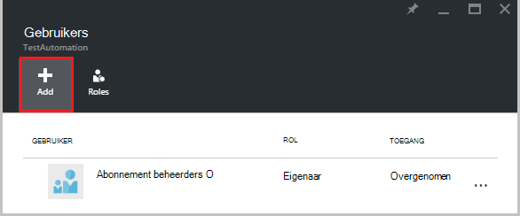  

2.  Selecteer een rol in de lijst met beschikbare rollen. Kiezen wij de rol van **lezer** , maar u kunt een van de beschikbare ingebouwde functies die een Account automatisering ondersteunt of een aangepaste functie die u hebt gedefinieerd.  

    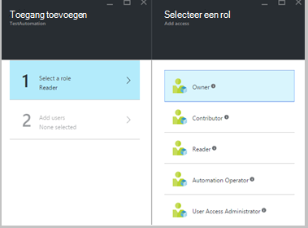  

3.  Klik op **gebruikers toevoegen** voor het openen van de bladeserver **gebruikers toevoegen** . Als u gebruikers, groepen of toepassingen voor het beheer van uw abonnement en vervolgens de gebruikers worden weergegeven en kunt u deze toegang toevoegen hebt toegevoegd. Als er zijn niet alle gebruikers in de lijst of als de gebruiker u wilt toevoegen niet wordt weergegeven, klikt u op **uitnodigen** om te openen de blade **Gast uitnodigen** , waar u een gebruiker met een geldig e-mailadres van een Microsoft-account zoals Outlook.com, OneDrive of Xbox Live-id's kunt uitnodigen. Nadat u het e-mailadres van de gebruiker hebt ingevoerd, klikt u op **selecteren** om de gebruiker toevoegen en klik vervolgens op **OK**. 

    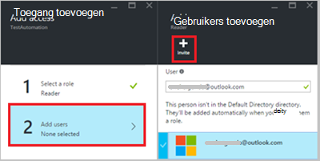  
 
    Nu ziet u de gebruiker toegevoegd aan de bladeserver **gebruikers** met de rol van **lezer** toegewezen.  

    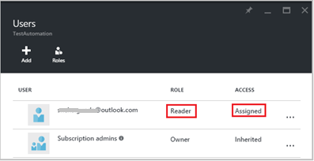  

    U kunt ook een rol toewijzen aan de gebruiker van het blad **rollen** . 

1. Klik op **rollen** van de bladeserver gebruikers openen de **rollen blade**. Vanuit deze blade, kunt u de naam van de functie, het aantal gebruikers en groepen die zijn toegewezen aan die rol bekijken.

    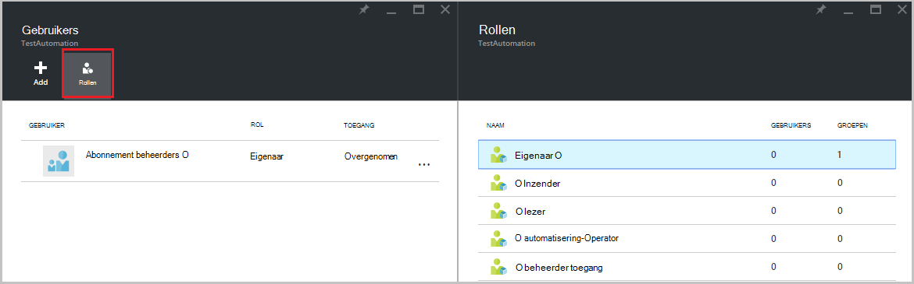  
   
    >[AZURE.NOTE] Toegangsbeheer op basis van rollen kan alleen worden ingesteld op het niveau van automatisering-Account en niet op een bron onder de Account van de automatisering.

    U kunt meer dan één functie toewijzen aan een gebruiker, groep of toepassing. Bijvoorbeeld, als we de rol van **Automatisering Operator** en de **rol van lezer** toe te aan de gebruiker voegen, kunnen vervolgens ze weergeven van alle bronnen in de automatisering, alsmede de runbook taken uitvoeren. U kunt de vervolgkeuzelijst voor een overzicht van de rollen die zijn toegewezen aan de gebruiker kunt uitbreiden.  

    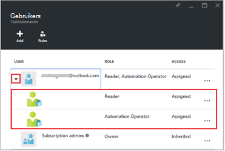  
 
### Een gebruiker verwijderen

Kunt u de toegangsmachtiging voor een gebruiker die de Account voor automatisering niet wordt beheerd of die niet meer werkt voor de organisatie. Hier volgen de stappen voor het verwijderen van een gebruiker: 

1.  Selecteer in het blad **gebruikers** de roltoewijzing die u wilt verwijderen.

2.  Klik op de knop **verwijderen** in de blade toewijzing details.

3.  Klik op **Ja** om te bevestigen. 

    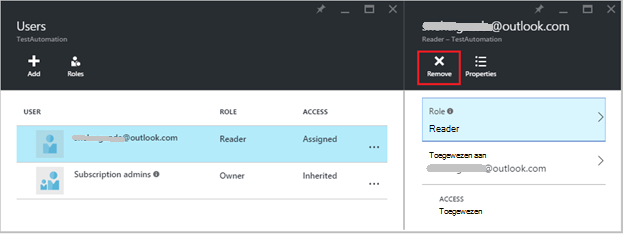  

## Rol toegewezen gebruiker

Wanneer een gebruiker wordt toegewezen aan een rol zich aanmelden bij hun account automatisering, kunnen ze eigenaar van de rekening vermeld in de lijst met **Mappen standaard**nu zien. Wilt bekijken van de automatisering-account die zijn toegevoegd aan, moeten zij de standaardmap overschakelen naar de standaardmap van de eigenaar.  

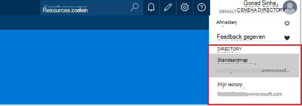  

### Voor de rol van automatisering operator

Wanneer een gebruiker die is toegewezen aan de rol van automatisering Operator weergaven de automatisering-account waaraan ze zijn toegewezen, zij alleen de lijst van runbooks, runbook taken en schema's die zijn gemaakt in de automatisering rekening kunnen bekijken maar niet hun definitie weergeven. Ze kunnen starten, stoppen, onderbreken, hervatten of de runbook taak plannen. De gebruiker geen toegang tot andere bronnen automatisering, zoals configuraties, hybride werknemersgroepen of DSC-knooppunten.  

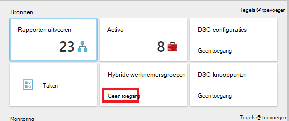  

Wanneer de gebruiker op de runbook klikt, worden de opdrachten voor het weergeven van de bron of de runbook bewerken niet opgegeven als de rol van de operator automatisering kan geen toegang tot deze.  

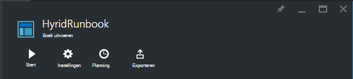  

De gebruiker heeft toegang tot het bekijken en schema's maken maar hebben geen toegang tot andere type van activa.  

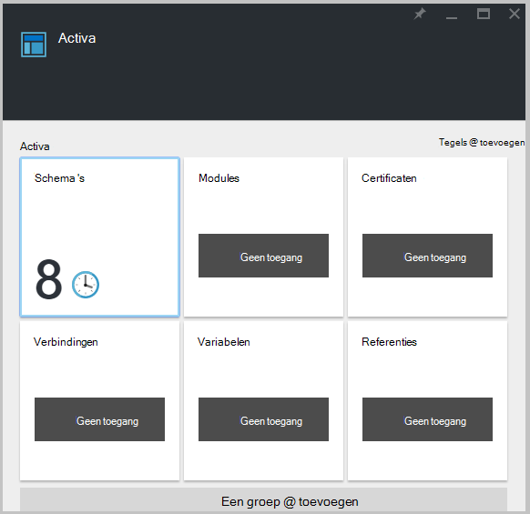  

Deze gebruiker ook geen toegang tot de webhooks die is gekoppeld aan een runbook weergeven

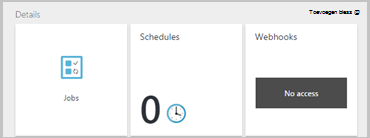  

## RBAC configureren voor uw automatisering rekening met Azure PowerShell

Toegang op basis van rollen kan ook worden geconfigureerd met de volgende [Azure PowerShell-cmdlets](../active-directory/role-based-access-control-manage-access-powershell.md)gebruiken om een Automation-Account.

• [Get-AzureRmRoleDefinition](https://msdn.microsoft.com/library/mt603792.aspx) geeft een overzicht van alle RBAC-rollen die beschikbaar in Azure Active Directory zijn. U kunt deze opdracht samen met de eigenschap **Name** lijst van alle acties die kunnen worden uitgevoerd door een specifieke rol.  
    **Voorbeeld:**  
    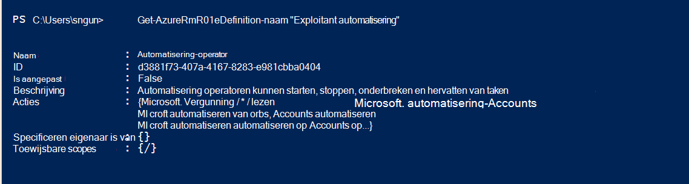  

• [Get AzureRmRoleAssignment](https://msdn.microsoft.com/library/mt619413.aspx) Azure AD RBAC roltoewijzingen voor het opgegeven bereik bevat. Zonder parameters retourneert deze opdracht u alle roltoewijzingen uit hoofde van het abonnement. Gebruik de parameter **ExpandPrincipalGroups** lijst toegang toewijzingen voor de opgegeven gebruiker als de groepen die de gebruiker lid van is.  
    **Voorbeeld:** Gebruik de volgende opdracht om alle gebruikers en hun rollen in een account met automatisering.

    Get-AzureRMRoleAssignment -scope “/subscriptions/<SubscriptionID>/resourcegroups/<Resource Group Name>/Providers/Microsoft.Automation/automationAccounts/<Automation Account Name>” 

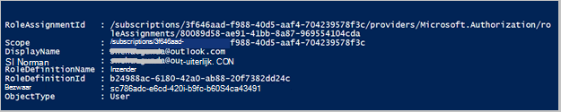

• [Nieuwe AzureRmRoleAssignment](https://msdn.microsoft.com/library/mt603580.aspx) voor het toewijzen van toegang aan gebruikers, groepen en toepassingen voor een bepaald bereik.  
    **Voorbeeld:** Gebruik de volgende opdracht om de rol van "Exploitant automatisering" voor een gebruiker in de scope automatisering Account toewijzen.

    New-AzureRmRoleAssignment -SignInName <sign-in Id of a user you wish to grant access> -RoleDefinitionName "Automation operator" -Scope “/subscriptions/<SubscriptionID>/resourcegroups/<Resource Group Name>/Providers/Microsoft.Automation/automationAccounts/<Automation Account Name>”  

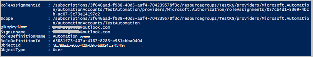

• Gebruik [Verwijderen AzureRmRoleAssignment](https://msdn.microsoft.com/library/mt603781.aspx) toegang te verwijderen van een specifieke gebruiker, groep of de toepassing van een bepaalde scope.  
    **Voorbeeld:** Gebruik de volgende opdracht om de gebruiker te verwijderen uit de rol van "Exploitant automatisering" in de scope van de rekening van de automatisering.

    Remove-AzureRmRoleAssignment -SignInName <sign-in Id of a user you wish to remove> -RoleDefinitionName "Automation Operator" -Scope “/subscriptions/<SubscriptionID>/resourcegroups/<Resource Group Name>/Providers/Microsoft.Automation/automationAccounts/<Automation Account Name>”

In de bovenstaande voorbeelden vervangen door **Id inloggen**, **abonnements-Id**, **Resourcegroepnaam** en **automatisering accountnaam** uw accountgegevens. Kies **Ja** wanneer u wordt gevraagd te bevestigen voordat u verdergaat met het verwijderen van de rol van de gebruiker is toegewezen.   

## Volgende stappen
-  Raadpleeg voor informatie op verschillende manieren RBAC configureren voor automatisering Azure [RBAC met Azure PowerShell](../active-directory/role-based-access-control-manage-access-powershell.md)beheren.
- Zie voor meer informatie over verschillende manieren waarop een runbook starten [vanaf een runbook](automation-starting-a-runbook.md)
- Raadpleeg voor meer informatie over de verschillende runbook [Azure automatisering runbook typen](automation-runbook-types.md)

