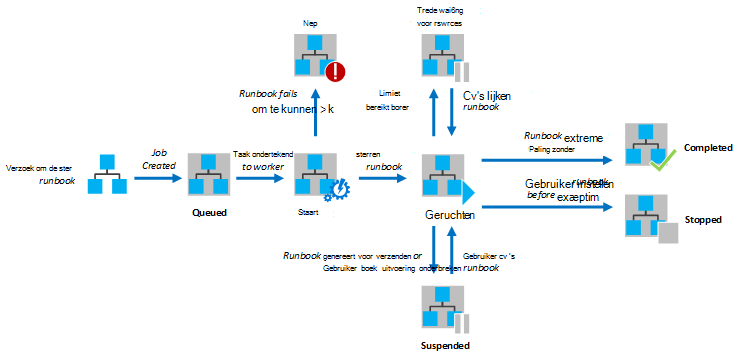
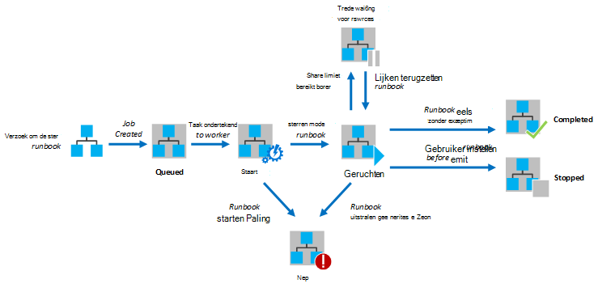

<properties
   pageTitle="Runbook worden uitgevoerd in Azure automatisering"
   description="Beschrijving van de details van hoe een runbook in Azure automatisering wordt verwerkt."
   services="automation"
   documentationCenter=""
   authors="mgoedtel"
   manager="stevenka"
   editor="tysonn" />
<tags
   ms.service="automation"
   ms.devlang="na"
   ms.topic="article"
   ms.tgt_pltfrm="na"
   ms.workload="infrastructure-services"
   ms.date="03/21/2016"
   ms.author="bwren" />

# Runbook worden uitgevoerd in Azure automatisering

Wanneer u een runbook in Azure automatisering start, wordt een taak gemaakt. Een taak is een exemplaar van één uitvoering van een runbook. Een werknemer Azure automatisering wordt toegewezen aan elke taak uitvoeren. Werknemers worden gedeeld door meerdere accounts voor Azure, zijn taken van verschillende rekeningen voor automatisering van elkaar gescheiden. U hebt geen controle over welke werknemer service zal de aanvraag voor uw project.  Een enkele runbook kan hebben meerdere taken tegelijk uitvoeren. Wanneer u de lijst met runbooks in de portal Azure weergeven, staan hierin de status van de laatste taak die voor elk runbook is gestart. U kunt de lijst met taken voor elke runbook wilt bijhouden van de status van elk weergeven. Zie de [Status van de taak](#job-statuses)voor een beschrijving van de verschillende statussen.

Het volgende diagram toont de levenscyclus van een project runbook voor [grafische runbooks](automation-runbook-types.md#graphical-runbooks) en [PowerShell Workflow runbooks](automation-runbook-types.md#powershell-workflow-runbooks).

Het volgende diagram toont de levenscyclus van een project van runbook voor [runbooks in PowerShell](automation-runbook-types.md#powershell-runbooks).

Uw taken zullen toegang hebben tot uw Azure bronnen door het maken van een verbinding met uw abonnement Azure. Zij zal hebben alleen toegang tot bronnen in uw datacenter als deze bronnen toegankelijk vanuit de openbare cloud zijn.

## Status van de taak

In de volgende tabel beschrijft de verschillende statussen die mogelijk zijn voor een project.

| Status| Beschrijving|
|:---|:---|
|Voltooid|De taak is voltooid.|
|Is mislukt| Voor [grafische en PowerShell Workflow runbooks](automation-runbook-types.md), de runbook kan niet worden gecompileerd.  [PowerShell Script runbooks](automation-runbook-types.md), de runbook kan niet worden gestart of de taak heeft een uitzondering aangetroffen. |
|Mislukt, wacht op bronnen|De taak is mislukt omdat het bereikt de [billijk aandeel](#fairshare) driemaal en tussen de controlepunten dezelfde of vanaf het begin van de runbook elke keer gestart.|
|In de wachtrij geplaatst|De taak moet wachten bronnen op een werknemer Automatisering beschikbaar komen, zodat deze kan worden gestart.|
|Starten|De taak is toegewezen aan een werknemer en het systeem is bij het starten.|
|Hervatten|Het systeem wordt de taak wordt hervat nadat deze is onderbroken.|
|Wordt uitgevoerd|De taak wordt uitgevoerd.|
|Wordt uitgevoerd, wacht op bronnen|Het project is verwijderd omdat het [billijk aandeel](#fairshare) limiet is bereikt. Hierbij wordt binnenkort uit de laatste checkpoint.|
|Gestopt|De taak is gestopt door de gebruiker voordat deze is voltooid.|
|Stoppen|Het systeem is bij het stoppen van de taak.|
|Geschorst|De taak is onderbroken door de gebruiker, het systeem of een opdracht in de runbook. Een taak die is geschorst, kan opnieuw worden gestart en wordt hervat vanaf de laatste checkpoint of vanaf het begin van de runbook als er geen controlepunten. De runbook zal slechts worden geschorst door het systeem in geval van een uitzondering. ErrorActionPreference is standaard ingesteld op **Doorgaan** wil zeggen dat de taak blijven op een fout uitvoeren zal. Als deze voorkeur-variabele is ingesteld op **stoppen** staken de taak op een fout.  Alleen van toepassing op [grafische en PowerShell Workflow runbooks](automation-runbook-types.md) .|
|Onderbreken|Het systeem probeert op te schorten de taak op verzoek van de gebruiker. De runbook moet de volgende checkpoint bereiken voordat kan worden geschorst. Als al het laatste controlepunt is verstreken, vervolgens voltooit het voordat kan worden geschorst.  Alleen van toepassing op [grafische en PowerShell Workflow runbooks](automation-runbook-types.md) .|

## Met behulp van de Portal Azure Management taakstatus weergeven

### Automatisering-Dashboard

Het Dashboard automatisering bevat een overzicht van alle van de runbooks voor een bepaalde automatisering. Het bevat ook een overzicht van de syntaxis voor de account. De samenvatting grafiek bevat het nummer van het totaal aantal taken voor alle runbooks die elke status ingevoerd over een bepaald aantal dagen of uren. Kunt u het tijdsbereik in de rechterbovenhoek van het diagram. De tijdas van de grafiek verandert afhankelijk van het type van de periode die u hebt geselecteerd. U kunt kiezen of de regel voor een bepaalde status door erop te klikken boven aan het scherm wordt weergegeven.

De volgende stappen kunt u het Dashboard automatisering weergeven.

1. In de Portal Management Azure **automatisering** selecteert en klikt u vervolgens de naam van een account met automatisering.
1. Selecteer het tabblad **Dashboard** .

### Runbook-Dashboard

Het Runbook Dashboard bevat een overzicht van een enkele runbook. De samenvatting grafiek bevat het nummer van het totaal aantal taken voor de runbook die elke status ingevoerd over een bepaald aantal dagen of uren. Kunt u het tijdsbereik in de rechterbovenhoek van het diagram. De tijdas van de grafiek verandert afhankelijk van het type van de periode die u hebt geselecteerd. U kunt kiezen of de regel voor een bepaalde status door erop te klikken boven aan het scherm wordt weergegeven.

Kunt u de volgende stappen uit om het Dashboard van Runbook weer te geven.

1. In de Portal Management Azure **automatisering** selecteert en klikt u vervolgens de naam van een account met automatisering.
1. Klik op de naam van een runbook.
1. Selecteer het tabblad **Dashboard** .

### Samenvatting

U kunt een lijst van alle taken die zijn gemaakt voor een bepaalde runbook en de meest recente status weergeven. U kunt filteren op deze lijst door de taakstatus en het datumbereik voor de laatste wijziging van de taak. Klik op de naam van een taak voor de gedetailleerde informatie weergeven en de uitvoer. De gedetailleerde weergave van de taak bevat de waarden voor de parameters van de runbook die voor die taak.

De volgende stappen kunt u de taken voor een runbook weergeven.

1. In de Portal Management Azure **automatisering** selecteert en klikt u vervolgens de naam van een account met automatisering.
1. Klik op de naam van een runbook.
1. Selecteer het tabblad **taken** .
1. Klik op de kolom **Taak gemaakt** voor een taak voor het detail en de output.

## Met Windows PowerShell taakstatus ophalen

De [Get-AzureAutomationJob](http://msdn.microsoft.com/library/azure/dn690263.aspx) kunt u de taken die zijn gemaakt voor een runbook en de details van een bepaald project te halen. Als u met Windows PowerShell [Start AzureAutomationRunbook](http://msdn.microsoft.com/library/azure/dn690259.aspx)met een runbook wordt gestart, wordt deze het resulterende project retourneren. Uitvoer van de [Get-AzureAutomationJob](http://msdn.microsoft.com/library/azure/dn690263.aspx)gebruiken om de uitvoer van een project.

De volgende voorbeeldopdrachten haalt de laatste taak voor een monster runbook en geeft de status van de waarden voor de parameters runbook en de uitvoer van de taak opgeven.

    $job = (Get-AzureAutomationJob –AutomationAccountName "MyAutomationAccount" –Name "Test-Runbook" | sort LastModifiedDate –desc)[0]
    $job.Status
    $job.JobParameters
    Get-AzureAutomationJobOutput –AutomationAccountName "MyAutomationAccount" -Id $job.Id –Stream Output

## Billijk aandeel

Om alle runbooks in de cloud bronnen delen, Azure automatisering wordt tijdelijk uit het geheugen verwijderen elke taak, na 3 uur al actief.    [Grafische](automation-runbook-types.md#graphical-runbooks) en [PowerShell Workflow](automation-runbook-types.md#powershell-workflow-runbooks) runbooks wordt uit hun laatste [controlepunt](http://technet.microsoft.com/library/dn469257.aspx#bk_Checkpoints)hervat. Gedurende deze periode wordt geeft de taak de status van uitvoeren, nog voor Resources. Als de runbook geen herstelpunten heeft of als de taak was niet het eerste controlepunt wordt bereikt voordat het geheugen wordt verwijderd, wordt deze opnieuw gestart vanaf het begin.  [PowerShell](automation-runbook-types.md#powershell-runbooks) runbooks zijn altijd vanaf het begin herhaald omdat ze geen ondersteuning voor controlepunten.

>[AZURE.NOTE] De limiet billijk aandeel is niet van toepassing op runbook taken uitvoeren op het hybride Runbook werknemers.

Als het runbook opnieuw is gestart vanuit het controlepunt dezelfde of vanaf het begin van de runbook drie keer achter elkaar, wordt deze afgesloten met de status mislukt, wacht op bronnen. Dit is om te beschermen tegen de runbooks voor onbepaalde tijd worden uitgevoerd zonder te voltooien, omdat zij niet kunnen niet opnieuw worden geladen zonder dat u naar de volgende checkpoint. In dit geval ontvangt u de volgende uitzondering met de fout.

*De taak kan niet doorgaan omdat het herhaaldelijk is verwijderd uit de dezelfde controlepunt wordt uitgevoerd. Zorg ervoor dat de Runbook geen langdurige bewerkingen uitvoert zonder dat de staat.*

Wanneer u een runbook maakt, moet u ervoor zorgen dat de tijd uit te voeren activiteiten tussen twee controlepunten niet meer bedragen dan 3 uur. Moet u de controlepunten toevoegen aan uw runbook om ervoor te zorgen dat deze geen 3 uur limiet of verdeel lange bewerkingen uitgevoerd. Uw runbook kan bijvoorbeeld een opnieuw indexeren op een grote SQL-database uitvoeren. Als deze één bewerking niet wordt voltooid binnen de billijk aandeel, vervolgens de taak uit het geheugen verwijderd en opnieuw worden gestart vanaf het begin. In dit geval moet u de bewerking opnieuw indexeren in meerdere stappen, zoals het opnieuw indexeren van één tabel tegelijk splitsen en plaats een controlepunt na elke bewerking zodat de taak kan worden hervat nadat de laatste bewerking te voltooien.

## Volgende stappen

- [Een runbook starten in Azure automatisering](automation-starting-a-runbook.md)
