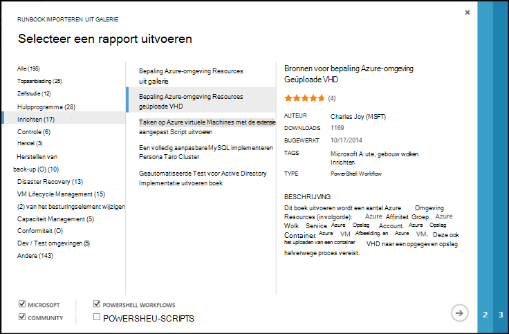

<properties
    pageTitle="Galerieën met Runbook en een module voor Azure automatisering | Microsoft Azure"
    description="Runbooks en modules van Microsoft en de Gemeenschap zijn die u kunt installeren en gebruiken in uw omgeving Azure automatisering.  In dit artikel wordt beschreven hoe u toegang hebt tot deze bronnen en bij te dragen van de runbooks aan de galerie."
    services="automation"
    documentationCenter=""
    authors="mgoedtel"
    manager="jwhit"
    editor="tysonn" />
<tags
    ms.service="automation"
    ms.devlang="na"
    ms.topic="article"
    ms.tgt_pltfrm="na"
    ms.workload="infrastructure-services"
    ms.date="09/18/2016"
    ms.author="magoedte;bwren" />

# Runbook en module galerijen voor Azure automatisering

In plaats van uw eigen runbooks en modules maken in Azure automatisering, kunt u toegang tot allerlei scenario's die door Microsoft en de Gemeenschap zijn gebouwd.  U kunt deze scenario's ongewijzigd gebruiken of kunt u als uitgangspunt gebruiken en deze te bewerken voor uw specifieke behoeften.

U kunt runbooks uit de [Galerie met Runbook](#runbooks-in-runbook-gallery) en modules uit de [Galerie met PowerShell](#modules-in-powerShell-gallery).  U kunt ook bijdragen aan de Gemeenschap door het delen van scenario's die u ontwikkelt.

## Runbooks in galerie Runbook

De [Galerie met Runbook](http://gallery.technet.microsoft.com/scriptcenter/site/search?f[0].Type=RootCategory&f[0].Value=WindowsAzure&f[1].Type=SubCategory&f[1].Value=WindowsAzure_automation&f[1].Text=Automation) biedt een scala van runbooks van Microsoft en de Gemeenschap die u in Azure automatisering importeren kunt. U kunt een download van een runbook uit de galerie die wordt gehost in het [TechNet Script Center](http://gallery.technet.microsoft.com/)of kunt u runbooks rechtstreeks importeren uit de galerie van de Azure klassieke portal of Azure portal.

U kunt alleen importeren rechtstreeks uit de galerie met Runbook via de Azure klassieke portal of Azure portal. U kunt deze functie met behulp van Windows PowerShell niet uitvoeren.

>[AZURE.NOTE] U moet de inhoud van een runbooks dat u uit de galerie met Runbook ophalen en uiterst voorzichtig met het installeren en uitvoeren van deze in een productieomgeving valideren. |

### Importeren van een runbook uit de galerie met Runbook met de klassieke Azure portal

1. In de Portal Azure, klikt u op **Nieuw**, **App-Services**, **automatisering**, **Runbook**, **Galerij uit**.
2. Selecteer een categorie om verwante runbooks weer te geven en selecteer een runbook om de details te bekijken. Wanneer u de runbook die u wilt selecteren, klikt u op de pijl naar rechts.

    

3. Controleer de inhoud van de runbook en Let op eventuele eisen in de beschrijving. Wanneer u klaar bent, klikt u op de pijl naar rechts.
4. Geef de details van de runbook en klik vervolgens op de knop ingeschakeld. De naam van de runbook al ingevuld.
5. De runbook wordt weergegeven op het tabblad **Runbooks** voor de rekening van de automatisering.

### Een runbook uit de galerie met Runbook met Azure portal importeren

1. Open uw account automatisering in de Portal Azure.
2. Klik op de tegel **Runbooks** opent de lijst met runbooks.
3. Klik op **galerie bladeren** .

    

4. Zoek de galerie u wilt gebruiken en selecteert u deze om de details te bekijken.

    

4. Klik op **View source project** om het item in het [TechNet Script Center](http://gallery.technet.microsoft.com/)weer te geven.
5. Als u wilt importeren in een item, klikt u op de details weergeven en klik vervolgens op de knop **importeren** .

    

6. Desgewenst de naam van de runbook wijzigen en klik vervolgens op **OK** om de runbook te importeren.
5. De runbook wordt weergegeven op het tabblad **Runbooks** voor de rekening van de automatisering.

### Een runbook toevoegen aan de galerie met runbook

Microsoft raadt u aan de runbooks toevoegen aan de galerie met Runbook waarvan u denkt dat het handig kan zijn voor andere klanten.  U kunt een runbook door te [uploaden naar het Script Center](http://gallery.technet.microsoft.com/site/upload) rekening wordt gehouden met de volgende details toevoegen.

- Voor de **categorie** en de *automatisering* van de **subcategorie** voor de runbook moet worden weergegeven in de wizard moet u *Windows Azure* .  

- Het uploaden moet één .ps1 of .graphrunbook-bestand.  Als de runbook is vereist voor alle modules, activa of onderliggende runbooks, moet vervolgens u aanbieden die in de beschrijving van de indiening en in de sectie Opmerkingen van de runbook.  Als u een scenario waarin meerdere runbooks, elk afzonderlijk uploaden en de namen van de bijbehorende runbooks in elk van hun beschrijvingen. Zorg ervoor dat u dezelfde labels gebruiken zodat ze worden weergegeven in dezelfde categorie. Een gebruiker moet lees de beschrijving om te weten dat er andere runbooks nodig zijn het scenario te werken.

- Voeg het label 'GraphicalPS' als u een **grafische runbook** (geen grafische Workflow) publiceert. 

- Een PowerShell of een werkstroom PowerShell codefragment invoegen in de beschrijving van de **code sectie invoegen** pictogram gebruikt.

- De samenvatting voor het uploaden wordt weergegeven in de galerie met Runbook zodat u gedetailleerde informatie waarmee de functionaliteit van de runbook identificeren van een gebruiker moet leveren.

- U moet één tot drie van de volgende codes toewijzen aan het uploaden.  De runbook worden weergegeven in de wizard onder de categorieën die overeenkomen met de labels.  Tags niet in deze lijst worden genegeerd door de wizard. Als u alle overeenkomende codes niet opgeeft, wordt de runbook onder de andere categorie worden vermeld.

 - Back-up
 - Beheer van de capaciteit
 - Besturingselement wijzigen
 - Conformiteit
 - Dev / Test omgevingen
 - Noodherstel
 - Monitoring
 - Patch toepassen
 - Inrichten
 - Herstel
 - VM Lifecycle Management

- Automatisering werkt de galerie eens per uur, zodat u meteen uw bijdragen niet zien.

## Modules in PowerShell galerie

Modules PowerShell cmdlets die u in uw runbooks gebruiken kunt bevatten, en bestaande modules die u in Azure automatisering installeren kunt beschikbaar zijn in de [Galerie met PowerShell](http://www.powershellgallery.com).  U kunt deze galerie van het portal voor Azure starten en installeert u deze rechtstreeks in Azure automatisering of kunt u deze downloaden en deze handmatig installeren.  U kunt de modules direct vanaf de klassieke Azure portal niet installeren, maar kunt u deze downloaden installeren als elke andere module.

### Importeren van een module in de galerie Automation Module met Azure portal

1. Open uw account automatisering in de Portal Azure.
2. Klik op de tegel **activa** in de lijst van activa wilt openen.
3. Klik op de tegel **Modules** opent de lijst met modules.
4. Klik op de knop **Bladeren galerie** en de galerie bladeren blade wordt gestart.

      
5. Wanneer u de galerie bladeren blade hebt gestart, kunt u zoeken op de volgende velden:

   - Naam van module
   - Tags
   - Auteur
   - De naam van de resource cmdlet/DSC

6. Een module waarin u bent geïnteresseerd in zoeken en selecteren om de details te bekijken.  
Wanneer u in een specifieke module, kunt u meer informatie bekijken over de module, een koppeling naar de galerie met PowerShell, inclusief eventuele vereiste afhankelijkheden en alle cmdlets en/of DSC-bronnen die de module bevat.

      

7. Klik op de knop **importeren** om de module direct in Azure automatisering.

    

8. Wanneer u op de knop importeren, ziet u de naam van de module die u wilt importeren. Als alle afhankelijkheden zijn geïnstalleerd, wordt de knop **OK** actief zijn. Als u afhankelijkheden ontbreken, moet u deze importeren voordat u deze module kunt importeren.
9. Klik op **OK** om het importeren van de module, en start de module blade. Azure automatisering importeert een module aan uw account, worden metagegevens over de module en de cmdlets uitgepakt.

    

    Dit kan enkele minuten duren, omdat elke activiteit moet worden uitgepakt.
10. U ontvangt een melding dat de module wordt ingezet en een melding wanneer deze is voltooid.
11. Nadat de module is geïmporteerd, ziet u de beschikbare activiteiten en kunt u de bronnen in de runbooks en de configuratie van de gewenste status.

## Aanvragen van een runbook of module

U kunt aanvragen kan verzenden naar de [Stem van de gebruiker](https://feedback.azure.com/forums/246290-azure-automation/).  Als u moet helpen bij het schrijven van een runbook of een vraag over PowerShell hebt, boekt u een vraag op ons [forum](http://social.msdn.microsoft.com/Forums/windowsazure/en-US/home?forum=azureautomation&filter=alltypes&sort=lastpostdesc).

## Volgende stappen

- Zie aan de slag met runbooks [maken of importeren van een runbook in Azure automatisering](automation-creating-importing-runbook.md)
- Zie [leren PowerShell workflow](automation-powershell-workflow.md) inzicht in de verschillen tussen PowerShell en PowerShell Workflow met runbooks
