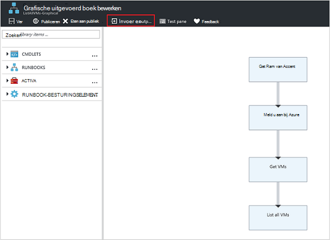
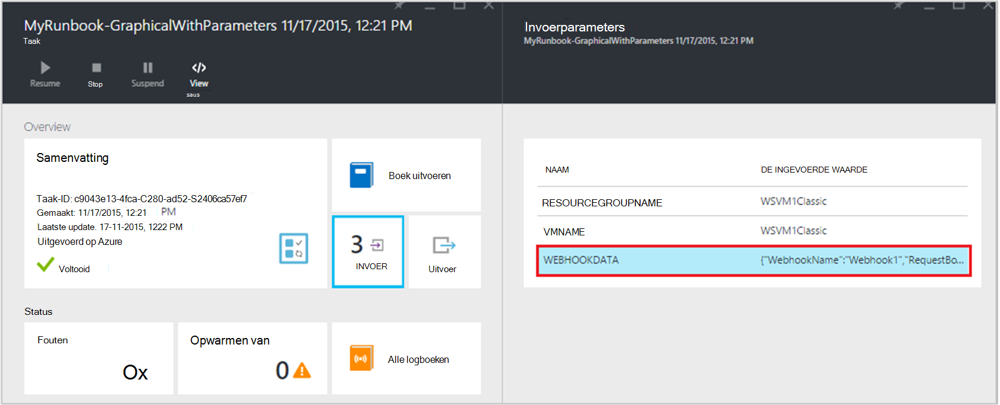

<properties
   pageTitle="Invoerparameters Runbook | Microsoft Azure"
   description="De flexibiliteit van runbooks verhogen Runbook invoerparameters doordat u gegevens doorgeven aan een runbook wanneer deze wordt gestart. Dit artikel beschrijft verschillende scenario's waar de invoerparameters worden gebruikt in runbooks."
   services="automation"
   documentationCenter=""
   authors="MGoedtel"
   manager="jwhit"
   editor="tysonn" />
<tags
   ms.service="automation"
   ms.devlang="na"
   ms.topic="article"
   ms.tgt_pltfrm="na"
   ms.workload="infrastructure-services"
   ms.date="10/11/2016"
   ms.author="sngun"/>

# <a name="runbook-input-parameters"></a>Invoerparameters Runbook

De flexibiliteit van runbooks verhogen Runbook invoerparameters doordat u gegevens aan het doorgeven wanneer deze wordt gestart. De parameters kan de runbook acties die moeten worden gericht voor specifieke scenario's en -omgevingen. In dit artikel hebben helpt we u bij verschillende scenario's waar de invoerparameters worden gebruikt in runbooks.

## <a name="configure-input-parameters"></a>Invoerparameters configureren

Invoerparameters kunnen worden geconfigureerd in PowerShell PowerShell Workflow en grafische runbooks. Een runbook kan meerdere parameters met verschillende gegevenstypen, of hebben geen parameters op alle. Invoerparameters kunnen worden verplicht of optioneel en u kunt een standaardwaarde voor de optionele parameters. U kunt waarden toewijzen aan de invoerparameters voor een runbook bij het starten via een van de beschikbare methoden. Deze methoden omvatten een runbook vanaf de portal of een webservice. U kunt ook starten als een onderliggende runbook die in line in een andere runbook heet.

## <a name="configure-input-parameters-in-powershell-and-powershell-workflow-runbooks"></a>De invoerparameters in PowerShell en PowerShell Workflow runbooks configureren

PowerShell en [PowerShell Workflow runbooks](automation-first-runbook-textual.md) in Azure automatisering ondersteuning voor invoerparameters die zijn gedefinieerd door de volgende kenmerken.  

| **Eigenschap** | **Beschrijving** |
|:--- |:---|
| Type | Vereist. Het gegevenstype voor de waarde van de parameter wordt verwacht. Elk type .NET is geldig. |
| Naam | Vereist. De naam van de parameter. Dit moet uniek zijn binnen de runbook, en kan alleen letters, cijfers of onderstrepingstekens. Moet beginnen met een letter. |
| Verplicht | Dit is optioneel. Hiermee geeft u op of een waarde voor de parameter moet worden opgegeven. Als u dit op **$true instelt**, moet vervolgens een waarde worden opgegeven als de runbook wordt gestart. Als u dit op **$false instelt**, is een waarde optioneel. |
| Standaardwaarde | Dit is optioneel.  Hiermee geeft u een waarde voor de parameter wordt gebruikt als een waarde niet wordt doorgegeven wanneer de runbook wordt gestart. Een standaardwaarde voor een parameter kan worden ingesteld en wordt automatisch de parameter optioneel maken ongeacht de instelling. |

Windows PowerShell ondersteunt meer kenmerken van invoerparameters dan die hier worden vermeld, zoals validatie, aliassen en de parameter wordt ingesteld. Azure automatisering ondersteunt momenteel echter alleen de hierboven genoemde invoerparameters.

De parameterdefinitie van een in PowerShell Workflow runbooks heeft de volgende algemene vorm waarin meerdere parameters zijn gescheiden door komma's.

   ```
     Param
     (
         [Parameter (Mandatory= $true/$false)]
         [Type] Name1 = <Default value>,

         [Parameter (Mandatory= $true/$false)]
         [Type] Name2 = <Default value>
     )
   ```

>[AZURE.NOTE] Wanneer u parameters, definieert als u niet het **verplichte** kenmerk opgeeft, wordt standaard de parameter als beschouwd optioneel. Ook als u een standaardwaarde voor een parameter in PowerShell Workflow, runbooks, het beschouwd door PowerShell als een optionele parameter, ongeacht de waarde van het kenmerk **verplicht** .

Als voorbeeld, laten we de invoerparameters configureren voor een PowerShell Workflow runbook die Hiermee kunt u meer informatie over virtuele machines een VM enkele of alle VMs binnen een groep. Deze runbook heeft twee parameters, zoals in de volgende schermafdruk: de naam van de virtuele machine en de naam van de resourcegroep.


In deze parameter zijn definitie, de parameters **$VMName** en **$resourceGroupName** eenvoudig parameters van het type string. PowerShell en PowerShell Workflow runbooks ondersteunen echter alle typen van eenvoudige en complexe typen, zoals **object** - of **PSCredential** voor invoerparameters.

Als uw runbook een invoerparameter object heeft, gebruikt u PowerShell hashtable met (naam, waarde) paren aan waarde doorgeeft. Bijvoorbeeld als u een runbook met de volgende parameter:

     [Parameter (Mandatory = $true)]
     [object] $FullName

Vervolgens kunt u de volgende waarde aan de parameter doorgeven:

    @{"FirstName"="Joe";"MiddleName"="Bob";"LastName"="Smith"}


## <a name="configure-input-parameters-in-graphical-runbooks"></a>Invoerparameters configureren in grafische runbooks

[Een grafische runbook configureren](automation-first-runbook-graphical.md) met de invoerparameters, we maken een grafische runbook die Hiermee kunt u meer informatie over virtuele machines een VM enkele of alle VMs binnen een resourcegroep. Configureren van een runbook bestaat uit twee hoofdactiviteiten, zoals hieronder beschreven.

[**Runbooks verifiëren met Azure uitvoeren als-account**](automation-sec-configure-azure-runas-account.md) te verifiëren met Azure.

[**Get-AzureRmVm**](https://msdn.microsoft.com/library/mt603718.aspx) om de eigenschappen van een virtuele machines.

U kunt de activiteit [**Schrijven uitvoer**](https://technet.microsoft.com/library/hh849921.aspx) uitvoer de namen van virtuele machines. De **Get-AzureRmVm** -activiteit accepteert twee parameters, de **naam van de virtuele machine** en de **naam van de resource**. Omdat deze parameters verschillende waarden telkens wanneer die u de runbook start vereist kunnen, kunt u de invoerparameters toevoegen aan uw runbook. Hier volgen de stappen voor het toevoegen van invoerparameters:

1. Selecteer de grafische runbook in het blad **Runbooks** en klik vervolgens op [**bewerken**](automation-graphical-authoring-intro.md) het.

2. Klik op **invoer en uitvoer** om te openen de blade **- en uitvoer** van de runbook-editor.

    

3. De **invoer en uitvoer** blade geeft een lijst van invoerparameters die zijn gedefinieerd voor de runbook. Op deze blade, kunt u een nieuwe input parameter toevoegen of bewerken van de configuratie van een bestaande invoerparameter. Klik op **invoer toevoegen** als u wilt openen de **invoerparameter Runbook** blade als u een nieuwe parameter voor de runbook. Er is, kunt u de volgende parameters configureren:

  	| **Eigenschap** | **Beschrijving** |
  	|:--- |:---|
  	| Naam | Vereist.  De naam van de parameter. Dit moet uniek zijn binnen de runbook, en kan alleen letters, cijfers of onderstrepingstekens. Moet beginnen met een letter. |
  	| Beschrijving | Dit is optioneel. Omschrijving van het doel van een invoerparameter. |
  	| Type | Dit is optioneel. Het gegevenstype voor de waarde van de parameter wordt verwacht. Soorten ondersteunde parameters zijn **String**, **Int32**, **Int64**, **decimaal**, **Boolean**, **datum/tijd**en **Object**. Als u een gegevenstype dat niet is geselecteerd, wordt standaard naar een **tekenreeks**. |
  	| Verplicht | Dit is optioneel. Hiermee geeft u op of een waarde voor de parameter moet worden opgegeven. Als u **Ja**kiest, moet vervolgens een waarde worden opgegeven als de runbook wordt gestart. Als u **geen**kiest, vervolgens is een waarde niet vereist wanneer de runbook wordt gestart en een standaardwaarde kan worden ingesteld. |
  	| Standaardwaarde | Dit is optioneel. Hiermee geeft u een waarde voor de parameter wordt gebruikt als een waarde niet wordt doorgegeven wanneer de runbook wordt gestart. Een standaardwaarde kan worden ingesteld voor een parameter die is niet verplicht. Een als standaardwaarde wilt instellen, kiest u **aangepast**. Deze waarde wordt gebruikt, tenzij een andere waarde is wanneer de runbook wordt gestart. Kies **geen** als u niet wilt dat een standaardwaarde opgeven. |  

    

4. Maak twee parameters met de volgende eigenschappen die worden gebruikt door de **Get-AzureRmVm** -activiteit:

    - **Parameter1:**
      - Naam - VMName
      - Type - tekenreeks
      - Verplicht - Nee

    - **Parameter2:**
      - Naam - resourceGroupName
      - Type - tekenreeks
      - Verplicht - Nee
      - Standaardwaarde - Custom
      - De standaardwaarde is aangepaste - \<naam van de bronnengroep met de virtuele machines >

5. Nadat u de parameters wilt toevoegen, klikt u op **OK**.  U kunt nu deze wilt weergeven in de **Input en output blade**. Klik nogmaals op **OK** en klik vervolgens op **Opslaan** en **publiceren** van uw runbook.

## <a name="assign-values-to-input-parameters-in-runbooks"></a>Geef waarden op de invoer van parameters in runbooks

U kunt de waarden voor het invoeren van parameters in runbooks in de volgende scenario's doorgeven.

### <a name="start-a-runbook-and-assign-parameters"></a>Start een runbook en parameters toewijzen

Een runbook kan worden gestart op verschillende manieren: via de portal van Azure, met een webhook, met PowerShell-cmdlets, met de REST API of met de SDK. Hierna bespreken we de verschillende methoden voor het starten van een runbook en parameters toe te wijzen.

#### <a name="start-a-published-runbook-by-using-the-azure-portal-and-assign-parameters"></a>Een gepubliceerde runbook start met behulp van de portal Azure en parameters toewijzen

Wanneer u [start de runbook](automation-starting-a-runbook.md#starting-a-runbook-with-the-azure-portal), de blade **Runbook Start** geopend en kunt u waarden voor de parameters die u zojuist hebt gemaakt.


Het etiket onder het invoervak ziet u de kenmerken die zijn ingesteld voor de parameter. De kenmerken zijn verplicht of optioneel zijn, type en waarde. In de help-ballon naast de parameternaam van de ziet u alle belangrijke informatie die u nodig hebt om beslissingen te nemen over de invoer van parameterwaarden. Deze informatie bevat of een parameter verplicht of optioneel is. Bevat ook het type en de standaardwaarde (indien aanwezig) en andere nuttige opmerkingen.


>[AZURE.NOTE] String typeparameters ondersteunen **lege** String-waarden.  **[Lege tekenreeks]** invoeren in het vak invoer wordt een lege tekenreeks doorgeven aan de parameter. String typeparameters ondersteunen ook geen **Null** -waarden worden doorgegeven. Als u geen waarde voor de parameter String doorgeeft, zal vervolgens PowerShell interpreteren als null.

#### <a name="start-a-published-runbook-by-using-powershell-cmdlets-and-assign-parameters"></a>Een gepubliceerde runbook start met PowerShell-cmdlets en parameters toewijzen

  - **-Cmdlets azure Resource Manager:** U kunt een automatisering-runbook die is gemaakt in een bronnengroep met [Start-AzureRmAutomationRunbook](https://msdn.microsoft.com/library/mt603661.aspx)op te starten.

    **Voorbeeld:**

   ```
    $params = @{“VMName”=”WSVMClassic”;”resourceGroupeName”=”WSVMClassicSG”}
 
    Start-AzureRmAutomationRunbook -AutomationAccountName “TestAutomation” -Name “Get-AzureVMGraphical” –ResourceGroupName $resourceGroupName -Parameters $params
   ```

  - **-Cmdlets azure Service Management:** U kunt een automatisering-runbook die in een standaardgroep is gemaakt met behulp van [Start AzureAutomationRunbook](https://msdn.microsoft.com/library/dn690259.aspx)op te starten.

    **Voorbeeld:**

   ```
    $params = @{“VMName”=”WSVMClassic”; ”ServiceName”=”WSVMClassicSG”}

    Start-AzureAutomationRunbook -AutomationAccountName “TestAutomation” -Name “Get-AzureVMGraphical” -Parameters $params
   ```

>[AZURE.NOTE] Wanneer u een runbook start met PowerShell-cmdlets een standaardparameter, wordt **MicrosoftApplicationManagementStartedBy** gemaakt met **PowerShell**. Met deze parameter kunt u bekijken in de **details van** blade.  

#### <a name="start-a-runbook-by-using-an-sdk-and-assign-parameters"></a>Een runbook start met behulp van een SDK en parameters toewijzen

  - **Methode azure Resource Manager:** U kunt een runbook starten door met de SDK van een programmeertaal. Hieronder vindt u een C#-codefragment voor het starten van een runbook in uw account voor automatisering. U kunt onze [opslagplaats GitHub](https://github.com/Azure/azure-sdk-for-net/blob/master/src/ResourceManagement/Automation/Automation.Tests/TestSupport/AutomationTestBase.cs)alle code bekijken.  

   ```
     public Job StartRunbook(string runbookName, IDictionary<string, string> parameters = null)
        {
          var response = AutomationClient.Jobs.Create(resourceGroupName, automationAccount, new JobCreateParameters
           {
              Properties = new JobCreateProperties
               {
                  Runbook = new RunbookAssociationProperty
                   {
                     Name = runbookName
                   },
                     Parameters = parameters
               }
           });
        return response.Job;
        }
   ```

  - **Methode azure Service Management:** U kunt een runbook starten door met de SDK van een programmeertaal. Hieronder vindt u een C#-codefragment voor het starten van een runbook in uw account voor automatisering. U kunt onze [opslagplaats GitHub](https://github.com/Azure/azure-sdk-for-net/blob/master/src/ServiceManagement/Automation/Automation.Tests/TestSupport/AutomationTestBase.cs)alle code bekijken.

   ```      
    public Job StartRunbook(string runbookName, IDictionary<string, string> parameters = null)
      {
        var response = AutomationClient.Jobs.Create(automationAccount, new JobCreateParameters
      {
        Properties = new JobCreateProperties
           {
             Runbook = new RunbookAssociationProperty
           {
             Name = runbookName
                },
                  Parameters = parameters
                }
         });
        return response.Job;
      }
   ```

  Maak eerst deze methode een woordenboek voor het opslaan van de parameters runbook, **VMName** en **resourceGroupName**en hun waarden. Start vervolgens de runbook. Hieronder vindt u de C#-codefragment voor het aanroepen van de methode die hierboven gedefinieerd.

   ```
    IDictionary<string, string> RunbookParameters = new Dictionary<string, string>();

    // Add parameters to the dictionary.
    RunbookParameters.Add("VMName", "WSVMClassic");
    RunbookParameters.Add("resourceGroupName", "WSSC1");

    //Call the StartRunbook method with parameters
    StartRunbook(“Get-AzureVMGraphical”, RunbookParameters);
   ```

#### <a name="start-a-runbook-by-using-the-rest-api-and-assign-parameters"></a>Een runbook start met de REST API en parameters toewijzen

Een runbook-project worden gemaakt en gestart met de REST API van Azure automatisering met behulp van de methode **PUT** met de volgende aanvraag-URI.

    https://management.core.windows.net/<subscription-id>/cloudServices/<cloud-service-name>/resources/automation/~/automationAccounts/<automation-account-name>/jobs/<job-id>?api-version=2014-12-08`

Vervang de volgende parameters in de aanvraag-URI:

  - **-abonnement-id:** Uw abonnement op Azure.  
  - **cloud-service-naam:** De naam van de cloud-dienst waaraan het verzoek moet worden verzonden.  
  - **automatisering accountnaam:** De naam van uw account automatisering die binnen de opgegeven wolk service wordt gehost.  
  - **taak-id:** De GUID van de taak. GUID's in PowerShell kunnen worden gemaakt met behulp van de **[GUID]::NewGuid(). ToString()** opdracht.

Gebruik parameters doorgeven aan het runbook project, het hoofdgedeelte van de aanvraag. De volgende twee eigenschappen in JSON-indeling nodig is:

  - **Runbook naam:** Vereist. De naam van de runbook voor de taak te starten.  
  - **Runbook parameters:** Dit is optioneel. Een woordenlijst van de lijst met parameters in het vak (waarde) waarbij naam moet van het type tekenreeks en waarde is een geldige waarde voor JSON opmaken.

Als u beginnen de **Get-AzureVMTextual** -runbook die eerder is gemaakt met **VMName** en **resourceGroupName** als parameters wilt, gebruiken de volgende JSON-indeling voor het hoofdgedeelte van de aanvraag.

   ```
    {
      "properties":{
        "runbook":{
        "name":"Get-AzureVMTextual"},
      "parameters":{
         "VMName":"WSVMClassic",
         "resourceGroupName":”WSCS1”}
        }
    }
   ```

Een HTTP-statuscode 201 wordt geretourneerd als de taak is gemaakt. Raadpleeg voor meer informatie over antwoordheaders en het hoofdgedeelte van de response het artikel over het [een runbook-project maakt met de REST API.](https://msdn.microsoft.com/library/azure/mt163849.aspx)

### <a name="test-a-runbook-and-assign-parameters"></a>Een runbook testen en parameters toewijzen

Wanneer u [de conceptversie van uw runbook te testen](automation-testing-runbook.md) met de optie test, de blade **testen** wordt geopend en kunt u waarden voor de parameters die u zojuist hebt gemaakt.


### <a name="link-a-schedule-to-a-runbook-and-assign-parameters"></a>Een schema aan een runbook en parameters toewijzen

U kunt [koppelen een planning](automation-schedules.md) aan uw runbook zodat de runbook op een bepaald tijdstip begint. U toewijzen de invoerparameters wanneer u de planning hebt gemaakt en de runbook deze waarden worden gebruikt wanneer deze wordt gestart met de planning. U kunt het schema niet opslaan totdat alle verplichte parameterwaarden worden geleverd.


### <a name="create-a-webhook-for-a-runbook-and-assign-parameters"></a>Een webhook voor een runbook maken en toewijzen van parameters

U kunt een [webhook](automation-webhooks.md) maken voor uw runbook en runbook invoerparameters configureren. U kunt de webhook niet opslaan totdat alle verplichte parameterwaarden worden geleverd.


Wanneer u een runbook uitvoert met behulp van een webhook, de vooraf gedefinieerde invoerparameter **[Webhookdata](automation-webhooks.md#details-of-a-webhook)** is verzonden met de invoerparameters die u hebt gedefinieerd. U kunt klikken om de parameter **WebhookData** voor meer details weer te geven.




## <a name="next-steps"></a>Volgende stappen

- Zie voor meer informatie op runbook input en output [Azure automatisering: runbook invoer, uitvoer en geneste runbooks](https://azure.microsoft.com/blog/azure-automation-runbook-input-output-and-nested-runbooks/).
- Zie [een runbook starten](automation-starting-a-runbook.md)voor meer informatie over de verschillende manieren om een runbook te starten.
- Als u wilt bewerken een tekstuele runbook, verwijzen naar [de tekstuele runbooks bewerken](automation-edit-textual-runbook.md).
- Als u wilt bewerken in een grafische runbook, Ga naar [grafische ontwerpen in Azure automatisering](automation-graphical-authoring-intro.md).
