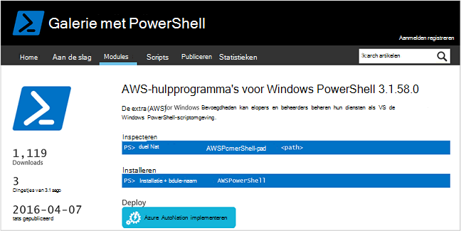
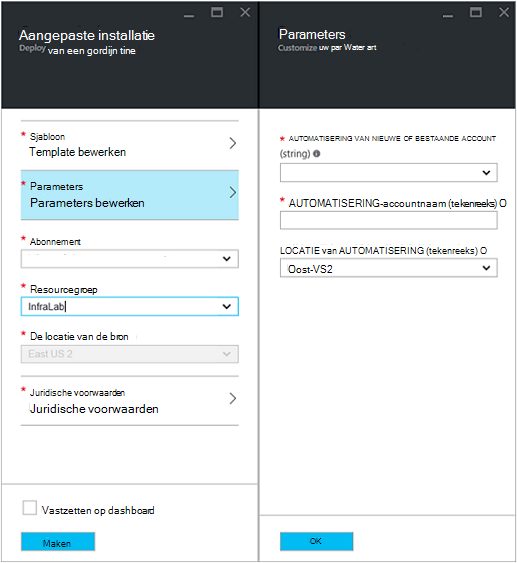
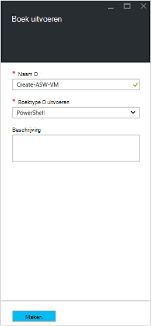
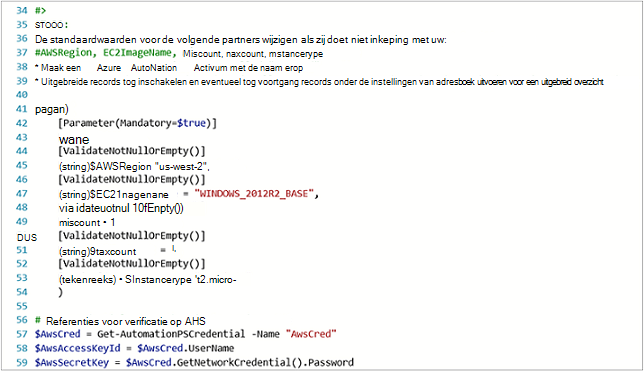
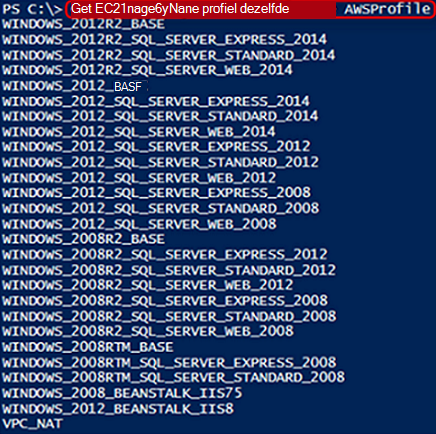
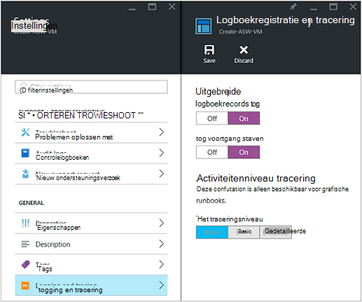
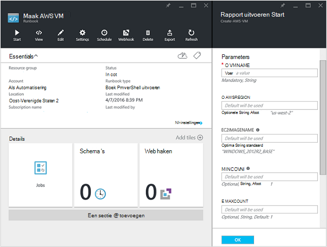
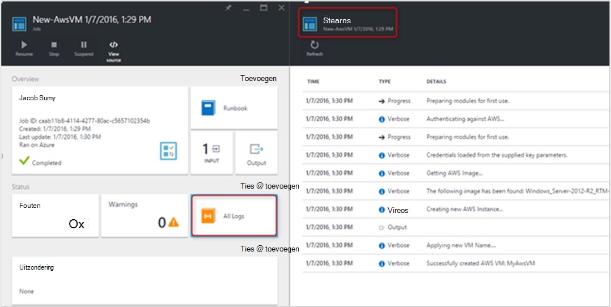
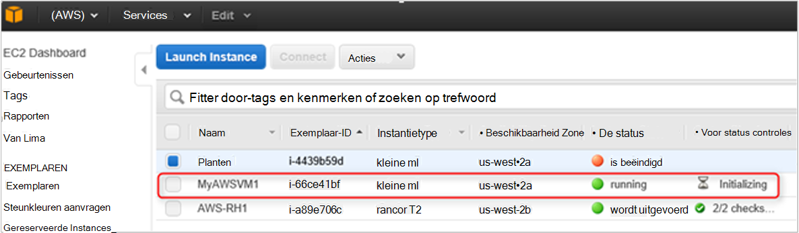

<properties
   pageTitle="Automatiseren van de implementatie van een VM in Amazon Web Services | Microsoft Azure"
   description="In dit artikel wordt beschreven hoe Azure automatisering gebruiken voor het automatiseren van het maken van een VM Amazon Web Service"
   services="automation"
   documentationCenter=""
   authors="mgoedtel"
   manager="jwhit"
   editor="" />
<tags
   ms.service="automation"
   ms.devlang="na"
   ms.topic="article"
   ms.tgt_pltfrm="na"
   ms.workload="na"
   ms.date="08/17/2016"
   ms.author="tiandert; bwren" />

# <a name="azure-automation-scenario---provision-an-aws-virtual-machine"></a>Azure scenario voor automatisering - voorziening een AWS virtuele machine 

In dit artikel wordt gedemonstreerd hoe u kunt profiteren van Azure automatiseren om het creëren van een virtuele machine in uw abonnement Amazon Web Service (AWS) en geef die VM een specifieke naam – (AWS) verwijst naar de VM 'labels'.

## <a name="prerequisites"></a>Vereisten

Voor de toepassing van dit artikel moet u een account Azure automatisering en een abonnement (AWS). Bekijk voor meer informatie over een Azure automatisering-account instellen en configureren met uw referenties (AWS) abonnement, [Verificatie configureren met Amazon Web Services](../automation/automation-sec-configure-aws-account.md).  Deze account moet worden gemaakt of bijgewerkt met uw referenties (AWS) abonnement voordat u verdergaat, omdat we verwijst naar deze rekening in de volgende stappen uit.


## <a name="deploy-amazon-web-services-powershell-module"></a>Amazon Web Services PowerShell Module implementeren

Onze provisioning runbook VM maken gebruik van de module AWS PowerShell zijn werk doet. Voer de volgende stappen uit om de module toevoegen aan uw account automatisering die is geconfigureerd met uw referenties (AWS) abonnement.  

1. Open uw webbrowser en Ga naar de [Galerie met PowerShell](http://www.powershellgallery.com/packages/AWSPowerShell/) en klik op de **distribueren naar Azure automatisering knop**.<br> 

2. U naar de aanmeldingspagina Azure en na verificatie worden genomen, wordt u aangeboden met het volgende blad en doorgestuurd naar de Portal Azure.<br> 

3. Selecteer de resourcegroep in de lijst **Groep van bronnen** en op het blad van de Parameters, de volgende gegevens:
   * Selecteer in de vervolgkeuzelijst **Nieuw of bestaand Account van automatisering (tekenreeks)** **bestaande**.  
   * Typ in het vak **Accountnaam automatisering (string)** , in de exacte naam van de account met automatisering met de referenties voor uw abonnement (AWS).  Bijvoorbeeld als u een speciale rekening met de naam **AWSAutomation**gemaakt, is dat wat u typt in het vak.
   * Selecteer de juiste regio in de vervolgkeuzelijst **Locatie van automatisering** .

4. Klik op **maken**als u klaar bent met het invoeren van de vereiste informatie.

    >[AZURE.NOTE]Tijdens het importeren van een module PowerShell in Azure automatisering, het is ook uitpakken van de cmdlets en deze activiteiten worden niet weergegeven totdat de module is volledig importeren en het extraheren van de cmdlets. Dit proces kan enkele minuten duren.  
<br>
5. Open uw automatisering account waarnaar wordt verwezen in stap 3 in de Portal Azure.
6. Klik op de tegel **activa** en de **activa** blade, selecteert u de tegel **Modules** .
7. U ziet de **AWSPowerShell** module in de lijst op de bladeserver **Modules** .

## <a name="create-aws-deploy-vm-runbook"></a>Maak AWS VM runbook implementeren

Zodra de AWS PowerShell Module is geïmplementeerd, kunnen we nu een runbook te automatiseren met het inrichten van een virtuele machine in (AWS) met een PowerShell script schrijven. De onderstaande stappen laat zien hoe u kunt profiteren van native PowerShell-script in Azure automatisering.  

>[AZURE.NOTE] Ga naar de [Galerie met PowerShell](https://www.powershellgallery.com/packages/New-AwsVM/DisplayScript)voor meer opties en informatie met betrekking tot dit script.


1. De PowerShell-script nieuw AwsVM uit de galerie met PowerShell downloaden door een PowerShell-sessie openen en het volgende te typen:<br>
   ```
   Save-Script -Name New-AwsVM -Path \<path\>
   ```
<br>
2. Open uw account automatisering en klik op de tegel **Runbooks** vanaf de Portal Azure.  
3. Selecteer in de blade **Runbooks** **een runbook toevoegen**.
4. Selecteer **Snel maken** (een nieuwe runbook maken) op het blad **een runbook toevoegen** .
5. De blade **Runbook** eigenschappen, typ een naam in het vak naam voor uw runbook en van het **type Runbook** vervolgkeuzelijst **PowerShell**selecteren en klik vervolgens op **maken**.<br> 
6. Als het blad PowerShell Runbook bewerken wordt weergegeven, kopiëren en plakken van het PowerShell-script in het canvas ontwerpen runbook.<br> <br>

    >[AZURE.NOTE] Let op het volgende wanneer u werkt met de voorbeeld-PowerShell-script:
    >
    > - De runbook bevat een aantal standaardwaarden voor parameters. Alle standaardwaarden te evalueren en zo nodig bijgewerkt.
    > - Als u uw referenties (AWS) hebt opgeslagen als een referentie actief met de naam anders dan **AWScred**, moet u het script op de regel 57 aan dienovereenkomstig bijwerken.  
    > - Als u werkt met de opdrachten AWS CLI in PowerShell, met name de runbook van dit voorbeeld moet u de regio (AWS). Anders mislukt de cmdlets.  AWS onderwerp [Opgeven (AWS) regio](http://docs.aws.amazon.com/powershell/latest/userguide/pstools-installing-specifying-region.html) weergeven in de AWS's voor PowerShell document voor meer informatie.  
<br>
7. PowerShell ISE starten om een lijst met namen van de afbeelding ophalen uit uw abonnement (AWS), en importeert u de AWS PowerShell-Module.  Verifiëren met AWS door in uw omgeving ISE met de **Get-AutomationPSCredential** **AWScred = Get-Credential**.  Hiermee wordt u gevraagd uw referenties en kunt u uw **Sleutel-ID voor toegang** bieden voor de gebruikersnaam en het **Geheim toegangstoets** voor het wachtwoord.  Zie het voorbeeld hieronder:

        #Sample to get the AWS VM available images
        #Please provide the path where you have downloaded the AWS PowerShell module
        Import-Module AWSPowerShell
        $AwsRegion = "us-west-2"
        $AwsCred = Get-Credential
        $AwsAccessKeyId = $AwsCred.UserName
        $AwsSecretKey = $AwsCred.GetNetworkCredential().Password

        # Set up the environment to access AWS
        Set-AwsCredentials -AccessKey $AwsAccessKeyId -SecretKey $AwsSecretKey -StoreAs AWSProfile
        Set-DefaultAWSRegion -Region $AwsRegion

        Get-EC2ImageByName -ProfileName AWSProfile
   De volgende uitvoergegevens:<br>
     
8. Kopieer en plak een van de namen van de afbeelding in een Automation-variabele waarnaar wordt verwezen in de runbook als **$InstanceType**. Aangezien in dit voorbeeld we zijn met behulp van de AWS gratis abonnement doorverbonden, gebruiken we **t2.micro** in ons voorbeeld runbook.
9. De runbook opslaan en klik vervolgens op **publiceren** op de runbook publiceren en vervolgens op **Ja** wanneer u wordt gevraagd.


### <a name="testing-the-aws-vm-runbook"></a>De AWS VM runbook testen
Voordat we doorgaan met het testen van de runbook, moeten we een aantal zaken controleren. Met name:

   -  Een actief voor verificatie ten opzichte van de AWS genaamd **AWScred** is gemaakt of het script is bijgewerkt en verwijst naar de naam van de activa van de referentie.  
   -  De module AWS PowerShell is geïmporteerd in Azure automatisering
   -  Een nieuwe runbook is gemaakt en parameterwaarden zijn gecontroleerd en zo nodig bijgewerkt
   -  **Uitgebreide logboekrecords** en eventueel **logboekrecords uitgevoerd** onder de runbook instellen, **logboekregistratie en tracering** is ingesteld **op**.<br> 

1. We willen de runbook start, dus klik op **Start** en klik op **OK** wanneer het blad Runbook starten wordt geopend.
2. Bieden een **VMname**op de blade Runbook Start.  Accepteer de standaardwaarden voor de parameters die u eerder in het script vooraf.  Klik op **OK** om de taak runbook.<br> 
3. Een deelvenster Project is geopend voor het runbook project dat we zojuist hebben gemaakt. Sluit dit venster.
4. Kunnen we de voortgang van de taak bekijken en **uitvoerstromen weergeven door te selecteren de tegel **Alle logboeken** in het blad runbook taak** .<br> 
5. Om te bevestigen dat de VM wordt ingericht, log in op de AWS-beheerconsole als u zich niet hebt aangemeld.<br> 

## <a name="next-steps"></a>Volgende stappen
-   Om te beginnen met een grafische runbooks, Zie [Mijn eerste grafische runbook](automation-first-runbook-graphical.md)
-   Om te beginnen met PowerShell workflow runbooks, Zie [Mijn eerste PowerShell workflow runbook](automation-first-runbook-textual.md)
-   Als u wilt meer weten over de typen runbook, hun voordelen en beperkingen, Zie [Azure automatisering runbook typen](automation-runbook-types.md)
-   Voor meer informatie over PowerShell script functie ondersteunen, Zie [Native PowerShell script in Azure automatisering ondersteunen](https://azure.microsoft.com/blog/announcing-powershell-script-support-azure-automation-2/)
