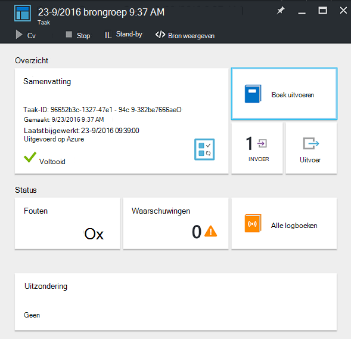

<properties
    pageTitle="Verwijdering van resourcegroepen automatiseren | Microsoft Azure"
    description="PowerShell Workflow versie van een geval Azure automatisering, met inbegrip van runbooks als u wilt verwijderen van alle resourcegroepen in uw abonnement."
    services="automation"
    documentationCenter=""
    authors="MGoedtel"
    manager="jwhit"
    editor=""
    />
<tags
    ms.service="automation"
    ms.workload="tbd"
    ms.tgt_pltfrm="na"
    ms.devlang="na"
    ms.topic="get-started-article"
    ms.date="09/26/2016"
    ms.author="magoedte"/>

# Scenario voor automatisering op Azure - verwijdering van resourcegroepen automatiseren

Veel klanten maken meer dan een bronnengroep. Sommige kan worden gebruikt voor het beheren van productietoepassingen en anderen kunnen worden gebruikt als ontwikkeling, testen en staging-omgevingen. Automatiseren van de implementatie van deze bronnen is één ding, maar een ander te ontmantelen, een bronnengroep met een klik op de knop is. U kunt deze veelvoorkomende beheertaak stroomlijnen met behulp van automatisering Azure. Dit is handig als u werkt met een abonnement van Azure een uitgavelimiet via een aanbieding lid zoals MSDN of het programma Microsoft Partner Network wolk Essentials is.

In dit scenario is gebaseerd op een runbook PowerShell en is ontworpen voor het verwijderen van een of meer resourcegroepen die u uit uw abonnement. De standaardinstelling van de runbook is om te testen voordat u verdergaat. Dit zorgt ervoor dat u per ongeluk de resourcegroep niet verwijdert voordat u bent klaar om deze procedure te voltooien.   

## Ophalen van het scenario

In dit scenario bestaat uit een PowerShell-runbook die u in de [Galerie met PowerShell downloaden kunt](https://www.powershellgallery.com/packages/Remove-ResourceGroup/1.0/DisplayScript). U kunt het ook rechtstreeks vanuit de [Galerie met Runbook](automation-runbook-gallery.md) in de Azure portal importeren.  

Runbook | Beschrijving|
----------|------------|
Verwijderen ResourceGroup | Hiermee verwijdert u een of meer resourcegroepen Azure en bijbehorende resources van het abonnement.  
 
De volgende invoerparameters zijn voor deze runbook gedefinieerd:

Parameter | Beschrijving|
----------|------------|
NameFilter (vereist) | Geeft een naam filter wilt beperken de resourcegroepen die u van plan over het verwijderen bent. U kunt meerdere waarden met een door komma's gescheiden lijst doorgeven. Het filter is niet hoofdlettergevoelig en komt overeen met een bronnengroep die de tekenreeks bevat.|
PreviewMode (optioneel) | Hiermee voert u de runbook om te zien welke resourcegroepen worden verwijderd, maar wordt geen actie uitgevoerd. De standaardwaarde is **true** om te voorkomen dat u onbedoeld verwijderen van één of meer resourcegroepen doorgegeven aan de runbook.  

## Installeer en configureer dit scenario

### Vereisten

Deze runbook wordt geverifieerd met behulp van de [Azure uitvoeren als-account](automation-sec-configure-azure-runas-account.md).    

### Installeren en uitgeven van de runbooks

Nadat u de runbook hebt gedownload, kunt u deze importeren met behulp van de procedure in [importeren runbook procedures](automation-creating-importing-runbook.md#importing-a-runbook-from-a-file-into-Azure-Automation). De runbook publiceren nadat deze is geïmporteerd in uw account voor automatisering.

## Met behulp van de runbook

De volgende stappen helpt u bij de uitvoering van deze runbook en help die u vertrouwd te maken met hoe het werkt. Je zal alleen worden testen de runbook in dit voorbeeld wordt de resourcegroep niet werkelijk te verwijderen.  

1. De Azure portal uw automatisering-account te openen en klik op **Runbooks**.
2. Selecteer de runbook **Verwijderen ResourceGroup** en klikt u op **Start**.
3. Bij het starten van de runbook de **Runbook Start** blade wordt geopend en kunt u de parameters. Typ de namen van de resourcegroepen in uw abonnement dat u voor het testen gebruiken kunt en geen kwaad veroorzaakt als u per ongeluk verwijderd.  

    >[AZURE.NOTE] Controleer of **dat previewmode** is ingesteld op **true** om te voorkomen dat de geselecteerde resourcegroepen verwijderd.  **Opmerking** deze runbook wordt de bronnengroep met de Automation-account waarop deze runbook wordt niet verwijderd.  

4. Nadat u alle parameter hebt geconfigureerd, klikt u op **OK**en de runbook zal worden in de wachtrij voor uitvoering.  

Selecteer de **taken** in de runbook om de details van de taak **Verwijderen ResourceGroup** runbook bekijken in het portal voor Azure. De taak-overzicht geeft de invoerparameters en de uitvoerstroom naast algemene informatie over het project en eventuele uitzonderingen die zijn opgetreden.  .

De **Samenvatting** bevat berichten van de uitvoer, waarschuwing en fout streams. Selecteer **uitvoer** om gedetailleerde resultaten van de uitvoering van de runbook weer te geven.  

## Volgende stappen

- Zie aan de slag maken van uw eigen runbook [maken of importeren van een runbook in Azure automatisering](automation-creating-importing-runbook.md).
- Zie [Mijn eerste PowerShell Workflow runbook](automation-first-runbook-textual.md)aan de slag met PowerShell Workflow runbooks.
