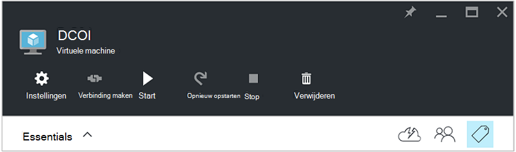

<properties
   pageTitle="Tags JSON-indeling gebruiken voor het maken van een schema voor Azure VM opstarten en afsluiten | Microsoft Azure"
   description="In dit artikel wordt beschreven hoe JSON tekenreeksen op labels gebruiken voor het automatiseren van de planning van de VM opstarten en afsluiten."
   services="automation"
   documentationCenter=""
   authors="MGoedtel"
   manager="jwhit"
   editor="tysonn" />
<tags
   ms.service="automation"
   ms.devlang="na"
   ms.topic="article"
   ms.tgt_pltfrm="na"
   ms.workload="infrastructure-services"
   ms.date="07/18/2016"
   ms.author="magoedte;paulomarquesc" />

# Scenario voor automatisering op Azure: tags JSON-indeling gebruiken voor het maken van een schema voor Azure VM opstarten en afsluiten

Klanten willen vaak plannen voor het opstarten en afsluiten van een abonnement kosten verminderen of ondersteuning van de zakelijke en technische eisen voor virtuele machines.  

In het volgende scenario kunt u automatisch opstarten en afsluiten van de VMs instellen met behulp van een code die de planning op een niveau van de resourcegroep of het niveau van de virtuele machine in Azure genoemd. Dit schema kan worden geconfigureerd van zondag tot zaterdag een opstarten en afsluiten.  

We hebben enkele opties voor out-of-the-box. Deze omvatten:
-  [Schaal van de virtuele machine wordt ingesteld](../virtual-machine-scale-sets/virtual-machine-scale-sets-overview.md) met automatisch schalen instellingen waarmee u in of uit te breiden.
- [DevTest Labs](../devtest-lab/devtest-lab-overview.md) -service met de ingebouwde mogelijkheden van het plannen van bewerkingen voor opstarten en afsluiten.

Deze opties ondersteunt echter alleen specifieke scenario's en kan niet worden toegepast op VMs infrastructure-as-a-service (IaaS).   

Wanneer de planning-label wordt toegepast op een groep, wordt het ook toegepast op alle virtuele machines binnen die groep. Als u een schema ook rechtstreeks op een VM wordt toegepast, heeft de laatste planning voorrang in de volgende volgorde:

1.  Toegepast op een resourcegroep plannen
2.  Schema toegepast op een groep en een virtuele machine in de resourcegroep
3.  Schema toegepast op een virtuele machine

In dit scenario wordt in feite een JSON-tekenreeks met een opgegeven indeling en wordt deze toegevoegd aan de waarde voor een tag planning genoemd. Vervolgens een runbook geeft een overzicht van alle resourcegroepen en virtuele machines en geeft u de schema's voor elke VM op basis van de scenario's die eerder zijn vermeld. Vervolgens doorloopt de VMs met's gekoppeld en geëvalueerd welke actie moet worden genomen. Zo bepaalt welke VMs moeten worden gestopt, afsluiten of genegeerd.

Deze runbooks worden geverifieerd via de [Azure uitvoeren als-account](../automation/automation-sec-configure-azure-runas-account.md).

## De runbooks voor het scenario downloaden

In dit scenario bestaat uit vier PowerShell Workflow runbooks die u van de [TechNet-galerie](https://gallery.technet.microsoft.com/Azure-Automation-Runbooks-84f0efc7) of de [GitHub](https://github.com/paulomarquesdacosta/azure-automation-scheduled-shutdown-and-startup) opslagplaats voor dit project downloaden kunt.

Runbook | Beschrijving
----------|----------
Test ResourceSchedule | Elke virtuele machine planning controleert en afsluiten of opstarten, afhankelijk van de planning wordt uitgevoerd.
Toevoegen-ResourceSchedule | De planning tag toegevoegd aan een groep VM of resource.
Update ResourceSchedule | Hiermee wijzigt de planning tag door deze te vervangen door een nieuwe.
Verwijderen ResourceSchedule | Hiermee verwijdert u de schema-code uit een bron- of VM.

## Installeer en configureer dit scenario

### Installeren en uitgeven van de runbooks

Na het downloaden van de runbooks, kunt u deze importeren met behulp van de procedure in [maken of importeren van een runbook in Azure automatisering](automation-creating-importing-runbook.md#importing-a-runbook-from-a-file-into-Azure-Automation).  Elke runbook publiceren nadat deze is geïmporteerd in uw account voor automatisering.

### Een schema toevoegen aan de runbook Test ResourceSchedule

Volg deze stappen als u het schema voor de runbook Test ResourceSchedule. Dit is de runbook die wordt gecontroleerd welke virtuele machines moet worden gestart, afgesloten of ongewijzigd.

1. Open uw account voor automatisering vanuit de portal Azure en klik op de tegel **Runbooks** .
2. Klik op de **schema's** naast elkaar op het blad **Test ResourceSchedule** .
3. Klik op het blad **schema's** **toevoegen een schema**.
4. Selecteer de **koppeling een planning voor uw runbook**op de bladeserver **schema's** . Selecteer **een nieuw schema maken**.
5.  Op de **nieuwe planning** blade, typ de naam van dit schema, bijvoorbeeld: *HourlyExecution*.
6. Stel de begintijd op een reeks uur voor de planning **gestart**.
7. Selecteer **Terugkeerpatroon**, en selecteer vervolgens voor **elk interval terugkeren**, **1 uur**.
8. Controleer dat **de vervaldatum instellen** op **Nee**is ingesteld en klik op **maken** om het nieuwe schema opslaan.
9. Selecteer op de **Planning Runbook** opties bladeserver, **Parameters en instellingen uitvoeren**. Voer de naam van uw abonnement in het veld **SubscriptionName** in het blad Test ResourceSchedule **Parameters** .  Dit is de enige parameter die is vereist voor de runbook.  Wanneer u klaar bent, klikt u op **OK**.  

De planning van de runbook ziet er als volgt wanneer deze voltooid:

 

## De JSON-tekenreeks opmaken

Deze oplossing in principe duurt een JSON tekenreeks van een opgegeven indeling en voegt u deze toe als de waarde voor een label genoemd planning. Vervolgens wordt een runbook geeft een overzicht van alle resourcegroepen en virtuele machines en identificeert de schema's voor elke virtuele machine.

De runbook wordt via de virtuele machines met's gekoppeld en wordt gecontroleerd welke acties moeten worden genomen. Hier volgt een voorbeeld van hoe de oplossingen moeten worden opgemaakt:

    {
       "TzId": "Eastern Standard Time",
        "0": {  
           "S": "11",
           "E": "17"
        },
        "1": {
           "S": "9",
           "E": "19"
        },
        "2": {
           "S": "9",
           "E": "19"
        },
    }

Hier volgt gedetailleerde informatie over deze structuur:

1. De indeling van deze structuur JSON is geoptimaliseerd voor de beperking van 256 tekens van de waarde van een afzonderlijke code in Azure omzeilen.

2. *TzId* vertegenwoordigt de tijdzone van de virtuele machine. Deze ID kan worden verkregen met behulp van de klasse TimeZoneInfo .NET in een PowerShell-sessie--**[System.TimeZoneInfo]:: GetSystemTimeZones()**.

    

    - Weekdagen worden aangegeven met een numerieke waarde nul op zes. De waarde nul is gelijk aan de zondag.
    - De begintijd wordt weergegeven met de **S** -kenmerk en de waarde ervan in een 24-uurs notatie.
    - Het einde worden afgesloten of tijd wordt aangegeven met het kenmerk **E** en de waarde ervan in een 24-uurs notatie.

    Als de **S** **E** kenmerken en de waarde nul (0), wordt de virtuele machine op het moment van de evaluatie in zijn huidige staat links.   

3. Als u overslaan evaluatie voor een bepaalde dag van de week wilt, niet een sectie toevoegen voor die dag van de week. In het volgende voorbeeld wordt alleen maandag wordt geëvalueerd en de andere dagen van de week worden genegeerd:

        {
          "TzId": "Eastern Standard Time",
           "1": {
             "S": "11",
             "E": "17"
           }
        }

## Label resourcegroepen of VMs

Als u wilt afsluiten VMs, moet u de VMs of de resourcegroepen waarin ze zich bevinden. Virtuele machines die geen label voor een schema worden niet geëvalueerd. Ze zijn niet daarom gestart of afgesloten.

Er zijn twee manieren tag resourcegroepen of VMs met deze oplossing. U kunt dit rechtstreeks doen vanuit de portal. Of u kunt de Add-ResourceSchedule, Update ResourceSchedule en runbooks verwijderen ResourceSchedule.

### Via de portal van label

Ga als volgt te werk om een virtuele machine of resourcegroep code in de portal:

1. De JSON-string afvlakken en controleer of er geen spaties.  De JSON-string ziet er zo uit:

        {"TzId":"Eastern Standard Time","0":{"S":"11","E":"17"},"1":{"S":"9","E":"19"},"2": {"S":"9","E":"19"},"3":{"S":"9","E":"19"},"4":{"S":"9","E":"19"},"5":{"S":"9","E":"19"},"6":{"S":"11","E":"17"}}

2. Selecteer het pictogram **label** voor een VM of resource dit schema toepassen.

    
3. Tags zijn gedefinieerd na een sleutel/waarde-paar. **Planning** typt in het veld **sleutel** en plak de JSON-tekenreeks in het veld **waarde** . Klik op **Opslaan**. Uw nieuwe code wordt nu weergegeven in de lijst van codes voor de resource.

### Label van PowerShell

Alle ingevoerde runbooks bevat help-informatie aan het begin van het script dat wordt beschreven hoe u de runbooks rechtstreeks vanuit PowerShell uitvoeren. U kunt de Add-ScheduleResource en Update-ScheduleResource runbooks bellen van PowerShell. Hiertoe vereiste parameters die het mogelijk maken of bijwerken van de planning-code op een VM of resource groep buiten de portal wordt doorgegeven.  

Als u wilt maken, toevoegen en verwijderen van codes via PowerShell, moet u eerst [uw Azure PowerShell omgeving](../powershell-install-configure.md)instellen. Nadat de installatie is voltooid, kunt u verdergaan met de volgende stappen.

### Maak een planning label met PowerShell

1. Open een PowerShell-sessie. In het volgende voorbeeld wordt vervolgens gebruiken om te verifiëren met uw account in het vak uitvoeren als en geeft u een abonnement:   

        Conn = Get-AutomationConnection -Name AzureRunAsConnection
        Add-AzureRMAccount -ServicePrincipal -Tenant $Conn.TenantID `
        -ApplicationId $Conn.ApplicationID -CertificateThumbprint $Conn.CertificateThumbprint
        Select-AzureRmSubscription -SubscriptionName "MySubscription"

2. Een hash-schema definiëren. Hier volgt een voorbeeld van hoe deze moet worden samengesteld:

        $schedule= @{ "TzId"="Eastern Standard Time"; "0"= @{"S"="11";"E"="17"};"1"= @{"S"="9";"E"="19"};"2"= @{"S"="9";"E"="19"};"3"= @{"S"="9";"E"="19"};"4"= @{"S"="9";"E"="19"};"5"= @{"S"="9";"E"="19"};"6"= @{"S"="11";"E"="17"}}

3. Definieer de parameters die voor de runbook vereist zijn. In het volgende voorbeeld wordt een VM gepland:

        $params = @{"SubscriptionName"="MySubscription";"ResourceGroupName"="ResourceGroup01"; `
        "VmName"="VM01";"Schedule"=$schedule}

    Als u een resourcegroep labelen wilt, verwijdert u de parameter *VMName* uit de $params hash-tabel als volgt:

        $params = @{"SubscriptionName"="MySubscription";"ResourceGroupName"="ResourceGroup01"; `
        "Schedule"=$schedule}

4. De Add-ResourceSchedule-runbook met de volgende parameters voor het maken van de planning-code uitvoeren:

        Start-AzureRmAutomationRunbook -Name "Add-ResourceSchedule" -Parameters $params `
        -AutomationAccountName "AutomationAccount" -ResourceGroupName "ResourceGroup01"

5. Uitvoeren om te werken aan een resourcegroep of een virtuele machine-code, de **Update-ResourceSchedule** runbook met de volgende parameters:

        Start-AzureRmAutomationRunbook -Name "Update-ResourceSchedule" -Parameters $params `
        -AutomationAccountName "AutomationAccount" -ResourceGroupName "ResourceGroup01"

### De code van een schema met PowerShell verwijderen

1. Een PowerShell-sessie openen en uitvoeren van de volgende voor het verifiëren van je account uitvoeren als te selecteren en geef een abonnement:

        Conn = Get-AutomationConnection -Name AzureRunAsConnection
        Add-AzureRMAccount -ServicePrincipal -Tenant $Conn.TenantID `
        -ApplicationId $Conn.ApplicationID -CertificateThumbprint $Conn.CertificateThumbprint
        Select-AzureRmSubscription -SubscriptionName "MySubscription"

2. Definieer de parameters die voor de runbook vereist zijn. In het volgende voorbeeld wordt een VM gepland:

        $params = @{"SubscriptionName"="MySubscription";"ResourceGroupName"="ResourceGroup01" `
        ;"VmName"="VM01"}

    Als u een label uit een resourcegroep verwijderen wilt, verwijdert u de parameter *VMName* uit de $params hash-tabel als volgt:

        $params = @{"SubscriptionName"="MySubscription";"ResourceGroupName"="ResourceGroup01"}

3. Uitvoeren van de software ResourceSchedule runbook om de code van de planning te verwijderen:

        Start-AzureRmAutomationRunbook -Name "Remove-ResourceSchedule" -Parameters $params `
        -AutomationAccountName "AutomationAccount" -ResourceGroupName "ResourceGroup01"

4. Uitvoeren om te werken aan een resourcegroep of een virtuele machine-code, het verwijderen ResourceSchedule runbook met de volgende parameters:

        Start-AzureRmAutomationRunbook -Name "Remove-ResourceSchedule" -Parameters $params `
        -AutomationAccountName "AutomationAccount" -ResourceGroupName "ResourceGroup01"

>[AZURE.NOTE] We raden proactief controleren deze runbooks (en de Staten van de virtuele machine) om te controleren dat uw virtuele machines zijn wordt afgesloten omlaag en dienovereenkomstig is gestart.  

Om de details van de taak van de runbook Test ResourceSchedule bekijken in het portal voor Azure, selecteert u de **taken** naast elkaar plaatsen van de runbook. De taak-overzicht geeft de invoerparameters en de uitvoerstroom naast algemene informatie over het project en eventuele uitzonderingen als zij is opgetreden.  

De **Samenvatting** bevat berichten van de uitvoer, waarschuwing en fout streams. Selecteer de tegel **uitvoer** om gedetailleerde resultaten van de uitvoering van de runbook weer te geven.

  

## Volgende stappen

-  Zie [Mijn eerste PowerShell workflow runbook](automation-first-runbook-textual.md)aan de slag met PowerShell workflow runbooks.
-  Zie voor meer informatie over de typen runbook, en hun voordelen en beperkingen, [Azure automatisering runbook typen](automation-runbook-types.md).
-  Ondersteuning voor functies voor meer informatie over PowerShell script, Zie [Native PowerShell script in Azure automatisering ondersteunen](https://azure.microsoft.com/blog/announcing-powershell-script-support-azure-automation-2/).
-  Zie voor meer informatie over logboekregistratie van runbook en -uitvoer, [Runbook uitvoer en berichten in Azure automatisering](automation-runbook-output-and-messages.md).
-  Zie voor meer informatie over Azure uitvoeren als een account en het verifiëren van uw runbooks met behulp van deze, [runbooks verifiëren met Azure uitvoeren als-account](../automation/automation-sec-configure-azure-runas-account.md).
