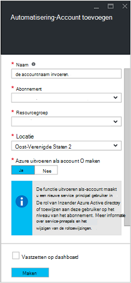
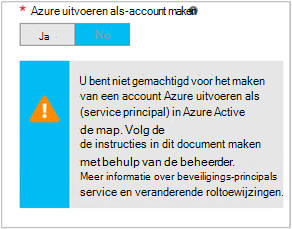

<properties
   pageTitle="Azure AD-gebruikersaccount configureren | Microsoft Azure"
   description="In dit artikel wordt beschreven hoe u van Azure AD-account gebruikersreferentie voor runbooks in Azure automatisering verifiëren van ARM en AANT."
   services="automation"
   documentationCenter=""
   authors="MGoedtel"
   manager="jwhit"
   editor="tysonn"
   keywords="Azure active directory-gebruiker azure service management azure ad-gebruikersaccount" />
<tags
   ms.service="automation"
   ms.devlang="na"
   ms.topic="get-started-article"
   ms.tgt_pltfrm="na"
   ms.workload="infrastructure-services"
   ms.date="09/12/2016"
   ms.author="magoedte" />

# Runbooks met Azure Service Management en Resource Manager verifiëren

In dit artikel beschrijft de stappen die u uitvoeren moet om een Azure AD-account voor Azure automatisering runbooks uitgevoerd op Azure Service Management (ASM)-of Azure Resource Manager (ARM) configureren.  Terwijl u zich nog steeds voor dat de identiteit van een ondersteunde verificatie voor uw ARM op basis van runbooks, is de aanbevolen methode met behulp van de nieuwe account Azure uitvoeren als.       

## Maak een nieuwe Azure Active Directory-gebruiker

1. Log in op de klassieke Portal Azure als servicebeheerder voor de Azure abonnement dat u wilt beheren.
2. Selecteer **Active Directory**en selecteer vervolgens de naam van de organisatiemap van uw.
3. Klik op het tabblad **gebruikers** en selecteer vervolgens in het gebied opdracht **Gebruiker toevoegen**.
4. Selecteer op de pagina **ons over deze gebruiker** onder **Type gebruiker** **nieuwe gebruiker in uw organisatie**.
5. Voer een gebruikersnaam in.  
6. Selecteer de naam van de map die is gekoppeld aan uw abonnement op de pagina Active Directory op Azure.
7. Bieden een eerste en laatste naam, een beschrijvende naam en gebruiker in de lijst **rollen** op de pagina **gebruikersprofiel** .  Doe niet **meerledige verificatie inschakelen**.
8. Noteer de volledige naam van de gebruiker en het tijdelijke wachtwoord.
9. Selecteer **Instellingen > beheerders > toevoegen**.
10. Typ de volledige naam van de gebruiker die u hebt gemaakt.
11. Selecteer het abonnement dat u wilt dat de gebruiker te beheren.
12. Azure afgemeld en meld u vervolgens weer met de account die u zojuist hebt gemaakt. U wordt gevraagd het wachtwoord te wijzigen.

## Maken van een account voor automatisering in Azure klassieke Portal
In deze sectie kunt uitvoert u de volgende stappen uit om een nieuwe Azure automatisering-account maken in de Azure-Portal die wordt gebruikt bij het beheren van bronnen in de modus voor ASM en ARM runbooks.  

>[AZURE.NOTE] Automatisering-accounts die zijn gemaakt met de klassieke Azure-Portal kunnen worden beheerd door zowel de klassieke Azure en Azure Portal en een set cmdlets. Zodra de account is gemaakt, maakt het niet uit te maken en beheren van bronnen binnen de rekening. Als u van plan bent om door te gaan naar de klassieke Azure-Portal te gebruiken, moet u deze in plaats van de Portal Azure automatisering accounts maken.

1. Log in op de klassieke Portal Azure als servicebeheerder voor de Azure abonnement dat u wilt beheren.
2. Selecteer de **automatisering**.
3. Selecteer op de pagina **automatisering** **een automatisering-Account maken**.
4. Typ een naam voor uw nieuwe account voor automatisering en selecteer een **regio** in de vervolgkeuzelijst in het **maken van een Account met automatisering** .  
5. Klik op **OK** om de instellingen te accepteren en de account te maken.
6. Nadat deze is gemaakt, wordt deze op de pagina **automatisering** vermeld.
7. Klik op de account en deze brengt u naar de pagina van het Dashboard.  
8. Selecteer op de pagina automatisering Dashboard **activa**.
9. Selecteer op de pagina **activa** **Instellingen toevoegen** onder aan de pagina bevindt.
10. Selecteer **Referentie toevoegen**op de pagina **Instellingen toevoegen** .
11. **Windows PowerShell referentie** selecteren in de vervolgkeuzelijst **Referentietype** en geef een naam op voor de referentie op de pagina **Referenties opgeven** .
12. Gemaakt op de volgende **Referentie definiëren** paginatype in de gebruikersnaam van de gebruikersaccount van het AD eerder in het veld **Gebruikersnaam** en het wachtwoord in de velden **wachtwoord** en **Bevestig het wachtwoord** . Klik op **OK** om uw wijzigingen te slaan.

## Een automatisering-account maken in de Portal Azure

In deze sectie kunt uitvoert u de volgende stappen uit om een nieuwe Azure automatisering-account maken in de Portal Azure die u met uw runbooks beheren van bronnen in de modus van de ARM.  

1. Log in op de Azure portal als servicebeheerder voor de Azure abonnement dat u wilt beheren.
2. Selecteer **de rekeningen automatisering**.
3. Klik in de blade automatisering-Accounts op **toevoegen**. 
2. In het blad **Automatisering Account toevoegen** in het vak **naam** type een naam voor uw nieuwe account voor automatisering.
5. Als er meer dan één abonnement, opgeven voor de nieuwe account en een nieuwe of bestaande **resourcegroep** en een Azure datacenter **locatie**.
3. Selecteer de waarde **Nee** voor de optie **account maken Azure uitvoeren als** en klikt u op de knop **maken** .  

    >[AZURE.NOTE] Als u niet de uitvoeren als-account maken door de optie **Nee**, u krijgt een waarschuwing in het blad **Automatisering Account toevoegen** .  Terwijl de account is gemaakt en aan de rol van **Inzender** in het abonnement toegewezen, wordt er een bijbehorende verificatie-identiteit binnen de Active Directory van uw abonnementen en daarom geen toegang tot bronnen op uw abonnement.  Hiermee voorkomt u dat een runbooks die verwijst naar deze rekening kunnen worden geverifieerd en het uitvoeren van taken ten opzichte van de ARM-bronnen.

    

4. Terwijl de Azure de automatisering-account maakt, kunt u de voortgang van de **meldingen** bijhouden in het menu.

Bij het maken van de referentie is voltooid, moet u referenties activa om de automatisering-Account koppelen aan de eerder gemaakte AD-gebruikersaccount wilt maken.  Vergeet niet dat we alleen de automatisering-account gemaakt en is niet gekoppeld aan een verificatie-identiteit.  Voer de stappen uit die worden beschreven in de [activa van de referentie in Azure automatisering artikel](../automation/automation-credentials.md#creating-a-new-credential) en geef de waarde voor de **gebruikersnaam** in de notatie **domein\gebruiker**.

## De referentie in een runbook gebruiken

U kunt de referentie in een runbook met de [Get-AutomationPSCredential](http://msdn.microsoft.com/library/dn940015.aspx) -activiteit ophalen en vervolgens verbinding maken met uw abonnement Azure met [Add-AzureAccount](http://msdn.microsoft.com/library/azure/dn722528.aspx) gebruiken. Als de referentie een beheerder meerdere Azure abonnementen is, moet u ook [Selecteren AzureSubscription](http://msdn.microsoft.com/library/dn495203.aspx) gebruiken om aan te geven de juiste is. Dit wordt weergegeven in het voorbeeld is Windows PowerShell hieronder die meestal wordt weergegeven boven aan de meeste Azure automatisering runbooks.

    $cred = Get-AutomationPSCredential –Name "myuseraccount.onmicrosoft.com"
    Add-AzureAccount –Credential $cred
    Select-AzureSubscription –SubscriptionName "My Subscription"

Herhaal deze regels na alle [controlepunten](http://technet.microsoft.com/library/dn469257.aspx#bk_Checkpoints) in de runbook. Als de runbook wordt onderbroken en op een andere werknemer hervat, moet deze de verificatie opnieuw uitvoeren.

## Volgende stappen
* Bekijk de runbook van verschillende typen en de stappen voor het maken van uw eigen runbooks in het volgende artikel [Azure automatisering runbook typen](../automation/automation-runbook-types.md)
