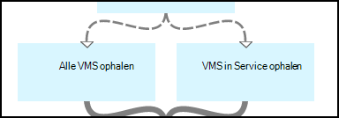

<properties 
    pageTitle="Starten en stoppen van virtuele machines - grafiek | Microsoft Azure"
    description="PowerShell Workflow versie van Azure automatisering scenario, met inbegrip van de runbooks te starten en stoppen van klassieke virtuele machines."
    services="automation"
    documentationCenter=""
    authors="mgoedtel"
    manager="jwhit"
    editor="tysonn" />
<tags 
    ms.service="automation"
    ms.devlang="na"
    ms.topic="article"
    ms.tgt_pltfrm="na"
    ms.workload="infrastructure-services"
    ms.date="07/06/2016"
    ms.author="bwren" />

# Azure scenario voor automatisering - starten en stoppen van virtuele machines

In dit scenario voor automatisering Azure bevat runbooks om te starten en stoppen van klassieke virtuele machines.  U kunt dit scenario voor het volgende gebruiken:  

- Gebruik het runbooks zonder wijziging in uw eigen omgeving. 
- Wijzig de runbooks voor het uitvoeren van aangepaste functionaliteit.  
- De runbooks aanroepen vanuit een andere runbook als onderdeel van een algemene oplossing. 
- De runbooks als zelfstudie gebruiken voor meer informatie over authoring concepten runbook. 

> [AZURE.SELECTOR]
- [Grafische](automation-solution-startstopvm-graphical.md)
- [PowerShell Workflow](automation-solution-startstopvm-psworkflow.md)

Dit is de versie van de grafische runbook van dit scenario. Het is ook beschikbaar via [PowerShell Workflow runbooks](automation-solution-startstopvm-psworkflow.md).

## Ophalen van het scenario

Dit scenario bestaat uit twee twee grafische runbooks die u van de volgende koppelingen downloaden kunt.  Zie de [PowerShell Workflow versie](automation-solution-startstopvm-psworkflow.md) van dit scenario voor koppelingen naar de PowerShell Workflow runbooks.

| Runbook | Koppeling | Type | Beschrijving |
|:---|:---|:---|:---|
| StartAzureClassicVM | [Start Azure klassieke VM grafische Runbook](https://gallery.technet.microsoft.com/scriptcenter/Start-Azure-Classic-VM-c6067b3d) | Grafische | Alle klassieke virtuele machines in een Azure-abonnement of alle virtuele machines met de naam van een bepaalde service gestart. |
| StopAzureClassicVM | [Azure klassieke VM grafische Runbook stoppen](https://gallery.technet.microsoft.com/scriptcenter/Stop-Azure-Classic-VM-397819bd) | Grafische | Hiermee stopt u alle virtuele machines in een automatisering-account of alle virtuele machines met de naam van een bepaalde service.  |

## Installeren en configureren van het scenario

### 1. Installeer de runbooks

Na het downloaden van de runbooks, kunt u deze met de procedure in de [grafische runbook procedures](automation-graphical-authoring-intro.md#graphical-runbook-procedures)importeren.

### 2. Bekijk de beschrijving en de vereisten
De runbooks omvatten een activiteit **Read Me** met een beschrijving en benodigde activa genoemd.  U kunt deze gegevens weergeven door de activiteit **Read Me** en vervolgens de **Workflow Script** -parameter.  U kunt dezelfde informatie ook opvragen uit dit artikel. 

### 3. activa configureren
De runbooks moeten de volgende elementen die u moet maken en vullen met de juiste waarden.  De namen zijn standaard.  U kunt activa met verschillende namen gebruiken als u deze namen in de [Invoerparameters](#using-the-runbooks) opgeven bij het starten van de runbook.

| Activatype | Standaardnaam | Beschrijving |
|:---|:---|:---|:---|
| [Referentie](automation-credentials.md) | AzureCredential | Referenties voor een account die is gemachtigd om te starten en stoppen van virtuele machines in de Azure-abonnement bevat.  |
| [Variabele](automation-variables.md) | AzureSubscriptionId | Bevat de abonnement-ID van uw abonnement Azure. |

## Met behulp van het scenario

### Parameters

De runbooks hebben de volgende [Invoerparameters](automation-starting-a-runbook.md#runbook-parameters).  U moet waarden opgeven voor de verplichte parameters en u kunt desgewenst waarden voor andere parameters afhankelijk van uw vereisten.

| Parameter | Type | Verplicht | Beschrijving |
|:---|:---|:---|:---|
| Servicenaam | tekenreeks | Nee | Als een waarde is opgegeven, worden alle virtuele machines met die servicenaam zijn gestart of gestopt.  Als geen waarde is opgegeven, worden alle klassieke virtuele machines in de Azure abonnement de gestart of gestopt. |
| AzureSubscriptionIdAssetName | tekenreeks | Nee | Bevat de naam van de [variabele activa](#installing-and-configuring-the-scenario) met de abonnement-ID van uw abonnement op Azure.  Als u geen waarde opgeeft, wordt *AzureSubscriptionId* gebruikt.  |
| AzureCredentialAssetName | tekenreeks | Nee | Bevat de naam van de [referentie actief](#installing-and-configuring-the-scenario) met de referenties voor de runbook te gebruiken.  Als u geen waarde opgeeft, wordt *AzureCredential* gebruikt.  |

### De runbooks starten

U kunt een van de methoden bij het [starten van een runbook in Azure automatisering](automation-starting-a-runbook.md) start een van de runbooks in dit artikel.

De volgende voorbeeldopdrachten gebruikt Windows PowerShell voor het uitvoeren van **StartAzureClassicVM** om te beginnen alle virtuele machines met de naam *MyVMService*.

    $params = @{"ServiceName"="MyVMService"}
    Start-AzureAutomationRunbook –AutomationAccountName "MyAutomationAccount" –Name "StartAzureClassicVM" –Parameters $params

### Uitvoer

De runbooks wordt [uitvoer van een bericht](automation-runbook-output-and-messages.md) voor elke virtuele machine die aangeeft of er met de instructie starten of stoppen met succes is ingediend.  U kunt zoeken naar een bepaalde tekenreeks in de uitvoer van het resultaat voor elke runbook bepalen.  De mogelijke uitvoertekenreeksen worden in de volgende tabel weergegeven.

| Runbook | Voorwaarde | Bericht |
|:---|:---|:---|
| StartAzureClassicVM | Virtuele machine wordt al uitgevoerd.  | MyVM wordt al uitgevoerd. |
| StartAzureClassicVM | Start-aanvraag voor virtuele machine is verzonden | MyVM is gestart |
| StartAzureClassicVM | Startaanvraag voor virtuele machine is mislukt  | MyVM kan niet worden gestart |
| StopAzureClassicVM | Virtuele machine wordt al uitgevoerd.  | MyVM is al gestopt. |
| StopAzureClassicVM | Start-aanvraag voor virtuele machine is verzonden | MyVM is gestart |
| StopAzureClassicVM | Startaanvraag voor virtuele machine is mislukt  | MyVM kan niet worden gestart |

Hieronder staat een afbeelding van het gebruik van de **StartAzureClassicVM** als een [runbook kind](automation-child-runbooks.md) in een grafische runbook monster.  Dit wordt de voorwaardelijke koppelingen gebruikt in de volgende tabel.

| Koppeling | Criteria |
|:---|:---|
| Geslaagde koppeling | $ActivityOutput [StartAzureClassicVM]-als "\* is gestart"    |
| Fout-koppeling   | $ActivityOutput [StartAzureClassicVM]-notlike "\* is gestart" |

## In detail

Hieronder vindt u een gedetailleerde uitsplitsing van de runbooks in dit scenario.  U kunt deze gegevens gewoon meer van hen voor het ontwerpen van uw eigen automatiseringsscenario's of de runbooks aanpassen.
 

### Verificatie

De runbook begint met de activiteiten de [referenties](automation-configuring.md#configuring-authentication-to-azure-resources) en Azure abonnement die wordt gebruikt voor de rest van de runbook instellen.

De eerste twee activiteiten, **De abonnement-Id ophalen** en **Azure referenties ophalen**, ophalen van de [activa](#installing-the-runbook) die worden gebruikt door de volgende twee activiteiten.  Deze activiteiten kunnen de activa direct opgeven, maar ze moeten de elementnamen.  Aangezien we zijn zodat de gebruiker deze namen in de [Invoerparameters](#using-the-runbooks)opgeven, moeten we deze activiteiten voor het ophalen van de activa met een naam die door een invoerparameter.

**Toevoegen-AzureAccount** stelt u de referenties die worden gebruikt voor de rest van de runbook.  De referentie actief dat deze opgehaald uit de **Azure referenties ophalen** moet toegang hebben tot starten en stoppen van virtuele machines in de Azure abonnement.  Het abonnement dat wordt gebruikt is door de **Select-AzureSubscription** waarin de abonnements-Id van **De abonnement-Id ophalen**geselecteerd.

### Ophalen van virtuele machines

De runbook moet bepalen welke virtuele machines die met werkt en of ze zijn al gestart of (afhankelijk van de runbook gestopt).   Een van de twee activiteiten zal het VMs ophalen.  **VMs ophalen in de Service** wordt uitgevoerd als de *servicenaam* invoerparameter voor de runbook een waarde bevat.  **Alle VMs ophalen** wordt uitgevoerd als de *servicenaam* invoerparameter voor de runbook niet een waarde bevat.  Deze logica wordt uitgevoerd door de voorwaardelijke koppelingen voorafgaand aan elke activiteit.

Beide activiteiten gebruik van de cmdlet **Get-AzureVM** .  **Alle VMs ophalen** gebruikt de **ListAllVMs** -parameter wordt ingesteld om alle virtuele machines.  **VMs ophalen in de Service** maakt gebruik van de parameter **GetVMByServiceAndVMName** is ingesteld en geeft de **servicenaam** invoerparameter voor de parameter **servicenaam** .  

### VMs samenvoegen

De activiteit **VMs samenvoegen** is vereist voor het leveren van input voor **Start-en AzureVM** die de naam en de naam van de vm(s) te starten moet.  Deze invoer kan afkomstig zijn uit **Alle VMs ophalen** of **VMs ophalen in de Service**, maar **Start AzureVM** kan slechts één activiteit voor de invoer van opgeven.   

Het scenario is het maken van **VMs samenvoegen** die de cmdlet **Schrijven uitvoer** wordt uitgevoerd.  De parameter **InputObject** voor deze cmdlet is een PowerShell-expressie die de invoer van de vorige twee activiteiten combineert.  Slechts één van deze activiteiten worden uitgevoerd, zodat alleen een set van de output wordt verwacht.  **Start AzureVM** kunt die uitvoer voor de invoerparameters. 

### Starten en stoppen van virtuele machines

 

Afhankelijk van de runbook wilt de volgende activiteiten starten of stoppen van de runbook **Start AzureVM** of **Stop AzureVM**.  Aangezien de activiteit wordt voorafgegaan door een koppeling van de pijpleiding, wordt het eenmaal uitgevoerd voor elk object dat wordt geretourneerd uit de **VMs samenvoegen**.  De koppeling is voorwaardelijke zodat de activiteit wordt alleen uitgevoerd als de *RunningState* van de virtuele machine *gestopt* voor **Start-AzureVM** en *gestart* voor **Stop-AzureVM wordt**. Als niet aan deze voorwaarde is voldaan, wordt **Kennis is gebeurd** of **Kennis al gestopt** uitgevoerd voor het verzenden van een bericht **Schrijven-Output**maken.

### Uitvoer verzenden

 

De laatste stap in het runbook is voor het verzenden van uitvoer of de aanvraag starten of stoppen voor elke virtuele machine met succes is ingediend. Er is een afzonderlijke activiteit voor elke **Uitvoer van schrijven** en we bepalen welke met voorwaardelijke koppelingen uit te voeren.  **Kennis VM gestart** of **Gestopt van VM kennis** wordt uitgevoerd als *OperationStatus* *geslaagd is*.  Als de *OperationStatus* is een andere waarde, wordt **Kennis is mislukt te starten** of **Stoppen in kennis kan** uitgevoerd.

## Volgende stappen

- [Grafische ontwerpen in Azure automatisering](automation-graphical-authoring-intro.md)
- [Onderliggende runbooks in Azure automatisering](automation-child-runbooks.md) 
- [Runbook output en berichten in Azure automatisering](automation-runbook-output-and-messages.md)