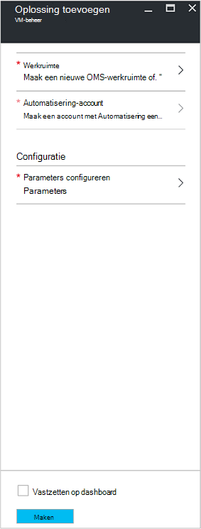
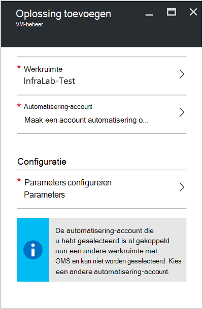
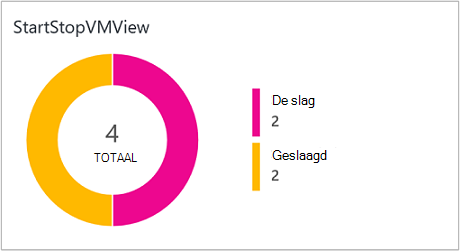
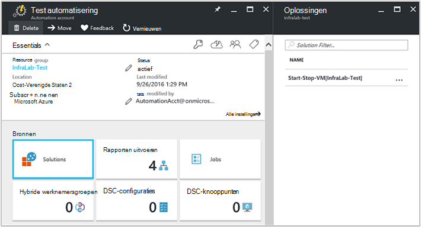
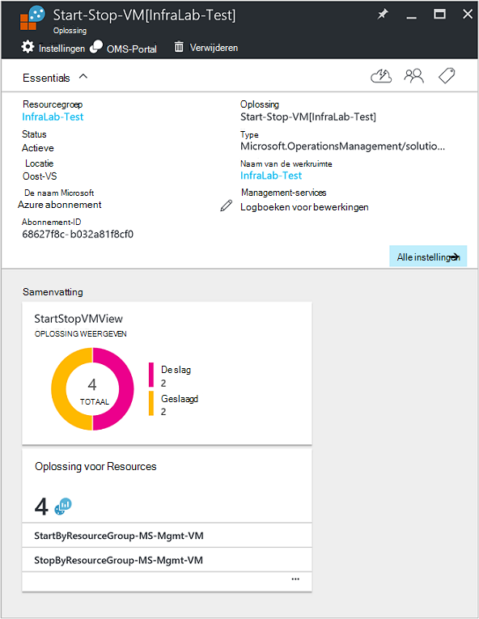

<properties
    pageTitle="Start/Stop VMs tijdens rustige uren [voorbeeld] oplossing | Microsoft Azure"
    description="VM-beheeroplossingen begint en stopt de Azure Resource Manager virtuele Machines volgens een schema en proactief bewaken van logboek Analytics."
    services="automation"
    documentationCenter=""
    authors="MGoedtel"
    manager="jwhit"
    editor=""
    />
<tags
    ms.service="automation"
    ms.workload="tbd"
    ms.tgt_pltfrm="na"
    ms.devlang="na"
    ms.topic="get-started-article"
    ms.date="10/07/2016"
    ms.author="magoedte"/>

# Start/Stop VMs tijdens rustige uren [voorbeeld]-oplossing in automatisering

Het starten en stoppen van VMs tijdens rustige uren [voorbeeld]-oplossing wordt gestart, stopt de bronnenbeheerder Azure virtuele machines op een door de gebruiker gedefinieerd schema en inzicht geven in het succes van de taken automatiseren die starten en stoppen van de virtuele machines met OMS logboek Analytics.  

## Vereisten

- De runbooks werkt met een [Azure uitvoeren als-account](automation-sec-configure-azure-runas-account.md).  De uitvoeren als-account is de gewenste verificatiemethode omdat certificaatverificatie wordt gebruikt in plaats van een wachtwoord, die vaak worden gewijzigd of verloopt.  

- Deze oplossing kan alleen VMs in de bronnengroep als waarin de automatisering account zich bevindt en hetzelfde abonnement beheren.  

- Deze oplossing implementeert alleen naar Azure regio - Zuidoost Australië, Oost-Verenigde Staten, Zuidoost-Azië en West-Europa.  De runbooks die de VM planning beheren kunt richten VMs in elke regio.  

- Een abonnement op Office 365 business class is voor het verzenden van e-mailberichten bij het voltooien van de start- en stoptijden VM runbooks vereist.  

## Onderdelen van oplossingen

Deze oplossing bestaat uit de volgende bronnen die worden geïmporteerd en toegevoegd aan uw account voor automatisering.

### Runbooks

Runbook | Beschrijving|
--------|------------|
CleanSolution-MS-Mgmt-VM | Deze runbook wordt alle resources en planningen verwijderd wanneer u de oplossing verwijderen uit uw abonnement gaat.|  
MS-SendMailO365-Mgmt | Deze runbook stuurt een e-mail via Exchange voor Office 365.|
StartByResourceGroup-MS-Mgmt-VM | Deze runbook is bedoeld om te beginnen VMs (beide klassieke en ARM VMs) die zich bevindt in een bepaalde lijst van Azure resource groep(en).
StopByResourceGroup-MS-Mgmt-VM | Deze runbook is bedoeld om te stoppen met VMs (beide klassieke en ARM VMs) die zich bevindt in een bepaalde lijst van Azure resource groep(en).|
 

### Variabelen

Variabele | Beschrijving|
---------|------------|
**MS-SendMailO365-Mgmt** Runbook ||
SendMailO365, IsSendEmail, MS, Mgmt | Hiermee geeft u als StartByResourceGroup MS-Mgmt VM en StopByResourceGroup-MS-Mgmt-VM runbooks na voltooiing per e-mail kunt verzenden.  Selecteer **True** inschakelen en **False** e-mail waarschuwingen uitschakelen. Standaardwaarde is **False**.| 
**StartByResourceGroup-MS-Mgmt-VM** Runbook ||
StartByResourceGroup-ExcludeList-MS-Mgmt-VM | Geef de namen van de VM worden uitgesloten van de werking van beheer; Scheid namen door een puntkomma (;). Waarden zijn hoofdlettergevoelig en jokerteken (sterretje) wordt ondersteund.|
StartByResourceGroup-SendMailO365-EmailBodyPreFix-MS-Mgmt | Tekst die kan worden toegevoegd aan het begin van de berichttekst van het e-mailadres.|
StartByResourceGroup-SendMailO365-EmailRunBookAccount-MS-Mgmt | Hiermee geeft u de naam van de automatisering rekening met de e-runbook.  **Deze variabele niet wijzigen.**|
StartByResourceGroup-SendMailO365-EmailRunbookName-MS-Mgmt | Hiermee geeft u de naam van de e-runbook.  Dit wordt door de StartByResourceGroup MS-Mgmt VM en StopByResourceGroup-MS-Mgmt-VM runbooks gebruikt om e-mail te verzenden.  **Deze variabele niet wijzigen.**|
StartByResourceGroup-SendMailO365-EmailRunbookResourceGroup-MS-Mgmt | Hiermee geeft u de naam van de bronnengroep met de e-runbook.  **Deze variabele niet wijzigen.**|
StartByResourceGroup-SendMailO365-EmailSubject-MS-Mgmt | Hiermee geeft u de tekst voor de onderwerpregel van het e-mailbericht.|  
StartByResourceGroup-SendMailO365-EmailToAddress-MS-Mgmt | Hiermee geeft u de geadresseerden van het e-mailbericht.  Afzonderlijke namen opgeven met behulp van puntkomma (;).|
StartByResourceGroup-TargetResourceGroups-MS-Mgmt-VM | Geef de namen van de VM worden uitgesloten van de werking van beheer; Scheid namen door een puntkomma (;). Waarden zijn hoofdlettergevoelig en jokerteken (sterretje) wordt ondersteund.  Standaardwaarde (sterretje) bevat alle resourcegroepen in het abonnement.|
StartByResourceGroup-TargetSubscriptionID-MS-Mgmt-VM | Hiermee geeft u het abonnement met VMs door deze oplossing moeten worden beheerd.  Dit moet het hetzelfde abonnement waar de rekening van de automatisering van deze oplossing zich bevindt.|
**StopByResourceGroup-MS-Mgmt-VM** Runbook ||
StopByResourceGroup-ExcludeList-MS-Mgmt-VM | Geef de namen van de VM worden uitgesloten van de werking van beheer; Scheid namen door een puntkomma (;). Waarden zijn hoofdlettergevoelig en jokerteken (sterretje) wordt ondersteund.|
StopByResourceGroup-SendMailO365-EmailBodyPreFix-MS-Mgmt | Tekst die kan worden toegevoegd aan het begin van de berichttekst van het e-mailadres.|
StopByResourceGroup-SendMailO365-EmailRunBookAccount-MS-Mgmt | Hiermee geeft u de naam van de automatisering rekening met de e-runbook.  **Deze variabele niet wijzigen.**|
StopByResourceGroup-SendMailO365-EmailRunbookResourceGroup-MS-Mgmt | Hiermee geeft u de naam van de bronnengroep met de e-runbook.  **Deze variabele niet wijzigen.**|
StopByResourceGroup-SendMailO365-EmailSubject-MS-Mgmt | Hiermee geeft u de tekst voor de onderwerpregel van het e-mailbericht.|  
StopByResourceGroup-SendMailO365-EmailToAddress-MS-Mgmt | Hiermee geeft u de geadresseerden van het e-mailbericht.  Afzonderlijke namen opgeven met behulp van puntkomma (;).|
StopByResourceGroup-TargetResourceGroups-MS-Mgmt-VM | Geef de namen van de VM worden uitgesloten van de werking van beheer; Scheid namen door een puntkomma (;). Waarden zijn hoofdlettergevoelig en jokerteken (sterretje) wordt ondersteund.  Standaardwaarde (sterretje) bevat alle resourcegroepen in het abonnement.|
StopByResourceGroup-TargetSubscriptionID-MS-Mgmt-VM | Hiermee geeft u het abonnement met VMs door deze oplossing moeten worden beheerd.  Dit moet het hetzelfde abonnement waar de rekening van de automatisering van deze oplossing zich bevindt.|  
 

### Schema 's

Planning | Beschrijving|
---------|------------|
StartByResourceGroup, planning, MS, Mgmt | Planning voor de StartByResourceGroup runbook waarmee het starten van VMs beheerd door deze oplossing.|
StopByResourceGroup, planning, MS, Mgmt | Planning voor de StopByResourceGroup runbook waarmee het afsluiten van VMs beheerd door deze oplossing.|

### Referenties

Referentie | Beschrijving|
-----------|------------|
O365Credential | Hiermee geeft u een geldige gebruikersaccount voor Office 365 voor het verzenden van e-mail.  Alleen vereist als de variabele SendMailO365-IsSendEmail-MS-Mgmt is ingesteld op **True**.

## Configuratie

Voer de volgende stappen voor het starten en stoppen van VMs tijdens rustige uren [voorbeeld]-oplossing toevoegen aan uw account automatisering en configureert u de variabelen voor het aanpassen van de oplossing.

1. Selecteer de tegel **Marketplace** van het home-scherm in de portal Azure.  Als de tegel niet langer wordt vastgemaakt aan het beginscherm van het linkernavigatievenster, selecteer **Nieuw**.  
2. In de blade Marketplace **VM starten** in het zoekvak typt en selecteert u de oplossing **Starten en stoppen van VMs [voorbeeld] buiten kantooruren** in de zoekresultaten.  
3. Neem de samenvattingsinformatie in de blade **VMs [voorbeeld] buiten kantooruren starten en stoppen** voor de geselecteerde oplossing, en klik vervolgens op **maken**.  
4. De blade **Oplossing toevoegen** wordt weergegeven waarbij u wordt gevraagd de oplossing configureren voordat u deze in uw abonnement voor automatisering importeren kunt.     
5.  **Werkruimte** op de bladeserver **Oplossing toevoegen** en hier selecteert een OMS-werkruimte die is gekoppeld aan de dezelfde Azure abonnement dat de rekening van de automatisering in of maak een nieuwe OMS-werkruimte.  Als u een werkruimte OMS niet hebt, kunt u **Nieuwe werkruimte maken** selecteren en op de bladeserver **OMS werkruimte** als volgt te werk: 
   - Geef een naam voor de nieuwe **Werkruimte OMS**.
   - Selecteer een **abonnement** aan te koppelen door in de vervolgkeuzelijst te selecteren als de standaardwaarde geselecteerd niet geschikt is.
   - U kunt een nieuwe resourcegroep maken of een bestaande resourcegroep selecteren voor de **Resourcegroep**.  
   - Selecteer een **locatie**.  Op dit moment zijn de enige locaties beschikbaar voor selectie **Zuidoost Australië**, **Oost-Verenigde Staten**, **Zuidoost-Azië**en **West-Europa**.
   - Selecteer een **laag in prijs**.  De oplossing wordt aangeboden in twee lagen: vrij en OMS laag betaald.  De vrij laag heeft een limiet op het bedrag van de verzamelde gegevens dagelijks bewaartermijn en runbook taak runtime minuten.  De laag OMS betaald heeft geen een limiet op de hoeveelheid gegevens per dag verzameld.  

        > [AZURE.NOTE]
        > Terwijl de zelfstandige laag betaald als optie wordt weergegeven, is het niet van toepassing.  Als u deze en gaat u verder met het maken van deze oplossing in uw abonnement, wordt een fout veroorzaakt.  Dit wordt opgelost wanneer deze oplossing wordt officieel uitgebracht. Als u deze oplossing gebruikt, worden alleen automatisering taak minuten gebruikt en meld u via de mond.  De oplossing biedt geen extra OMS knooppunten toevoegen aan uw omgeving.  

6. Na de vereiste informatie verstrekken over de blade **OMS werkruimte** , klikt u op **maken**.  Terwijl de gegevens worden gecontroleerd en de werkruimte wordt gemaakt, kunt u de voortgang van de **meldingen** bijhouden in het menu.  U wordt teruggeleid naar de blade **Oplossing toevoegen** .  
7. Selecteer de **Account die automatisering**op het blad **Oplossing toevoegen** .  Als u een nieuwe OMS werkruimte maken wilt, moet u zult ook een nieuwe automatisering account maken die gekoppeld aan de nieuwe OMS werkruimte opgegeven eerder worden, met inbegrip van uw abonnement Azure, resourcegroep en regio.  U kunt **een Automation-account maken** en op de blade **-account toevoegen automatisering** bieden het volgende: 
  - Voer in het veld **naam** de naam van de rekening van de automatisering.

    Alle andere opties worden automatisch ingevuld op basis van de geselecteerde OMS-werkruimte en deze opties kunnen niet worden gewijzigd.  Een Azure uitvoeren als-account is de standaardverificatiemethode voor de runbooks van deze oplossing is opgenomen.  Nadat u op **OK**klikt, de configuratieopties worden gevalideerd en de automatisering-account is gemaakt.  U kunt de voortgang van de **meldingen** bijhouden in het menu. 

    Anders kunt u een bestaande account automatisering uitvoeren als.  Opmerking dat de account kan niet al zijn gekoppeld aan een andere werkruimte OMS, anders een bericht worden weergegeven in het blad om u te informeren.  Als deze al is gekoppeld, moet u een andere account uitvoeren voor automatisering als selecteren of een nieuwe maken.    

8. Ten slotte op de bladeserver **Oplossing toevoegen** selecteert u de **configuratie** en de **Parameters** blade wordt weergegeven.  Op het blad **Parameters** moet u:  
   - Geef de **Doelnamen ResourceGroup**, die de naam van een groep resources met VMs wordt beheerd door deze oplossing is.  U kunt meer dan één naam invoeren en gescheiden van elkaar met een puntkomma (de waarden zijn hoofdlettergevoelig).  Met behulp van een jokerteken wordt ondersteund als u doel VMs in alle resourcegroepen in het abonnement.
   - Selecteer een **schema** is een terugkerende datum en tijd voor het starten en stoppen in de groep(en) doel bron van de VM.  

10. Selecteer **maken**als u klaar bent met het configureren van de eerste instellingen die vereist zijn voor de oplossing.  Alle instellingen worden gevalideerd en wordt vervolgens geprobeerd voor de implementatie van de oplossing in uw abonnement.  Dit proces kan enige seconden duren en u kunt de voortgang van de **meldingen** bijhouden in het menu. 

## Frequentie van verzameling

Automatisering taak logboek- en stream-gegevens wordt elke vijf minuten in de opslagplaats OMS ingenomen.  

## Met behulp van de oplossing

Wanneer u de VM-oplossing toevoegt, in uw werkruimte OMS **StartStopVM weergave** van de wordt tegel toegevoegd aan het dashboard OMS.  Dit element wordt weergegeven een aantal en een grafische weergave van de runbooks taken voor de oplossing die zijn begonnen en voltooid hebben.     

U kunt in uw account automatisering toegang tot en beheer van de oplossing door de tegel **oplossingen** te selecteren en vervolgens van de bladeserver **oplossingen** de oplossing **Start-Stop-VM [werkruimte]** selecteren in de lijst.     

Selecteren van de oplossing weergegeven **Start-Stop-VM [werkruimte]** oplossing blade, waar u belangrijke details, zoals de tegel **StartStopVM** zoals kunt bekijken in uw werkruimte OMS, die een aantal en een grafische weergave van de runbooks taken voor de oplossing die zijn begonnen en hebben voltooid.     

Hier kunt u ook uw werkruimte OMS openen en verdere analyse van de Taakrecords uitvoeren.  Alleen voor **alle instellingen**, klik op en selecteer **Quick Start** in de blade **Instellingen** en selecteer vervolgens in de **Quick Start** -blade **OMS Portal**.   Dit automatisch een nieuw tabblad of een nieuwe browsersessie openen en uw OMS-werkruimte is gekoppeld aan uw account voor automatisering en abonnement.  

### E-mailmeldingen configureren

E-mailberichten inschakelen als de start- en stoptijden VM runbooks dat klaar is, moet u de **O365Credential** wijzigen van referenties en ten minste de volgende variabelen:

 - SendMailO365, IsSendEmail, MS, Mgmt
 - StartByResourceGroup-SendMailO365-EmailToAddress-MS-Mgmt
 - StopByResourceGroup-SendMailO365-EmailToAddress-MS-Mgmt

De referentie van de **O365Credential** configureren, moet u de volgende stappen uitvoeren:

1. Klik op **Alle instellingen** aan de bovenkant van het venster van uw account automatisering. 
2. Selecteer op de bladeserver **Instellingen** in de sectie **Bronnen automatisering**, **activa**. 
3. Selecteer de **referentie** -tegel op het blad **activa** en selecteer de **O365Credential**van de **referentie** -blade.  
4. Voer een geldige Office 365 gebruikersnaam en wachtwoord en klik op **Opslaan** om uw wijzigingen te slaan.  

Configureren van de variabelen die eerder is gemarkeerd, voert u de volgende stappen uit:

1. Klik op **Alle instellingen** aan de bovenkant van het venster van uw account automatisering. 
2. Selecteer op de bladeserver **Instellingen** in de sectie **Bronnen automatisering**, **activa**. 
3. Op het blad **activa** de tegel **variabelen** selecteren uit de blade **variabelen** de bovenstaande variabele en selecteer wijzigt u de waarde na de beschrijving voor het eerder in de sectie van de [variabele opgegeven](##variables) .  
4. Klik op **Opslaan** om de wijzigingen in de variabele opslaan.   

### Wijzigen van de planning voor opstarten en afsluiten

Beheer van de planning voor opstarten en afsluiten van deze oplossing, volgt dezelfde stappen zoals beschreven bij het [plannen van een runbook in Azure automatisering](automation-scheduling-a-runbook.md).  Denk eraan dat u de configuratie van het schema niet wijzigen.  U moet het bestaande schema uitschakelen en maak vervolgens een nieuw en vervolgens een koppeling naar de **StartByResourceGroup MS-Mgmt VM** of **StopByResourceGroup MS-Mgmt VM** runbook die u toepassen wilt op de planning.   

## Logboekrecords Analytics

Automatisering maakt twee typen records in de opslagplaats OMS.

### Logboeken van de taak

Eigenschap | Beschrijving|
----------|----------|
Beller |  Wie de bewerking heeft gestart.  Mogelijke waarden zijn een e-mailadres of een systeem voor geplande taken.|
Categorie | Classificatie van het type gegevens.  Voor automatisering is de waarde JobLogs.|
CorrelationId | De GUID is de correlatie-Id van het project runbook.|
Taak-id | De GUID wordt de Id van de taak runbook.|
operationName | Hiermee geeft u het type bewerking uitgevoerd in Azure.  De waarde is voor automatisering, taak.|
resourceId | Hiermee geeft u het resourcetype in Azure.  Voor automatisering is de waarde de automatisering-account die is gekoppeld aan de runbook.|
ResourceGroup | Hiermee geeft u de naam van de resource van de taak runbook.|
ResourceProvider | Hiermee geeft u de Azure service die levert de bronnen die u kunt implementeren en beheren.  De waarde is voor automatisering, Azure automatisering.|
Brontype | Hiermee geeft u het resourcetype in Azure.  Voor automatisering is de waarde de automatisering-account die is gekoppeld aan de runbook.|
resultType | De status van het project runbook.  Mogelijke waarden zijn: -De slag -Gestopt -Geschorst -Is mislukt -Geslaagd|
resultDescription | Beschrijving van het resultaat van runbook taakstatus.  Mogelijke waarden zijn: -De taak is gestart -Taak is mislukt -De taak is voltooid|
RunbookName | Hiermee geeft u de naam van de runbook.|
SourceSystem | Hiermee geeft u het bronsysteem voor de ingediende gegevens.  Voor automatisering, de waarde is: OpsManager|
StreamType | Hiermee geeft u het type gebeurtenis. Mogelijke waarden zijn: -Uitgebreide -Uitvoer -Fout -Waarschuwing|
SubscriptionId | Hiermee geeft u de abonnement-ID van de taak.
Tijd | Datum en tijd waarop de taak runbook uitgevoerd.|

### Taak streams

Eigenschap | Beschrijving|
----------|----------|
Beller |  Wie de bewerking heeft gestart.  Mogelijke waarden zijn een e-mailadres of een systeem voor geplande taken.|
Categorie | Classificatie van het type gegevens.  Voor automatisering is de waarde JobStreams.|
Taak-id | De GUID wordt de Id van de taak runbook.|
operationName | Hiermee geeft u het type bewerking uitgevoerd in Azure.  De waarde is voor automatisering, taak.|
ResourceGroup | Hiermee geeft u de naam van de resource van de taak runbook.|
resourceId | Hiermee geeft u de Id van de resource in Azure.  Voor automatisering is de waarde de automatisering-account die is gekoppeld aan de runbook.|
ResourceProvider | Hiermee geeft u de Azure service die levert de bronnen die u kunt implementeren en beheren.  De waarde is voor automatisering, Azure automatisering.|
Brontype | Hiermee geeft u het resourcetype in Azure.  Voor automatisering is de waarde de automatisering-account die is gekoppeld aan de runbook.|
resultType | Het resultaat van het project runbook op het moment dat de gebeurtenis is gegenereerd.  Mogelijke waarden zijn: -InProgress|
resultDescription | Bevat de uitvoerstroom van de runbook.|
RunbookName | De naam van de runbook.|
SourceSystem | Hiermee geeft u het bronsysteem voor de ingediende gegevens.  De waarde is voor automatisering, OpsManager|
StreamType | Het type van de stroom van de taak. Mogelijke waarden zijn: -Voortgang -Uitvoer -Waarschuwing -Fout -Foutopsporing -Uitgebreide|
Tijd | Datum en tijd waarop de taak runbook uitgevoerd.|

Wanneer u de zoekfunctie geeft als resultaat records van categorie **JobLogs** of **JobStreams**uitvoert, kunt u de **JobLogs** of **JobStreams** weergave waarin een aantal tegels samenvatten van de updates die door de zoekactie wordt geretourneerd.

## Monster logboek zoeken

De volgende tabel bevat een voorbeeld logboek zoekt Taakrecords verzameld door deze oplossing. 

Query | Beschrijving|
----------|----------|
Taken vinden voor runbook StartVM die zijn voltooid | Categorie = JobLogs RunbookName_s = ResultType "StartByResourceGroup-MS-Mgmt-VM" = geslaagd & #124; maatregel count() door JobId_g|
Taken vinden voor runbook StopVM die zijn voltooid | Categorie = JobLogs RunbookName_s = "StartByResourceGroup-MS-Mgmt-VM" ResultType = mislukt & #124; maatregel count() door JobId_g
De status weergeven na verloop van tijd voor StartVM en StopVM runbooks | Categorie = JobLogs RunbookName_s = NOT(ResultType="started") "StartByResourceGroup-MS-Mgmt-VM" of "StopByResourceGroup-MS-Mgmt-VM" | Count() meten met ResultType interval 1 dag|

## Volgende stappen

- Zie voor meer informatie over het samenstellen van verschillende zoekquery's en de logboeken van de taak automatisering met Analytics logboek bekijken, [zoekacties in Analytics logboek logboek](../log-analytics/log-analytics-log-searches.md)
- Zie voor meer informatie over runbook worden uitgevoerd, hoe de taken voor het controleren van runbook, en andere technische details, [een runbook project bijhouden](automation-runbook-execution.md)
- Zie voor meer informatie over het Kantoorbeheersysteem logboek Analytics en gegevensbronnen collectie, [opslag, gegevens in logboek Analytics overzicht Azure verzamelen](../log-analytics/log-analytics-azure-storage.md)

   

