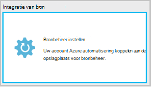
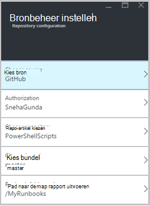
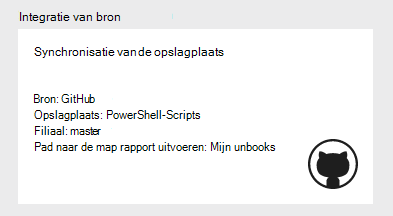
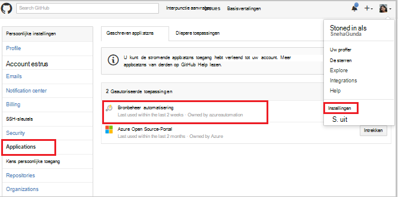
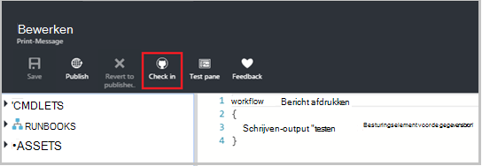
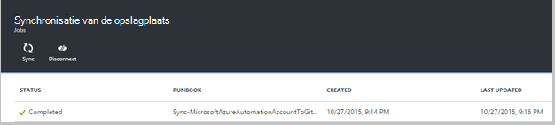
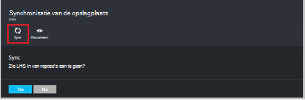
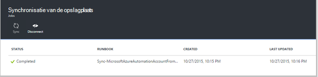
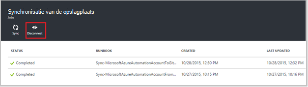

<properties 
    pageTitle=" Source Control integration in Azure automatisering | Microsoft Azure"
    description="In dit artikel wordt beschreven bron controle integratie met GitHub in Azure automatisering."
    services="automation"
    documentationCenter=""
    authors="mgoedtel"
    manager="jwhit"
    editor="tysonn" />    
<tags 
    ms.service="automation"
    ms.devlang="na"
    ms.topic="article"
    ms.tgt_pltfrm="na"
    ms.workload="infrastructure-services"
    ms.date="09/12/2016"
    ms.author="magoedte;sngun" />

# Integratie van bron in Azure automatisering

Integratie van bron kunt u runbooks in uw Automatisering een opslagplaats voor bronbeheer GitHub account koppelen. Besturingselement voor gegevensbron kunt u eenvoudig samenwerken met uw team, het bijhouden van wijzigingen en terugkeren naar eerdere versies van uw runbooks. Besturingselement voor gegevensbron kunt u verschillende filialen in het besturingselement aan de ontwikkeling, test- of productie automatisering, zodat u gemakkelijk ter bevordering van de code die is getest in uw ontwikkelomgeving op uw productie automatisering account synchroniseren.

Besturingselement voor gegevensbron kunt u code van Azure automatisering op bronbeheer van push of pull-de runbooks van het besturingselement aan automatisering Azure. In dit artikel wordt beschreven hoe voor het instellen van het besturingselement in uw omgeving Azure automatisering. We wordt gestart door het configureren van Azure automatiseren om toegang tot uw bibliotheek GitHub en wandel door de verschillende bewerkingen die kunnen worden uitgevoerd met behulp van integratie van bron. 

>[AZURE.NOTE]Het besturingselement ondersteunt ophalen en opslaan van [PowerShell Workflow runbooks](automation-runbook-types.md#powershell-workflow-runbooks) als [runbooks in PowerShell](automation-runbook-types.md#powershell-runbooks). [Grafische runbooks](automation-runbook-types.md#graphical-runbooks) zijn nog niet ondersteund.  

Er zijn twee eenvoudige stappen die nodig zijn voor uw account automatisering en slechts één besturingselement configureren als u al een GitHub-account. Deze zijn:
## Stap 1 – een GitHub opslagplaats maken

Als u al een GitHub-account en een opslagplaats die u wilt koppelen in Azure automatisering en vervolgens inloggen met uw bestaande account en start vanaf stap 2 hieronder. Anders gaat u naar [GitHub](https://github.com/), teken omhoog voor een nieuwe account en [een nieuwe bibliotheek maken](https://help.github.com/articles/create-a-repo/).

## Stap 2: instellen van bronbeheer in Azure automatisering

1. De blade automatisering Account in de portal Azure, klik op **Bronbeheer instellen.** 
 
    

2. Het blad van **Het besturingselement** wordt geopend, waar u de details van uw GitHub kunt configureren. Hieronder vindt u de lijst met parameters te configureren:  

  	|**Parameter**            |**Beschrijving** |
  	|:---|:---| 
  	|Kies bron   | Selecteer de gegevensbron. Op dit moment wordt alleen **GitHub** ondersteund. |
  	|Autorisatie | Klik op **machtigen** om Azure automatisering toegang tot uw bibliotheek GitHub. Als u al bent aangemeld bij uw account GitHub in een ander venster, worden de referenties van die account gebruikt. Nadat de verificatie is geslaagd, wordt het blad uw gebruikersnaam GitHub onder **Vergunning eigenschap**weergegeven. |
  	|Opslagplaats kiezen | Selecteer een opslagplaats GitHub uit de lijst met beschikbare opslaglocaties. |
  	|Filiaal kiezen | Selecteer een vertakking uit de lijst met beschikbare vertakkingen. Alleen de **master** branch wordt weergegeven als u alle bijkantoren nog niet gemaakt. |
  	|Pad naar de map Runbook | Het pad naar de runbook geeft het pad in de GitHub opslagplaats die u wilt push of pull-code. Dit moet worden ingevoerd in de indeling **/foldername/subfoldername**. Alleen runbooks in de map runbook wordt gesynchroniseerd met uw account voor automatisering. Runbooks in de submappen van de runbook map pad zal **niet** worden gesynchroniseerd. Gebruik **/** de runbooks onder de opslagplaats synchroniseren. |

3. Bijvoorbeeld, als u een bibliotheek met de naam **PowerShellScripts** met een map met de naam **RootFolder**, die een map bevat met de naam **submap**. Voor elk niveau van de map synchronisatie kunt u de volgende tekenreeksen:

    1. Als u wilt synchroniseren runbooks uit de **opslagplaats**, is pad naar de map runbook*/*
    2. Als u wilt synchroniseren runbooks van **RootFolder**, is runbook het pad */RootFolder*
    3. Als u wilt synchroniseren runbooks van de **submap**, is runbook het pad */RootFolder/SubFolder*.
  

4. Nadat u de parameters hebt geconfigureerd, worden weergegeven op de **Bronbeheer instellen blade.**  
 
    

5. Nadat u op OK klikt, wordt integratie van bron is nu geconfigureerd voor uw account automatisering en moet worden bijgewerkt met de gegevens van uw GitHub. U kunt nu klikken op dit deel al uw source control sync geschiedenis weergeven.  

    

6. Nadat u het besturingselement hebt ingesteld, worden de volgende bronnen voor automatisering in uw account automatisering gemaakt:  
 Twee [variabele elementen](automation-variables.md) worden gemaakt.  
      
    * De variabele **Microsoft.Azure.Automation.SourceControl.Connection** bevat de waarden van de verbindingsreeks, zoals hieronder wordt weergegeven.  

  	|**Parameter**            |**Waarde** |
  	|:---|:---|
  	| Naam  | Microsoft.Azure.Automation.SourceControl.Connection |
  	| Type | Tekenreeks |
  	| Waarde  | {"Bijkantoor":\<*uw Filiaalnaam*>, "RunbookFolderPath":\<*Runbook pad*>, "ProviderType":\<*heeft een waarde 1 voor GitHub*>, 'Opslagplaats':\<*de naam van uw bibliotheek*>, "Gebruikersnaam":\<*GitHub uw gebruikersnaam*>} |   

    * De variabele **Microsoft.Azure.Automation.SourceControl.OAuthToken**bevat de beveiligde gecodeerde waarde van uw OAuthToken.  

  	|**Parameter**            |**Waarde** |
  	|:---|:---|
  	| Naam  | Microsoft.Azure.Automation.SourceControl.OAuthToken |
  	| Type | Unknown(Encrypted) |
  	| Waarde | <*Gecodeerde OAuthToken*> |  

      

    * **Automatisering-bronbeheer** wordt toegevoegd als een toegelaten toepassing naar je GitHub account. Om de toepassing weer te geven: Ga vanaf uw startpagina GitHub aan uw **profiel** > **Instellingen** > **toepassingen**. Deze toepassing kunnen Azure automatisering te synchroniseren van uw bibliotheek GitHub naar een automatisering-account.  

    

## Met behulp van bronbeheer in automatisering

### Een runbook van Azure automatisering aan bronbeheer inchecken

Hiermee kunt u de wijzigingen die u hebt aangebracht in een runbook in Azure automatisering in de opslagplaats voor bronbeheer push inchecken Runbook. Hieronder vindt u de stappen voor het inchecken een runbook:

1. Uit uw automatisering Account, [een nieuwe tekstuele runbook maken](automation-first-runbook-textual.md)of [bewerken van een bestaande, tekstuele runbook](automation-edit-textual-runbook.md). Deze runbook is een werkstroom PowerShell of een PowerShell script runbook.  

2. Nadat u uw runbook kunt bewerken, opslaan en klik **in -** uit de blade **bewerken** .  

    

     >[AZURE.NOTE] Inchecken bij Azure automatisering wordt overschreven door de code die momenteel in het besturingselement voor de gegevensbron aanwezig. De instructie van de gelijkwaardige opdrachtregel Git voor inchecken is **git toevoegen + git commit + git push**  

3. Klik op Ja om door te gaan wanneer u **incheckt**, wordt u gevraagd een bevestigingsbericht.  

    

4. In-begint de runbook source control: **Sync-MicrosoftAzureAutomationAccountToGitHubV1**. Deze runbook is verbonden met GitHub en wijzigingen van Azure automatisering duwt naar uw bibliotheek. Om de in-Taakgeschiedenis bekijken, gaat u terug naar het tabblad **Bron controle integratie** en opent u de synchronisatie van de opslagplaats blade. Deze blade bevat alle uw source control-taken.  Selecteer de taak die u wilt weergeven en klik op om de details weer te geven.  

    

    >[AZURE.NOTE] Source control runbooks zijn speciale runbooks voor automatisering die u niet weergeven of bewerken. Terwijl ze niet in de lijst met runbook weergegeven, ziet u sync taken weergegeven op de takenlijst met.
 
5. De naam van de gewijzigde runbook wordt verzonden als invoerparameter voor de in-runbook. Kunt u [de taakdetails weergeven](automation-runbook-execution.md#viewing-job-status-using-the-azure-management-portal) door runbook in de **Opslagplaats synchronisatie** blade uit te breiden.  

    

6. De opslagplaats GitHub vernieuwen zodra de taak is voltooid om de wijzigingen te bekijken.  Moet er een commit in de bibliotheek met een commit bericht: *De naam Runbook *bijgewerkt ** in Azure Automation.* *  

### Sync-runbooks van het besturingselement naar Azure automatisering 

De sync-knop op de bladeserver opslagplaats synchronisatie kunt u alle runbooks in de map runbook van uw bibliotheek aan uw account automatisering pull. De dezelfde opslagplaats kan meer dan één account voor automatisering worden gesynchroniseerd. Hieronder vindt u de stappen voor het synchroniseren van een runbook:

1. De automatisering account waar u bronbeheer instellen en opent u de **bron controle integratie/opslagplaats synchronisatie blade** en vervolgens wordt u gevraagd een bevestigingsbericht klikt u op **synchronisatie** , klik op **Ja** om door te gaan.  

    

2. Synchronisatie wordt gestart van de runbook: **Sync-MicrosoftAzureAutomationAccountFromGitHubV1**. Deze runbook is verbonden met GitHub en haalt de wijzigingen uit uw bibliotheek naar Azure automatisering. U ziet een nieuwe taak op de bladeserver **Opslagplaats-synchronisatie** voor deze actie. Gedetailleerde informatie over de synchronisatie taak, klik op om de details van taak blade.  
 
    

 
    >[AZURE.NOTE] Een synchronisatie uit besturingselement voor gegevensbron overschreven door de conceptversie van de runbooks die momenteel beschikbaar zijn in uw account automatisering voor **alle** runbooks die momenteel in het besturingselement. De instructie Git gelijkwaardige opdrachtregel synchroniseren is **git pull**

## Problemen met control bron

Als er fouten optreden met een project in- of synchroniseren, status van de taak moet worden opgeschort en vindt u meer informatie over de fout in het blad van de taak.  Het deel van **Alle logboeken** weergeven alle PowerShell streams die zijn gekoppeld aan deze taak. Zodoende kunt u de gegevens voor het oplossen van problemen met uw in- of synchroniseren. Ook geeft de volgorde van de acties die zijn opgetreden bij het synchroniseren of controleren in een runbook.  

## Besturingselement voor gegevensbron verbreken

Je GitHub account verbreken, opent de blade-opslagplaats synchroniseren en klik op **verbinding verbreken**. Als u het besturingselement, runbooks die eerder werden gesynchroniseerd blijven in uw account automatisering, maar de blade opslagplaats synchronisatie wordt niet ingeschakeld.  

  

## Volgende stappen

Zie de volgende bronnen voor meer informatie over de integratie van bron:  
- [Azure automatisering: Integratie van bron in Azure automatisering](https://azure.microsoft.com/blog/azure-automation-source-control-13/)  
- [Stem op uw favoriete bronbeheersysteem](https://www.surveymonkey.com/r/?sm=2dVjdcrCPFdT0dFFI8nUdQ%3d%3d)  
- [Azure automatisering: Besturingselement voor gegevensbron Runbook met behulp van Visual Studio Team Services integreren](https://azure.microsoft.com/blog/azure-automation-integrating-runbook-source-control-using-visual-studio-online/)  
