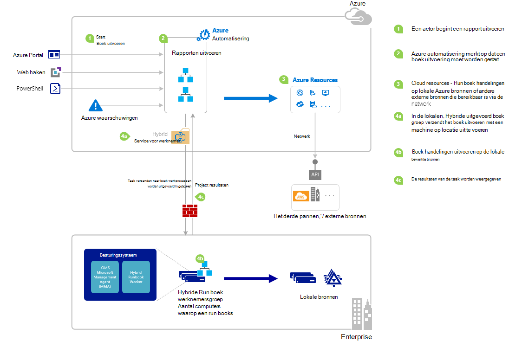

<properties
   pageTitle="Een runbook starten in Azure automatisering | Microsoft Azure"
   description="Geeft een overzicht van de verschillende methoden die kunnen worden gebruikt voor het starten van een runbook in Azure automatisering en bevat informatie over het gebruik van de portal Azure en Windows PowerShell."
   services="automation"
   documentationCenter=""
   authors="mgoedtel"
   manager="jwhit"
   editor="tysonn" />
<tags
   ms.service="automation"
   ms.devlang="na"
   ms.topic="article"
   ms.tgt_pltfrm="na"
   ms.workload="infrastructure-services"
   ms.date="10/08/2016"
   ms.author="magoedte;bwren"/>

# <a name="starting-a-runbook-in-azure-automation"></a>Een runbook starten in Azure automatisering

De volgende tabel kunt u de methode voor het starten van een runbook in Azure automatisering die het meest geschikt is voor uw specifieke scenario bepalen. Dit artikel bevat informatie over het starten van een runbook met de portal Azure en Windows PowerShell. Meer informatie over de andere methoden zijn beschikbaar in andere documentatie die u via de onderstaande koppelingen openen kunt.

| **METHODE**                                                                    | **KENMERKEN**                                                                                                                                                                                                                                                                                                                                                |
|-------------------------------------------------------------------------------|--------------------------------------------------------------------------------------------------------------------------------------------------------------------------------------------------------------------------------------------------------------------------------------------------------------------------------------------------------------------|
| [Azure Portal](#starting-a-runbook-with-the-azure-portal)                     | <li>Eenvoudigste methode met een interactieve gebruikersinterface.<br> <li>Formulier eenvoudig parameterwaarden op te geven.<br> <li>Taakstatus op eenvoudige wijze volgen.<br> <li>Toegang met Azure aanmelding is geverifieerd.                                                                                                                                                                               |
| [Windows PowerShell](https://msdn.microsoft.com/library/dn690259.aspx)        | <li>Bel vanaf opdrachtregel met Windows PowerShell-cmdlets.<br> <li>Kunnen worden opgenomen in een geautomatiseerde oplossing met meerdere stappen.<br> <li>Aanvraag wordt geverifieerd met certificaten of gebruiker OAuth principal / service principal.<br> <li>Eenvoudige en complexe parameterwaarden opgeven.<br> <li>Taakstatus bijhouden.<br> <li>De client is vereist voor de ondersteuning van PowerShell-cmdlets. |
| [Azure automatisering API](https://msdn.microsoft.com/library/azure/mt662285.aspx) | <li>Meest flexibele methode, maar ook de meeste complex.<br> <li>Oproepen vanuit een aangepaste code waarmee HTTP-aanvragen.<br> <li>Aanvraag geverifieerd met certificaten of Oauth user principal / service principal.<br> <li>Eenvoudige en complexe parameterwaarden opgeven.<br> <li>Taakstatus bijhouden.                                                                          |
| [Webhooks](automation-webhooks.md)                                            | <li>Runbook starten vanuit één HTTP-aanvraag.<br> <li>Met een beveiligingstoken in een URL wordt geverifieerd.<br> <li>Client overschrijven niet parameterwaarden die worden opgegeven wanneer webhook gemaakt. Runbook kunt definiëren enkele parameter die wordt gevuld met de gegevens voor de HTTP-aanvraag.<br> <li>Niet in staat is om bij te houden van de taakstatus via de URL webhook.                                      |
| [Reageren op Azure waarschuwing](../log-analytics/log-analytics-alerts.md)               | <li>Start een runbook reactie op Azure waarschuwing.<br> <li>Configureren van webhook voor runbook en een koppeling naar een waarschuwing.<br> <li>Met een beveiligingstoken in een URL wordt geverifieerd.<br> <li>Momenteel ondersteunt waarschuwing van een maatstelsel alleen.                                                                                                                                                       |
| [Planning](automation-schedules.md)                                | <li>Runbook automatisch starten van per uur, dagelijks of wekelijks schema.<br> <li>Planning via de portal Azure, PowerShell-cmdlets of Azure API manipuleren.<br> <li>Parameterwaarden kan worden gebruikt bij de planning opgeven.                                                                                                                                               |
| [Vanuit een ander Runbook](automation-child-runbooks.md)                          | <li>Gebruik een runbook als een activiteit in een andere runbook.<br> <li>Dit is handig voor functionaliteit die wordt gebruikt door meerdere runbooks.<br> <li>Parameterwaarden voor onderliggende runbook leveren en output in bovenliggende runbook gebruiken.                                                                                                                                                               |

De volgende afbeelding ziet u gedetailleerde stapsgewijze proces in de levenscyclus van een runbook. Het bevat verschillende manieren waarop die een runbook is gestart in Azure-automatisering onderdelen vereist voor hybride Runbook werknemer uit te voeren runbooks Azure automatisering en interacties tussen de verschillende onderdelen. Raadpleeg voor meer informatie over het uitvoeren van runbooks voor automatisering in uw datacenter, [hybride runbook](automation-hybrid-runbook-worker.md) werknemers



## <a name="starting-a-runbook-with-the-azure-portal"></a>Een runbook starten met de Azure portal

1.  In het portal voor Azure **automatisering** selecteert en klikt u vervolgens de naam van een account met automatisering.
2.  Selecteer het tabblad **Runbooks** .
3.  Selecteer een runbook en klik op **starten**.
4.  Als de runbook parameters heeft, wordt u gevraagd waarden op te geven met een tekstvak voor elke parameter. Zie [Parameters van de Runbook](#Runbook-parameters) hieronder voor meer informatie over parameters.
5.  Selecteer **Taak weergeven** naast het bericht **Bezig met starten** runbook of klik op het tabblad **taken** voor de runbook om de status van de taak van de runbook weer te geven.

## <a name="starting-a-runbook-with-the-azure-portal"></a>Een runbook starten met de Azure portal

1.  Klik op het onderdeel **Runbooks** de blade **Runbooks** openen van uw account automatisering.
2.  Klik op een runbook om te openen de blade **Runbook** .
3.  Klik op **Start**.
4.  Als de runbook geen parameters heeft, wordt u gevraagd te bevestigen of u wilt starten. Als de runbook parameters heeft, wordt het blad **Runbook Start** geopend zodat u de parameterwaarden kunt opgeven. Zie [Parameters van de Runbook](#Runbook-parameters) hieronder voor meer informatie over parameters.
5.  Het blad van de **taak** wordt geopend zodat u de status van de taak kunt bijhouden.

## <a name="starting-a-runbook-with-windows-powershell"></a>Een runbook wordt gestart met Windows PowerShell

Een runbook starten met Windows PowerShell kunt u de [Begin-en AzureRmAutomationRunbook](https://msdn.microsoft.com/library/mt603661.aspx) . De volgende voorbeeldcode wordt een runbook Test Runbook genoemd.

```
Start-AzureRmAutomationRunbook -AutomationAccountName "MyAutomationAccount" -Name "Test-Runbook" -ResourceGroupName "ResourceGroup01"
```

Start AzureRmAutomationRunbook geeft als resultaat een project-object kunt u de status ervan bijhouden als de runbook is gestart. Vervolgens kunt u deze taakobject met [Get-AzureRmAutomationJob](https://msdn.microsoft.com/library/mt619440.aspx) om te bepalen van de status van de taak en het [Get-AzureRmAutomationJobOutput](https://msdn.microsoft.com/library/mt603476.aspx) voor de uitvoer. De volgende voorbeeldcode wordt een Test-Runbook, wacht totdat deze is voltooid en de uitvoer vervolgens wordt genaamd runbook.

```
$runbookName = "Test-Runbook"
$ResourceGroup = "ResourceGroup01"
$AutomationAcct = "MyAutomationAccount"

$job = Start-AzureRmAutomationRunbook –AutomationAccountName $AutomationAcct -Name $runbookName -ResourceGroupName $ResourceGroup

$doLoop = $true
While ($doLoop) {
   $job = Get-AzureRmAutomationJob –AutomationAccountName $AutomationAcct -Id $job.JobId -ResourceGroupName $ResourceGroup
   $status = $job.Status
   $doLoop = (($status -ne "Completed") -and ($status -ne "Failed") -and ($status -ne "Suspended") -and ($status -ne "Stopped"))
}

Get-AzureRmAutomationJobOutput –AutomationAccountName $AutomationAcct -Id $job.JobId -ResourceGroupName $ResourceGroup –Stream Output
```

Als de runbook parameters vereist, moet u opgeven ze als [hash-tabel](http://technet.microsoft.com/library/hh847780.aspx) waarin de sleutel van de hash-tabel overeenkomt met de parameternaam van de en de waarde is de waarde van de parameter. In het volgende voorbeeld ziet u hoe een runbook starten met twee reeks parameters met de naam voornaam en achternaam, een geheel getal met de naam RepeatCount en Booleaanse parameter met de naam weergeven. Zie voor meer informatie over de parameters voor [Runbook Parameters](#Runbook-parameters) hieronder.

```
$params = @{"FirstName"="Joe";"LastName"="Smith";"RepeatCount"=2;"Show"=$true}
Start-AzureRmAutomationRunbook –AutomationAccountName "MyAutomationAccount" –Name "Test-Runbook" -ResourceGroupName "ResourceGroup01" –Parameters $params
```

## <a name="runbook-parameters"></a>Runbook-parameters

Wanneer u een runbook vanaf de Portal Azure of Windows PowerShell start, wordt de instructie wordt verzonden via de webservice Azure automatisering. Deze service biedt geen ondersteuning voor parameters met complexe gegevenstypen. Als u een waarde opgeven voor een parameter complexe, moet vervolgens u aanroepen in line uit een andere runbook zoals beschreven in de [onderliggende runbooks in Azure automatisering](automation-child-runbooks.md).

De webservice Azure automatisering biedt speciale functies voor bepaalde gegevenstypen, zoals beschreven in de volgende secties met parameters.

### <a name="named-values"></a>Benoemde waarden

Als de parameter het gegevenstype [object], dan kunt u de volgende JSON-indeling voor het verzenden van een lijst met benoemde waarden: *{naam1: "Waarde1", Naam2: 'Waarde2', Naam3: 'Waarde3'}*. Deze waarden zijn eenvoudige typen. De runbook wordt de parameter ontvangen als een [PSCustomObject](https://msdn.microsoft.com/library/system.management.automation.pscustomobject%28v=vs.85%29.aspx) met eigenschappen die met elke benoemde waarde overeenkomen.

U kunt de volgende test runbook die een parameter met de naam van de gebruiker accepteert.

```
Workflow Test-Parameters
{
   param (
      [Parameter(Mandatory=$true)][object]$user
   )
    $userObject = $user | ConvertFrom-JSON
    if ($userObject.Show) {
        foreach ($i in 1..$userObject.RepeatCount) {
            $userObject.FirstName
            $userObject.LastName
        }
    }
}
```

De volgende tekst kan worden gebruikt voor de parameter gebruiker.

```
{FirstName:'Joe',LastName:'Smith',RepeatCount:'2',Show:'True'}
```

Dit resulteert in de volgende uitvoer.

```
Joe
Smith
Joe
Smith
```

### <a name="arrays"></a>Matrices

Als de parameter een matrix zoals [matrix is] of [string []], kunt u de volgende JSON-indeling gebruiken voor het verzenden van een lijst met waarden: *[waarde1, waarde2, Waarde3]*. Deze waarden zijn eenvoudige typen.

U kunt de volgende test runbook die een parameter met de naam van de *gebruiker accepteert*.

```
Workflow Test-Parameters
{
   param (
      [Parameter(Mandatory=$true)][array]$user
   )
    if ($user[3]) {
        foreach ($i in 1..$user[2]) {
            $ user[0]
            $ user[1]
        }
    }
}
```

De volgende tekst kan worden gebruikt voor de parameter gebruiker.

```
["Joe","Smith",2,true]
```

Dit resulteert in de volgende uitvoer.

```
Joe
Smith
Joe
Smith
```

### <a name="credentials"></a>Referenties

Als de parameter het gegevenstype **PSCredential**, kunt u de naam van een Azure automatisering [referentie activum](automation-credentials.md)opgeven. De runbook haalt de referenties met de naam die u opgeeft.

U kunt de volgende test runbook die een parameter met de naam van de referentie accepteert.

```
Workflow Test-Parameters
{
   param (
      [Parameter(Mandatory=$true)][PSCredential]$credential
   )
   $credential.UserName
}
```

De volgende tekst kan worden gebruikt voor de parameter gebruiker ervan uitgaande dat er een referentie actief *Mijn referenties*genoemd is.

```
My Credential
```

Als dat de gebruikersnaam in de referenties *Jjansen*was, resulteert dit in de volgende uitvoer.

```
jsmith
```

## <a name="next-steps"></a>Volgende stappen

-   De architectuur van de runbook in het huidige artikel overzicht een algemeen van runbooks middelen in Azure en lokale met de hybride Runbook werknemer beheren.  Raadpleeg voor meer informatie over het uitvoeren van runbooks voor automatisering in uw datacenter, [hybride Runbook](automation-hybrid-runbook-worker.md)werknemers.
-   Raadpleeg voor meer informatie over het maken van de modulaire runbooks door andere runbooks worden gebruikt voor algemene of specifieke functies, [Onderliggende Runbooks](automation-child-runbooks.md).
