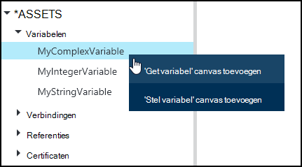
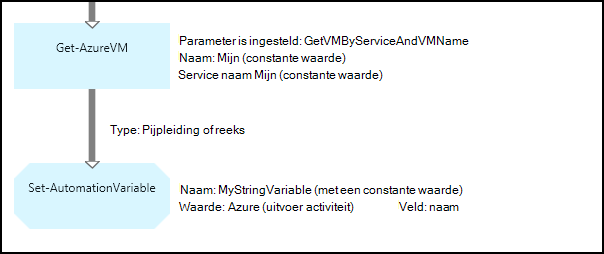
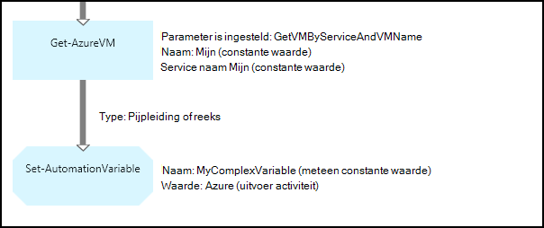
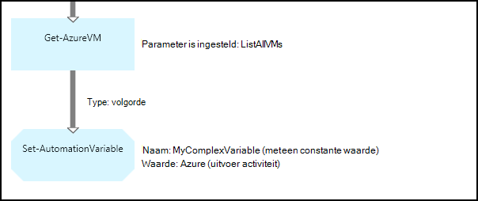
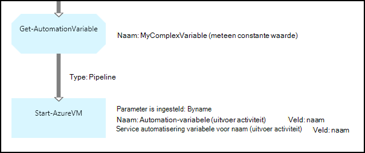
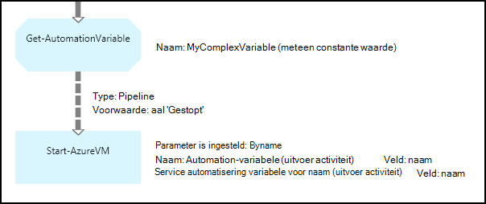

<properties 
   pageTitle="Variabele activa in Azure automatisering | Microsoft Azure"
   description="Variabele activa zijn waarden die beschikbaar voor alle runbooks en DSC-configuraties in Azure automatisering zijn.  In dit artikel wordt uitgelegd dat de details van de variabelen en het werken met hen in tekst en grafische ontwerpen."
   services="automation"
   documentationCenter=""
   authors="mgoedtel"
   manager="jwhit"
   editor="tysonn" />
<tags 
   ms.service="automation"
   ms.devlang="na"
   ms.topic="article"
   ms.tgt_pltfrm="na"
   ms.workload="infrastructure-services"
   ms.date="05/24/2016"
   ms.author="magoedte;bwren" />

# Variabele activa in Azure automatisering

Variabele activa zijn waarden die beschikbaar voor alle runbooks en DSC-configuraties in uw account voor automatisering zijn. Ze kunnen worden gemaakt, gewijzigd en wordt opgehaald uit de Azure portal, Windows PowerShell, en vanuit een runbook of een DSC-configuratie. Automatisering-variabelen zijn handig voor de volgende scenario's:

- Een waarde tussen meerdere runbooks of configuraties DSC delen.

- Een waarde tussen meerdere taken van de DSC-configuratie of dezelfde runbook delen.

- Een waarde van het portal of vanaf de Windows PowerShell-opdrachtregel die wordt gebruikt door runbooks of DSC-configuraties te beheren.

Automatisering variabelen worden doorgevoerd, zodat ze beschikbaar blijven zelfs als de runbook of DSC-configuratie is mislukt.  Hierdoor kunnen ook een waarde moet worden ingesteld door een runbook die wordt vervolgens gebruikt door een andere, of wordt gebruikt door de dezelfde runbook of DSC-configuratie de volgende keer dat deze wordt uitgevoerd.

Als een variabele wordt gemaakt, kunt u worden opgeslagen gecodeerde.  Als een variabele is gecodeerd, is het veilig opgeslagen in Azure, automatisering en de waarde van de cmdlet [Get-AzureAutomationVariable](http://msdn.microsoft.com/library/dn913772.aspx) dat wordt geleverd als onderdeel van de module Azure PowerShell kan niet worden opgehaald.  Er is de enige manier dat een gecodeerde waarde kan worden opgehaald uit de activiteit van de **Get-AutomationVariable** in een runbook of een DSC-configuratie.

>[AZURE.NOTE]Veilige activa in Azure automatisering zijn referenties, certificaten, verbindingen en gecodeerde variabelen. Deze activa worden gecodeerd en opgeslagen in de Azure automatisering met behulp van een unieke sleutel die is gegenereerd voor elke rekening voor automatisering. Deze sleutel wordt gecodeerd met behulp van een basiscertificaat en opgeslagen in Azure automatisering. Voordat u een activum veilig op te slaan, de sleutel voor de rekening van de automatisering wordt gedecodeerd met behulp van het basiscertificaat en wordt gebruikt voor het coderen van de activa.

## Typen variabelen

Wanneer u een variabele met de Azure portal maakt, moet u een gegevenstype in de vervolgkeuzelijst opgeven, zodat het juiste besturingselement voor het invoeren van de waarde van de variabele kan worden weergegeven in de portal. De variabele is niet beperkt tot dit gegevenstype moet, maar u de variabele met behulp van Windows PowerShell als u wilt dat een waarde van een ander type op te geven. Als u **niet gedefinieerd opgeeft**, vervolgens de waarde van de variabele zal worden ingesteld op **$null**en stelt u de waarde aan de cmdlet [Set-AzureAutomationVariable](http://msdn.microsoft.com/library/dn913767.aspx) of een **Set AutomationVariable** -activiteit.  U kunt maken of wijzigen van de waarde van het type van een complexe variabele in de portal, maar u kunt opgeven dat een waarde van elk type gebruik van Windows PowerShell. Complexe gegevenstypen worden geretourneerd als een [PSCustomObject](http://msdn.microsoft.com/library/system.management.automation.pscustomobject.aspx).

U kunt meerdere waarden aan één variabele opslaan door een matrix of een hash-tabel te maken en deze opslaat naar de variabele.

## Cmdlets en werkstroomacties

De cmdlets in de volgende tabel worden gebruikt voor het maken en beheren van automatisering variabelen met Windows PowerShell. Ze geleverd als onderdeel van de [module Azure PowerShell](../powershell-install-configure.md) beschikbaar voor gebruik in runbooks automatisering en DSC-configuratie is.

|Cmdlets|Beschrijving|
|:---|:---|
|[Get-AzureAutomationVariable](http://msdn.microsoft.com/library/dn913772.aspx)|De waarde van een bestaande variabele opgehaald.|
|[Nieuwe AzureAutomationVariable](http://msdn.microsoft.com/library/dn913771.aspx)|Hiermee maakt u een nieuwe variabele en de waarde ervan wordt ingesteld.|
|[Verwijderen AzureAutomationVariable](http://msdn.microsoft.com/library/dn913775.aspx)|Hiermee verwijdert u een bestaande variabele.|
|[Set AzureAutomationVariable](http://msdn.microsoft.com/library/dn913767.aspx)|Hiermee stelt u de waarde voor een bestaande variabele.|

De werkstroomactiviteiten in de volgende tabel worden gebruikt voor toegang tot variabelen van automatisering in een runbook. Ze zijn alleen beschikbaar voor gebruik in een runbook of DSC-configuratie en niet geleverd als onderdeel van de module Azure PowerShell.

|Workflowactiviteiten|Beschrijving|
|:---|:---|
|Get-AutomationVariable|De waarde van een bestaande variabele opgehaald.|
|Set AutomationVariable|Hiermee stelt u de waarde voor een bestaande variabele.|

>[AZURE.NOTE] Vermijd het gebruik van variabelen in de – naamparameter van **Get-AutomationVariable** in een runbook of DSC configuratie omdat dit ontdekken afhankelijkheden tussen runbooks of DSC-configuratie en automatisering variabelen in de ontwerpfase kan bemoeilijken.

## Een nieuwe Automation-variabele maken

### Een nieuwe variabele maken met de Azure portal

1. Klik op **activa** aan de bovenkant van het venster van uw account automatisering.
1. Klik op **Toevoegen**onder aan het venster.
1. Klik op **variabele toevoegen**.
1. Voltooi de wizard en schakel het selectievakje in als u wilt de nieuwe variabele opslaan.

### Een nieuwe variabele maken met de Azure portal

1. Klik op het onderdeel **activa** om te openen de blade **activa** van uw account automatisering.
1. Klik op het onderdeel **variabelen** om te openen de blade **variabelen** .
1. Klik op **een variabele toevoegen** aan de bovenkant van het blad.
1. Vul het formulier in en klik op **maken** om de nieuwe variabele opslaan.

### Een nieuwe variabele maken met Windows PowerShell

De cmdlet [New-AzureAutomationVariable](http://msdn.microsoft.com/library/dn913771.aspx) maakt een nieuwe variabele en de oorspronkelijke waarde ingesteld. U kunt de waarde met de [Get-AzureAutomationVariable](http://msdn.microsoft.com/library/dn913772.aspx)ophalen. Als de waarde een eenvoudig type is dat hetzelfde type wordt als resultaat gegeven. Het is een complex type, een **PSCustomObject** geretourneerd.

De volgende voorbeeldopdrachten hoe een variabele van het type tekenreeks en geeft de waarde als resultaat.

    New-AzureAutomationVariable –AutomationAccountName "MyAutomationAccount" –Name 'MyStringVariable' –Encrypted $false –Value 'My String'
    $string = (Get-AzureAutomationVariable –AutomationAccountName "MyAutomationAccount" –Name 'MyStringVariable').Value

De volgende voorbeeldopdrachten hoe een variabele met een complex type en vervolgens de eigenschappen retourneren. In dit geval wordt een object voor virtuele machine van **Get-AzureVM** gebruikt.

    $vm = Get-AzureVM –ServiceName "MyVM" –Name "MyVM"
    New-AzureAutomationVariable –AutomationAccountName "MyAutomationAccount" –Name "MyComplexVariable" –Encrypted $false –Value $vm
    
    $vmValue = (Get-AzureAutomationVariable –AutomationAccountName "MyAutomationAccount" –Name "MyComplexVariable").Value
    $vmName = $vmValue.Name
    $vmIpAddress = $vmValue.IpAddress

## Met behulp van een variabele in een runbook of een DSC-configuratie

De activiteit **Set AutomationVariable** gebruiken voor het instellen van de waarde van een Automation-variabele in een runbook of DSC-configuratie en de **Get-AutomationVariable** te halen.  De cmdlets **Set AzureAutomationVariable** of **Get-AzureAutomationVariable** in een runbook of een DSC-configuratie moet u niet gebruiken omdat ze minder efficiënt dan de werkstroomactiviteiten.  U ophalen de waarde van beveiligde variabelen met **Get-AzureAutomationVariable**ook niet.  De enige manier om een nieuwe variabele uit binnen een runbook of DSC-configuratie is de cmdlet [New-AzureAutomationVariable](http://msdn.microsoft.com/library/dn913771.aspx) gebruiken.

### Tekstuele runbook monsters

#### Instellen en ophalen van een eenvoudige waarde van een variabele

De volgende voorbeeldopdrachten hoe instellen en ophalen van een variabele in een tekstuele runbook. In dit voorbeeld wordt ervan uitgegaan dat de variabelen van het type integer naam *NumberOfIterations* en *NumberOfRunnings* en een variabele van het type tekenreeks met de naam *SampleMessage* al zijn gemaakt.

    $NumberOfIterations = Get-AutomationVariable -Name 'NumberOfIterations'
    $NumberOfRunnings = Get-AutomationVariable -Name 'NumberOfRunnings'
    $SampleMessage = Get-AutomationVariable -Name 'SampleMessage'
    
    Write-Output "Runbook has been run $NumberOfRunnings times."
    
    for ($i = 1; $i -le $NumberOfIterations; $i++) {
       Write-Output "$i`: $SampleMessage"
    }
    Set-AutomationVariable –Name NumberOfRunnings –Value ($NumberOfRunnings += 1)

#### Instellen en ophalen van een complexe object in een variabele

De volgende voorbeeldcode ziet u hoe een variabele met een complexe waarde in een tekstuele runbook bijwerken. In dit voorbeeld wordt een Azure virtuele machine met **Get-AzureVM** opgehaald en opgeslagen in een bestaande automatiseringsvariabele.  Zoals uiteengezet in [typen variabelen](#variable-types), wordt dit opgeslagen als een PSCustomObject.

    $vm = Get-AzureVM -ServiceName "MyVM" -Name "MyVM"
    Set-AutomationVariable -Name "MyComplexVariable" -Value $vm

In de volgende code wordt de waarde opgehaald van de variabele en gebruikt voor het starten van de virtuele machine.

    $vmObject = Get-AutomationVariable -Name "MyComplexVariable"
    if ($vmObject.PowerState -eq 'Stopped') {
       Start-AzureVM -ServiceName $vmObject.ServiceName -Name $vmObject.Name
    }

#### Instellen en ophalen van een collectie in een variabele

De volgende voorbeeldcode ziet u hoe u een variabele met een collectie van complexe waarden in een tekstuele runbook. In dit voorbeeld meerdere Azure virtuele machines met **Get-AzureVM** opgehaald en opgeslagen in een bestaande automatiseringsvariabele.  Zoals uiteengezet in [typen variabelen](#variable-types), wordt dit opgeslagen als een verzameling PSCustomObjects.

    $vms = Get-AzureVM | Where -FilterScript {$_.Name -match "my"}     
    Set-AutomationVariable -Name 'MyComplexVariable' -Value $vms

In de volgende code wordt de collectie opgehaald van de variabele en gebruikt voor het starten van elke virtuele machine.

    $vmValues = Get-AutomationVariable -Name "MyComplexVariable"
    ForEach ($vmValue in $vmValues)
    {
       if ($vmValue.PowerState -eq 'Stopped') {
          Start-AzureVM -ServiceName $vmValue.ServiceName -Name $vmValue.Name
       }
    }

### Voorbeelden van grafische runbook

In een grafische runbook voegt u de **Get-AutomationVariable** of een **Set AutomationVariable** met de rechtermuisknop op de variabele in het deelvenster bibliotheek van de grafische editor en selecteer de gewenste activiteit.

#### Instellen van waarden in een variabele

De volgende afbeelding toont een voorbeeld van activiteiten voor het bijwerken van een variabele met een eenvoudige waarde in een grafische runbook. In dit voorbeeld wordt een enkele Azure virtuele machine met **Get-AzureVM** opgehaald en wordt de naam van de computer is opgeslagen in een bestaande automatiseringsvariabele van het type String.  Het maakt niet uit of de [koppeling is een pijpleiding of een reeks](automation-graphical-authoring-intro.md#links-and-workflow) Aangezien we slechts één object in de uitvoer verwachten.

De volgende afbeelding ziet u de activiteiten voor het bijwerken van een variabele met een complexe waarde in een grafische runbook gebruikt. De enige wijziging uit het vorige voorbeeld is niet een **veld pad** opgeven voor de **uitvoer van de activiteit** op de activiteit van de **Set AutomationVariable** zodat het object wordt opgeslagen in plaats van alleen een eigenschap van het object.  Zoals uiteengezet in [typen variabelen](#variable-types), wordt dit opgeslagen als een PSCustomObject.

De volgende afbeelding wordt dezelfde functionaliteit als in het vorige voorbeeld met meerdere virtuele machines die worden opgeslagen in de variabele.  Een [reeks koppeling](automation-graphical-authoring-intro.md#links-and-workflow) moet hier worden gebruikt, zodat de **Set AutomationVariable** activiteit de volledige set van virtuele machines als één verzameling ontvangt.  Als een [koppeling van de pijpleiding](automation-graphical-authoring-intro.md#links-and-workflow) is gebruikt, wordt vervolgens de **Set AutomationVariable** activiteit uitgevoerd apart voor elk object met het resultaat dat alleen de laatste virtuele machine in de collectie wordt opgeslagen.  Zoals uiteengezet in [typen variabelen](#variable-types), wordt dit opgeslagen als een verzameling PSCustomObjects.

#### Ophalen van waarden van een variabele

De volgende afbeelding toont een voorbeeld activiteiten die ophalen en gebruiken van een variabele in een grafische runbook.  De eerste activiteit wordt opgehaald van de virtuele machines die zijn opgeslagen in de variabele in het vorige voorbeeld.  De koppeling moet een [pijpleiding](automation-graphical-authoring-intro.md#links-and-workflow) die de activiteit **Start AzureVM** wordt eenmaal uitgevoerd voor elk object verzonden vanaf de **Get-AutomationVariable** -activiteit.  Dit werkt hetzelfde of een enkele of meerdere objecten worden opgeslagen in de variabele.  De activiteit **Start AzureVM** worden de eigenschappen van de PSCustomObject die elke virtuele machine vertegenwoordigt. 

De volgende afbeelding ziet u hoe de objecten die zijn opgeslagen op een variabele in een grafische runbook filteren.  Een [voorwaarde](automation-graphical-authoring-intro.md#links-and-workflow) is toegevoegd aan de koppeling in het vorige voorbeeld voor het filteren van alleen de virtuele machines die zijn gestopt als de variabele is ingesteld.

## Volgende stappen

- Zie voor meer informatie over het aansluiten van de activiteiten bij elkaar in de grafische ontwerpen, [koppelingen in het grafische ontwerpen](automation-graphical-authoring-intro.md#links-and-workflow)
- Om te beginnen met een grafische runbooks, Zie [Mijn eerste grafische runbook](automation-first-runbook-graphical.md) 
