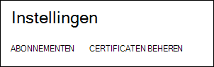
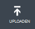
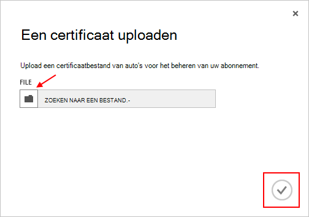

<properties 
    pageTitle="Uploaden van een certificaat Azure Management API | Microsoft Azure" 
    description="Informatie over het uploaden athe Management API-certificaat voor de klassieke Azure-Portal." 
    services="cloud-services" 
    documentationCenter=".net" 
    authors="Thraka" 
    manager="timlt" 
    editor=""/>

<tags 
    ms.service="na" 
    ms.workload="tbd" 
    ms.tgt_pltfrm="na" 
    ms.devlang="na" 
    ms.topic="article" 
    ms.date="04/18/2016"
    ms.author="adegeo"/>

# Uploaden van een certificaat Azure API voor beheer beheer

Beheer van certificaten kunnen u verifiëren bij de Service Management-API die door Azure. Veel programma's en hulpprogramma's (zoals Visual Studio of de SDK Azure) wordt deze certficates gebruikt voor het automatiseren van de configuratie en implementatie van verschillende Azure diensten. **Dit geldt alleen voor de klassieke Azure portal**. 

>[AZURE.WARNING] Wees voorzichtig! Deze typen certificaten dat alle gebruikers worden geverifieerd met hen voor het beheren van het abonnement dat ze zijn gekoppeld. 

Meer informatie over Azure certificaten (met inbegrip van een zelf-ondertekend certificaat maken) is [beschikbaar](cloud-services/cloud-services-certs-create.md#what-are-management-certificates) als u deze nodig hebt.

U kunt ook [Azure Active Directory](/services/active-directory/) gebruiken voor het verifiëren van clientcode voor automatisering.

## Een certificaat uploaden

Zodra er een management certificaat gemaakt, (.cer-bestand met alleen de openbare sleutel) kunt u deze uploaden naar de portal. Wanneer het certificaat in de portal beschikbaar is, kan iedereen met een overeenkomende certficiate (persoonlijke sleutel) verbinding maken via de API voor beheer en toegang tot de bronnen voor het abonnement gekoppeld.

1. Log in op de [Azure klassieke portal](http://manage.windowsazure.com).

2. Zorg ervoor dat het selecteren van het juiste abonnement dat u wilt verbinden met een certificaat met. Druk op de tekst van de **abonnementen** in de rechterbovenhoek van de portal.

    

3. Nadat u het juiste abonnement hebt geselecteerd hebt, drukt u op **Instellingen voor** de portal (mogelijk moet u naar beneden schuiven) aan de linkerkant. 
    
    

4. Druk op het tabblad **Beheer van certificaten** .

    
    
5. Druk op de knop **uploaden** .

    
    
6. Vul het dialoogvenster en druk op het gereed **is ingeschakeld**.

    

## Volgende stappen

Nu dat er een management-certificaat dat is gekoppeld aan een abonnement, u (na het installeren van het bijbehorende certificaat lokaal) via programmacode verbinding maken met de [Service Management REST API](https://msdn.microsoft.com/library/azure/mt420159.aspx) en automatiseren van de diverse Azure bronnen die gekoppeld aan een abonnement zijn. 