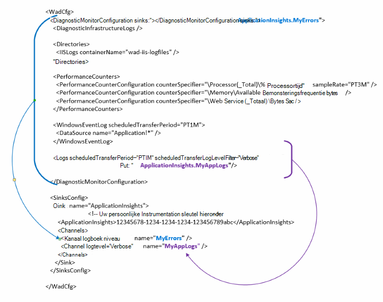

<properties
   pageTitle="Azure diagnostische functies voor het verzenden van gegevens naar inzichten toepassing configureren | Microsoft Azure"
   description="De diagnostische gegevens van Azure openbare configuratie om gegevens te verzenden naar de inzichten van de toepassing bijwerken."
   services="multiple"
   documentationCenter=".net"
   authors="sbtron"
   manager="douge"
   editor="" />
<tags
   ms.service="application-insights"
   ms.devlang="na"
   ms.topic="article"
   ms.tgt_pltfrm="na"
   ms.workload="na"
   ms.date="12/15/2015"
   ms.author="saurabh" />

# Azure diagnostische functies voor het verzenden van gegevens naar inzichten toepassing configureren

Azure diagnostische gegevens naar Azure opslag tabellen opgeslagen.  U kunt echter ook alle pipe of een subset van de gegevens naar de toepassing inzichten door 'put' en 'kanalen' in de configuratie van de bij het gebruik van diagnostische Azure uitbreiding 1.5 of hoger.

In dit artikel wordt beschreven hoe u de openbare configuratie voor de extensie Azure diagnostische gegevens die zijn geconfigureerd om gegevens te verzenden naar de inzichten van toepassing.

## Toepassing inzichten te configureren als een Sink

Introduceert de extensie Azure diagnostics 1.5 de **<SinksConfig>** -element in de openbare configuratie. Hiermee definieert u de extra *wastafel* waar de Azure diagnostische gegevens kunnen worden verzonden. Kunt u de details van de toepassing inzichten bron waar u de Azure diagnostische gegevens verzenden als onderdeel van dit **<SinksConfig>**.
Een voorbeeld van de **SinksConfig** ziet er zo-  

    <SinksConfig>
        <Sink name="ApplicationInsights">
          <ApplicationInsights>{Insert InstrumentationKey}</ApplicationInsights>
          <Channels>
            <Channel logLevel="Error" name="MyTopDiagData"  />
            <Channel logLevel="Verbose" name="MyLogData"  />
          </Channels>
        </Sink>
      </SinksConfig>

De **Sink** -element het kenmerk *name* Hiermee geeft u een string-waarde die een unieke verwijzen naar de sink wordt gebruikt.
Het element **ApplicationInsights** bevat instrumentation sleutel van de toepassingsbron inzichten waar de Azure diagnostische gegevens wordt verzonden. Als u een bestaande toepassing inzichten-bron Zie [maken een nieuwe toepassing inzichten resource](./application-insights/app-insights-create-new-resource.md) voor meer informatie over het maken van een bron en het ophalen van de sleutel instrumentation niet hebt.

Als u een project Cloud Service met Azure SDK 2.8 ontwikkelt is deze sleutel instrumentation automatisch ingevuld in de openbare configuratie op basis van de **APPINSIGHTS_INSTRUMENTATIONKEY** configuratie-instelling wanneer het project cloud service verpakking. Zie [Gebruik toepassing inzicht met diagnostische gegevens van Azure Cloud-Service-problemen oplossen](./cloud-services/cloud-services-dotnet-diagnostics-applicationinsights.md).

Het element **kanalen** kunt u een of meer elementen **kanaal** voor de gegevens die worden verzonden naar de sink definiëren. Het kanaal fungeert als een filter en kunt u specifieke niveaus die u wilt verzenden naar de sink selecteren. U kan bijvoorbeeld uitgebreide logboekbestanden te verzamelen en stuur ze naar opslag, maar kunt u een kanaal met een registratieniveau van fout, en wanneer u zich aanmeldt via verzendt dat kanaal alleen foutenlogboeken worden verzonden aan de sink die definiëren.
Voor een **kanaal** dat het kenmerk *name* is een unieke naar dat kanaal.
Het kenmerk *loglevel* geeft u het niveau voor vastleggen waarmee het kanaal. De beschikbare niveaus in volgorde van meest minst informatie zijn
 - Uitgebreide
 - Informatie
 - Waarschuwing
 - Fout
 - Kritiek

## Gegevens verzenden naar de sink-toepassing inzichten
Nadat de sink-toepassing inzichten is gedefinieerd kunt u gegevens verzenden naar de sink die door de *sink* -kenmerk toe te voegen aan de elementen onder het knooppunt **DiagnosticMonitorConfiguration** . *Put* -element toe te voegen aan elk knooppunt geeft u aan dat gegevens die zijn verzameld via dat knooppunt of een willekeurig knooppunt onder het worden verzonden naar de opgegeven sink.

Bijvoorbeeld als u wilt dat de gegevens die worden verzameld door Azure diagnostische gegevens te verzenden kunt klikt u toevoegen het kenmerk *sink* rechtstreeks naar het knooppunt **DiagnosticMonitorConfiguration** . Stel de waarde van de *put* in de Sink-naam die is opgegeven in de **SinkConfig**.

    <DiagnosticMonitorConfiguration overallQuotaInMB="4096" sinks="ApplicationInsights">

Als u wilt verzenden foutenlogboeken op de inzichten van toepassing opvangen en vervolgens kunt u instellen dat de *put* waarde de naam van het Sink gevolgd door de naam van het kanaal van elkaar gescheiden door een punt ("."). Sink gebruiken bijvoorbeeld foutenlogboeken alleen verzenden naar de inzichten van de toepassing het kanaal MyTopDiagdata die is gedefinieerd in het bovenstaande SinksConfig.  

    <DiagnosticMonitorConfiguration overallQuotaInMB="4096" sinks="ApplicationInsights.MyTopDiagdata">

Als u alleen wilt uitgebreide toepassingen verzenden naar inzichten van toepassing zou u het kenmerk *sinks* toevoegen aan het knooppunt **Logboeken** .

    <Logs scheduledTransferPeriod="PT1M" scheduledTransferLogLevelFilter="Verbose" sinks="ApplicationInsights.MyLogData"/>

U kunt ook meerdere gootstenen opnemen in de configuratie op verschillende niveaus in de hiërarchie. In dat geval dient de sink die is opgegeven op het hoogste niveau van de hiërarchie als een globale instelling en bij de besluiten van het element afzonderlijk element zoals een overschrijving naar deze globale instelling wordt opgegeven.    

Hier is een volledig voorbeeld van het openbare configuratiebestand alle fouten toepassing inzichten verzendt (opgegeven bij het knooppunt **DiagnosticMonitorConfiguration** ) en verder uitgebreide niveau logboeken voor de toepassingslogboeken (opgegeven bij het knooppunt **Logboeken** ).

    <WadCfg>
      <DiagnosticMonitorConfiguration overallQuotaInMB="4096"
           sinks="ApplicationInsights.MyTopDiagData"> <!-- All info below sent to this channel -->
        <DiagnosticInfrastructureLogs />
        <PerformanceCounters>
          <PerformanceCounterConfiguration counterSpecifier="\Processor(_Total)\% Processor Time" sampleRate="PT3M" sinks="ApplicationInsights.MyLogData/>
          <PerformanceCounterConfiguration counterSpecifier="\Memory\Available MBytes" sampleRate="PT3M" />
          <PerformanceCounterConfiguration counterSpecifier="\Web Service(_Total)\Bytes Total/Sec" sampleRate="PT3M" />
        </PerformanceCounters>
        <WindowsEventLog scheduledTransferPeriod="PT1M">
          <DataSource name="Application!*" />
        </WindowsEventLog>
        <Logs scheduledTransferPeriod="PT1M" scheduledTransferLogLevelFilter="Verbose"
                sinks="ApplicationInsights.MyLogData"/> <!-- This specific info sent to this channel -->
      </DiagnosticMonitorConfiguration>

    <SinksConfig>
        <Sink name="ApplicationInsights">
          <ApplicationInsights>{Insert InstrumentationKey}</ApplicationInsights>
          <Channels>
            <Channel logLevel="Error" name="MyTopDiagData"  />
            <Channel logLevel="Verbose" name="MyLogData"  />
          </Channels>
        </Sink>
      </SinksConfig>
    </WadCfg>

Er zijn enkele beperkingen rekening houden met deze functionaliteit

- Kanalen zijn uitsluitend bedoeld om te werken met logboekbestanden en niet voor prestatiemeteritems. Als u een kanaal met een performance counter-element die wordt genegeerd.
- Het niveau voor vastleggen voor een kanaal niet meer dan het niveau voor vastleggen voor wat door Azure diagnostische gegevens worden verzameld. Bijvoorbeeld: u kan verzamelen van fouten in het logboek van de toepassing in het element logboeken en probeert te verzenden, uitgebreid logboeken voor de toepassing inzicht sink. Het kenmerk *scheduledTransferLogLevelFilter* moet altijd gelijk verzamelen of meer logboeken dan de logboeken u probeert te verzenden naar een sink.
- U kunt een blob-gegevens verzameld door uitbreiding van Azure diagnostische gegevens verzenden naar de inzichten van toepassing. Bijvoorbeeld iets onder het knooppunt *mappen* opgegeven. Voor Crash dumpen de werkelijke crashdump nog steeds worden verzonden naar een blob-opslag en alleen een melding dat de crashdump is gegenereerd wordt verzonden naar de inzichten van toepassing.

## Volgende stappen

- [PowerShell](./cloud-services/cloud-services-diagnostics-powershell.md) gebruiken de extensie Azure diagnostische gegevens voor uw toepassing inschakelen. 
- [Visual Studio](vs-azure-tools-diagnostics-for-cloud-services-and-virtual-machines.md) gebruiken de extensie Azure diagnostische gegevens voor uw toepassing inschakelen
