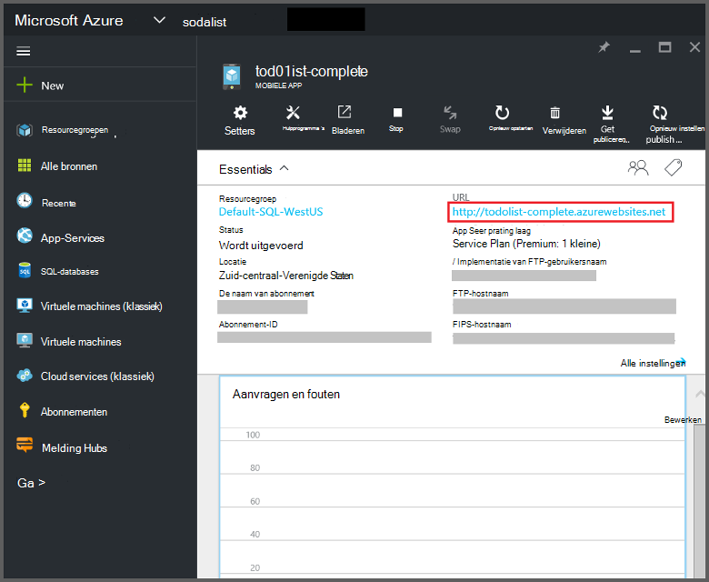
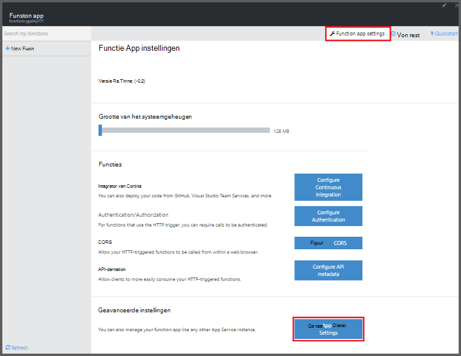
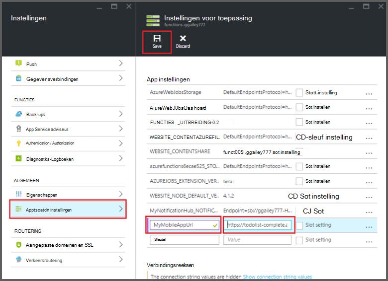

<properties
    pageTitle="Azure functies mobiele Apps bindingen | Microsoft Azure"
    description="Begrijpen hoe Azure Mobile Apps bindingen in Azure functies."
    services="functions"
    documentationCenter="na"
    authors="ggailey777"
    manager="erikre"
    editor=""
    tags=""
    keywords="Azure functies, functies, verwerking van gebeurtenissen, dynamische compute, zonder server architecture"/>

<tags
    ms.service="functions"
    ms.devlang="multiple"
    ms.topic="reference"
    ms.tgt_pltfrm="multiple"
    ms.workload="na"
    ms.date="08/30/2016"
    ms.author="glenga"/>

# Azure functies mobiele Apps bindingen

[AZURE.INCLUDE [functions-selector-bindings](../../includes/functions-selector-bindings.md)]

In dit artikel wordt uitgelegd hoe te configureren en code Azure Mobile Apps bindingen in Azure functies. 

[AZURE.INCLUDE [intro](../../includes/functions-bindings-intro.md)] 

Azure Mobile Apps in App-Service kunt u gegevens van de tabel eindpunt aan mobiele clients. Dezelfde gegevens in tabelvorm kan worden gebruikt met beide invoer en uitvoer van bindingen in Azure functies. Omdat het ondersteunt dynamische schema, is een mobiele app voor Node.js backend ideaal voor gegevens in tabelvorm voor gebruik met uw functies bloot. Dynamische schema is standaard ingeschakeld en moet worden uitgeschakeld in een mobiele app voor productie. Zie voor meer informatie over de eindpunten van de tabel in een backend Node.js [Overzicht: bewerkingen tabel](../app-service-mobile/app-service-mobile-node-backend-how-to-use-server-sdk.md#TableOperations). In de mobiele Apps ondersteunt de backend Node.js in portal bladeren en bewerken van tabellen. Zie [bewerken in de portal](../app-service-mobile/app-service-mobile-node-backend-how-to-use-server-sdk.md#in-portal-editing) in het onderwerp Node.js SDK voor meer informatie. Als u een .NET back-end mobiele app met Azure functies gebruikt, moet u het gegevensmodel van uw zoals vereist door de functie handmatig bijwerken. Zie voor meer informatie over de eindpunten van de tabel in een mobiele app voor .NET back-end [procedure: definiëren een tabel controller](../app-service-mobile/app-service-mobile-dotnet-backend-how-to-use-server-sdk.md#define-table-controller) in het onderwerp .NET back-end-SDK. 

## Een variabele maken voor uw mobiele app backend URL

Mobiele Apps bindingen vereisen momenteel dat u een omgevingsvariabele die de URL van de backend mobiele app zelf retourneert maken. Deze URL vindt u in de [Azure portal](https://portal.azure.com) door uw mobiele app zoeken en openen van het blad.

Deze URL als een omgevingsvariabele in uw functie app instellen:

1. Klik op **functie app instellingen**in uw functie app in de [portal Azure functies](https://functions.azure.com/signin), > **Ga naar de instellingen App-Service**. 

    

2. Klik op **alle instellingen**, Ga naar **Instellingen**, vervolgens onder type **App instellingen** een nieuwe **naam** voor de variabele, plak de URL in **waarde**, zorg ervoor dat het schema HTTPS gebruiken, klik op **Opslaan** en sluiten van de functie app blade terug te keren naar de portal functies in uw app functie.   

    

Nu kunt u deze nieuwe omgevingsvariabele als het veld *verbinding* instellen in uw bindingen.

## Een API-sleutel voor veilige toegang tot uw mobiele Apps tabel eindpunten gebruiken.

In Azure-functies kunnen mobiele Tabelverbindingen u een API-sleutel, dat een gedeeld geheim dat kan worden gebruikt is om te voorkomen dat ongewenste toegang van apps dan uw functies. Mobiele Apps heeft geen ingebouwde ondersteuning voor verificatie van API-sleutel. Echter kunt u een API-sleutel in uw mobiele app in Node.js backend implementeren door de volgende voorbeelden in [Azure App Service Mobile Apps back-end implementatie van een API-sleutel](https://github.com/Azure/azure-mobile-apps-node/tree/master/samples/api-key). Ook kunt u een API-sleutel implementeren in een [.NET back-end mobiele app](https://github.com/Azure/azure-mobile-apps-net-server/wiki/Implementing-Application-Key).

>[AZURE.IMPORTANT] Deze API-sleutel mag niet worden verspreid met de clients mobiele app, deze moet alleen worden verdeeld veilig service aan clients, zoals functies voor Azure. 

## Azure Mobile Apps invoer binding

Invoer bindingen kunnen laden van een record uit een eindpunt mobiele tabel en doorgegeven rechtstreeks aan de binding. De record-ID wordt vastgesteld, gebaseerd op de trigger dat de functie aangeroepen. In een C#-functie, worden eventuele wijzigingen in de record automatisch verzonden naar de tabel wanneer de functie met succes wordt afgesloten.

#### Function.JSON voor mobiele Apps invoer binding

Het bestand *function.json* ondersteunt de volgende eigenschappen:

- `name`: De naam variabele in de functiecode wordt gebruikt voor de nieuwe record.
- `type`: Type waar moet worden ingesteld op *mobileTable*.
- `tableName`: De tabel waar u de nieuwe record wordt gemaakt.
- `id`: De ID van de record op te halen. Deze eigenschap ondersteunt bindingen vergelijkbaar met `{queueTrigger}`, die de tekenreekswaarde van het bericht wachtrij wordt gebruikt als de record-id.
- `apiKey`: De tekenreeks die de toepassingsinstelling van de waarmee de optionele API-sleutel voor de mobiele app. Dit is vereist als uw mobiele app een API-sleutel wordt gebruikt voor het beperken van de toegang van clients.
- `connection`: De tekenreeks die de naam van de omgevingsvariabele in de instellingen van de toepassing die de URL van uw mobiele app backend.
- `direction`: Richting binding, dat moet worden ingesteld op *in*.

Voorbeeld *function.json* bestand:

    {
      "bindings": [
        {
          "name": "record",
          "type": "mobileTable",
          "tableName": "MyTable",
          "id" : "{queueTrigger}",
          "connection": "My_MobileApp_Url",
          "apiKey": "My_MobileApp_Key",
          "direction": "in"
        }
      ],
      "disabled": false
    }

#### Azure voorbeeld mobiele Apps voor C# queue triggers

Op basis van het voorbeeld function.json hierboven, de invoer binding haalt de record van een mobiele Apps tabel eindpunt met de ID die overeenkomt met de tekenreeks wachtrij en wordt doorgegeven aan de parameter *record* . Als de record niet wordt gevonden, wordt de parameter null is. De record wordt vervolgens bijgewerkt met de nieuwe waarde voor de *tekst* bij het verlaten van de functie.

    #r "Newtonsoft.Json"    
    using Newtonsoft.Json.Linq;
    
    public static void Run(string myQueueItem, JObject record)
    {
        if (record != null)
        {
            record["Text"] = "This has changed.";
        }    
    }

#### Azure Mobile Apps voorbeeldcode voor een wachtrij Node.js trigger

Op basis van het voorbeeld function.json hierboven, de invoer binding haalt de record van een mobiele Apps tabel eindpunt met de ID die overeenkomt met de tekenreeks wachtrij en wordt doorgegeven aan de parameter *record* . In Node.js functies, worden bijgewerkte records niet verzonden naar de tabel. In dit codevoorbeeld schrijft de opgehaalde record naar het logboek.

    module.exports = function (context, input) {    
        context.log(context.bindings.record);
        context.done();
    };

## Azure Mobile Apps uitvoer binding

De functie kunt u een record schrijven naar een mobiele Apps tabel eindpunt met een output-binding. 

#### Function.JSON voor mobiele Apps uitvoer binding

Het bestand function.json ondersteunt de volgende eigenschappen:

- `name`: De naam variabele in de functiecode wordt gebruikt voor de nieuwe record.
- `type`: Binding het type dat moet worden ingesteld op *mobileTable*.
- `tableName`: De tabel waar u de nieuwe record wordt gemaakt.
- `apiKey`: De tekenreeks die de toepassingsinstelling van de waarmee de optionele API-sleutel voor de mobiele app. Dit is vereist als uw mobiele app een API-sleutel wordt gebruikt voor het beperken van de toegang van clients.
- `connection`: De tekenreeks die de naam van de omgevingsvariabele in de instellingen van de toepassing die de URL van uw mobiele app backend.
- `direction`: Richting binding, dat moet worden ingesteld op *uit*.

Voorbeeld function.json:

    {
      "bindings": [
        {
          "name": "record",
          "type": "mobileTable",
          "tableName": "MyTable",
          "connection": "My_MobileApp_Url",
          "apiKey": "My_MobileApp_Key",
          "direction": "out"
        }
      ],
      "disabled": false
    }

#### Azure voorbeeld mobiele Apps voor C# queue triggers

In dit voorbeeld C#-code voegt een nieuwe record in een eindpunt Mobile Apps tabel met de eigenschap *Text* in de tabel die is opgegeven in de bovenstaande binding.

    public static void Run(string myQueueItem, out object record)
    {
        record = new {
            Text = $"I'm running in a C# function! {myQueueItem}"
        };
    }

#### Azure Mobile Apps voorbeeldcode voor een wachtrij Node.js trigger

Dit codevoorbeeld Node.js voegt een nieuwe record in een eindpunt Mobile Apps tabel met de eigenschap *text* in de tabel die is opgegeven in de bovenstaande binding.

    module.exports = function (context, input) {
    
        context.bindings.record = {
            text : "I'm running in a Node function! Data: '" + input + "'"
        }   
    
        context.done();
    };

## Volgende stappen

[AZURE.INCLUDE [next steps](../../includes/functions-bindings-next-steps.md)]
