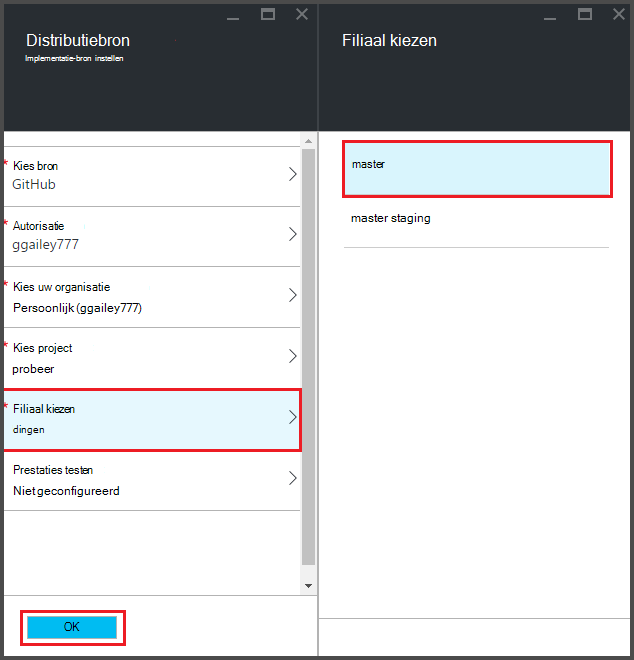

<properties
   pageTitle="Doorlopende implementatie voor Azure functies | Microsoft Azure"
   description="Continuous deployment faciliteiten van Azure App-Service voor het publiceren van uw Azure-functies gebruiken."
   services="functions"
   documentationCenter="na"
   authors="ggailey777"
   manager="erikre"
   editor=""
   tags=""
   />

<tags
   ms.service="functions"
   ms.devlang="multiple"
   ms.topic="article"
   ms.tgt_pltfrm="multiple"
   ms.workload="na"
   ms.date="09/25/2016"
   ms.author="glenga"/>

# Doorlopende implementatie voor Azure functies 

Azure-functies kunt u gemakkelijk continu distributie voor uw functie app configureren. Integratie met BitBucket, Dropbox, GitHub en Visual Studio Team Services (VSTS) een continue implementatieworkflow waar Azure updates aan uw code functies getrokken wanneer ze worden gepubliceerd op een van deze services inschakelen Azure App-Service maakt gebruik van functies. Als u de nieuwe functies in Azure, beginnen met [Azure functies overzicht](functions-overview.md).

Continuous deployment is een geweldige optie voor projecten waarin meerdere en frequent bijdragen worden geïntegreerd. Ook kunt u het besturingselement voor de functies code te onderhouden. De volgende bronnen voor distributie worden momenteel ondersteund:

+ [Bitbucket](https://bitbucket.org/)
+ [Dropbox](https://bitbucket.org/)
+ [Lokale repo GIT](../app-service-web/app-service-deploy-local-git.md)
+ Externe repo GIT
+ [GitHub]
+ Volgt externe repo
+ [OneDrive](https://onedrive.live.com/)
+ Visual Studio teamservices

Implementaties worden geconfigureerd op basis van per-functie-app. Na implementatie continu is ingeschakeld, toegang tot de functiecode in de portal is ingesteld op *alleen-lezen*.

## Doorlopende implementatievereisten

Hebt u uw implementatie bron geconfigureerd en de code van de functies in de implementatie-bron voordat u set-up continuous deployment. Elke functie in een benoemde submap woont, is de naam van de map de naam van de functie in een bepaalde functie app-implementatie. De mapstructuur van deze is in feite de sitecode van uw. 

[AZURE.INCLUDE [functions-folder-structure](../../includes/functions-folder-structure.md)]

## Het instellen van continue implementatie

Gebruik de volgende procedure continue implementatie voor een bestaande functie app configureren:

1. Klik op **functie app instellingen**in uw functie app in de [portal Azure functies](https://functions.azure.com/signin), > **continue integratie configureren** > **Setup**.

    
    
    
    
    Ook kun je naar de blade implementaties van de quickstart functies door te klikken op **Start vanuit het besturingselement**.

2. In het blad implementaties **bron kiezen**, vervolgens de gegevens voor de implementatie van de gekozen bron invullen en klik op **OK**.

    

Nadat de continuous deployment is geconfigureerd, alle wijzigingen in uw implementatie bron bestanden worden naar de functie app en een volledige implementatie wordt geactiveerd. De site is geïmplementeerd als bestanden in de gegevensbron zijn bijgewerkt.

##Implementatie-opties

Hier volgen enkele gebruikelijke implementatiescenario's:

+ 

###Maken van een staging-implementatie

Functie Apps ondersteunt nog geen implementatie sleuven. U kunt echter nog steeds afzonderlijke ontwikkel- en productiecomputers implementaties beheren via continue integratie.

Het proces te configureren en te werken met een staging-implementatie in het algemeen zien er zo uit:

1. Twee functie apps in uw abonnement, een voor de productiecode en een voor staging maken. 

2. Maak een bron van implementatie, als u nog niet hebt. We gebruiken [GitHub].
 
3. De bovenstaande stappen in **doorlopende installatie instellen** voor uw app productie-functie en de implementatie vertakking ingesteld op de master-vertakking van de repo GitHub.

    

4. Herhaal deze stap voor de tijdelijke functie app, maar deze keer de staging-vertakking in de GitHub repo kiezen. Als de bron van uw implementatie geen vertakking ondersteunt, gebruikt u een andere map.
 
5. Breng wijzigingen aan uw code in de tijdelijke map of filiaal en vervolgens controleren of dat deze wijzigingen worden doorgevoerd in de staging-implementatie.

6. Na testen verandert het samenvoegen van de staging-vertakking in de master branch. Deze wordt implementatie App productie functie geactiveerd. Als de bron van uw implementatie geen takken ondersteunt, overschrijven de bestanden in de map van de productie door de bestanden uit de map voor gefaseerde installatie.

###Bestaande functies voor continue implementatie verplaatsen

Wanneer u bestaande functies die u hebt gemaakt en onderhouden in de portal, moet u de bestaande functie codebestanden via FTP downloaden of de lokale Git opslagplaats voordat u kunt continue implementatie instellen zoals hierboven beschreven. U kunt dit doen in de instellingen van de App Service voor uw functie app. Nadat u de bestanden hebt gedownload, kunt u deze uploaden naar uw gekozen continue distributiebron.

>[AZURE.NOTE]Na het configureren van continue integratie, langer u niet de bronbestanden in de portal functies bewerken.

####Procedure: implementatie referenties configureren
Voordat u bestanden vanuit de app functie downloaden kunt, moet u uw referenties voor toegang tot de site, u via de portal doen kunt. Referenties zijn ingesteld op het niveau van de functie app.

1. In uw functie app in de [portal Azure functies](https://functions.azure.com/signin), klikt u op **functie app instellingen** > **Ga naar de instellingen App** > **implementatie referenties**.

    

2. Typ een gebruikersnaam en wachtwoord en klik op **Opslaan**. Nu kunt u deze referenties voor toegang tot uw app in functie van FTP of de ingebouwde Git repo.

####Procedure: bestanden via FTP downloaden

1. In uw functie app in de [portal Azure functies](https://functions.azure.com/signin), klikt u op **functie app instellingen** > **Ga naar de instellingen App** > **Eigenschappen** en kopieert u de waarden voor **Gebruiker/implementatie van FTP**, **FTP-hostnaam**en **FTPS hostnaam**.  
**FTP/implementatie van gebruikers** moet worden ingevoerd, zoals weergegeven in de portal, inclusief de naam van de app om de juiste context bieden voor de FTP-server.

    
    
2. Gebruik de gegevens van uw FTP-client die verbinding maken met uw app en download de bronbestanden voor de functies zijn verzameld.

####Procedure: bestanden met behulp van de lokale Git repository downloaden

1. Klik op **functie app instellingen**in uw functie app in de [portal Azure functies](https://functions.azure.com/signin), > **continue integratie configureren** > **Setup**.

2. In het blad implementaties **Kies bron** **lokaal Git repository**, klik op **OK**.
 
3. Klik op **Ga naar de instellingen App** > **Eigenschappen** en de waarde van de URL Git opmerking. 
    
    

4. De repo op uw lokale machine met een opdrachtregel Git weten of uw favoriete Git Clone. De kloon Git opdracht ziet er als volgt uit:

        git clone https://username@my-function-app.scm.azurewebsites.net:443/my-function-app.git

5. Bestanden ophalen van uw app functie op de kloon op uw lokale computer, zoals in het volgende voorbeeld:

        git pull origin master

    Als dit wordt gevraagd, geven de gebruikersnaam en het wachtwoord voor uw distributie functie app.  

[GitHub]: https://github.com/
