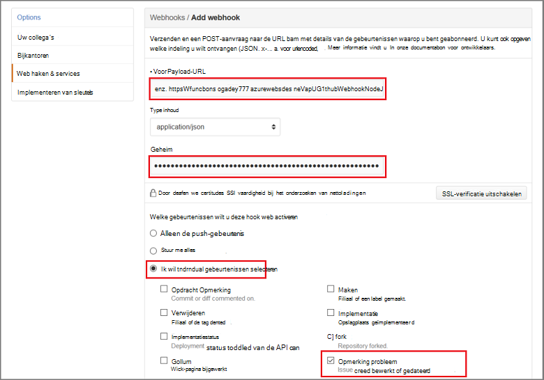

<properties
   pageTitle="Maak een hook Internet of Azure de API-functie | Microsoft Azure"
   description="Azure-functies gebruiken voor het maken van een functie die wordt aangeroepen door een WebHook of API-aanroepen."
   services="azure-functions"
   documentationCenter="na"
   authors="ggailey777"
   manager="erikre"
   editor=""
   tags=""
   />

<tags
   ms.service="functions"
   ms.devlang="multiple"
   ms.topic="get-started-article"
   ms.tgt_pltfrm="multiple"
   ms.workload="na"
   ms.date="08/30/2016"
   ms.author="glenga"/>
   
# Maak een webhook of Azure de API-functie

Azure functies is een gebeurtenisgestuurde compute-on-demand-ervaring die kunt u maken gepland of code-eenheden geactiveerd geïmplementeerd in een aantal verschillende programmeertalen. Zie voor meer informatie over functies in Azure, [Azure functies overzicht](functions-overview.md).

In dit onderwerp wordt beschreven hoe u een nieuwe Node.js functie die wordt aangeroepen door een GitHub webhook maken. De nieuwe functie is gemaakt op basis van een vooraf gedefinieerde sjabloon in de portal Azure functies. U kunt ook controleren of een korte video om te zien hoe deze stappen worden uitgevoerd in de portal.

## Bekijk de video

De volgende video laten zien hoe de eenvoudige stappen uitvoeren in deze zelfstudie 

[AZURE.VIDEO create-a-web-hook-or-api-azure-function]

##Een webhook wordt geactiveerd door de functie van de sjabloon maken

Een functie app fungeert als host voor de uitvoering van de functies in Azure. Voordat u een functie maken kunt, moet u een actieve account Azure. Als u niet al een Azure, [gratis accounts zijn beschikbaar hebt](https://azure.microsoft.com/free/). 

1. Ga naar de [portal Azure functies](https://functions.azure.com/signin) en aanmelden met uw account Azure.

2. Als u een bestaande functie app gebruiken, selecteert u deze in **uw functie apps** hebt klikt u op **openen**. Voor het maken van een nieuwe functie app, typ een unieke **naam** voor de nieuwe functie app of gegenereerde een accepteren, selecteert u de gewenste **regio**en klik vervolgens op **maken + aan de slag**. 

3. Klik op **+ nieuwe functie**in uw app functie > **GitHub Webhook - knooppunt** > **maken**. Hiermee maakt u een functie met een standaardnaam die is gebaseerd op de opgegeven sjabloon. 

     

4. Opmerking in het **ontwikkelen**, de voorbeeldfunctie van de express.js in het venster **Code** . Deze functie ontvangt een verzoek GitHub van een opmerking probleem webhook Logboeken de tekst van het probleem en stuurt een antwoord naar de webhook als `New GitHub comment: <Your issue comment text>`.

     

5. Kopieer de **URL van de functie** en het **Geheim van GitHub** waarden. Deze moet u bij het maken van de webhook in de GitHub. 

6. Schuif naar beneden naar **uitvoeren**, Let op de vooraf gedefinieerde JSON hoofdtekst van de opmerking van een probleem in het hoofdgedeelte van de aanvraag en klik op **uitvoeren**. 
 
    U kunt altijd een nieuwe functie op basis van een sjabloon testen rechts op het tabblad **opstellen** door levering van een verwachte instantie JSON-gegevens en te klikken op de knop **uitvoeren** . In dit geval is de sjabloon een vooraf gedefinieerde instelling voor de opmerking van een probleem. 
 
Vervolgens maakt u de werkelijke webhook in de opslagplaats van GitHub.

##De webhook configureren

1. In de GitHub, gaat u naar een opslagplaats die u bezit; Dit omvat alle opslaglocaties die u hebt forked.
 
2. Klik op **Instellingen voor** > **Webhooks & services** > **webhook toevoegen**.

       

3. Plak de URL en het geheim van de functie **Payload URL** en **geheim**, en vervolgens klikt u op **Ik wil zelf afzonderlijke gebeurtenissen selecteren**, **probleem Opmerking** en klik op **Add-webhook**.

     

De GitHub webhook is nu geconfigureerd voor uw functie wordt geactiveerd wanneer er een nieuw probleem opmerking is toegevoegd.  
Nu is het tijd om deze uit te testen.

##De functie test

1. Uw repo GitHub het tabblad **problemen** in een nieuw browservenster openen, **Nieuw probleem**, typ een titel Klik op **nieuwe kwestie indienen**. U kunt ook een bestaand actie-item openen.

2. Typ een opmerking in het probleem, en klikt u op **Opmerking**. Op dit punt kunt u teruggaan naar uw nieuwe webhook in GitHub en onder **Recente leveringen** Zie die een webhook-verzoek is verzonden en dat de tekst van het antwoord is `New GitHub comment: <Your issue comment text>`.

3. Schuif naar de logboeken en Zie dat de functie geactiveerd is en de waarde terug in de portal functies `New GitHub comment: <Your issue comment text>` naar de streaming Logboeken geschreven.

##Volgende stappen

Zie de volgende onderwerpen voor meer informatie over functies van Azure.

+ [Azure functies: referentie voor ontwikkelaars](functions-reference.md)  
Programmeur verwijzing voor het coderen van functies.
+ [Azure-functies testen](functions-test-a-function.md)  
Beschrijving van verschillende hulpprogramma's en technieken voor het testen van de functies.
+ [Schaalaanpassing van Azure functies](functions-scale.md)  
Serviceplannen beschikbaar met Azure-functies, met inbegrip van het dynamische serviceplan en het kiezen van het juiste plan beschreven.  

[AZURE.INCLUDE [Getting Started Note](../../includes/functions-get-help.md)]
