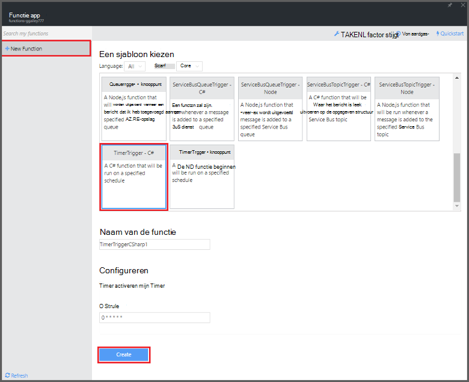
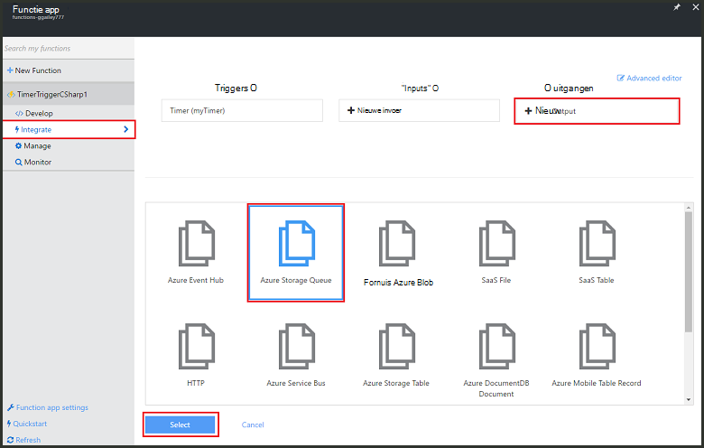
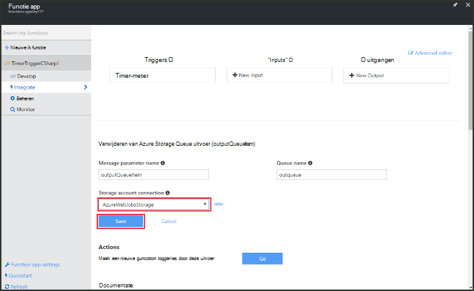

<properties
   pageTitle="Een gebeurtenis maken verwerking functie | Microsoft Azure"
   description="Azure functies maken een C#-functie die wordt uitgevoerd op basis van een Gebeurtenistimer."
   services="functions"
   documentationCenter="na"
   authors="ggailey777"
   manager="erikre"
   editor=""
   tags=""
   />

<tags
   ms.service="functions"
   ms.devlang="multiple"
   ms.topic="get-started-article"
   ms.tgt_pltfrm="multiple"
   ms.workload="na"
   ms.date="09/25/2016"
   ms.author="glenga"/>
   
# Een gebeurtenis maken Azure functie verwerken

Azure functies is een gebeurtenisgestuurde compute-on-demand-ervaring die kunt u maken gepland of code-eenheden geactiveerd geïmplementeerd in een aantal verschillende programmeertalen. Zie voor meer informatie over functies in Azure, [Azure functies overzicht](functions-overview.md).

In dit onderwerp wordt beschreven hoe u een nieuwe functie maken in C# die wordt uitgevoerd op basis van een Gebeurtenistimer om berichten naar een wachtrij opslag toevoegen. 

## Vereisten 

Voordat u een functie maken kunt, moet u een actieve account Azure. Als u niet al een Azure, [gratis accounts zijn beschikbaar hebt](https://azure.microsoft.com/free/).

## Een timer geactiveerd door de functie van de sjabloon maken

Een functie app fungeert als host voor de uitvoering van de functies in Azure. Voordat u een functie maken kunt, moet u een actieve account Azure. Als u niet al een Azure, [gratis accounts zijn beschikbaar hebt](https://azure.microsoft.com/free/). 

1. Ga naar de [portal Azure functies](https://functions.azure.com/signin) en aanmelden met uw account Azure.

2. Als u een bestaande functie app gebruiken, selecteert u deze in **uw functie apps** hebt klikt u op **openen**. Voor het maken van een nieuwe functie app, typ een unieke **naam** voor de nieuwe functie app of gegenereerde een accepteren, selecteert u de gewenste **regio**en klik vervolgens op **maken + aan de slag**. 

3. Klik op **+ nieuwe functie**in uw app functie > **TimerTrigger - C#** > **maken**. Hiermee maakt u een functie met een standaardnaam die wordt uitgevoerd op het standaardschema van eenmaal per minuut. 

    

4. Klik op het tabblad **integratie** in uw nieuwe functie > **Nieuwe uitvoer** > **Azure Storage Queue** > **selecteren**.

    

5. Selecteer een bestaande **opslag account verbinding**in **Azure Storage Queue uitvoer**, of maak een nieuw en klik vervolgens op **Opslaan**. 

    

6. Vervang de bestaande C#-script in het venster **Code** met de volgende code weer op het tabblad **opstellen** :

        using System;
        
        public static void Run(TimerInfo myTimer, out string outputQueueItem, TraceWriter log)
        {
            // Add a new scheduled message to the queue.
            outputQueueItem = $"Ping message added to the queue at: {DateTime.Now}.";
            
            // Also write the message to the logs.
            log.Info(outputQueueItem);
        }

    Deze code wordt een nieuw bericht toegevoegd aan de wachtrij met de huidige datum en tijd waarop de functie wordt uitgevoerd.

7. Klik op **Opslaan** en bekijken van de **Logboeken** van windows voor de volgende functie wordt uitgevoerd.

8. (Optioneel) Navigeer naar de account van de opslag en controleer of de berichten worden toegevoegd aan de wachtrij.

9. Ga terug naar het tabblad **integratie** en wijzig het veld plannen aan `0 0 * * * *`. De functie nu eenmaal elk uur wordt uitgevoerd. 

Dit is een zeer eenvoudig voorbeeld van een trigger timer en een wachtrij voor de opslag van uitvoer binding. Zie de [Azure functies timer trigger](functions-bindings-timer.md) zowel de [Azure functies, triggers en bindingen voor opslag van Azure](functions-bindings-storage.md) onderwerpen voor meer informatie.

##Volgende stappen

Zie de volgende onderwerpen voor meer informatie over functies van Azure.

+ [Azure functies: referentie voor ontwikkelaars](functions-reference.md)  
Programmeur verwijzing voor codering, functies en triggers en bindingen te definiëren.
+ [Azure-functies testen](functions-test-a-function.md)  
Beschrijving van verschillende hulpprogramma's en technieken voor het testen van de functies.
+ [Schaalaanpassing van Azure functies](functions-scale.md)  
Serviceplannen beschikbaar met Azure-functies, met inbegrip van het dynamische serviceplan en het kiezen van het juiste plan beschreven.  

[AZURE.INCLUDE [Getting Started Note](../../includes/functions-get-help.md)]
