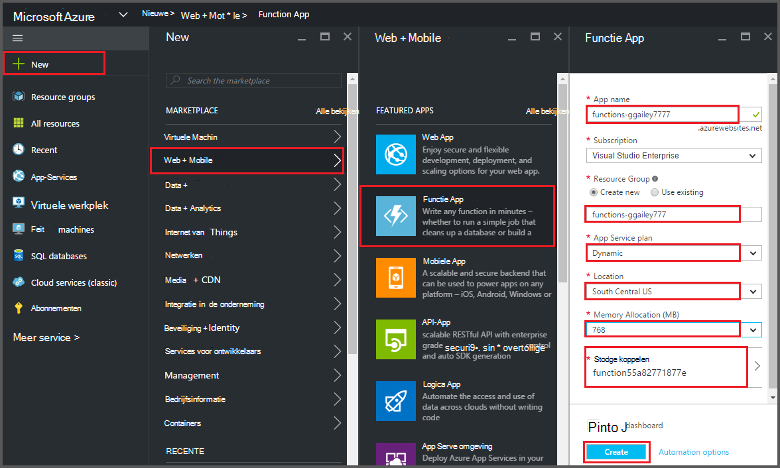
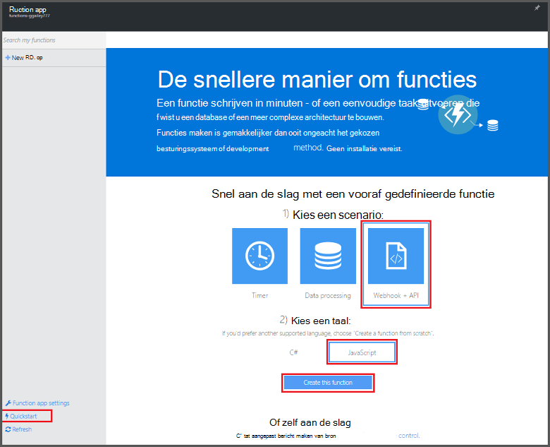
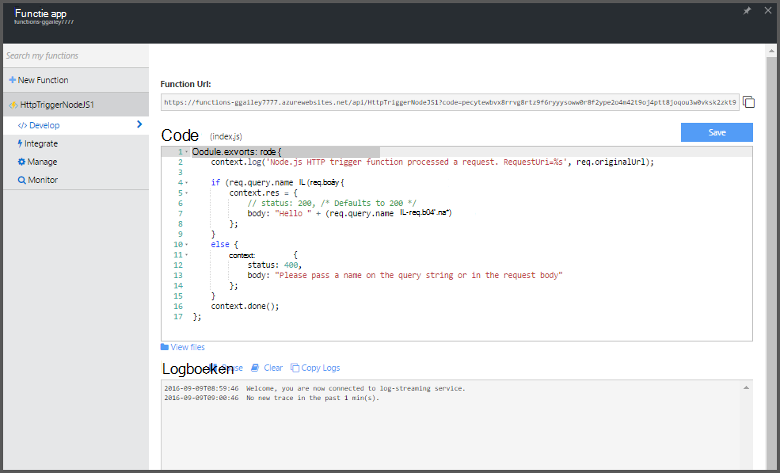

<properties
   pageTitle="Een functie maken vanaf de Portal Azure | Microsoft Azure"
   description="Bouw uw eerste Azure-functie, een toepassing zonder server uitvoert in minder dan twee minuten."
   services="functions"
   documentationCenter="na"
   authors="ggailey777"
   manager="erikre"
   editor=""
   tags=""
/>

<tags
   ms.service="functions"
   ms.devlang="multiple"
   ms.topic="article"
   ms.tgt_pltfrm="multiple"
   ms.workload="na"
   ms.date="09/08/2016"
   ms.author="glenga"/>

#Een functie maken vanaf de portal Azure

##Overzicht
Azure functies is een gebeurtenisgestuurde compute-on-demand-ervaring die zich uitstrekt van de bestaande Azure toepassingsplatform met mogelijkheden voor de uitvoering van code die worden gestart door gebeurtenissen die in andere Azure services, SaaS-producten en systemen op locatie. Toepassingen geschaald op basis van de vraag met Azure functies, en u betaalt alleen voor de resources die u wilt gebruiken. Azure functies kunt u maken gepland of eenheden van code geïmplementeerd in verschillende programmeertalen geactiveerd. Zie voor meer informatie over functies in Azure, [Azure functies overzicht](functions-overview.md).

Dit onderwerp wordt beschreven hoe u de Azure portal gebruiken voor het maken van een eenvoudige "hello world" Node.js Azure-functie die wordt aangeroepen door een HTTP-trigger. Voordat u een functie in de Azure portal maken kunt, moet u expliciet een functie app maken in Azure App-Service. Als u de functie app automatisch voor u gemaakt, Zie [de andere functies van Azure quickstart zelfstudie](functions-create-first-azure-function.md), dat is een eenvoudiger quickstart-ervaring en bevat een video.

##Een functie app maken

Een functie app fungeert als host voor de uitvoering van de functies in Azure. Volg deze stappen als u wilt een functie app maken in de portal Azure.

Voordat u uw eerste functie maken kunt, moet u een actieve account Azure. Als u niet al een Azure, [gratis accounts zijn beschikbaar hebt](https://azure.microsoft.com/free/).

1. Ga naar de [portal Azure](https://portal.azure.com) en aanmelden met uw account Azure.

2. Klik op **+ Nieuw** > **Web + Mobile** > **Functie App**, selecteer uw **abonnement**, typ een unieke **naam** waarmee uw app functie en geef vervolgens de volgende instellingen:

    + **[Resourcegroep](../azure-portal/resource-group-portal.md/)**: Selecteer **Nieuw** en typ een naam voor uw nieuwe resourcegroep. U kunt een bestaande resourcegroep, maar mogelijk niet maken van een dynamische App serviceplan voor uw functie app.
    + **[App serviceplan](../app-service/azure-web-sites-web-hosting-plans-in-depth-overview.md)**: *dynamische* of *Klassiek*kiezen. 
        + **Dynamische**: het plantype voor Azure functies. Als u een dynamische plan, ook kiest u de **locatie** en de **Toewijzing van geheugen** (in MB) instellen. Kosten, Zie [prijzen Azure functies](https://azure.microsoft.com/pricing/details/functions/)voor informatie over de invloed van de toewijzing van geheugen. 
        + **Klassieke**: een klassieke serviceplan App, moet u een **App aantal servicelocatie plan** maken of een bestaande selecteren. Deze instellingen bepalen de [locatie van functies, de kosten en resources te berekenen](https://azure.microsoft.com/pricing/details/app-service/) die zijn gekoppeld aan uw toepassing.  
    + **Opslag account**: elke functie app een opslag-account vereist. Kies een bestaande account voor opslag of een maken. 

    

3. Klik op **maken** om in te richten en implementeren van de nieuwe functie app.  

Nu de functie app is ingericht, kunt u uw eerste functie.

## Maak een functie

Deze stappen maken een functie van de quickstart Azure functies.

1. In het tabblad **Quickstart** **WebHook + API** en **JavaScript**, klik op **een functie maken**. Een nieuwe vooraf gedefinieerde Node.js functie wordt gemaakt. 

    

2. (Optioneel) Op dit moment in de quickstart, kunt u een rondleiding van Azure functies, functies in de portal.   Zodra u hebt voltooid of de rondleiding wordt overgeslagen, kunt u uw nieuwe functie testen door de HTTP-trigger te gebruiken.

##De functie test

Omdat de functies van Azure QuickStart functionele code bevatten, kunt u de nieuwe functie onmiddellijk testen.

1. Bekijk het venster **Code** op het tabblad **opstellen** en u ziet dat deze code Node.js verwacht van een HTTP-verzoek met *een waarde die in de hoofdtekst van het bericht of in een queryreeks worden doorgegeven* . Wanneer de functie wordt uitgevoerd, wordt deze waarde wordt geretourneerd in het antwoordbericht.

    

2. Ga naar het vak **hoofdtekst aanvragen** , wijzigen in de waarde van de eigenschap *name* de naam en op **uitvoeren**. U ziet dat de uitvoering wordt geactiveerd door een test HTTP-verzoek, gegevens worden geschreven naar de streaming-logboeken en het antwoord 'hello' wordt weergegeven in de **uitvoer**. 

3. Om uitvoering van dezelfde functie uit een andere browservenster of tabblad activeren, de **Functie URL** -waarde van het tabblad **opstellen** kopiëren en plakken in de adresbalk van een browser en vervolgens de query string-waarde toevoegen `&name=yourname` en druk op enter. Dezelfde informatie in de logboeken wordt geschreven en geeft het antwoord 'hello' als voordat u de browser.

##Volgende stappen

Deze quickstart toont een zeer eenvoudige uitvoering van een eenvoudige functie van HTTP geactiveerd. Zie de volgende onderwerpen voor meer informatie over het gebruik van de kracht van Azure functies in uw toepassingen.

+ [Azure functies: referentie voor ontwikkelaars](functions-reference.md)  
Programmeur verwijzing voor codering, functies en triggers en bindingen te definiëren.
+ [Azure-functies testen](functions-test-a-function.md)  
Beschrijving van verschillende hulpprogramma's en technieken voor het testen van de functies.
+ [Schaalaanpassing van Azure functies](functions-scale.md)  
Serviceplannen beschikbaar met Azure-functies, met inbegrip van het dynamische serviceplan en het kiezen van het juiste plan beschreven. 
+ [Wat is Azure App Service?](../app-service/app-service-value-prop-what-is.md)  
Azure functies gebruikt de Azure App Service platform voor basisfunctionaliteit zoals implementaties, omgevingsvariabelen en diagnostische gegevens. 

[AZURE.INCLUDE [Getting Started Note](../../includes/functions-get-help.md)]
