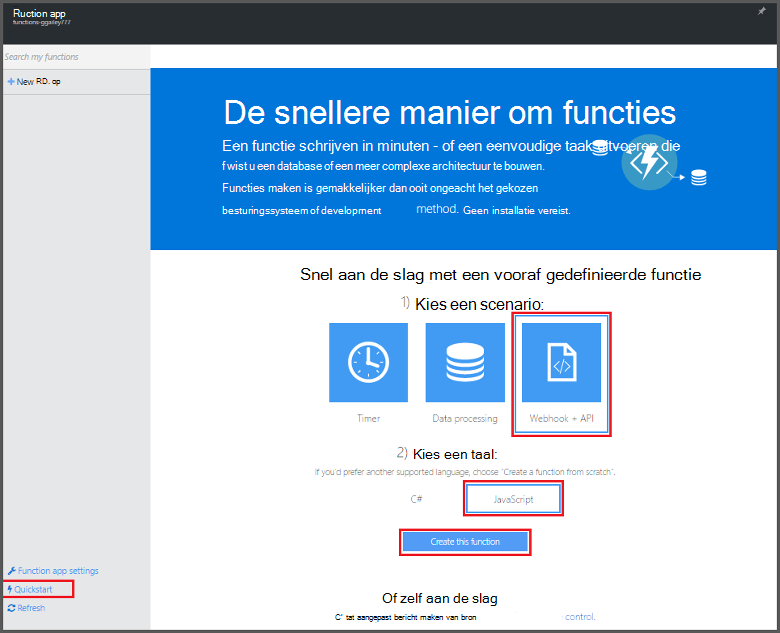
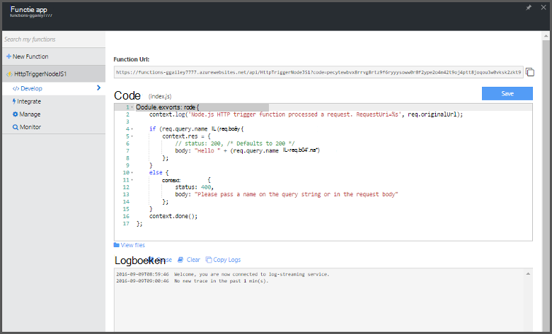

<properties
   pageTitle="Maak uw eerste Azure functie | Microsoft Azure"
   description="Bouw uw eerste Azure-functie, een toepassing zonder server uitvoert in minder dan twee minuten."
   services="functions"
   documentationCenter="na"
   authors="ggailey777"
   manager="erikre"
   editor=""
   tags=""
/>

<tags
   ms.service="functions"
   ms.devlang="multiple"
   ms.topic="hero-article"
   ms.tgt_pltfrm="multiple"
   ms.workload="na"
   ms.date="09/08/2016"
   ms.author="glenga"/>

#Maak uw eerste Azure-functie

##Overzicht
Azure functies is een gebeurtenisgestuurde compute-on-demand-ervaring die zich uitstrekt van de bestaande Azure toepassingsplatform met mogelijkheden voor de uitvoering van code die worden gestart door gebeurtenissen die in andere Azure services, SaaS-producten en systemen op locatie. Toepassingen geschaald op basis van de vraag met Azure functies, en u betaalt alleen voor de resources die u wilt gebruiken. Azure functies kunt u maken gepland of eenheden van code geïmplementeerd in een aantal verschillende programmeertalen geactiveerd. Zie voor meer informatie over functies in Azure, [Azure functies overzicht](functions-overview.md).

In dit onderwerp wordt beschreven hoe u de quickstart Azure functies in de portal te gebruiken voor het maken van een eenvoudige "hello world" Node.js functie die wordt aangeroepen door een HTTP-trigger. U kunt ook controleren of een korte video om te zien hoe deze stappen worden uitgevoerd in de portal.

## Bekijk de video

De volgende video te zien hoe de basisstappen uitvoeren in deze zelfstudie. 

[AZURE.VIDEO create-your-first-azure-function-simple]

##Een functie van de quickstart maken

Een functie app fungeert als host voor de uitvoering van de functies in Azure. Ga als volgt te werk om een nieuwe functie app als de nieuwe functie maken. De nieuwe functie app is gemaakt met een standaardconfiguratie. Zie voor een voorbeeld van het expliciet maken van uw app in functie, [de andere functies van Azure quickstart-zelfstudie](functions-create-first-azure-function-azure-portal.md).

Voordat u uw eerste functie maken kunt, moet u een actieve account Azure. Als u niet al een Azure, [gratis accounts zijn beschikbaar hebt](https://azure.microsoft.com/free/).

1. Ga naar de [portal Azure functies](https://functions.azure.com/signin) en aanmelden met uw account Azure.

2. Typ een unieke **naam** voor de nieuwe functie app of gegenereerde een accepteren, selecteert u de gewenste **regio**en klik op **maken + aan de slag**. 

3. In het tabblad **Quickstart** **WebHook + API** en **JavaScript**, klik op **een functie maken**. Een nieuwe vooraf gedefinieerde Node.js functie wordt gemaakt. 

    

4. (Optioneel) Op dit moment in de quickstart, kunt u een rondleiding van Azure functies, functies in de portal.   Zodra u hebt voltooid of de rondleiding wordt overgeslagen, kunt u uw nieuwe functie testen door de HTTP-trigger te gebruiken.

##De functie test

Omdat de functies van Azure QuickStart functionele code bevatten, kunt u de nieuwe functie onmiddellijk testen.

1. Bekijk het venster **Code** op het tabblad **opstellen** en u ziet dat deze code Node.js verwacht van een HTTP-verzoek met *een waarde die in de hoofdtekst van het bericht of in een queryreeks worden doorgegeven* . Wanneer de functie wordt uitgevoerd, wordt deze waarde wordt geretourneerd in het antwoordbericht.

    

2. Ga naar het vak **hoofdtekst aanvragen** , wijzigen in de waarde van de eigenschap *name* de naam en op **uitvoeren**. Ziet u dat de uitvoering wordt geactiveerd door een test HTTP-verzoek, gegevens worden geschreven naar de streaming-logboeken en het antwoord 'hello' wordt weergegeven in de **uitvoer**. 

3. Om uitvoering van dezelfde functie uit een andere browservenster of tabblad activeren, de **Functie URL** -waarde van het tabblad **opstellen** kopiëren en plakken in de adresbalk van een browser en vervolgens de query string-waarde toevoegen `&name=yourname` en druk op enter. Dezelfde informatie in de logboeken wordt geschreven en geeft het antwoord 'hello' als voordat u de browser.

##Volgende stappen

Deze quickstart toont een zeer eenvoudige uitvoering van een eenvoudige functie van HTTP geactiveerd. Zie de volgende onderwerpen voor meer informatie over het gebruik van de kracht van Azure functies in uw toepassingen.

+ [Azure functies: referentie voor ontwikkelaars](functions-reference.md)  
Programmeur verwijzing voor codering, functies en triggers en bindingen te definiëren.
+ [Azure-functies testen](functions-test-a-function.md)  
Beschrijving van verschillende hulpprogramma's en technieken voor het testen van de functies.
+ [Schaalaanpassing van Azure functies](functions-scale.md)  
Serviceplannen beschikbaar met Azure-functies, met inbegrip van het dynamische serviceplan en het kiezen van het juiste plan beschreven. 
+ [Wat is Azure App Service?](../app-service/app-service-value-prop-what-is.md)  
Azure functies maakt gebruik van het platform Azure App Service voor basisfunctionaliteit zoals implementaties, omgevingsvariabelen en diagnostische gegevens. 

[AZURE.INCLUDE [Getting Started Note](../../includes/functions-get-help.md)]
