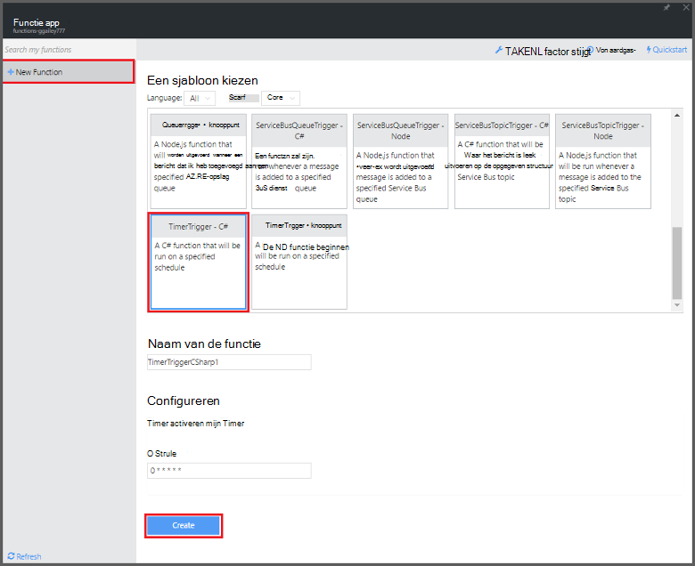

<properties
   pageTitle="Azure-functies gebruiken voor het uitvoeren van een geplande taak voor opschonen | Microsoft Azure"
   description="Azure functies maken een C#-functie die wordt uitgevoerd op basis van een Gebeurtenistimer."
   services="functions"
   documentationCenter="na"
   authors="ggailey777"
   manager="erikre"
   editor=""
   tags=""
   />

<tags
   ms.service="functions"
   ms.devlang="multiple"
   ms.topic="article"
   ms.tgt_pltfrm="multiple"
   ms.workload="na"
   ms.date="09/26/2016"
   ms.author="glenga"/>
   
# Azure-functies gebruiken voor het uitvoeren van een geplande taak voor opschonen

In dit onderwerp wordt beschreven hoe u Azure functies gebruiken voor het maken van een nieuwe functie in C# die wordt uitgevoerd op basis van een Gebeurtenistimer voor opschonen u rijen in een databasetabel. De nieuwe functie is gemaakt op basis van een vooraf gedefinieerde sjabloon in de portal Azure functies. Ter ondersteuning van dit scenario moet u een verbindingsreeks voor de database ook instellen als een App Service in de app functie instellen. 

## Vereisten 

Voordat u een functie maken kunt, moet u een actieve account Azure. Als u niet al een Azure, [gratis accounts zijn beschikbaar hebt](https://azure.microsoft.com/free/).

In dit onderwerp ziet u een Transact-SQL-opdracht die wordt uitgevoerd een bulkbewerking opruimen in de tabel met de naam *TodoItems* in een SQL-Database. Deze tabel met dezelfde TodoItems wordt gemaakt wanneer u de [Azure App Service Mobile Apps quickstart zelfstudie](../app-service-mobile/app-service-mobile-ios-get-started.md)hebt voltooid. U kunt een voorbeelddatabase ook gebruiken als u een andere tabel te gebruiken, moet u de opdracht aanpassen.

Kunt u de verbindingsreeks die wordt gebruikt door een mobiele App back-end in de portal voor **alle**instellingen krijgen > **Toepassingsinstellingen** > **verbindingsreeksen** > **connection string-waarden weergeven** > **MS_TableConnectionString**. Ook krijgt u de verbindingsreeks rechtstreeks vanuit een SQL-Database in de portal voor **alle**instellingen > **Eigenschappen** > **weergegeven tekenreeksen voor een databaseverbinding** > **ADO.NET (SQL-verificatie)**.

In dit scenario wordt een bulkbewerking ten opzichte van de database. Als u de functie proces afzonderlijke CRUD bewerkingen in een tabel met mobiele Apps, moet u in plaats daarvan gebruiken Mobile tabel-binding.

## De verbindingsreeks voor een SQL-Database in de functie app instellen

Een functie app fungeert als host voor de uitvoering van de functies in Azure. Het is een goed gebruik om tekenreeksen en andere geheimen in de functie app instellingen. Dit voorkomt dat onbedoelde openbaarmaking wanneer de functiecode eindigt boven in een repo ergens. 

1. Ga naar de [portal Azure functies](https://functions.azure.com/signin) en aanmelden met uw account Azure.

2. Als u een bestaande functie app gebruiken, selecteert u deze in **uw functie apps** hebt klikt u op **openen**. Voor het maken van een nieuwe functie app, typ een unieke **naam** voor de nieuwe functie app of gegenereerde een accepteren, selecteert u de gewenste **regio**en klik vervolgens op **maken + aan de slag**. 

3. Klik op **functie app instellingen**in uw app functie > **Ga naar de instellingen App-Service**. 

    

4. In uw app functie op **alle instellingen**, Ga naar **Instellingen**en klik vervolgens onder type **verbindingsreeksen** `sqldb_connection` voor **de naam**, de verbindingsreeks in **waarde**te plakken, klikt u op **Opslaan**en sluit vervolgens de functie app blade terug te keren naar de portal functies.

    

U kunt nu de C# programmacode die is verbonden met de SQL-Database toevoegen.

## Een timer geactiveerd door de functie van de sjabloon maken

1. Klik op **+ nieuwe functie**in uw app functie > **TimerTrigger - C#** > **maken**. Hiermee maakt u een functie met een standaardnaam die wordt uitgevoerd op het standaardschema van eenmaal per minuut. 

    

2. Toevoegen de volgende assemblyverwijzingen aan de bovenkant van de bestaande programmacode in het deelvenster **Code** op het tabblad **opstellen** :

        #r "System.Configuration"
        #r "System.Data"

3. Voeg de volgende `using` de functie-instructies:

        using System.Configuration;
        using System.Data.SqlClient;
        using System.Threading.Tasks; 

4. Vervang de bestaande functie voor **uitvoeren** met de volgende code:

        public static async Task Run(TimerInfo myTimer, TraceWriter log)
        {
            var str = ConfigurationManager.ConnectionStrings["sqldb_connection"].ConnectionString;
            using (SqlConnection conn = new SqlConnection(str))
            {
                conn.Open();
                var text = "DELETE from dbo.TodoItems WHERE Complete='True'";
                using (SqlCommand cmd = new SqlCommand(text, conn))
                {
                    // Execute the command and log the # rows deleted.
                    var rows = await cmd.ExecuteNonQueryAsync();
                    log.Info($"{rows} rows were deleted");
                }
            }
        }

5. Klik op **Opslaan**, bekijk de **Logboeken** van windows voor de volgende functie wordt uitgevoerd en Let op het aantal rijen verwijderd uit de tabel TodoItems.

6. (Optioneel) Met de [mobiele Apps quickstart app](../app-service-mobile/app-service-mobile-ios-get-started.md), aanvullende items niet markeren als 'voltooid' vervolgens terug naar het venster **Logboeken** en bekijk hetzelfde aantal rijen verwijderd tijdens het uitvoeren van de volgende door de functie. 

##Volgende stappen

Zie de volgende onderwerpen voor meer informatie over functies van Azure.

+ [Azure functies: referentie voor ontwikkelaars](functions-reference.md)  
Programmeur verwijzing voor codering, functies en triggers en bindingen te definiëren.
+ [Azure-functies testen](functions-test-a-function.md)  
Beschrijving van verschillende hulpprogramma's en technieken voor het testen van de functies.
+ [Schaalaanpassing van Azure functies](functions-scale.md)  
Serviceplannen beschikbaar met Azure-functies, met inbegrip van het dynamische serviceplan en het kiezen van het juiste plan beschreven.  

[AZURE.INCLUDE [Getting Started Note](../../includes/functions-get-help.md)]