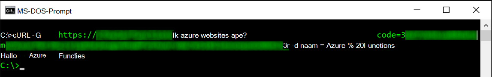
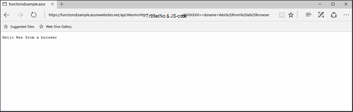
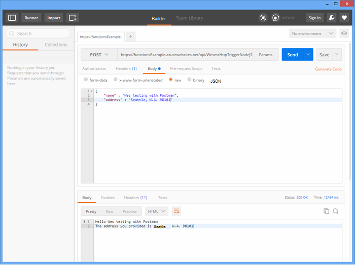
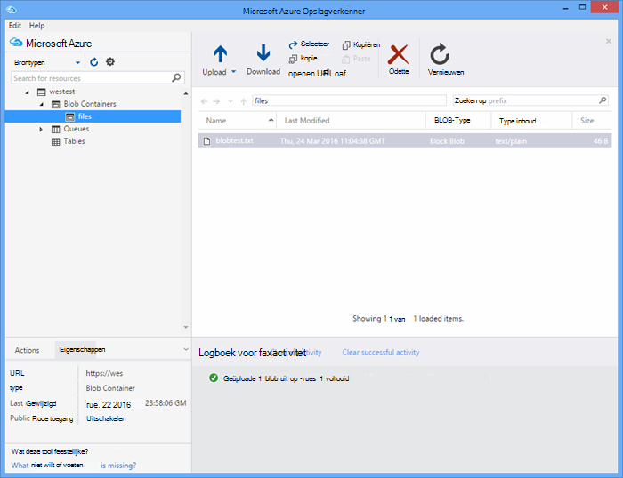

<properties
   pageTitle="Azure-functies testen | Microsoft Azure"
   description="Test uw Azure functies met Postman, krul en Node.js."
   services="functions"
   documentationCenter="na"
   authors="wesmc7777"
   manager="erikre"
   editor=""
   tags=""
   keywords="Azure functies, functies, verwerking van de gebeurtenis, webhooks, dynamische compute, zonder server-architectuur, testen"/>

<tags
   ms.service="functions"
   ms.devlang="multiple"
   ms.topic="article"
   ms.tgt_pltfrm="multiple"
   ms.workload="na"
   ms.date="08/19/2016"
   ms.author="wesmc"/>

# Azure-functies testen

## Overzicht

In deze zelfstudie doorlopen we verschillende benaderingen voor het testen van functies. We zullen een HTTP-trigger functie definiëren waarmee invoer via een tekenreeksparameter van de query of het hoofdgedeelte van de aanvraag accepteert. De standaard **HttpTrigger Node.js** sjabloon functiecode ondersteunt een `name` query string parameter. We zullen ook code toevoegen om te ondersteunen die parameter samen met `address` informatie voor de gebruiker in het hoofdgedeelte van de aanvraag.

## Maak een functie voor het testen

Voor de meeste van deze zelfstudie gebruiken we een enigszins gewijzigde versie van de sjabloon **HttpTrigger Nodejs-functie** die beschikbaar is bij het maken van een nieuwe functie.  U kunt het [maken van uw eerste functie Azure zelfstudie](functions-create-first-azure-function.md) als u hulp bij het maken van een nieuwe functie bekijken.  De sjabloon **HttpTrigger Nodejs functie** kiest bij het maken van de test-functie in de [Portal Azure].

De standaardsjabloon voor de functie is in principe een hello world-functie die de naam van de aanvraag instantie of query string parameter, een echo weer `name=<your name>`.  De code kunt u de naam en adres opgeven als JSON-inhoud in het hoofdgedeelte van de aanvraag zal worden bijgewerkt. De functie wordt vervolgens deze terug naar de client als beschikbare echo.   

De functie bijgewerkt met de volgende code die we gebruiken voor het testen van:

    module.exports = function(context, req) {
        context.log("Node.js HTTP trigger function processed a request. RequestUri=%s", req.originalUrl);
        context.log("Request Headers = " + JSON.stringify(req.headers));    
    
        if (req.query.name || (req.body && req.body.name)) {
            if (typeof req.query.name != "undefined") {
                context.log("Name was provided as a query string param..."); 
                ProcessNewUserInformation(context, req.query.name);
            }
            else {
                context.log("Processing user info from request body..."); 
                ProcessNewUserInformation(context, req.body.name, req.body.address);
            }
        }
        else {
            context.res = {
                status: 400,
                body: "Please pass a name on the query string or in the request body"
            };
        }
        context.done();
    };
    
    function ProcessNewUserInformation(context, name, address)
    {    
        context.log("Processing User Information...");            
        context.log("name = " + name);            
        echoString = "Hello " + name;
        
        if (typeof address != "undefined")
        {
            echoString += "\n" + "The address you provided is " + address;
            context.log("address = " + address);            
        }
        
        context.res = {
                // status: 200, /* Defaults to 200 */
                body: echoString
            };
    }

## Een functie met extra testen

### Testen met krul

Bij het testen van software, vaak is het niet nodig om te zoeken een verder dan vanaf de opdrachtregel kunt u fouten opsporen in uw toepassing, dit is niet anders met functies.

Om te testen op de bovenstaande functie, de **Functie Url** van de portal te kopiëren. Heeft de volgende vorm: 

    https://<Your Function App>.azurewebsites.net/api/<Your Function Name>?code=<your access code>
    
Dit is de Url voor het genereren van uw functie, kunnen we dit testen met behulp van de cURL-opdracht op de opdrachtregel om een Get (`-G` of `--get`) verzoek aan onze functie:

    curl -G https://<Your Function App>.azurewebsites.net/api/<Your Function Name>?code=<your access code>
    
Deze bovenstaande voorbeeld vereist een queryreeksparameter waarop gegevens kan worden doorgegeven (`-d`) in een cURL-opdracht:

    curl -G https://<Your Function App>.azurewebsites.net/api/<Your Function Name>?code=<your access code> -d name=<Enter a name here>
    
Op ENTER drukken en ziet u de uitvoer van de functie op de opdrachtregel.

In het venster portal **Logboeken** wordt uitvoer van de volgende strekking vastgelegd tijdens het uitvoeren van de functie:

    2016-04-05T21:55:09  Welcome, you are now connected to log-streaming service.
    2016-04-05T21:55:30.738 Function started (Id=ae6955da-29db-401a-b706-482fcd1b8f7a)
    2016-04-05T21:55:30.738 Node.js HTTP trigger function processed a request. RequestUri=https://functionsExample.azurewebsites.net/api/HttpTriggerNodeJS1?code=XXXXXXX&name=Azure Functions
    2016-04-05T21:55:30.738 Function completed (Success, Id=ae6955da-29db-401a-b706-482fcd1b8f7a)

### Testen met een browser

Functies die geen parameters vereist en hoeft alleen queryreeksparameters, kunnen worden getest met behulp van een browser.

Test de functie die hierboven is gedefinieerd, kopieert u de **Url van de functie** vanaf de portal. Heeft de volgende vorm:

    https://<Your Function App>.azurewebsites.net/api/<Your Function Name>?code=<your access code>

Append, de `name` queryparameter tekenreeks als volgt met behulp van een werkelijke naam voor de `<Enter a name here>` tijdelijke aanduiding.

    https://<Your Function App>.azurewebsites.net/api/<Your Function Name>?code=<your access code>&name=<Enter a name here>

Plak de URL in uw browser en u moet een antwoord met de volgende strekking.

In het venster portal **Logboeken** wordt uitvoer van de volgende strekking vastgelegd tijdens het uitvoeren van de functie:

    2016-03-23T07:34:59  Welcome, you are now connected to log-streaming service.
    2016-03-23T07:35:09.195 Function started (Id=61a8c5a9-5e44-4da0-909d-91d293f20445)
    2016-03-23T07:35:10.338 Node.js HTTP trigger function processed a request. RequestUri=https://functionsExample.azurewebsites.net/api/WesmcHttpTriggerNodeJS1?code=XXXXXXXXXX==&name=Wes from a browser
    2016-03-23T07:35:10.338 Request Headers = {"cache-control":"max-age=0","connection":"Keep-Alive","accept":"text/html","accept-encoding":"gzip","accept-language":"en-US"}
    2016-03-23T07:35:10.338 Name was provided as a query string param.
    2016-03-23T07:35:10.338 Processing User Information...
    2016-03-23T07:35:10.369 Function completed (Success, Id=61a8c5a9-5e44-4da0-909d-91d293f20445)

### Test met Postman

Het aanbevolen hulpmiddel voor het merendeel van de functies testen is Postman. Zie installeren Postman, [Postman ophalen](https://www.getpostman.com/). Postman biedt controle over veel meer kenmerken van een HTTP-aanvraag.

> [AZURE.TIP] Gebruik de REST-Client die u vertrouwd bent. Hier zijn enkele alternatieven voor Postman:  
> 
> * [Fiddler](http://www.telerik.com/fiddler)  
> * [Paw](https://luckymarmot.com/paw)  

De functie met het hoofdgedeelte van een aanvraag in Postman testen: 

1. Postman start via de **Apps** -knop in de linkerbovenhoek van de hoek van een venster van de browser Chrome.
2. De **Functie Url** kopiëren en plakken in de Postman. De parameter toegangscode queryreeks bevat.
3. De methode HTTP **POST**wijzigen.
4. Klik op de **instantie** > **ruwe** en JSON het hoofdgedeelte van de aanvraag de volgende toevoegen:

        {
            "name" : "Wes testing with Postman",
            "address" : "Seattle, W.A. 98101"
        }

5. Klik op **verzenden**.

De volgende afbeelding ziet het voorbeeld van de functie eenvoudig echo in deze zelfstudie te testen. 

In het venster portal **Logboeken** wordt uitvoer van de volgende strekking vastgelegd tijdens het uitvoeren van de functie:

    2016-03-23T08:04:51  Welcome, you are now connected to log-streaming service.
    2016-03-23T08:04:57.107 Function started (Id=dc5db8b1-6f1c-4117-b5c4-f6b602d538f7)
    2016-03-23T08:04:57.763 Node.js HTTP trigger function processed a request. RequestUri=https://functions841def78.azurewebsites.net/api/WesmcHttpTriggerNodeJS1?code=XXXXXXXXXX==
    2016-03-23T08:04:57.763 Request Headers = {"cache-control":"no-cache","connection":"Keep-Alive","accept":"*/*","accept-encoding":"gzip","accept-language":"en-US"}
    2016-03-23T08:04:57.763 Processing user info from request body...
    2016-03-23T08:04:57.763 Processing User Information...
    2016-03-23T08:04:57.763 name = Wes testing with Postman
    2016-03-23T08:04:57.763 address = Seattle, W.A. 98101
    2016-03-23T08:04:57.795 Function completed (Success, Id=dc5db8b1-6f1c-4117-b5c4-f6b602d538f7)
    
### Een blob-trigger met Opslagverkenner testen

U kunt een trigger-functie blob met [Microsoft Azure Opslagverkenner](http://storageexplorer.com/)kunt testen.

1. In [Azure Portal] voor uw app functies, maak een nieuwe C#, F # of knooppunt blob trigger functie. Stel het pad om te controleren op de naam van je blob-container. Bijvoorbeeld:

        files

2. Klik op de **+** om te selecteren of maken van de opslag-account die u wilt gebruiken. Klik vervolgens op **maken**.

3. Maak een tekstbestand met de volgende tekst en sla het op:

        A text file for blob trigger function testing.

4. Voer [Microsoft Azure Opslagverkenner](http://storageexplorer.com/) en verbinding maken met de blob-container in de gecontroleerde opslag-account.

5. Klik op de knop **uploaden** en het bestand uploaden.

    

    De standaardcode blob trigger functie wordt de verwerking van de blob in de logboeken te rapporteren:

        2016-03-24T11:30:10  Welcome, you are now connected to log-streaming service.
        2016-03-24T11:30:34.472 Function started (Id=739ebc07-ff9e-4ec4-a444-e479cec2e460)
        2016-03-24T11:30:34.472 C# Blob trigger function processed: A text file for blob trigger function testing.
        2016-03-24T11:30:34.472 Function completed (Success, Id=739ebc07-ff9e-4ec4-a444-e479cec2e460)

## Een functie binnen functies testen

### Testen met de functies portal knop uitvoeren

De portal biedt een knop **uitvoeren** waarmee u bepaalde beperkte testen. U kan bieden een hoofdgedeelte van de aanvraag met de knop uitvoeren, maar u kan bieden queryreeksparameters of bijwerken van aanvraagheaders.

De HTTP-trigger functie die we eerder hebben gemaakt door een JSON-vergelijkbaar met de volgende tekenreeks toe te voegen in het veld **instantie verzoeken** testen en vervolgens klikt u op de knop **uitvoeren** .

    {
        "name" : "Wes testing Run button",
        "address" : "USA"
    } 

In het venster portal **Logboeken** wordt uitvoer van de volgende strekking vastgelegd tijdens het uitvoeren van de functie:

    2016-03-23T08:03:12  Welcome, you are now connected to log-streaming service.
    2016-03-23T08:03:17.357 Function started (Id=753a01b0-45a8-4125-a030-3ad543a89409)
    2016-03-23T08:03:18.697 Node.js HTTP trigger function processed a request. RequestUri=https://functions841def78.azurewebsites.net/api/wesmchttptriggernodejs1
    2016-03-23T08:03:18.697 Request Headers = {"connection":"Keep-Alive","accept":"*/*","accept-encoding":"gzip","accept-language":"en-US"}
    2016-03-23T08:03:18.697 Processing user info from request body...
    2016-03-23T08:03:18.697 Processing User Information...
    2016-03-23T08:03:18.697 name = Wes testing Run button
    2016-03-23T08:03:18.697 address = USA
    2016-03-23T08:03:18.744 Function completed (Success, Id=753a01b0-45a8-4125-a030-3ad543a89409)

### Met een timer trigger test

Sommige functies, kan niet echt worden getest met de hulpprogramma's die hierboven zijn genoemd. Bijvoorbeeld een wachtrij trigger functie die wordt uitgevoerd wanneer een bericht in [Azure Queue Storage](../storage/storage-dotnet-how-to-use-queues.md)wordt neergezet. U kan altijd code schrijven voor een bericht in de wachtrij plaatsen en een voorbeeld in een console-project vindt u hieronder. Er is echter een andere benadering die kunt u rechtstreeks met de functies te testen.  

U kunt een trigger timer is geconfigureerd met een wachtrij binding wordt uitgevoerd. Deze activeringscode timer kan vervolgens de testberichten schrijven naar de wachtrij. In deze sectie doorlopen door middel van een voorbeeld. 

Zie de [Naslaginformatie voor ontwikkelaars van Azure functies](functions-reference.md)voor gedetailleerde informatie over het gebruik van bindingen met Azure functies. 

#### Trigger voor het testen van wachtrij maken

Voorbeelden van deze aanpak zal eerst maken we een wachtrij trigger-functie die we willen testen voor een wachtrij met de naam `queue-newusers`. Deze functie, naam en adres gegevens voor een nieuwe gebruiker in opslag Azure wachtrij geplaatst worden verwerkt. 

> [AZURE.NOTE] Als u de naam van een andere wachtrij, moet de naam die u gebruikt, voldoet aan de regels voor [naamgeving van wachtrijen en metagegevens](https://msdn.microsoft.com/library/dd179349.aspx) .  Anders krijgt u een HTTP-statuscode 400: ongeldige aanvragen. 

1. Klik op **Nieuwe functie**in [Azure Portal] voor uw app functies, > **QueueTrigger - C#**.
2. Voer de naam van de wachtrij moeten worden bewaakt door de wachtrij-functie 

        queue-newusers 

3. Klik op de **+** (toevoegen) om te selecteren of maken van de opslag-account die u wilt gebruiken. Klik vervolgens op **maken**.
4. Laat dit portal browservenster geopend, zodat u de logboekvermeldingen voor de standaard wachtrij functie sjablooncode kunt controleren.

#### Een trigger timer om te verwijderen van een bericht in de wachtrij maken

1. De [Azure Portal] opent in een nieuw browservenster en Ga naar uw functie app.
2. Klik op **nieuwe functie** > **TimerTrigger - C#**. Voer een expressie voor een cron in te stellen hoe vaak de timer-code wordt uitgevoerd voor het testen van de functie van de wachtrij. Klik vervolgens op **maken**. Als u wilt dat de test uit te voeren om de 30 seconden kunt u de volgende [expressie CRON](https://wikipedia.org/wiki/Cron#CRON_expression):

        */30 * * * * *

2. Klik op het tabblad **integratie** van de nieuwe trigger van de timer.
3. Klik op de knop **+ nieuwe uitvoer** onder **Output**. Klik op **wachtrij** en de knop **selecteren** .
4. Opmerking de naam die u gebruikt voor het **wachtrijobject bericht** u dit in de code van de functie timer wordt gebruikt.

        myQueue

4. Geef de naam van de wachtrij waar het bericht wordt verzonden: 

        queue-newusers 

3. Klik op de **+** (toevoegen) om de opslag account waarmee u eerder met de wachtrij trigger selecteren. Klik vervolgens op **Opslaan**.
4. Klik op het tabblad **opstellen** voor de trigger timer.
5. Als u hetzelfde bericht objectnaam van de wachtrij hierboven gebruikt, kunt u de volgende code voor de C#-timer-functie. Klik vervolgens op **Opslaan**

        using System;
        
        public static void Run(TimerInfo myTimer, out String myQueue, TraceWriter log)
        {
            String newUser = 
            "{\"name\":\"User testing from C# timer function\",\"address\":\"XYZ\"}";
        
            log.Verbose($"C# Timer trigger function executed at: {DateTime.Now}");   
            log.Verbose($"{newUser}");   
            
            myQueue = newUser;
        }

Op dit moment wordt timerfunctie in C# uitgevoerd om de 30 seconden de voorbeeld cron-expressie die wordt gebruikt. Elke uitvoering van meldt de logboeken voor de timerfunctie:

    2016-03-24T10:27:02  Welcome, you are now connected to log-streaming service.
    2016-03-24T10:27:30.004 Function started (Id=04061790-974f-4043-b851-48bd4ac424d1)
    2016-03-24T10:27:30.004 C# Timer trigger function executed at: 3/24/2016 10:27:30 AM
    2016-03-24T10:27:30.004 {"name":"User testing from C# timer function","address":"XYZ"}
    2016-03-24T10:27:30.004 Function completed (Success, Id=04061790-974f-4043-b851-48bd4ac424d1)

In het browservenster voor de functie van de wachtrij ziet u de elk bericht wordt verwerkt:

    2016-03-24T10:27:06  Welcome, you are now connected to log-streaming service.
    2016-03-24T10:27:30.607 Function started (Id=e304450c-ff48-44dc-ba2e-1df7209a9d22)
    2016-03-24T10:27:30.607 C# Queue trigger function processed: {"name":"User testing from C# timer function","address":"XYZ"}
    2016-03-24T10:27:30.607 Function completed (Success, Id=e304450c-ff48-44dc-ba2e-1df7209a9d22)
    
## Testen van een functie met Code

### Testen van een HTTP-trigger functie met Code: Node.js

Node.js code kunt u een HTTP-aanvraag voor het testen van uw Azure-functie uitvoeren. 

Controleer of in te stellen:

- De `host` in de aanvraag naar de host van de functie app
- De functienaam van uw in de `path`.
- Uw toegangscode (`<your code>`) in de `path`.

Voorbeeld:

    var http = require("http");
    
    var nameQueryString = "name=Wes%20Query%20String%20Test%20From%20Node.js";
    
    var nameBodyJSON = {
        name : "Wes testing with Node.JS code",
        address : "Dallas, T.X. 75201"
    };
    
    var bodyString = JSON.stringify(nameBodyJSON);
    
    var options = {
      host: "functions841def78.azurewebsites.net",
      //path: "/api/HttpTriggerNodeJS2?code=sc1wt62opn7k9buhrm8jpds4ikxvvj42m5ojdt0p91lz5jnhfr2c74ipoujyq26wab3wk5gkfbt9&" + nameQueryString,
      path: "/api/HttpTriggerNodeJS2?code=sc1wt62opn7k9buhrm8jpds4ikxvvj42m5ojdt0p91lz5jnhfr2c74ipoujyq26wab3wk5gkfbt9",
      method: "POST",
      headers : {
          "Content-Type":"application/json",
          "Content-Length": Buffer.byteLength(bodyString)
        }    
    };
    
    callback = function(response) {
      var str = ""
      response.on("data", function (chunk) {
        str += chunk;
      });
    
      response.on("end", function () {
        console.log(str);
      });
    }
    
    var req = http.request(options, callback);
    console.log("*** Sending name and address in body ***");
    console.log(bodyString);
    req.end(bodyString);

Uitvoer:

    C:\Users\Wesley\testing\Node.js>node testHttpTriggerExample.js
    *** Sending name and address in body ***
    {"name" : "Wes testing with Node.JS code","address" : "Dallas, T.X. 75201"}
    Hello Wes testing with Node.JS code
    The address you provided is Dallas, T.X. 75201
        
In het venster portal **Logboeken** wordt uitvoer van de volgende strekking vastgelegd tijdens het uitvoeren van de functie:

    2016-03-23T08:08:55  Welcome, you are now connected to log-streaming service.
    2016-03-23T08:08:59.736 Function started (Id=607b891c-08a1-427f-910c-af64ae4f7f9c)
    2016-03-23T08:09:01.153 Node.js HTTP trigger function processed a request. RequestUri=http://functionsExample.azurewebsites.net/api/WesmcHttpTriggerNodeJS1/?code=XXXXXXXXXX==
    2016-03-23T08:09:01.153 Request Headers = {"connection":"Keep-Alive","host":"functionsExample.azurewebsites.net"}
    2016-03-23T08:09:01.153 Name not provided as query string param. Checking body...
    2016-03-23T08:09:01.153 Request Body Type = object
    2016-03-23T08:09:01.153 Request Body = [object Object]
    2016-03-23T08:09:01.153 Processing User Information...
    2016-03-23T08:09:01.215 Function completed (Success, Id=607b891c-08a1-427f-910c-af64ae4f7f9c)
    

### Testen van een wachtrij trigger functie met Code: C# #

Gezegd dat u de trigger voor een wachtrij test kan met behulp van code een bericht in de wachtrij plaatsen. De volgende voorbeeldcode is gebaseerd op de C#-code die in de zelfstudie [aan de slag met Azure Queue storage](../storage/storage-dotnet-how-to-use-queues.md) gepresenteerd. Code voor de andere talen is ook beschikbaar via deze link.

Deze code in een console app die u moet testen:

- [De verbindingsreeks voor de opslag in het bestand app.config configureren](../storage/storage-dotnet-how-to-use-queues.md#setup-a-storage-connection-string).
- Deze code accepteert de naam en het adres voor een nieuwe gebruiker als argumenten voor de opdrachtregel tijdens runtime. Geeft een `name` en `address` als parameters aan de app. Bijvoorbeeld:`C:\myQueueConsoleApp\test.exe "Wes testing queues" "in a console app"`

Van de C#-voorbeeldcode:

    static void Main(string[] args)
    {
        string name = null;
        string address = null;
        string queueName = "queue-newusers";
        string JSON = null;

        if (args.Length > 0)
        {
            name = args[0];
        }
        if (args.Length > 1)
        {
            address = args[1];
        }

        // Retrieve storage account from connection string
        CloudStorageAccount storageAccount = CloudStorageAccount.Parse(ConfigurationManager.AppSettings["StorageConnectionString"]);

        // Create the queue client
        CloudQueueClient queueClient = storageAccount.CreateCloudQueueClient();

        // Retrieve a reference to a queue
        CloudQueue queue = queueClient.GetQueueReference(queueName);

        // Create the queue if it doesn't already exist
        queue.CreateIfNotExists();

        // Create a message and add it to the queue.
        if (name != null)
        {
            if (address != null)
                JSON = String.Format("{{\"name\":\"{0}\",\"address\":\"{1}\"}}", name, address);
            else
                JSON = String.Format("{{\"name\":\"{0}\"}}", name);
        }

        Console.WriteLine("Adding message to " + queueName + "...");
        Console.WriteLine(JSON);

        CloudQueueMessage message = new CloudQueueMessage(JSON);
        queue.AddMessage(message);
    }

In het browservenster voor de functie van de wachtrij ziet u de elk bericht wordt verwerkt:

    2016-03-24T10:27:06  Welcome, you are now connected to log-streaming service.
    2016-03-24T10:27:30.607 Function started (Id=e304450c-ff48-44dc-ba2e-1df7209a9d22)
    2016-03-24T10:27:30.607 C# Queue trigger function processed: {"name":"Wes testing queues","address":"in a console app"}
    2016-03-24T10:27:30.607 Function completed (Success, Id=e304450c-ff48-44dc-ba2e-1df7209a9d22)

<!-- URLs. -->

[Azure Portal]: https://portal.azure.com
