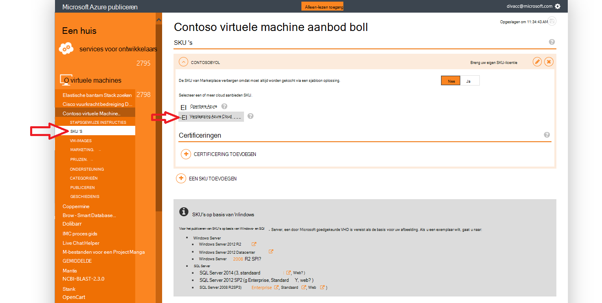
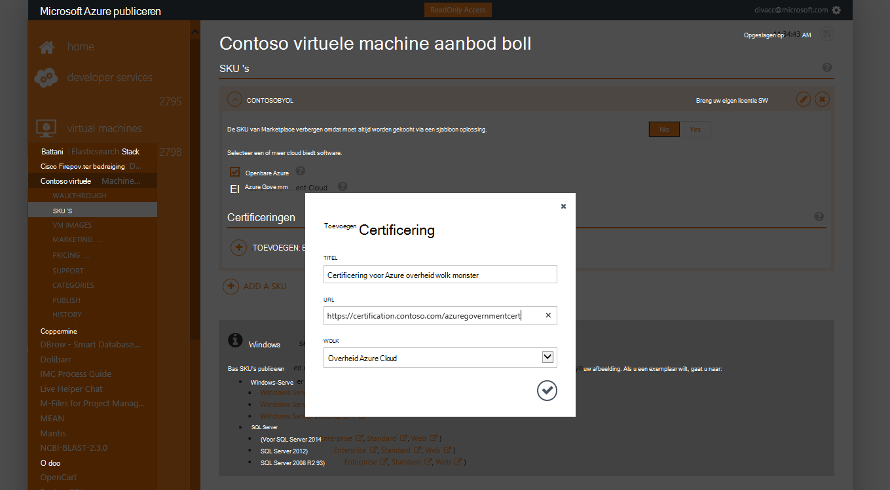
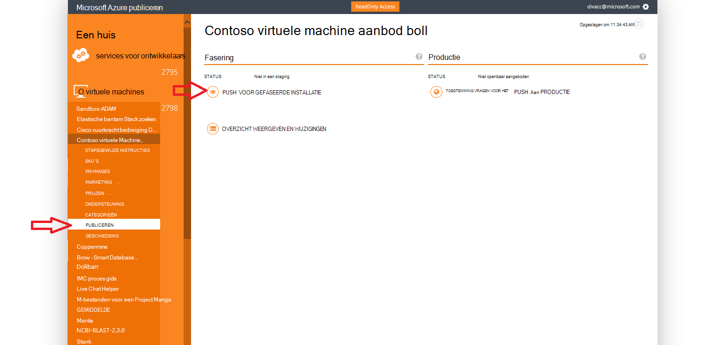
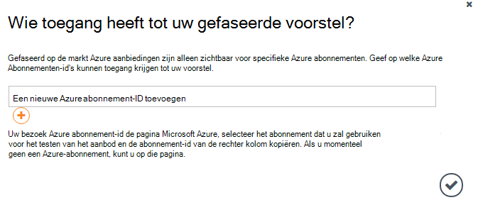
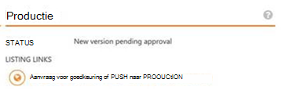

<properties
            pageTitle="Azure overheid documentatie | Microsoft Azure"
            description="Dit biedt een vergelijking van de functies en de richtlijnen over het ontwikkelen van toepassingen voor de overheid Azure."
            services="Azure-Government"
            cloud="gov"
            documentationCenter=""
            authors="tsingh"
            manager="asimm"
            editor=""/>
 
<tags    ms.service="multiple"
            ms.devlang="na"
            ms.topic="article"
            ms.tgt_pltfrm="na"
            ms.workload="azure-government"
            ms.date="10/20/2016"
            ms.author="zakramer;tsingh;divacc"/> 

# Azure overheid Marketplace
Voor partners die geïnteresseerd zijn in het publiceren van uw aanbod op de markt Azure voor de overheid, de onderstaande gegevens te vinden.

## Publiceren
>[AZURE.NOTE] Als u niet een bestaande Azure gecertificeerd Marketplace-partner de stappen [hier](../marketplace-publishing/marketplace-publishing-getting-started.md) voordat u verdergaat.

### Stap 1  
Meld u aan bij [https://publish.windowsazure.com](https://publish.windowsazure.com)

### Stap 2
Klik op de aanbieding die u wilt publiceren

### Stap 3
Klik op **SKU's** en klik in het vak Azure overheid Cloud

>[AZURE.NOTE] Alleen doen om uw eigen licentie (BYOL) SKU's worden ondersteund.  Deze optie is niet beschikbaar voor Pay-as-You-Go (PayG) SKU's.

### Stap 4
Klik op de + koppeling toevoegen-certificering koppelingen toevoegen aan alle certificeringen voor uw aanbieding.

### Stap 5
Aanvraag voor een proefperiode in de cloud met Microsoft Azure regering om te testen uw afbeelding in de portal voor publiceren: [https://azuregov.microsoft.com/trial/azuregovtrial](https://azuregov.microsoft.com/trial/azuregovtrial)

Uw recht als een partner die Amerikaanse federale, regionale, lokale of Tribale entiteiten worden gecontroleerd en de bevestiging via e-mail worden geleverd.  Uw evaluatieversie-account zijn beschikbaar is binnen 3-5 werkdagen.

### Stap 6
Klik op publiceren en klik op Push voor gefaseerde installatie. 

U wordt gevraagd een abonnement whitelisted die toegang heeft tot de gefaseerde bieden invoeren. De abonnement-ID van uw nieuw verworven Azure overheid evaluatie rekening invoeren.

### Stap 7
Zodra de aanbieding is klaargezet, kunt u uw image testen door naar [https://portal.azure.us](https://portal.azure.us) met uw Azure overheid Trial account aanmelden.

### Stap 8
Zodra u uw image aan met het proefabonnement hebt gevalideerd, kunt u de aanbieding beschikbaar live door te klikken op publiceren en goedkeuring aangevraagd voor het productie maken. 

## Volgende stappen

Voor aanvullende informatie en updates, zich abonneren op de [Blog van Microsoft Azure regering](https://blogs.msdn.microsoft.com/azuregov/).
